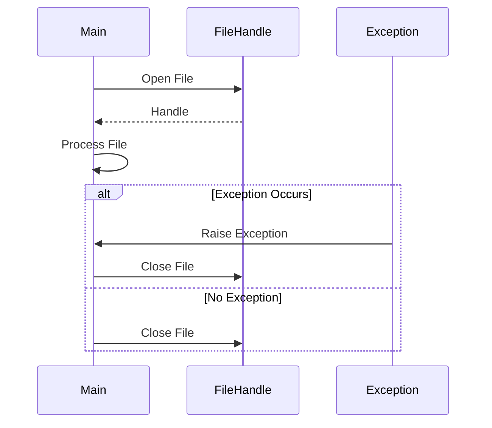

## 8.6 Managing Asynchronous Exceptions

In the realm of concurrent programming, managing asynchronous exceptions is crucial for building robust and fault-tolerant systems. Haskell, with its strong emphasis on purity and type safety, provides powerful abstractions for handling exceptions in a concurrent environment. This section delves into the intricacies of asynchronous exceptions, exploring strategies and patterns to manage them effectively.

### Understanding Asynchronous Exceptions

**Asynchronous Exceptions** are exceptions that can be raised in any thread at any time, often due to external events such as user interrupts, timeouts, or other threads explicitly throwing exceptions. Unlike synchronous exceptions, which occur as a direct result of executing a particular piece of code, asynchronous exceptions can disrupt the normal flow of a program unexpectedly.

#### Key Concepts

- **Interruptibility**: Threads can be interrupted by asynchronous exceptions, which can be both a powerful feature and a source of complexity.
- **Masking**: Temporarily preventing asynchronous exceptions from being delivered to ensure critical sections of code execute without interruption.
- **Resource Cleanup**: Ensuring that resources such as file handles, network connections, or memory allocations are properly released, even when exceptions occur.

### Handling Strategies

Handling asynchronous exceptions requires careful consideration to ensure that resources are managed correctly and that the program remains in a consistent state. Here are some strategies to manage asynchronous exceptions effectively:

#### Masking Exceptions

Masking is a technique used to temporarily block asynchronous exceptions from being delivered to a thread. This is particularly useful in critical sections where resource cleanup or state consistency is paramount.

```haskell
import Control.Exception (mask, uninterruptibleMask, onException)

-- Example of masking asynchronous exceptions
criticalSection :: IO a -> IO a
criticalSection action = mask $ \restore -> do
    result <- action `onException` cleanup
    restore (return result)
  where
    cleanup = putStrLn "Cleaning up resources..."
```

In this example, `mask` is used to block asynchronous exceptions during the execution of `action`. The `restore` function allows exceptions to be unmasked for specific parts of the code, ensuring that the critical section is protected while still allowing exceptions to be handled appropriately.

#### Ensuring Resource Cleanup

Haskell provides several combinators to ensure that resources are properly managed, even in the presence of exceptions. These include `bracket`, `finally`, and `onException`.

- **`bracket`**: Ensures that a resource is acquired and released properly, even if an exception occurs.

```haskell
import Control.Exception (bracket)

-- Example of using bracket for resource management
withFile :: FilePath -> (Handle -> IO r) -> IO r
withFile path = bracket (openFile path ReadMode) hClose
```

- **`finally`**: Executes a cleanup action after a computation, regardless of whether an exception was raised.

```haskell
import Control.Exception (finally)

-- Example of using finally to ensure cleanup
safeComputation :: IO ()
safeComputation = do
    putStrLn "Starting computation..."
    (putStrLn "Computation complete.") `finally` putStrLn "Cleaning up..."
```

- **`onException`**: Executes a cleanup action only if an exception is raised during the computation.

```haskell
import Control.Exception (onException)

-- Example of using onException for conditional cleanup
riskyOperation :: IO ()
riskyOperation = do
    putStrLn "Performing risky operation..."
    (putStrLn "Operation succeeded.") `onException` putStrLn "Operation failed, cleaning up..."
```

### Implementation Patterns

Implementing robust exception handling in Haskell involves combining these strategies and patterns to create resilient and maintainable code. Let's explore some common patterns for managing asynchronous exceptions.

#### Using `bracket` for Resource Management

The `bracket` pattern is a staple in Haskell for managing resources safely. It ensures that resources are acquired and released correctly, even if exceptions occur.

```haskell
import System.IO (Handle, IOMode(ReadMode), openFile, hClose)

-- Using bracket to manage file handles
processFile :: FilePath -> IO ()
processFile path = bracket (openFile path ReadMode) hClose $ \handle -> do
    contents <- hGetContents handle
    putStrLn contents
```

In this example, `bracket` is used to open a file and ensure that the file handle is closed after processing, regardless of whether an exception occurs during the reading of the file.

#### Ensuring Consistency with `finally`

The `finally` combinator is useful for ensuring that cleanup actions are performed after a computation, maintaining consistency in the presence of exceptions.

```haskell
import Control.Exception (finally)

-- Ensuring consistency with finally
performTask :: IO ()
performTask = do
    putStrLn "Starting task..."
    (putStrLn "Task completed.") `finally` putStrLn "Finalizing task..."
```

Here, `finally` guarantees that the "Finalizing task..." message is printed, even if an exception interrupts the task.

#### Conditional Cleanup with `onException`

The `onException` combinator allows for conditional cleanup actions, executing only when an exception is raised.

```haskell
import Control.Exception (onException)

-- Conditional cleanup with onException
executeWithFallback :: IO ()
executeWithFallback = do
    putStrLn "Executing primary action..."
    (putStrLn "Primary action succeeded.") `onException` putStrLn "Primary action failed, executing fallback..."
```

This pattern is useful for implementing fallback mechanisms or logging errors when exceptions occur.

### Example: Ensuring File Handles Are Closed

Let's consider a practical example where we ensure that file handles are closed even if a thread is killed. This example demonstrates the use of `bracket` to manage file resources safely.

```haskell
import System.IO (Handle, IOMode(ReadMode), openFile, hClose, hGetContents)
import Control.Exception (bracket)

-- Example of ensuring file handles are closed
readFileSafely :: FilePath -> IO ()
readFileSafely path = bracket (openFile path ReadMode) hClose $ \handle -> do
    contents <- hGetContents handle
    putStrLn contents
```

In this example, `bracket` is used to open a file and ensure that the file handle is closed after reading its contents. This pattern guarantees that resources are released properly, even if an exception occurs during the file reading process.

### Visualizing Exception Handling

To better understand how these patterns work together, let's visualize the flow of exception handling using a sequence diagram.



**Diagram Description**: This sequence diagram illustrates the flow of exception handling when managing file resources. The `Main` process opens a file, processes it, and ensures that the file handle is closed, regardless of whether an exception occurs.

### Key Takeaways

- **Asynchronous exceptions** can occur at any time, requiring careful handling to ensure program stability.
- **Masking** is a powerful technique to protect critical sections from interruption by asynchronous exceptions.
- **Resource management** is essential in concurrent programming, with combinators like `bracket`, `finally`, and `onException` providing robust solutions.
- **Visualizing exception handling** can aid in understanding the flow and impact of exceptions on resource management.

### Try It Yourself

Experiment with the provided code examples by modifying them to handle different types of resources or to implement additional error handling mechanisms. Consider how you might extend these patterns to manage network connections, database transactions, or other critical resources in your applications.

### References and Further Reading

- [Haskell Exception Handling](https://wiki.haskell.org/Exception)
- [Control.Exception Documentation](https://hackage.haskell.org/package/base/docs/Control-Exception.html)
- [Asynchronous Exceptions in Haskell](https://www.microsoft.com/en-us/research/wp-content/uploads/2016/02/asynch-exns.pdf)

### Embrace the Journey

Remember, mastering asynchronous exception handling is a journey. As you explore these patterns and techniques, you'll gain a deeper understanding of how to build resilient and fault-tolerant systems in Haskell. Keep experimenting, stay curious, and enjoy the process of learning and discovery!

## Quiz: Managing Asynchronous Exceptions



### What are asynchronous exceptions?

- [x] Exceptions that can be raised in any thread at any time
- [ ] Exceptions that occur due to syntax errors
- [ ] Exceptions that are handled synchronously
- [ ] Exceptions that only occur in the main thread

> **Explanation:** Asynchronous exceptions can be raised in any thread at any time, often due to external events or other threads.

### Which combinator ensures that a resource is acquired and released properly, even if an exception occurs?

- [x] `bracket`
- [ ] `finally`
- [ ] `onException`
- [ ] `catch`

> **Explanation:** `bracket` is used to ensure that resources are acquired and released properly, even if an exception occurs.

### What is the purpose of masking exceptions?

- [x] To temporarily block asynchronous exceptions from being delivered
- [ ] To catch and handle exceptions
- [ ] To log exceptions
- [ ] To ignore exceptions

> **Explanation:** Masking is used to temporarily block asynchronous exceptions from being delivered, protecting critical sections of code.

### Which combinator executes a cleanup action only if an exception is raised?

- [ ] `bracket`
- [ ] `finally`
- [x] `onException`
- [ ] `mask`

> **Explanation:** `onException` executes a cleanup action only if an exception is raised during the computation.

### What does the `finally` combinator do?

- [x] Executes a cleanup action after a computation, regardless of exceptions
- [ ] Masks exceptions during a computation
- [ ] Logs exceptions
- [ ] Ignores exceptions

> **Explanation:** `finally` ensures that a cleanup action is executed after a computation, regardless of whether an exception was raised.

### How can you ensure that a file handle is closed even if a thread is killed?

- [x] Use `bracket` to manage the file handle
- [ ] Use `finally` to close the file handle
- [ ] Use `onException` to close the file handle
- [ ] Use `mask` to protect the file handle

> **Explanation:** `bracket` is used to manage resources like file handles, ensuring they are closed even if a thread is killed.

### What is the role of the `restore` function in masking?

- [x] Allows exceptions to be unmasked for specific parts of the code
- [ ] Logs exceptions
- [ ] Ignores exceptions
- [ ] Catches exceptions

> **Explanation:** The `restore` function allows exceptions to be unmasked for specific parts of the code, providing flexibility in handling exceptions.

### Which of the following is NOT a strategy for managing asynchronous exceptions?

- [ ] Masking exceptions
- [ ] Using `bracket`
- [ ] Using `finally`
- [x] Ignoring exceptions

> **Explanation:** Ignoring exceptions is not a strategy for managing them; instead, they should be handled appropriately.

### What is the benefit of using `onException`?

- [x] It allows for conditional cleanup actions
- [ ] It masks exceptions
- [ ] It logs exceptions
- [ ] It ignores exceptions

> **Explanation:** `onException` allows for conditional cleanup actions, executing only when an exception is raised.

### True or False: Asynchronous exceptions can only occur due to user interrupts.

- [ ] True
- [x] False

> **Explanation:** Asynchronous exceptions can occur due to various external events, not just user interrupts.


