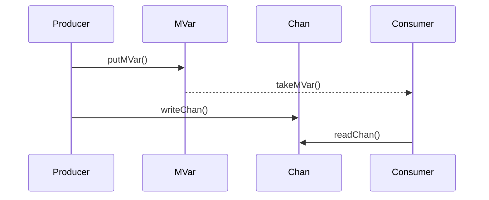

## 8.7 MVar and Channel Patterns

Concurrency is a critical aspect of modern software development, enabling applications to perform multiple operations simultaneously. In Haskell, MVar and Channel patterns provide powerful abstractions for managing concurrency. This section delves into these patterns, explaining their concepts, implementation, and practical applications.

### MVar: A Mutable Variable for Synchronization

**MVar** is a mutable location that can either be empty or contain a value. It serves as a synchronization primitive, facilitating communication between threads. MVars are particularly useful for implementing shared state and ensuring safe access to resources in concurrent Haskell programs.

#### Key Features of MVar

- **Mutability**: Unlike most Haskell data structures, MVars are mutable, allowing their contents to change over time.
- **Blocking Operations**: Operations on MVars can block, meaning a thread may wait until the MVar is in the desired state (empty or full).
- **Atomicity**: Operations on MVars are atomic, ensuring thread safety without explicit locking mechanisms.

#### Basic Operations on MVar

- **`newEmptyMVar`**: Create an empty MVar.
- **`newMVar`**: Create an MVar containing an initial value.
- **`takeMVar`**: Remove and return the value from an MVar, blocking if empty.
- **`putMVar`**: Place a value into an MVar, blocking if full.
- **`tryTakeMVar`** and **`tryPutMVar`**: Non-blocking versions of `takeMVar` and `putMVar`.

#### Example: Using MVar for Synchronization

Let's explore a simple example where two threads communicate using an MVar:

```haskell
import Control.Concurrent
import Control.Monad

main :: IO ()
main = do
    mvar <- newEmptyMVar

    -- Producer thread
    forkIO $ do
        putStrLn "Producer: Putting value into MVar"
        putMVar mvar "Hello from Producer"

    -- Consumer thread
    forkIO $ do
        value <- takeMVar mvar
        putStrLn $ "Consumer: Received value - " ++ value

    -- Wait for threads to finish
    threadDelay 1000000
```

In this example, the producer thread places a value into the MVar, and the consumer thread retrieves it. The `threadDelay` ensures the main thread waits for the other threads to complete.

### Channels: FIFO Queues for Message Passing

**Channels** in Haskell provide a way to pass messages between threads using a FIFO (First-In-First-Out) queue. Channels are ideal for implementing producer-consumer patterns where multiple producers and consumers interact.

#### Types of Channels

- **`Chan`**: A simple unbounded channel.
- **`TChan`**: A transactional channel, used with Software Transactional Memory (STM) for atomic operations.

#### Basic Operations on Channels

- **`newChan`**: Create a new channel.
- **`writeChan`**: Write a value to the channel.
- **`readChan`**: Read a value from the channel, blocking if empty.
- **`dupChan`**: Duplicate a channel for broadcasting messages.

#### Example: Implementing a Producer-Consumer Pattern with Chan

Let's implement a producer-consumer pattern using `Chan`:

```haskell
import Control.Concurrent
import Control.Concurrent.Chan
import Control.Monad

producer :: Chan String -> IO ()
producer chan = forM_ [1..5] $ \i -> do
    let message = "Message " ++ show i
    putStrLn $ "Producer: Sending " ++ message
    writeChan chan message
    threadDelay 500000

consumer :: Chan String -> IO ()
consumer chan = forever $ do
    message <- readChan chan
    putStrLn $ "Consumer: Received " ++ message

main :: IO ()
main = do
    chan <- newChan
    forkIO $ producer chan
    forkIO $ consumer chan
    threadDelay 5000000
```

In this example, the producer sends messages to the channel, and the consumer reads them. The `threadDelay` ensures the main thread waits for the producer and consumer to process messages.

### Synchronizing Threads with MVar and Chan

MVar and Chan can be combined to synchronize threads effectively. MVar can be used to signal when a channel is ready for reading or writing, ensuring that threads do not access the channel prematurely.

#### Example: Synchronizing with MVar and Chan

```haskell
import Control.Concurrent
import Control.Concurrent.Chan

producer :: Chan String -> MVar () -> IO ()
producer chan mvar = do
    putStrLn "Producer: Preparing to send messages"
    writeChan chan "Start"
    putMVar mvar ()  -- Signal that the channel is ready
    forM_ [1..5] $ \i -> do
        let message = "Message " ++ show i
        putStrLn $ "Producer: Sending " ++ message
        writeChan chan message
        threadDelay 500000

consumer :: Chan String -> MVar () -> IO ()
consumer chan mvar = do
    takeMVar mvar  -- Wait for the signal
    putStrLn "Consumer: Ready to receive messages"
    forever $ do
        message <- readChan chan
        putStrLn $ "Consumer: Received " ++ message

main :: IO ()
main = do
    chan <- newChan
    mvar <- newEmptyMVar
    forkIO $ producer chan mvar
    forkIO $ consumer chan mvar
    threadDelay 5000000
```

In this example, the producer signals the consumer using an MVar, ensuring that the consumer only starts reading from the channel once it is ready.

### Design Considerations

When using MVar and Chan, consider the following:

- **Deadlocks**: Ensure that MVars are not left in a state that causes threads to block indefinitely.
- **Fairness**: Consider the order in which threads access shared resources to prevent starvation.
- **Performance**: Channels can introduce overhead; use them judiciously in performance-critical applications.

### Haskell's Unique Features

Haskell's strong type system and purity make MVar and Channel patterns particularly powerful. The language's emphasis on immutability and side-effect management ensures that concurrency is both safe and efficient.

### Differences and Similarities

MVar and Chan serve different purposes but can be used together for complex synchronization tasks. While MVar is ideal for signaling and mutual exclusion, Chan excels in message passing and queuing.

### Try It Yourself

Experiment with the examples provided by modifying the number of producers and consumers. Observe how the system behaves with different configurations and delays. Try using `TChan` for transactional operations and explore the benefits of STM.

### Visualizing MVar and Channel Patterns

Below is a diagram illustrating the interaction between producer and consumer threads using MVar and Chan:



This diagram shows the sequence of operations, highlighting how MVar and Chan facilitate communication between threads.

### References and Links

- [Haskell MVar Documentation](https://hackage.haskell.org/package/base/docs/Control-Concurrent-MVar.html)
- [Haskell Chan Documentation](https://hackage.haskell.org/package/base/docs/Control-Concurrent-Chan.html)
- [Concurrency in Haskell](https://wiki.haskell.org/Concurrency)

### Knowledge Check

- What are the primary differences between MVar and Chan?
- How can you prevent deadlocks when using MVar?
- What are the benefits of using `TChan` over `Chan`?

### Embrace the Journey

Concurrency in Haskell is a journey of exploration and learning. As you delve deeper into MVar and Channel patterns, you'll discover new ways to harness the power of Haskell's concurrency model. Keep experimenting, stay curious, and enjoy the journey!

## Quiz: MVar and Channel Patterns



### What is an MVar in Haskell?

- [x] A mutable location that can be empty or contain a value
- [ ] A type of channel for message passing
- [ ] A function for asynchronous computation
- [ ] A library for network communication

> **Explanation:** An MVar is a mutable location used for synchronization between threads in Haskell.

### What operation would you use to create an empty MVar?

- [x] `newEmptyMVar`
- [ ] `newMVar`
- [ ] `takeMVar`
- [ ] `putMVar`

> **Explanation:** `newEmptyMVar` creates an empty MVar, ready to be filled with a value.

### How do you read a value from a Chan in Haskell?

- [x] `readChan`
- [ ] `writeChan`
- [ ] `takeChan`
- [ ] `putChan`

> **Explanation:** `readChan` is used to read a value from a Chan, blocking if the Chan is empty.

### What is a key feature of operations on MVars?

- [x] Atomicity
- [ ] Non-blocking
- [ ] Asynchronous
- [ ] Stateless

> **Explanation:** Operations on MVars are atomic, ensuring thread safety.

### Which of the following is a transactional channel in Haskell?

- [x] `TChan`
- [ ] `Chan`
- [ ] `MVar`
- [ ] `STM`

> **Explanation:** `TChan` is a transactional channel used with STM for atomic operations.

### How can you prevent deadlocks when using MVars?

- [x] Ensure proper ordering of operations
- [ ] Use more threads
- [ ] Increase memory allocation
- [ ] Use non-blocking operations

> **Explanation:** Proper ordering of operations can help prevent deadlocks when using MVars.

### What is the purpose of `dupChan`?

- [x] To duplicate a channel for broadcasting messages
- [ ] To create a new channel
- [ ] To read from a channel
- [ ] To write to a channel

> **Explanation:** `dupChan` duplicates a channel, allowing multiple consumers to read the same messages.

### What is the main advantage of using `TChan` over `Chan`?

- [x] Atomic operations with STM
- [ ] Faster message passing
- [ ] Simpler API
- [ ] Better error handling

> **Explanation:** `TChan` allows for atomic operations using STM, providing stronger guarantees in concurrent programs.

### True or False: MVars can be used for both mutual exclusion and signaling.

- [x] True
- [ ] False

> **Explanation:** MVars can be used for mutual exclusion and signaling between threads.

### What is the primary use case for Channels in Haskell?

- [x] Message passing between threads
- [ ] Managing side effects
- [ ] Error handling
- [ ] Data serialization

> **Explanation:** Channels are primarily used for message passing between threads in Haskell.


