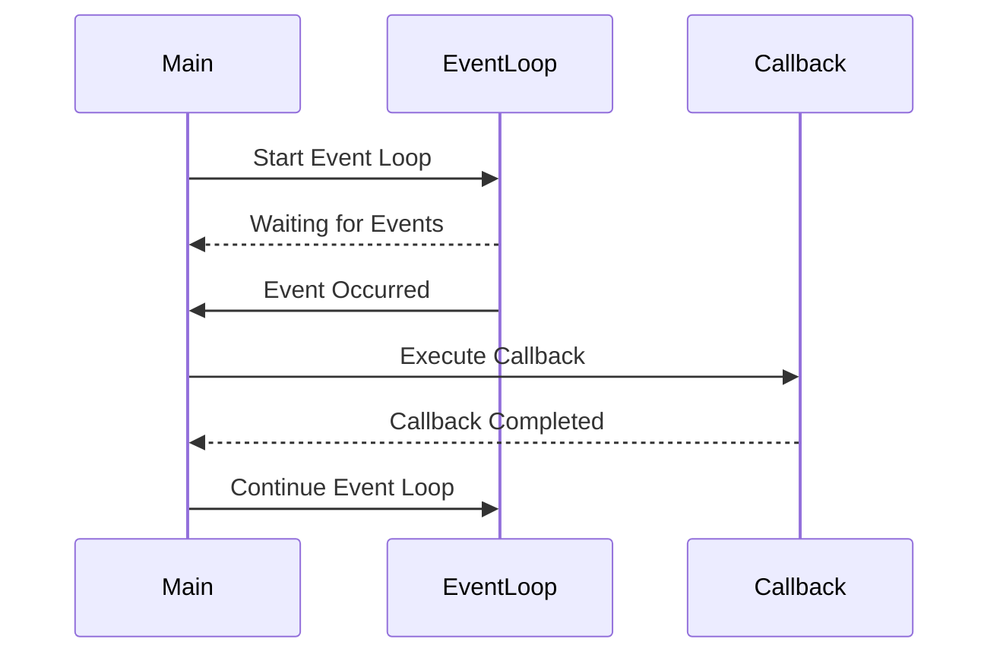

## 8.9 Event Loop and Callback Patterns

In this section, we delve into the **Event Loop and Callback Patterns** in Haskell, which are essential for building responsive and efficient applications. These patterns are particularly useful in scenarios where applications need to handle multiple events or inputs concurrently, such as in GUI applications or network servers. Let's explore these concepts in detail, understand their implementation in Haskell, and see how they can be effectively utilized in your projects.

### Understanding Event Loop and Callback Patterns

#### Event Loop

An **Event Loop** is a programming construct that waits for and dispatches events or messages in a program. It is a core component in many asynchronous programming environments, allowing applications to remain responsive while waiting for events. The event loop continuously checks for new events and processes them as they arrive.

**Key Characteristics of Event Loop:**

- **Non-blocking:** The event loop allows other operations to continue while waiting for events.
- **Single-threaded:** Typically runs on a single thread, managing multiple tasks by switching between them.
- **Efficient:** Minimizes idle time by continuously processing events.

#### Callbacks

**Callbacks** are functions that are passed as arguments to other functions and are invoked in response to an event. They are a fundamental mechanism for handling asynchronous operations, allowing a program to continue executing other code while waiting for an event to occur.

**Key Characteristics of Callbacks:**

- **Asynchronous Execution:** Callbacks are executed when a specific event occurs, not immediately.
- **Decoupling:** Separate the logic of event handling from the main program flow.
- **Flexibility:** Allow different behaviors to be specified for different events.

### Implementing Event Loop and Callback Patterns in Haskell

Haskell, being a functional programming language, offers unique approaches to implementing event loops and callbacks. Let's explore how these patterns can be implemented using Haskell's features and libraries.

#### Using Libraries for Asynchronous Events

Haskell provides several libraries that facilitate asynchronous programming, such as `async`, `STM`, and `conduit`. These libraries offer abstractions for handling concurrent operations and managing events efficiently.

##### Example: Using `async` for Event Loop

The `async` library in Haskell allows you to run IO operations asynchronously, making it a suitable choice for implementing an event loop.

```haskell
import Control.Concurrent.Async
import Control.Concurrent (threadDelay)

-- A simple event loop that waits for events and processes them
eventLoop :: IO ()
eventLoop = do
    putStrLn "Event loop started. Waiting for events..."
    -- Simulate an event occurring after a delay
    threadDelay 2000000
    putStrLn "Event occurred! Processing event..."
    -- Continue the loop
    eventLoop

main :: IO ()
main = do
    -- Run the event loop asynchronously
    asyncEventLoop <- async eventLoop
    -- Wait for the event loop to complete (it won't in this example)
    wait asyncEventLoop
```

In this example, the `eventLoop` function simulates an event loop that waits for events and processes them. The `async` function is used to run the event loop asynchronously, allowing the program to remain responsive.

#### Implementing Callbacks in Haskell

Callbacks in Haskell can be implemented using higher-order functions, where functions are passed as arguments to other functions.

##### Example: Simple Callback Implementation

```haskell
-- Define a type for a callback function
type Callback = String -> IO ()

-- A function that takes a callback and an event
handleEvent :: Callback -> String -> IO ()
handleEvent callback event = do
    putStrLn $ "Handling event: " ++ event
    -- Invoke the callback with the event data
    callback event

-- A sample callback function
printCallback :: Callback
printCallback eventData = putStrLn $ "Callback executed with data: " ++ eventData

main :: IO ()
main = do
    -- Simulate an event and handle it with a callback
    handleEvent printCallback "Sample Event"
```

In this example, `handleEvent` is a function that takes a callback and an event, invoking the callback with the event data. The `printCallback` function is a simple callback that prints the event data.

### Visualizing Event Loop and Callback Patterns

To better understand the flow of an event loop and callbacks, let's visualize the process using a sequence diagram.



**Diagram Description:** This sequence diagram illustrates the interaction between the main program, the event loop, and the callback. The event loop waits for events, and when an event occurs, it triggers the callback. The callback is executed, and control returns to the event loop to continue processing.

### Key Participants in Event Loop and Callback Patterns

- **Event Loop:** The core component that waits for and dispatches events.
- **Callback Functions:** Functions that are executed in response to events.
- **Event Sources:** Entities that generate events, such as user input or network data.

### Applicability of Event Loop and Callback Patterns

Event loop and callback patterns are applicable in various scenarios, including:

- **GUI Applications:** Handling user input events such as clicks and key presses.
- **Network Servers:** Processing incoming network requests asynchronously.
- **Real-Time Systems:** Managing events in systems that require immediate response.

### Design Considerations

When implementing event loop and callback patterns in Haskell, consider the following:

- **Concurrency:** Ensure that the event loop can handle multiple events concurrently without blocking.
- **Error Handling:** Implement robust error handling to manage exceptions in callbacks.
- **Performance:** Optimize the event loop for performance, especially in high-load scenarios.

### Haskell Unique Features

Haskell's strong type system and functional nature provide unique advantages in implementing event loops and callbacks:

- **Type Safety:** Ensure that callbacks conform to expected types, reducing runtime errors.
- **Immutability:** Leverage immutable data structures to avoid side effects in callbacks.
- **Higher-Order Functions:** Use higher-order functions to create flexible and reusable callbacks.

### Differences and Similarities with Other Patterns

Event loop and callback patterns are often compared with other asynchronous patterns, such as:

- **Promises/Futures:** Unlike callbacks, promises represent a value that will be available in the future.
- **Reactive Programming:** Focuses on data streams and the propagation of change, whereas event loops handle discrete events.

### Try It Yourself

To deepen your understanding, try modifying the code examples:

- **Experiment with Different Callbacks:** Create different callback functions and observe their behavior.
- **Simulate Multiple Events:** Modify the event loop to handle multiple events concurrently.
- **Implement Error Handling:** Add error handling to manage exceptions in callbacks.

### Knowledge Check

- **Question:** What is the primary role of an event loop in a program?
- **Question:** How do callbacks enhance the flexibility of event handling?
- **Question:** What are some common use cases for event loop and callback patterns?

### Embrace the Journey

Remember, mastering event loop and callback patterns is just the beginning. As you progress, you'll build more complex and interactive applications. Keep experimenting, stay curious, and enjoy the journey!

## Quiz: Event Loop and Callback Patterns



### What is the primary role of an event loop in a program?

- [x] To wait for and dispatch events or messages
- [ ] To execute code sequentially
- [ ] To manage memory allocation
- [ ] To handle user authentication

> **Explanation:** An event loop waits for and dispatches events or messages, allowing a program to remain responsive.

### How do callbacks enhance the flexibility of event handling?

- [x] By allowing different behaviors to be specified for different events
- [ ] By executing code immediately
- [ ] By reducing the need for error handling
- [ ] By simplifying memory management

> **Explanation:** Callbacks allow different behaviors to be specified for different events, enhancing flexibility.

### What is a key characteristic of an event loop?

- [x] Non-blocking
- [ ] Multi-threaded
- [ ] Synchronous
- [ ] Memory-intensive

> **Explanation:** An event loop is non-blocking, allowing other operations to continue while waiting for events.

### In Haskell, how can callbacks be implemented?

- [x] Using higher-order functions
- [ ] Using global variables
- [ ] Using loops
- [ ] Using pointers

> **Explanation:** Callbacks in Haskell can be implemented using higher-order functions, where functions are passed as arguments.

### What is a common use case for event loop and callback patterns?

- [x] GUI applications
- [ ] File I/O operations
- [ ] Static website generation
- [ ] Data serialization

> **Explanation:** Event loop and callback patterns are commonly used in GUI applications to handle user input events.

### What library in Haskell is commonly used for asynchronous programming?

- [x] async
- [ ] bytestring
- [ ] text
- [ ] containers

> **Explanation:** The `async` library in Haskell is commonly used for asynchronous programming, allowing IO operations to run asynchronously.

### What advantage does Haskell's type system provide in implementing callbacks?

- [x] Type safety
- [ ] Faster execution
- [ ] Reduced memory usage
- [ ] Simplified syntax

> **Explanation:** Haskell's type system provides type safety, ensuring that callbacks conform to expected types and reducing runtime errors.

### What is a potential pitfall when using callbacks?

- [x] Error handling
- [ ] Increased memory usage
- [ ] Slower execution
- [ ] Simplified code structure

> **Explanation:** Error handling can be a potential pitfall when using callbacks, as exceptions in callbacks need to be managed properly.

### How can you optimize an event loop for performance?

- [x] By minimizing idle time and processing events efficiently
- [ ] By increasing the number of threads
- [ ] By using global variables
- [ ] By reducing the number of callbacks

> **Explanation:** Optimizing an event loop involves minimizing idle time and processing events efficiently to enhance performance.

### True or False: Event loop and callback patterns are only applicable in GUI applications.

- [ ] True
- [x] False

> **Explanation:** Event loop and callback patterns are applicable in various scenarios, including network servers and real-time systems, not just GUI applications.



By understanding and implementing event loop and callback patterns in Haskell, you can build responsive and efficient applications that handle asynchronous events gracefully. Keep exploring and applying these patterns to enhance your Haskell programming skills.
