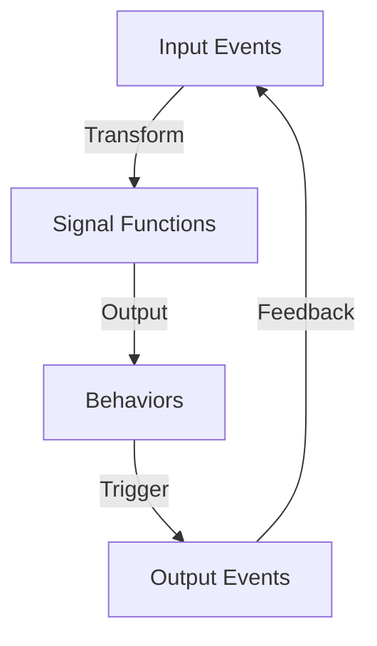

## 9.1 Functional Reactive Programming (FRP) Concepts

Functional Reactive Programming (FRP) is a paradigm that combines the principles of functional programming with reactive systems to elegantly handle time-varying values and asynchronous events. In this section, we will delve into the core concepts of FRP, focusing on its implementation in Haskell, and explore how it can be used to model complex systems such as graphical user interfaces (GUIs).

### FRP Overview

FRP is designed to simplify the handling of dynamic and interactive systems by providing a declarative approach to programming with time-varying values. It abstracts the complexity of managing state changes and asynchronous events, allowing developers to focus on the logic of their applications.

#### Key Components of FRP

1. **Behaviors**: These represent continuous time-varying values. In Haskell, behaviors can be thought of as functions from time to values, capturing the notion of a value that changes over time.

2. **Events**: These are discrete occurrences that happen at specific points in time. Events can trigger changes in behaviors or initiate actions in a system.

3. **Reactive Streams**: A combination of behaviors and events, reactive streams allow for the composition and transformation of time-varying data.

4. **Signal Functions**: In some FRP frameworks, signal functions are used to model transformations from input signals (events or behaviors) to output signals.

### Core Concepts

#### Behaviors

Behaviors are central to FRP, representing values that change over time. They provide a way to model continuous data streams, such as the position of a mouse cursor or the current time.

**Example of Behavior in Haskell:**

```haskell
-- A simple behavior representing the current time
currentTime :: Behavior Time
currentTime = time
```

In this example, `currentTime` is a behavior that continuously represents the passage of time.

#### Events

Events are another fundamental concept in FRP, representing discrete occurrences. They are used to model actions such as button clicks, key presses, or network messages.

**Example of Event in Haskell:**

```haskell
-- An event representing a mouse click
mouseClick :: Event ()
mouseClick = clickEvent
```

Here, `mouseClick` is an event that occurs whenever a mouse click is detected.

#### Modeling User Interactions in a GUI Application

FRP is particularly powerful for modeling user interactions in GUI applications. By using behaviors and events, developers can create responsive and interactive interfaces without the complexity of traditional imperative event handling.

**Example:**

Consider a simple GUI application with a button that changes color when clicked. Using FRP, we can model this interaction as follows:

```haskell
-- Define a behavior for the button color
buttonColor :: Behavior Color
buttonColor = stepper initialColor (fmap toggleColor mouseClick)

-- Function to toggle the button color
toggleColor :: Color -> Color
toggleColor currentColor = if currentColor == red then blue else red

-- Initial color of the button
initialColor :: Color
initialColor = red
```

In this example, `buttonColor` is a behavior that changes its value based on the `mouseClick` event. The `stepper` function is used to create a new behavior that toggles the button's color between red and blue each time the button is clicked.

### Code Examples

Let's explore a more comprehensive example that demonstrates the use of FRP in a Haskell application. We'll create a simple counter application where the counter value increases each time a button is clicked.

```haskell
import Reactive.Banana
import Reactive.Banana.Frameworks

-- Define the main function to set up the FRP network
main :: IO ()
main = do
    -- Create a new event network
    network <- compile $ do
        -- Define an event for button clicks
        eClick <- fromAddHandler addHandler

        -- Define a behavior for the counter value
        let bCounter = accumB 0 (fmap (const (+1)) eClick)

        -- Output the counter value whenever it changes
        reactimate $ fmap print bCounter

    -- Activate the network
    actuate network

-- Function to add an event handler for button clicks
addHandler :: AddHandler ()
addHandler = ...

-- Try It Yourself: Modify the code to decrease the counter value on a different button click
```

In this example, we use the `Reactive.Banana` library to create an FRP network. The `accumB` function is used to accumulate the counter value based on the `eClick` event. The `reactimate` function outputs the counter value whenever it changes.

### Visualizing FRP Concepts

To better understand the flow of data in an FRP system, let's visualize the relationships between behaviors, events, and signal functions.



**Diagram Description:** This diagram illustrates the flow of data in an FRP system. Input events are transformed by signal functions to produce behaviors, which can trigger output events. These events can then provide feedback to the input events, creating a continuous loop of interaction.

### Haskell Unique Features

Haskell's strong static typing and lazy evaluation make it particularly well-suited for implementing FRP systems. The type system ensures that behaviors and events are used consistently, reducing the likelihood of runtime errors. Lazy evaluation allows for efficient handling of infinite data streams, which is a common requirement in FRP applications.

### Differences and Similarities with Other Patterns

FRP shares similarities with other reactive programming paradigms, such as Reactive Extensions (Rx) and the Observer pattern. However, FRP's emphasis on continuous time-varying values and its declarative nature distinguish it from these patterns. Unlike the Observer pattern, which focuses on discrete event handling, FRP provides a unified approach to handling both continuous and discrete data.

### Design Considerations

When using FRP, it's important to consider the following:

- **Complexity**: While FRP simplifies the handling of time-varying data, it can introduce complexity in terms of understanding and maintaining the system. It's crucial to design the FRP network carefully to avoid unnecessary complexity.

- **Performance**: FRP systems can be resource-intensive, especially when dealing with large data streams or complex transformations. Profiling and optimization are essential to ensure the system performs efficiently.

- **Debugging**: Debugging FRP systems can be challenging due to the declarative nature of the paradigm. Tools and techniques for tracing and visualizing data flow can be helpful in identifying issues.

### Knowledge Check

Before we move on, let's reinforce our understanding of FRP concepts with a few questions:

- What are the key components of FRP?
- How do behaviors differ from events in FRP?
- How can FRP be used to model user interactions in a GUI application?

### Embrace the Journey

Remember, mastering FRP is a journey. As you explore and experiment with these concepts, you'll gain a deeper understanding of how to build responsive and interactive applications. Keep experimenting, stay curious, and enjoy the journey!

### References and Links

For further reading on FRP and its applications in Haskell, consider the following resources:

- [Reactive.Banana Documentation](https://hackage.haskell.org/package/reactive-banana)
- [Functional Reactive Programming in Haskell](https://www.schoolofhaskell.com/user/edwardk/frp-introduction)
- [FRP in Haskell: A Comprehensive Guide](https://www.fpcomplete.com/blog/2017/06/frp-haskell)

## Quiz: Functional Reactive Programming (FRP) Concepts



### What is a key component of FRP?

- [x] Behaviors
- [ ] Classes
- [ ] Interfaces
- [ ] Threads

> **Explanation:** Behaviors are a key component of FRP, representing continuous time-varying values.

### How do behaviors differ from events in FRP?

- [x] Behaviors represent continuous values, while events are discrete occurrences.
- [ ] Behaviors are discrete, while events are continuous.
- [ ] Both are continuous.
- [ ] Both are discrete.

> **Explanation:** Behaviors represent continuous time-varying values, whereas events are discrete occurrences.

### What is the purpose of signal functions in FRP?

- [x] To transform input signals into output signals.
- [ ] To manage memory allocation.
- [ ] To handle exceptions.
- [ ] To perform I/O operations.

> **Explanation:** Signal functions are used in FRP to transform input signals (events or behaviors) into output signals.

### Which Haskell feature is particularly beneficial for FRP?

- [x] Lazy evaluation
- [ ] Dynamic typing
- [ ] Manual memory management
- [ ] Global variables

> **Explanation:** Lazy evaluation in Haskell allows for efficient handling of infinite data streams, which is beneficial for FRP.

### What is a common challenge when debugging FRP systems?

- [x] Understanding the declarative nature of the paradigm.
- [ ] Lack of libraries.
- [ ] Poor performance.
- [ ] Limited community support.

> **Explanation:** Debugging FRP systems can be challenging due to the declarative nature of the paradigm.

### How can FRP be used in GUI applications?

- [x] By modeling user interactions with behaviors and events.
- [ ] By using imperative event handling.
- [ ] By managing global state.
- [ ] By using threads for concurrency.

> **Explanation:** FRP can be used in GUI applications by modeling user interactions with behaviors and events.

### What is a potential drawback of using FRP?

- [x] Resource-intensive operations
- [ ] Lack of type safety
- [ ] Difficulty in handling discrete events
- [ ] Inability to handle continuous data

> **Explanation:** FRP systems can be resource-intensive, especially when dealing with large data streams or complex transformations.

### What is the role of the `stepper` function in FRP?

- [x] To create a new behavior based on an event.
- [ ] To manage memory.
- [ ] To handle exceptions.
- [ ] To perform I/O operations.

> **Explanation:** The `stepper` function is used in FRP to create a new behavior based on an event.

### What distinguishes FRP from the Observer pattern?

- [x] FRP handles both continuous and discrete data.
- [ ] FRP is imperative.
- [ ] FRP is object-oriented.
- [ ] FRP uses global variables.

> **Explanation:** FRP provides a unified approach to handling both continuous and discrete data, unlike the Observer pattern, which focuses on discrete event handling.

### True or False: FRP simplifies the handling of time-varying data.

- [x] True
- [ ] False

> **Explanation:** FRP simplifies the handling of time-varying data by providing a declarative approach to programming with time-varying values.


