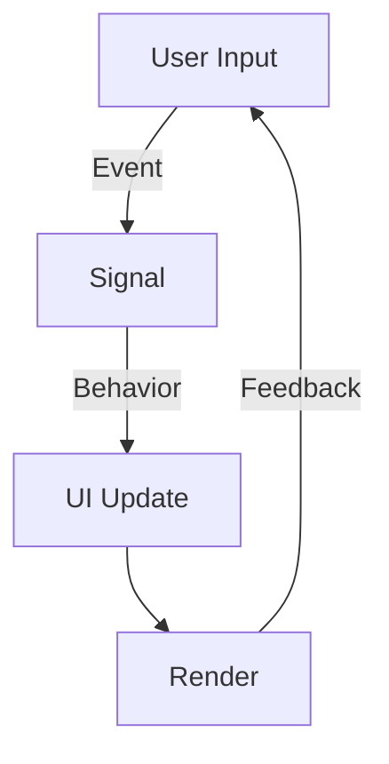

## 9.10 Building User Interfaces with Functional Reactive Programming (FRP) in Haskell: Reflex and Yampa

Functional Reactive Programming (FRP) represents a paradigm shift in how we approach user interface (UI) development. By leveraging the power of Haskell's functional programming capabilities, FRP allows us to build dynamic, responsive, and maintainable UIs. In this section, we will explore the core concepts of FRP, delve into the popular Haskell libraries Reflex and Yampa, and demonstrate how to implement real-time, reactive UIs.

### Introduction to Functional Reactive Programming (FRP)

**Functional Reactive Programming (FRP)** is a programming paradigm that combines functional programming with reactive programming to handle time-varying values and asynchronous events. In the context of UI development, FRP allows developers to declaratively define the behavior of UI components in response to user interactions and other events.

#### Key Concepts of FRP

- **Reactive Values**: These are values that change over time, such as user inputs or sensor data.
- **Signals**: Continuous time-varying values that represent the state of the system.
- **Events**: Discrete occurrences that trigger changes in the system.
- **Behaviors**: Functions that map signals to outputs, defining how the UI should respond to changes.

### Libraries for FRP in Haskell

Haskell offers several libraries for implementing FRP, with Reflex and Yampa being two of the most prominent.

#### Reflex

**Reflex** is a powerful FRP library for Haskell that excels in building web applications. It provides a rich set of abstractions for managing reactive values and events, making it ideal for complex UI interactions.

- **Declarative UI**: Reflex allows developers to define UIs declaratively, specifying how components should react to changes in data.
- **Efficient Updates**: Reflex optimizes updates to only recompute the parts of the UI that are affected by changes, improving performance.
- **Integration with GHCJS**: Reflex can be used with GHCJS to compile Haskell code to JavaScript, enabling web-based applications.

#### Yampa

**Yampa** is another FRP library that focuses on continuous time and hybrid systems. It is well-suited for applications that require precise control over time, such as simulations and games.

- **Signal Functions**: Yampa uses signal functions to model time-varying behaviors, allowing for complex interactions between components.
- **Arrowized FRP**: Yampa leverages Haskell's arrow syntax to compose signal functions, providing a clean and expressive way to define reactive systems.

### Implementing User Interfaces with FRP

Building UIs with FRP involves binding UI elements to reactive data sources and defining how they should respond to changes. Let's explore how to implement a simple UI using Reflex and Yampa.

#### Example: Creating a Dynamic Form with Reflex

In this example, we'll create a dynamic form that validates user input in real-time using Reflex.

```haskell
{-# LANGUAGE OverloadedStrings #-}
{-# LANGUAGE RecursiveDo #-}

import Reflex.Dom

main :: IO ()
main = mainWidget $ el "div" $ do
  el "h1" $ text "Dynamic Form with Reflex"
  rec
    name <- el "div" $ do
      el "label" $ text "Name: "
      inputElement def

    age <- el "div" $ do
      el "label" $ text "Age: "
      inputElement def

    let nameValid = fmap (not . null) $ _inputElement_value name
        ageValid = fmap (all (`elem` ['0'..'9'])) $ _inputElement_value age

    el "div" $ do
      dynText =<< holdDyn "Please enter valid input" (validateForm <$> nameValid <*> ageValid)

  return ()

validateForm :: Bool -> Bool -> String
validateForm True True = "Form is valid!"
validateForm False _ = "Name is required."
validateForm _ False = "Age must be a number."
```

**Explanation:**

- **Input Elements**: We create input elements for the user's name and age.
- **Validation**: We define validation logic that checks if the name is non-empty and the age is numeric.
- **Dynamic Text**: We use `dynText` to display validation messages based on the input values.

#### Example: Building a Simple Game with Yampa

Let's create a simple game using Yampa to demonstrate its capabilities in handling continuous time and reactive behaviors.

```haskell
{-# LANGUAGE Arrows #-}

import FRP.Yampa

type Position = (Double, Double)
type Velocity = (Double, Double)

fallingBall :: Position -> SF () Position
fallingBall (x0, y0) = proc () -> do
  v <- integral -< (0, -9.8)  -- Gravity
  p <- integral -< v
  returnA -< (x0, y0) `add` p

add :: Position -> Position -> Position
add (x1, y1) (x2, y2) = (x1 + x2, y1 + y2)

main :: IO ()
main = reactimate (return ()) (\_ -> return (0.1, Nothing)) print (fallingBall (0, 100))
```

**Explanation:**

- **Signal Function**: We define a signal function `fallingBall` that models the position of a ball falling under gravity.
- **Integration**: We use `integral` to compute the velocity and position over time.
- **Reactimation**: We use `reactimate` to run the simulation and print the ball's position.

### Visualizing FRP Concepts

To better understand the flow of data in FRP, let's visualize the interaction between signals, events, and behaviors.



**Diagram Explanation:**

- **User Input**: Represents events triggered by user interactions.
- **Signal**: Captures the state of the system as a time-varying value.
- **Behavior**: Defines how the UI responds to changes in signals.
- **Render**: Updates the UI based on the computed behaviors.

### Design Considerations for FRP in Haskell

When building UIs with FRP in Haskell, consider the following:

- **Performance**: Ensure efficient updates by minimizing recomputation and leveraging Haskell's lazy evaluation.
- **Complexity**: FRP can introduce complexity in managing dependencies between reactive values. Use abstractions like signal functions and behaviors to simplify your design.
- **Integration**: Consider how your FRP-based UI will integrate with other parts of your application, such as data fetching and state management.

### Haskell Unique Features in FRP

Haskell's strong type system and lazy evaluation are particularly advantageous in FRP:

- **Type Safety**: Haskell's type system helps catch errors at compile time, reducing runtime issues in reactive systems.
- **Lazy Evaluation**: Allows for efficient handling of potentially infinite data streams, which is useful in FRP.

### Differences and Similarities Between Reflex and Yampa

While both Reflex and Yampa are FRP libraries, they have distinct focuses:

- **Reflex**: Best suited for web applications with complex UI interactions. It excels in handling discrete events and dynamic updates.
- **Yampa**: Ideal for applications requiring continuous time modeling, such as simulations and games. It leverages signal functions for precise control over time.

### Try It Yourself

Experiment with the provided code examples by:

- Modifying the validation logic in the Reflex example to include additional fields or constraints.
- Extending the Yampa example to include more complex physics, such as collision detection or multiple objects.

### References and Further Reading

- [Reflex FRP](https://reflex-frp.org/)
- [Yampa Documentation](https://hackage.haskell.org/package/Yampa)
- [Functional Reactive Programming in Haskell](https://www.schoolofhaskell.com/user/edwardk/frp-why-it-matters)

### Knowledge Check

- What are the key components of FRP in UI development?
- How does Reflex optimize UI updates?
- What is the role of signal functions in Yampa?

### Embrace the Journey

Building UIs with FRP in Haskell opens up a world of possibilities for creating responsive and maintainable applications. Remember, this is just the beginning. As you progress, you'll discover more advanced techniques and patterns. Keep experimenting, stay curious, and enjoy the journey!

## Quiz: Building User Interfaces with FRP (e.g., Reflex, Yampa)



### What is a key advantage of using FRP for UI development in Haskell?

- [x] Declarative definition of UI behaviors
- [ ] Imperative control over UI elements
- [ ] Direct manipulation of DOM elements
- [ ] Simplified styling with CSS

> **Explanation:** FRP allows developers to declaratively define how UI components should behave in response to changes in data, making it easier to manage complex interactions.

### Which Haskell library is best suited for web applications with complex UI interactions?

- [x] Reflex
- [ ] Yampa
- [ ] Conduit
- [ ] Warp

> **Explanation:** Reflex is designed for building web applications with complex UI interactions, providing efficient updates and integration with GHCJS.

### What is a signal in the context of FRP?

- [x] A continuous time-varying value
- [ ] A discrete event
- [ ] A static data structure
- [ ] A user input

> **Explanation:** In FRP, a signal represents a continuous time-varying value that captures the state of the system.

### How does Yampa model time-varying behaviors?

- [x] Using signal functions
- [ ] Through direct state manipulation
- [ ] By modifying global variables
- [ ] With imperative loops

> **Explanation:** Yampa uses signal functions to model time-varying behaviors, allowing for precise control over interactions.

### What is the purpose of the `integral` function in Yampa?

- [x] To compute the accumulation of values over time
- [ ] To perform arithmetic operations
- [ ] To handle discrete events
- [ ] To manage user inputs

> **Explanation:** The `integral` function in Yampa is used to compute the accumulation of values over time, such as velocity or position in a simulation.

### Which feature of Haskell is particularly advantageous in FRP?

- [x] Lazy evaluation
- [ ] Dynamic typing
- [ ] Manual memory management
- [ ] Global state

> **Explanation:** Haskell's lazy evaluation allows for efficient handling of potentially infinite data streams, which is useful in FRP.

### What is a common use case for Yampa?

- [x] Simulations and games
- [ ] Web form validation
- [ ] Database management
- [ ] File I/O operations

> **Explanation:** Yampa is well-suited for applications requiring continuous time modeling, such as simulations and games.

### How does Reflex handle UI updates?

- [x] By optimizing updates to only recompute affected parts
- [ ] By re-rendering the entire UI
- [ ] By directly manipulating the DOM
- [ ] By using global variables

> **Explanation:** Reflex optimizes updates to only recompute the parts of the UI that are affected by changes, improving performance.

### What is a behavior in FRP?

- [x] A function that maps signals to outputs
- [ ] A static data structure
- [ ] A discrete event
- [ ] A user input

> **Explanation:** A behavior in FRP is a function that maps signals to outputs, defining how the UI should respond to changes.

### True or False: Reflex can be used with GHCJS to compile Haskell code to JavaScript.

- [x] True
- [ ] False

> **Explanation:** Reflex can be used with GHCJS to compile Haskell code to JavaScript, enabling web-based applications.


