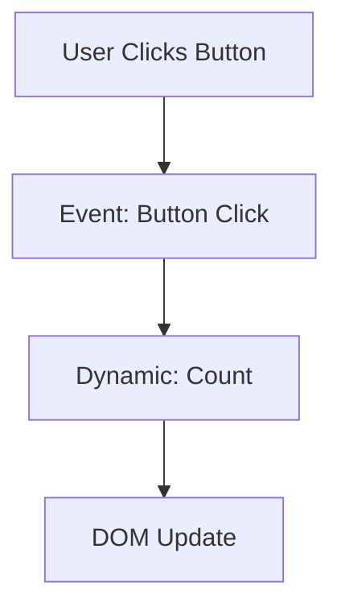

## 9.11 FRP in Web Development with GHCJS

Functional Reactive Programming (FRP) is a paradigm that allows developers to work with time-varying values and asynchronous events in a declarative manner. In the context of web development, FRP provides a powerful way to build interactive and dynamic web applications. This section explores how to leverage FRP in web development using GHCJS, a Haskell-to-JavaScript compiler, and Reflex-DOM, a Haskell library for building reactive web interfaces.

### Introduction to GHCJS

**GHCJS** is a compiler that translates Haskell code into JavaScript, enabling Haskell developers to write client-side web applications. By using GHCJS, developers can harness the power of Haskell's type system and functional programming paradigms in the browser environment.

#### Key Features of GHCJS

- **Seamless Integration**: GHCJS allows Haskell code to interact with JavaScript libraries and APIs, providing seamless integration with existing web technologies.
- **Type Safety**: By compiling Haskell to JavaScript, developers can ensure type safety and catch errors at compile time, reducing runtime errors.
- **Code Reuse**: Developers can reuse Haskell code across server and client environments, promoting code consistency and reducing duplication.

### Functional Reactive Programming (FRP) on the Web

FRP is particularly well-suited for web development due to its ability to handle asynchronous events and dynamic data streams. In a web application, user interactions, network requests, and other events can be modeled as streams of data that change over time.

#### Benefits of FRP in Web Development

- **Declarative Style**: FRP allows developers to express complex interactions and state changes declaratively, making code easier to read and maintain.
- **Composability**: FRP promotes composability, enabling developers to build complex behaviors by combining simple, reusable components.
- **Reactive Updates**: FRP automatically propagates changes through the system, ensuring that the user interface remains consistent with the underlying data model.

### Implementing FRP with Reflex-DOM

**Reflex-DOM** is a Haskell library that provides tools for building reactive web interfaces using FRP principles. It leverages GHCJS to run Haskell code in the browser and offers a rich set of abstractions for managing dynamic content and user interactions.

#### Key Concepts in Reflex-DOM

- **Dynamic**: Represents values that can change over time. A `Dynamic` value automatically updates the DOM when it changes.
- **Event**: Represents a stream of discrete occurrences, such as user clicks or network responses.
- **Behavior**: Represents a time-varying value that can be sampled at any point in time.

#### Building a Simple Reflex-DOM Application

Let's build a simple Reflex-DOM application to demonstrate how FRP can be used to create interactive web interfaces.

```haskell
{-# LANGUAGE OverloadedStrings #-}
{-# LANGUAGE RecursiveDo #-}

import Reflex.Dom

main :: IO ()
main = mainWidget $ el "div" $ do
  el "h1" $ text "Counter Example"
  rec
    let increment = (+1) <$ buttonClick
    count <- foldDyn ($) (0 :: Int) increment
    buttonClick <- button "Increment"
    display count
  return ()
```

**Explanation:**

- **`mainWidget`**: Initializes the Reflex-DOM application and sets up the main widget.
- **`el`**: Creates an HTML element. In this case, a `div` and an `h1` are created.
- **`button`**: Creates a button element that emits an `Event` when clicked.
- **`foldDyn`**: Accumulates changes over time, updating the `Dynamic` value `count` whenever the button is clicked.
- **`display`**: Displays the current value of `count` in the DOM.

### Visualizing FRP with Reflex-DOM

To better understand how Reflex-DOM manages dynamic updates, let's visualize the flow of data in a Reflex-DOM application.



**Description**: This diagram illustrates the flow of data in a Reflex-DOM application. When the user clicks the button, an `Event` is generated, which updates the `Dynamic` value `count`. The DOM is then updated to reflect the new count.

### Advanced Reflex-DOM Features

Reflex-DOM provides several advanced features that enable developers to build complex web applications.

#### Combining Events and Dynamics

Reflex-DOM allows developers to combine multiple `Event` and `Dynamic` values to create complex behaviors.

```haskell
{-# LANGUAGE OverloadedStrings #-}
{-# LANGUAGE RecursiveDo #-}

import Reflex.Dom

main :: IO ()
main = mainWidget $ el "div" $ do
  el "h1" $ text "Combined Events Example"
  rec
    let increment = (+1) <$ buttonClick
        decrement = subtract 1 <$ buttonClick2
    count <- foldDyn ($) (0 :: Int) (mergeWith (.) [increment, decrement])
    buttonClick <- button "Increment"
    buttonClick2 <- button "Decrement"
    display count
  return ()
```

**Explanation**:

- **`mergeWith`**: Combines multiple `Event` streams into a single `Event` stream using a specified function. In this example, it combines increment and decrement events.

#### Working with Attributes and Styles

Reflex-DOM allows developers to dynamically update HTML attributes and styles based on `Dynamic` values.

```haskell
{-# LANGUAGE OverloadedStrings #-}
{-# LANGUAGE RecursiveDo #-}

import Reflex.Dom

main :: IO ()
main = mainWidget $ el "div" $ do
  el "h1" $ text "Dynamic Styles Example"
  rec
    let toggle = not <$ buttonClick
    isRed <- foldDyn ($) True toggle
    buttonClick <- button "Toggle Color"
    let styleAttr = ffor isRed $ \red -> if red
                                         then "color: red;"
                                         else "color: blue;"
    elDynAttr "p" (constDyn ("style" =: styleAttr)) $ text "This text changes color."
  return ()
```

**Explanation**:

- **`elDynAttr`**: Creates an HTML element with dynamic attributes. The `style` attribute is updated based on the `Dynamic` value `isRed`.

### Building Single-Page Applications (SPAs) with Reflex-DOM

Reflex-DOM is well-suited for building single-page applications (SPAs) that run entirely in the browser. SPAs provide a seamless user experience by dynamically updating the content without reloading the page.

#### Routing in Reflex-DOM

Reflex-DOM provides tools for managing client-side routing, allowing developers to build SPAs with multiple views.

```haskell
{-# LANGUAGE OverloadedStrings #-}
{-# LANGUAGE RecursiveDo #-}

import Reflex.Dom
import Data.Text (Text)

main :: IO ()
main = mainWidget $ el "div" $ do
  el "h1" $ text "SPA Example"
  rec
    let home = constDyn "Home Page"
        about = constDyn "About Page"
    currentRoute <- holdDyn home (leftmost [home <$ homeClick, about <$ aboutClick])
    homeClick <- button "Home"
    aboutClick <- button "About"
    dynText =<< currentRoute
  return ()
```

**Explanation**:

- **`holdDyn`**: Holds the current value of a `Dynamic` based on an `Event`.
- **`leftmost`**: Selects the first occurring `Event` from a list of `Event` streams.

### Integrating JavaScript and Haskell with GHCJS

GHCJS allows Haskell code to interact with JavaScript libraries and APIs, enabling developers to leverage existing web technologies.

#### Calling JavaScript from Haskell

GHCJS provides the `foreign import javascript` syntax to call JavaScript functions from Haskell.

```haskell
{-# LANGUAGE ForeignFunctionInterface #-}

foreign import javascript unsafe "console.log($1)"
  js_log :: JSString -> IO ()

main :: IO ()
main = js_log "Hello from Haskell!"
```

**Explanation**:

- **`foreign import javascript`**: Declares a foreign JavaScript function that can be called from Haskell.
- **`js_log`**: A Haskell function that calls the JavaScript `console.log` function.

#### Using JavaScript Libraries with Reflex-DOM

Reflex-DOM can be extended with JavaScript libraries to enhance functionality and user experience.

```haskell
{-# LANGUAGE OverloadedStrings #-}
{-# LANGUAGE RecursiveDo #-}

import Reflex.Dom
import GHCJS.DOM.Types (JSM)
import qualified Data.Text as T

foreign import javascript unsafe "$($1).datepicker()"
  js_datepicker :: JSString -> JSM ()

main :: IO ()
main = mainWidget $ el "div" $ do
  el "h1" $ text "Datepicker Example"
  el "input" $ return ()
  performEvent_ $ liftJSM . js_datepicker . T.pack <$> (domEvent Click =<< button "Activate Datepicker")
  return ()
```

**Explanation**:

- **`performEvent_`**: Executes a side effect in response to an `Event`.
- **`liftJSM`**: Lifts a `JSM` action into the Reflex-DOM monad.

### Design Considerations for FRP in Web Development

When building web applications with FRP and Reflex-DOM, consider the following design considerations:

- **Performance**: FRP can introduce overhead due to the propagation of changes. Optimize performance by minimizing unnecessary updates and using efficient data structures.
- **State Management**: Carefully manage application state to ensure consistency and avoid race conditions.
- **Testing**: Test FRP applications thoroughly to ensure that reactive updates behave as expected.

### Haskell Unique Features in FRP

Haskell's strong type system and functional programming paradigms provide unique advantages when implementing FRP:

- **Type Safety**: Haskell's type system ensures that FRP components are composed correctly, reducing runtime errors.
- **Immutability**: Immutable data structures simplify state management and reduce the risk of unintended side effects.
- **Higher-Order Functions**: Haskell's support for higher-order functions enables concise and expressive FRP code.

### Differences and Similarities with Other Patterns

FRP shares similarities with other reactive programming paradigms, such as Reactive Extensions (Rx) and Functional Reactive Programming (FRP) in other languages. However, Haskell's implementation of FRP emphasizes purity and type safety, distinguishing it from imperative approaches.

### Try It Yourself

Experiment with the provided code examples by modifying them to create new behaviors. For example, try adding additional buttons to the counter example or integrating a different JavaScript library with Reflex-DOM.

### Knowledge Check

- How does GHCJS enable Haskell code to run in the browser?
- What are the key components of Reflex-DOM?
- How can you combine multiple `Event` streams in Reflex-DOM?
- What are the benefits of using FRP in web development?

### Embrace the Journey

Remember, this is just the beginning. As you progress, you'll build more complex and interactive web applications using FRP and Reflex-DOM. Keep experimenting, stay curious, and enjoy the journey!

## Quiz: FRP in Web Development with GHCJS



### What is GHCJS?

- [x] A compiler that converts Haskell code to JavaScript.
- [ ] A JavaScript library for building web applications.
- [ ] A Haskell library for server-side programming.
- [ ] A tool for optimizing JavaScript performance.

> **Explanation:** GHCJS is a compiler that translates Haskell code into JavaScript, enabling Haskell developers to write client-side web applications.

### What is the primary benefit of using FRP in web development?

- [x] Declarative style for expressing complex interactions.
- [ ] Improved server-side performance.
- [ ] Simplified database management.
- [ ] Enhanced security features.

> **Explanation:** FRP allows developers to express complex interactions and state changes declaratively, making code easier to read and maintain.

### Which Reflex-DOM component represents values that can change over time?

- [x] Dynamic
- [ ] Event
- [ ] Behavior
- [ ] Action

> **Explanation:** In Reflex-DOM, a `Dynamic` represents values that can change over time and automatically updates the DOM when it changes.

### How can you combine multiple `Event` streams in Reflex-DOM?

- [x] Using `mergeWith`
- [ ] Using `foldDyn`
- [ ] Using `el`
- [ ] Using `display`

> **Explanation:** `mergeWith` is used to combine multiple `Event` streams into a single `Event` stream using a specified function.

### What is the purpose of `foreign import javascript` in GHCJS?

- [x] To call JavaScript functions from Haskell.
- [ ] To import Haskell functions into JavaScript.
- [ ] To optimize JavaScript code.
- [ ] To manage server-side state.

> **Explanation:** `foreign import javascript` is used to declare foreign JavaScript functions that can be called from Haskell.

### What is the role of `performEvent_` in Reflex-DOM?

- [x] Executes a side effect in response to an `Event`.
- [ ] Combines multiple `Event` streams.
- [ ] Updates the DOM with a `Dynamic` value.
- [ ] Manages application state.

> **Explanation:** `performEvent_` is used to execute a side effect in response to an `Event` in Reflex-DOM.

### How does Reflex-DOM handle dynamic updates to HTML attributes?

- [x] Using `elDynAttr`
- [ ] Using `foldDyn`
- [ ] Using `button`
- [ ] Using `display`

> **Explanation:** `elDynAttr` creates an HTML element with dynamic attributes, allowing updates based on `Dynamic` values.

### What is a key consideration when building FRP applications?

- [x] Performance optimization
- [ ] Simplified database management
- [ ] Enhanced security features
- [ ] Improved server-side performance

> **Explanation:** Performance optimization is important in FRP applications to minimize overhead and ensure efficient updates.

### What is a unique feature of Haskell in implementing FRP?

- [x] Strong type system
- [ ] Simplified database management
- [ ] Enhanced security features
- [ ] Improved server-side performance

> **Explanation:** Haskell's strong type system ensures that FRP components are composed correctly, reducing runtime errors.

### True or False: Reflex-DOM can only be used for server-side applications.

- [ ] True
- [x] False

> **Explanation:** Reflex-DOM is used for building client-side web applications, leveraging GHCJS to run Haskell code in the browser.




