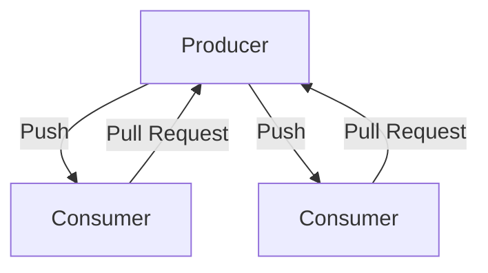

## 9.12 Reactive Systems and Push-Pull Models

In the realm of software architecture, reactive systems have emerged as a powerful paradigm for building responsive, resilient, and scalable applications. At the heart of reactive systems lies the concept of push-pull models, which dictate how data flows between producers and consumers. In this section, we will delve into the intricacies of reactive systems and push-pull models, focusing on their implementation in Haskell, a language renowned for its strong support for functional programming and concurrency.

### Understanding Reactive Systems

Reactive systems are designed to be responsive, resilient, elastic, and message-driven. They are particularly well-suited for environments where systems must react to changes in real-time, such as in financial trading platforms, IoT applications, and interactive web services.

#### Key Characteristics of Reactive Systems

1. **Responsive**: Reactive systems provide rapid and consistent response times, ensuring a positive user experience.
2. **Resilient**: They remain responsive in the face of failure, employing techniques such as replication, containment, isolation, and delegation.
3. **Elastic**: Reactive systems can scale up or down to accommodate varying workloads, optimizing resource utilization.
4. **Message-Driven**: They rely on asynchronous message-passing to establish boundaries between components, ensuring loose coupling and isolation.

### Push vs. Pull Models

The push-pull model is a fundamental concept in reactive systems, determining how data is communicated between producers and consumers.

#### Push Model

In the push model, producers actively send data to consumers as soon as it becomes available. This approach is suitable for scenarios where data needs to be processed immediately, such as in real-time analytics or event-driven architectures.

- **Advantages**:
  - Low latency: Data is delivered as soon as it's available.
  - Simplified consumer logic: Consumers don't need to request data.

- **Disadvantages**:
  - Potential for data overload: Consumers may be overwhelmed if they can't process data quickly enough.
  - Increased complexity in backpressure management.

#### Pull Model

Conversely, in the pull model, consumers request data from producers as needed. This model is beneficial when consumers need to control the rate of data processing, such as in batch processing or when dealing with large datasets.

- **Advantages**:
  - Consumer control: Consumers can request data at their own pace.
  - Easier to implement backpressure: Consumers can throttle requests based on their processing capacity.

- **Disadvantages**:
  - Increased latency: Data is only delivered upon request.
  - More complex producer logic: Producers must handle data requests.

### Combining Push and Pull Models

In practice, many systems benefit from a hybrid approach that combines both push and pull models. This allows systems to optimize for responsiveness and resource utilization, adapting to varying workloads and network conditions.

#### Hybrid Approach

A hybrid approach involves dynamically switching between push and pull models based on system load, network conditions, and consumer demand. This flexibility enables systems to maintain responsiveness while preventing resource exhaustion.

- **Implementation Strategies**:
  - Use push for high-priority, real-time data and pull for less time-sensitive information.
  - Implement adaptive algorithms that switch models based on current load and performance metrics.

### Implementing Push-Pull Models in Haskell

Haskell's strong support for functional programming and concurrency makes it an excellent choice for implementing reactive systems with push-pull models. Let's explore how to design and implement these models in Haskell.

#### Designing Reactive Systems in Haskell

1. **Use of Functional Paradigms**: Leverage Haskell's functional paradigms, such as pure functions, immutability, and higher-order functions, to build robust and maintainable reactive systems.

2. **Concurrency and Parallelism**: Utilize Haskell's concurrency libraries, such as `async` and `STM` (Software Transactional Memory), to manage concurrent data flows efficiently.

3. **FRP Libraries**: Explore Functional Reactive Programming (FRP) libraries like `reflex` and `Yampa` to handle asynchronous data streams and events.

#### Code Example: Implementing a Simple Push-Pull Model

Let's implement a simple push-pull model in Haskell using the `Conduit` library, which provides a powerful abstraction for streaming data.

```haskell
{-# LANGUAGE OverloadedStrings #-}

import Conduit
import Control.Monad.IO.Class (liftIO)
import Data.Text (Text)
import qualified Data.Text as T
import qualified Data.Text.IO as TIO

-- Producer: Generates a stream of data
producer :: MonadIO m => ConduitT () Text m ()
producer = do
    yield "Hello"
    yield "World"
    yield "from"
    yield "Haskell"

-- Consumer: Processes the stream of data
consumer :: MonadIO m => ConduitT Text Void m ()
consumer = awaitForever $ \text -> liftIO $ TIO.putStrLn text

-- Main function: Connects producer and consumer
main :: IO ()
main = runConduit $ producer .| consumer
```

In this example, the `producer` function generates a stream of `Text` data, which is then processed by the `consumer` function. The `runConduit` function connects the producer and consumer, facilitating the data flow.

### Visualizing Push-Pull Models

To better understand the dynamics of push-pull models, let's visualize the data flow using a Mermaid.js diagram.



**Diagram Description**: This diagram illustrates a hybrid push-pull model where a producer can push data to multiple consumers, and consumers can also request data from the producer as needed.

### Design Considerations

When implementing push-pull models in Haskell, consider the following:

1. **Backpressure Management**: Implement mechanisms to handle backpressure, ensuring that consumers are not overwhelmed by data.

2. **Error Handling**: Use Haskell's strong type system and monadic error handling to manage errors gracefully.

3. **Scalability**: Design systems to scale horizontally, leveraging Haskell's concurrency primitives to handle increased load.

4. **Resource Utilization**: Optimize resource utilization by dynamically switching between push and pull models based on current conditions.

### Haskell Unique Features

Haskell offers several unique features that enhance the implementation of reactive systems:

- **Lazy Evaluation**: Haskell's lazy evaluation model allows for efficient handling of infinite data streams, making it ideal for reactive systems.

- **Strong Typing**: Haskell's strong static typing ensures type safety, reducing runtime errors and enhancing system reliability.

- **Monads and Applicatives**: Utilize monads and applicatives to manage side effects and asynchronous data flows effectively.

### Differences and Similarities with Other Patterns

Push-pull models share similarities with other design patterns, such as the observer pattern and publish-subscribe pattern. However, they differ in their approach to data flow control and consumer-producer interaction.

- **Observer Pattern**: In the observer pattern, observers are notified of changes by the subject. This is similar to the push model but lacks the pull model's consumer control.

- **Publish-Subscribe Pattern**: This pattern involves publishers broadcasting messages to subscribers. It can be implemented using push-pull models, where subscribers can request specific data.

### Try It Yourself

Experiment with the provided code example by modifying the producer to generate different types of data or by adding additional consumers. Observe how the system behaves under different configurations and loads.

### Knowledge Check

- What are the key characteristics of reactive systems?
- How do push and pull models differ in terms of data flow?
- What are the advantages and disadvantages of using a hybrid push-pull model?
- How can Haskell's concurrency libraries be used to implement reactive systems?

### Embrace the Journey

Remember, mastering reactive systems and push-pull models in Haskell is a journey. As you progress, you'll build more complex and efficient systems. Keep experimenting, stay curious, and enjoy the journey!

## Quiz: Reactive Systems and Push-Pull Models



### What is a key characteristic of reactive systems?

- [x] They are message-driven.
- [ ] They rely solely on synchronous communication.
- [ ] They are always implemented using object-oriented programming.
- [ ] They do not scale well.

> **Explanation:** Reactive systems are message-driven, which allows them to be responsive and resilient.

### In a push model, who initiates the data transfer?

- [x] The producer
- [ ] The consumer
- [ ] A third-party service
- [ ] The database

> **Explanation:** In a push model, the producer initiates the data transfer by sending data to the consumer.

### What is an advantage of the pull model?

- [x] Consumers can control the rate of data processing.
- [ ] Producers have complete control over data flow.
- [ ] It eliminates the need for backpressure management.
- [ ] It reduces latency.

> **Explanation:** The pull model allows consumers to request data at their own pace, giving them control over the rate of data processing.

### How can a hybrid push-pull model benefit a system?

- [x] By optimizing responsiveness and resource utilization
- [ ] By eliminating the need for producers
- [ ] By reducing the complexity of consumer logic
- [ ] By ensuring data is never lost

> **Explanation:** A hybrid push-pull model can dynamically switch between push and pull based on system load, optimizing responsiveness and resource utilization.

### Which Haskell feature is particularly useful for handling infinite data streams?

- [x] Lazy evaluation
- [ ] Strong typing
- [ ] Monads
- [ ] Type classes

> **Explanation:** Haskell's lazy evaluation allows for efficient handling of infinite data streams, making it ideal for reactive systems.

### What is a common challenge when implementing push models?

- [x] Managing backpressure
- [ ] Ensuring consumer control
- [ ] Handling synchronous communication
- [ ] Reducing latency

> **Explanation:** Managing backpressure is a common challenge in push models, as consumers may be overwhelmed by data.

### Which library can be used in Haskell for streaming data?

- [x] Conduit
- [ ] Reflex
- [ ] Yampa
- [ ] STM

> **Explanation:** The Conduit library provides a powerful abstraction for streaming data in Haskell.

### What is a benefit of using Haskell's strong typing in reactive systems?

- [x] It reduces runtime errors.
- [ ] It simplifies consumer logic.
- [ ] It eliminates the need for error handling.
- [ ] It increases latency.

> **Explanation:** Haskell's strong static typing ensures type safety, reducing runtime errors and enhancing system reliability.

### How can Haskell's concurrency libraries help in reactive systems?

- [x] By managing concurrent data flows efficiently
- [ ] By eliminating the need for producers
- [ ] By simplifying consumer logic
- [ ] By increasing latency

> **Explanation:** Haskell's concurrency libraries, such as `async` and `STM`, help manage concurrent data flows efficiently.

### True or False: The observer pattern is identical to the push model.

- [ ] True
- [x] False

> **Explanation:** While the observer pattern shares similarities with the push model, it lacks the pull model's consumer control.


