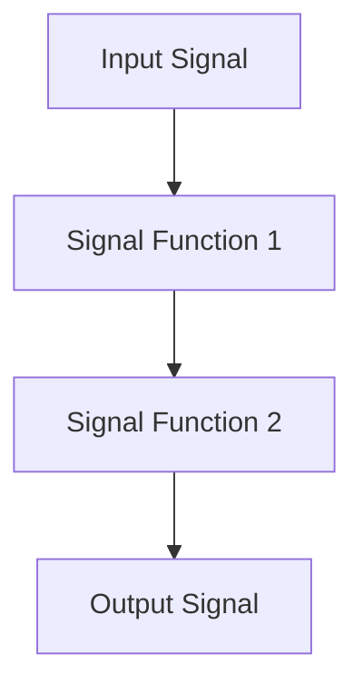

## 9.2 Signal Functions and Arrowized FRP

In this section, we delve into the world of Signal Functions and Arrowized Functional Reactive Programming (FRP) in Haskell. As expert software engineers and architects, you will gain a deeper understanding of how to leverage these concepts to build reactive systems that are both efficient and scalable.

### Introduction to Signal Functions

Signal Functions are a core concept in Functional Reactive Programming (FRP). They are essentially functions that transform input signals into output signals over time. This transformation is continuous, allowing for the modeling of dynamic systems such as animations, games, and real-time data processing.

#### Key Concepts

- **Signals**: Continuous streams of data that change over time.
- **Signal Functions**: Functions that take signals as input and produce signals as output.
- **Time-Varying Behavior**: The ability to model changes in data over time.

Signal Functions provide a declarative way to describe how data flows through a system, making it easier to reason about complex interactions and dependencies.

### Arrowized FRP

Arrowized FRP builds upon the concept of Signal Functions by using the `Arrow` abstraction. Arrows are a generalization of monads that allow for more flexible composition of computations. In the context of FRP, Arrows enable the composition of Signal Functions in a way that is both expressive and efficient.

#### The Arrow Abstraction

Arrows provide a way to abstract over computations that have an input and an output. They are defined by the `Arrow` type class, which provides several combinators for composing and manipulating arrows.

```haskell
class Category arr => Arrow arr where
    arr :: (b -> c) -> arr b c
    (>>>) :: arr b c -> arr c d -> arr b d
    first :: arr b c -> arr (b, d) (c, d)
```

- **`arr`**: Lifts a pure function into an arrow.
- **`>>>`**: Composes two arrows sequentially.
- **`first`**: Applies an arrow to the first component of a pair.

#### Arrowized FRP in Practice

Arrowized FRP is implemented in Haskell using libraries like **Yampa**. Yampa provides a rich set of tools for working with Signal Functions and Arrows, making it easier to build complex reactive systems.

### Implementing Arrowized FRP with Yampa

Yampa is a Haskell library for Arrowized FRP that provides a powerful framework for building reactive systems. It is particularly well-suited for applications like games and simulations, where real-time responsiveness is crucial.

#### Getting Started with Yampa

To get started with Yampa, you need to install the library and set up your Haskell environment. You can install Yampa using Cabal or Stack:

```bash
cabal update
cabal install Yampa
```

Once installed, you can start using Yampa to define Signal Functions and compose them using Arrows.

#### Defining Signal Functions

In Yampa, a Signal Function is represented by the `SF` type, which stands for Signal Function. You can define a simple Signal Function that increments its input by one:

```haskell
import FRP.Yampa

incrementSF :: SF Int Int
incrementSF = arr (+1)
```

This Signal Function takes an integer signal as input and produces an integer signal as output, incrementing each value by one.

#### Composing Signal Functions

One of the key advantages of Arrowized FRP is the ability to compose Signal Functions using Arrow combinators. For example, you can compose two Signal Functions to create a new one:

```haskell
doubleSF :: SF Int Int
doubleSF = arr (*2)

incrementAndDoubleSF :: SF Int Int
incrementAndDoubleSF = incrementSF >>> doubleSF
```

Here, `incrementAndDoubleSF` is a Signal Function that first increments its input and then doubles the result.

### Designing Reactive Game Logic

Let's explore how Arrowized FRP can be used to design reactive game logic. We'll build a simple game where a player controls a character that moves across the screen.

#### Defining the Game State

First, we define the game state, which includes the player's position and velocity:

```haskell
data GameState = GameState
    { playerPosition :: Double
    , playerVelocity :: Double
    }

initialState :: GameState
initialState = GameState 0 0
```

#### Creating Signal Functions for Game Logic

Next, we create Signal Functions to update the game state based on player input and time progression:

```haskell
playerControlSF :: SF (Event Input) Double
playerControlSF = arr $ \input -> case input of
    MoveLeft  -> -1
    MoveRight -> 1
    _         -> 0

velocitySF :: SF (Event Input) Double
velocitySF = playerControlSF >>> arr (*10)

positionSF :: SF (Double, Double) Double
positionSF = arr $ \\(pos, vel) -> pos + vel
```

#### Composing the Game Logic

Finally, we compose the Signal Functions to create the complete game logic:

```haskell
gameLogicSF :: SF (Event Input) GameState
gameLogicSF = proc input -> do
    vel <- velocitySF -< input
    pos <- positionSF -< (0, vel)
    returnA -< GameState pos vel
```

### Visualizing Signal Functions and Arrows

To better understand how Signal Functions and Arrows work together, let's visualize the flow of data through a simple system using Mermaid.js.



This diagram illustrates how input signals are transformed by a series of Signal Functions, resulting in an output signal.

### Try It Yourself

Now that you have a basic understanding of Signal Functions and Arrowized FRP, try modifying the code examples to experiment with different behaviors. For instance, you can change the player's velocity or add new Signal Functions to handle additional game mechanics.

### References and Further Reading

- [Yampa Library](https://hackage.haskell.org/package/Yampa)
- [Arrowized FRP in Haskell](https://wiki.haskell.org/Arrowized_FRP)
- [Functional Reactive Programming](https://en.wikipedia.org/wiki/Functional_reactive_programming)

### Knowledge Check

- What are Signal Functions, and how do they differ from regular functions?
- How does the Arrow abstraction enhance the composition of Signal Functions?
- What are some practical applications of Arrowized FRP in software development?

### Embrace the Journey

Remember, mastering Signal Functions and Arrowized FRP is just the beginning of your journey into reactive programming with Haskell. As you continue to explore these concepts, you'll discover new ways to build responsive and efficient systems. Keep experimenting, stay curious, and enjoy the journey!

## Quiz: Signal Functions and Arrowized FRP



### What is the primary purpose of Signal Functions in FRP?

- [x] To transform input signals into output signals over time.
- [ ] To manage state in a reactive system.
- [ ] To handle side effects in functional programming.
- [ ] To compose monadic computations.

> **Explanation:** Signal Functions are used to transform input signals into output signals over time, allowing for the modeling of dynamic systems.

### Which Haskell library is commonly used for Arrowized FRP?

- [x] Yampa
- [ ] Conduit
- [ ] Warp
- [ ] Aeson

> **Explanation:** Yampa is a Haskell library specifically designed for Arrowized Functional Reactive Programming.

### What does the `arr` function do in the context of Arrows?

- [x] It lifts a pure function into an arrow.
- [ ] It composes two arrows sequentially.
- [ ] It applies an arrow to the first component of a pair.
- [ ] It creates a new arrow from an existing one.

> **Explanation:** The `arr` function lifts a pure function into an arrow, allowing it to be used in arrow compositions.

### How can Signal Functions be composed in Arrowized FRP?

- [x] Using the `>>>` operator.
- [ ] Using the `>>=` operator.
- [ ] Using the `++` operator.
- [ ] Using the `&&` operator.

> **Explanation:** Signal Functions can be composed using the `>>>` operator, which connects the output of one arrow to the input of another.

### What is a practical application of Arrowized FRP?

- [x] Designing reactive game logic.
- [ ] Implementing database transactions.
- [ ] Managing file I/O operations.
- [ ] Building static web pages.

> **Explanation:** Arrowized FRP is particularly useful for designing reactive game logic and other real-time systems.

### What type represents a Signal Function in Yampa?

- [x] SF
- [ ] IO
- [ ] STM
- [ ] Maybe

> **Explanation:** In Yampa, a Signal Function is represented by the `SF` type.

### What is the role of the `first` combinator in Arrows?

- [x] It applies an arrow to the first component of a pair.
- [ ] It composes two arrows sequentially.
- [ ] It lifts a pure function into an arrow.
- [ ] It creates a new arrow from an existing one.

> **Explanation:** The `first` combinator applies an arrow to the first component of a pair, leaving the second component unchanged.

### What is the initial step in creating a reactive system with Yampa?

- [x] Defining the Signal Functions.
- [ ] Setting up a database connection.
- [ ] Writing unit tests.
- [ ] Configuring a web server.

> **Explanation:** The initial step in creating a reactive system with Yampa is defining the Signal Functions that will process the input signals.

### What is the benefit of using Arrowized FRP over traditional FRP?

- [x] More flexible composition of computations.
- [ ] Easier handling of side effects.
- [ ] Better support for concurrency.
- [ ] Simplified error handling.

> **Explanation:** Arrowized FRP provides more flexible composition of computations, making it easier to build complex reactive systems.

### True or False: Signal Functions in Yampa can only process discrete events.

- [ ] True
- [x] False

> **Explanation:** Signal Functions in Yampa can process both continuous signals and discrete events, allowing for a wide range of applications.




