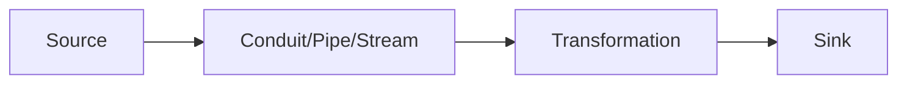

## 9.3 Observable Streams with Conduit, Pipes, and Streaming

In the realm of functional programming, observable streams are a powerful concept that allows us to handle sequences of data in a way that is both efficient and expressive. In Haskell, libraries like **Conduit**, **Pipes**, and **Streaming** provide robust frameworks for working with streams. This section will delve into the intricacies of these libraries, demonstrating how they enable us to process large data sets without the need to load them entirely into memory.

### Understanding Observable Streams

**Observable Streams** are sequences of data that can be observed and processed incrementally. They are particularly useful for handling large data sets or continuous data flows, such as log files, network packets, or user interactions. The key advantage of using streams is their ability to process data in a memory-efficient manner, often allowing for operations on data that exceed the available memory.

### Libraries for Stream Processing in Haskell

Haskell offers several libraries for stream processing, each with its own strengths and use cases. The most prominent ones are:

- **Conduit**: Known for its simplicity and composability, Conduit is a library that provides a way to build data processing pipelines.
- **Pipes**: Offers a more general framework for stream processing, emphasizing composability and resource safety.
- **Streaming**: Focuses on providing a simple interface for stream processing, leveraging Haskell's lazy evaluation.

Let's explore each of these libraries in detail.

### Conduit

#### Overview

Conduit is a library designed to handle streaming data in a way that is both efficient and easy to use. It allows you to construct pipelines that process data incrementally, making it ideal for scenarios where you need to handle large data sets or continuous data streams.

#### Key Concepts

- **Source**: A producer of data.
- **Sink**: A consumer of data.
- **Conduit**: A transformer that sits between a source and a sink, processing data as it flows through.

#### Example: Processing a Large File

Let's consider an example where we need to process a large file line by line, counting the number of lines that contain a specific word.

```haskell
{-# LANGUAGE OverloadedStrings #-}

import Conduit
import qualified Data.ByteString as BS

main :: IO ()
main = do
  count <- runConduitRes
    $ sourceFile "largefile.txt"
    .| decodeUtf8C
    .| linesUnboundedC
    .| filterC (BS.isInfixOf "Haskell")
    .| lengthC
  print count
```

**Explanation**:
- `sourceFile`: Reads the file as a stream of bytes.
- `decodeUtf8C`: Decodes the bytes into a stream of text.
- `linesUnboundedC`: Splits the text into lines.
- `filterC`: Filters lines containing the word "Haskell".
- `lengthC`: Counts the number of lines that pass the filter.

### Pipes

#### Overview

Pipes is a library that provides a powerful abstraction for stream processing. It emphasizes composability and resource safety, making it suitable for complex data processing tasks.

#### Key Concepts

- **Producer**: Generates a stream of data.
- **Consumer**: Consumes a stream of data.
- **Pipe**: Transforms data as it flows from a producer to a consumer.
- **Effect**: Represents a computation that produces no output.

#### Example: Transforming a Stream

Let's transform a stream of numbers by doubling each number and then summing them up.

```haskell
import Pipes
import qualified Pipes.Prelude as P

main :: IO ()
main = do
  result <- runEffect $ for (each [1..10]) $ \x -> do
    let y = x * 2
    lift $ print y
  print result
```

**Explanation**:
- `each [1..10]`: Produces a stream of numbers from 1 to 10.
- `for`: Iterates over the stream, applying a transformation.
- `lift $ print y`: Prints each transformed number.

### Streaming

#### Overview

The Streaming library provides a simple and intuitive interface for working with streams. It leverages Haskell's lazy evaluation to process data efficiently.

#### Key Concepts

- **Stream**: Represents a sequence of data.
- **Of**: A pair of a value and a stream.
- **Effect**: A computation that produces a stream.

#### Example: Filtering a Stream

Let's filter a stream of numbers, retaining only the even numbers.

```haskell
import Streaming
import qualified Streaming.Prelude as S

main :: IO ()
main = S.print $ S.filter even $ S.each [1..10]
```

**Explanation**:
- `S.each [1..10]`: Creates a stream of numbers from 1 to 10.
- `S.filter even`: Filters the stream, retaining only even numbers.
- `S.print`: Prints each number in the filtered stream.

### Comparing Conduit, Pipes, and Streaming

Each of these libraries has its own strengths and trade-offs. Here's a comparison to help you choose the right one for your needs:

- **Conduit**: Offers a straightforward API with good performance. It's a great choice for most streaming tasks.
- **Pipes**: Provides more flexibility and composability, making it suitable for complex data processing pipelines.
- **Streaming**: Leverages Haskell's lazy evaluation, offering a simple interface for stream processing.

### Visualizing Stream Processing

To better understand how these libraries work, let's visualize a simple data processing pipeline using Mermaid.js.



**Description**: This diagram represents a typical data processing pipeline, where data flows from a source through a transformation conduit or pipe, and finally to a sink.

### Design Considerations

When working with observable streams in Haskell, consider the following:

- **Memory Usage**: Streams allow you to process data incrementally, reducing memory usage.
- **Composability**: Choose a library that offers the right balance of composability and simplicity for your needs.
- **Performance**: Consider the performance characteristics of each library, especially for large data sets.

### Haskell Unique Features

Haskell's strong type system and lazy evaluation make it particularly well-suited for stream processing. These features allow you to write concise and efficient code that is both safe and expressive.

### Differences and Similarities

While Conduit, Pipes, and Streaming share many similarities, they differ in their approach to stream processing. Conduit and Pipes offer more control over resource management, while Streaming provides a simpler interface by leveraging lazy evaluation.

### Try It Yourself

Experiment with the code examples provided in this section. Try modifying them to process different types of data or apply different transformations. For example, you could:

- Modify the Conduit example to count lines containing a different word.
- Change the Pipes example to apply a different transformation to the numbers.
- Use the Streaming library to process a stream of text instead of numbers.

### Knowledge Check

- What are observable streams, and why are they useful?
- How do Conduit, Pipes, and Streaming differ in their approach to stream processing?
- What are some key considerations when working with streams in Haskell?

### Embrace the Journey

Remember, mastering observable streams in Haskell is a journey. As you explore these libraries, you'll gain a deeper understanding of functional programming and stream processing. Keep experimenting, stay curious, and enjoy the journey!

## Quiz: Observable Streams with Conduit, Pipes, and Streaming



### What is the primary advantage of using observable streams?

- [x] Memory-efficient data processing
- [ ] Faster computation
- [ ] Easier debugging
- [ ] Better error handling

> **Explanation:** Observable streams allow for memory-efficient data processing by handling data incrementally.

### Which library is known for leveraging Haskell's lazy evaluation?

- [ ] Conduit
- [ ] Pipes
- [x] Streaming
- [ ] All of the above

> **Explanation:** The Streaming library leverages Haskell's lazy evaluation to process data efficiently.

### What is a key concept in the Conduit library?

- [ ] Effect
- [x] Source
- [ ] Stream
- [ ] Observable

> **Explanation:** In Conduit, a Source is a producer of data.

### In the Pipes library, what does a Pipe do?

- [ ] Consumes data
- [ ] Produces data
- [x] Transforms data
- [ ] Stores data

> **Explanation:** A Pipe in the Pipes library transforms data as it flows from a producer to a consumer.

### What is the role of a Sink in Conduit?

- [x] Consumes data
- [ ] Produces data
- [ ] Transforms data
- [ ] Stores data

> **Explanation:** A Sink in Conduit is a consumer of data.

### Which library emphasizes composability and resource safety?

- [ ] Conduit
- [x] Pipes
- [ ] Streaming
- [ ] None of the above

> **Explanation:** Pipes emphasizes composability and resource safety.

### What does the `filterC` function do in Conduit?

- [ ] Produces data
- [x] Filters data
- [ ] Transforms data
- [ ] Consumes data

> **Explanation:** The `filterC` function in Conduit filters data based on a predicate.

### How does the Streaming library represent a sequence of data?

- [ ] Source
- [ ] Sink
- [x] Stream
- [ ] Pipe

> **Explanation:** The Streaming library represents a sequence of data as a Stream.

### What is a common use case for observable streams?

- [x] Processing large files
- [ ] Debugging code
- [ ] Writing tests
- [ ] Designing user interfaces

> **Explanation:** Observable streams are commonly used for processing large files without loading them entirely into memory.

### True or False: Conduit, Pipes, and Streaming can all be used for stream processing in Haskell.

- [x] True
- [ ] False

> **Explanation:** All three libraries—Conduit, Pipes, and Streaming—can be used for stream processing in Haskell.


