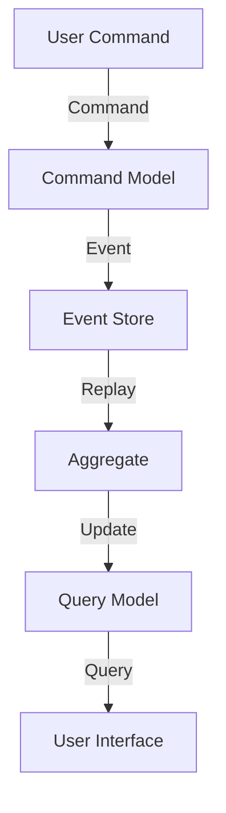

## 9.4 Event Sourcing and CQRS in Reactive Systems

In the realm of reactive systems, **Event Sourcing** and **Command Query Responsibility Segregation (CQRS)** are two powerful architectural patterns that can significantly enhance the scalability, performance, and maintainability of applications. In this section, we will explore these patterns in the context of Haskell, a language well-suited for implementing such paradigms due to its strong emphasis on immutability and functional programming.

### Understanding Event Sourcing

**Event Sourcing** is an architectural pattern where all changes to the application state are stored as a sequence of immutable events. Instead of storing the current state of an entity, we store a log of state-changing events. This approach offers several advantages:

- **Auditability**: Every change is recorded, providing a complete history of the application's state.
- **Replayability**: The state can be reconstructed by replaying the events, which is useful for debugging and testing.
- **Scalability**: Events can be processed asynchronously, allowing for scalable and distributed systems.

#### Key Concepts in Event Sourcing

- **Event Store**: A database or storage system that holds the sequence of events.
- **Event**: A record of a state change, typically immutable and timestamped.
- **Aggregate**: A cluster of domain objects that can be treated as a single unit for data changes.
- **Command**: An action or request that triggers an event.

#### Implementing Event Sourcing in Haskell

Let's delve into a basic implementation of Event Sourcing in Haskell. We'll create a simple banking application where account transactions are stored as events.

```haskell
{-# LANGUAGE DeriveGeneric #-}

import Data.Time.Clock (UTCTime, getCurrentTime)
import GHC.Generics (Generic)
import Data.Aeson (ToJSON, FromJSON)

-- Define an event type
data AccountEvent
  = AccountCreated { accountId :: String, initialBalance :: Double }
  | MoneyDeposited { accountId :: String, amount :: Double }
  | MoneyWithdrawn { accountId :: String, amount :: Double }
  deriving (Show, Generic)

instance ToJSON AccountEvent
instance FromJSON AccountEvent

-- Function to apply an event to an account state
applyEvent :: AccountState -> AccountEvent -> AccountState
applyEvent state (AccountCreated _ balance) = state { balance = balance }
applyEvent state (MoneyDeposited _ amount)  = state { balance = balance state + amount }
applyEvent state (MoneyWithdrawn _ amount)  = state { balance = balance state - amount }

-- Define the account state
data AccountState = AccountState
  { accountId :: String
  , balance   :: Double
  } deriving (Show)

-- Function to replay events to get the current state
replayEvents :: [AccountEvent] -> AccountState -> AccountState
replayEvents events initialState = foldl applyEvent initialState events
```

In this example, we define an `AccountEvent` data type to represent different types of events that can occur in a banking account. We then define functions to apply these events to an account state and to replay a sequence of events to reconstruct the current state.

### Command Query Responsibility Segregation (CQRS)

**CQRS** is a pattern that separates the read and write operations of a data store. By splitting the command (write) and query (read) responsibilities, CQRS allows for optimized performance and scalability, as each side can be independently optimized and scaled.

#### Key Concepts in CQRS

- **Command Model**: Handles the write operations and is responsible for validating and processing commands.
- **Query Model**: Handles the read operations and is optimized for querying data.
- **Eventual Consistency**: The read model may not be immediately consistent with the write model, but it will eventually become consistent.

#### Implementing CQRS in Haskell

Let's extend our banking application to use CQRS. We'll separate the command and query models.

```haskell
-- Command model
processCommand :: AccountState -> AccountEvent -> Either String AccountState
processCommand state (MoneyDeposited _ amount)
  | amount <= 0 = Left "Deposit amount must be positive"
  | otherwise   = Right $ applyEvent state (MoneyDeposited (accountId state) amount)
processCommand state (MoneyWithdrawn _ amount)
  | amount <= 0 = Left "Withdrawal amount must be positive"
  | amount > balance state = Left "Insufficient funds"
  | otherwise   = Right $ applyEvent state (MoneyWithdrawn (accountId state) amount)

-- Query model
getAccountBalance :: AccountState -> Double
getAccountBalance = balance
```

In this CQRS implementation, we define a `processCommand` function to handle write operations, ensuring that commands are validated before being applied. The `getAccountBalance` function represents the query model, optimized for reading the account balance.

### Reactive Integration with Event Sourcing and CQRS

Reactive systems benefit greatly from Event Sourcing and CQRS, as they enable real-time data processing and immediate consistency across distributed components.

#### Real-Time Event Processing

In a reactive system, events can be processed in real-time, allowing for immediate updates to the UI or other components. This is particularly useful in applications where timely data updates are critical, such as financial systems or live dashboards.

#### Example: Updating UI Components

Consider a scenario where a user's account balance is displayed on a dashboard. With Event Sourcing and CQRS, the UI can react to balance changes in real-time.

```haskell
-- Example of a reactive UI update
updateUI :: AccountState -> IO ()
updateUI state = putStrLn $ "Updated balance: " ++ show (balance state)

-- Simulate event processing and UI update
main :: IO ()
main = do
  let initialState = AccountState "12345" 0
  let events = [AccountCreated "12345" 1000, MoneyDeposited "12345" 200, MoneyWithdrawn "12345" 50]
  let finalState = replayEvents events initialState
  updateUI finalState
```

In this example, we simulate processing a series of events and updating the UI to reflect the current account balance.

### Visualizing Event Sourcing and CQRS

To better understand the flow of data in Event Sourcing and CQRS, let's visualize the architecture using a Mermaid.js diagram.



**Diagram Description**: This diagram illustrates the flow of data in an Event Sourcing and CQRS system. User commands are processed by the command model, which generates events stored in the event store. The events are replayed to update the aggregate, which in turn updates the query model. The user interface queries the query model to display the current state.

### Design Considerations

When implementing Event Sourcing and CQRS, consider the following:

- **Complexity**: These patterns introduce complexity, as they require managing multiple models and ensuring eventual consistency.
- **Storage**: Event stores can grow large over time, necessitating efficient storage and retrieval mechanisms.
- **Consistency**: Ensure that eventual consistency is acceptable for your application, as there may be delays in propagating changes to the query model.

### Haskell Unique Features

Haskell's strong type system and emphasis on immutability make it an excellent choice for implementing Event Sourcing and CQRS. The language's support for algebraic data types and pattern matching simplifies the handling of events and commands.

### Differences and Similarities

Event Sourcing and CQRS are often used together but can be implemented independently. Event Sourcing focuses on capturing state changes as events, while CQRS emphasizes separating read and write responsibilities. Both patterns aim to improve scalability and performance.

### Try It Yourself

Experiment with the provided code examples by adding new event types or modifying the command processing logic. Consider implementing additional features, such as event snapshots or more complex query models.

### Knowledge Check

- What are the main benefits of using Event Sourcing in a reactive system?
- How does CQRS improve the scalability of an application?
- What are some potential challenges when implementing Event Sourcing and CQRS?

### Embrace the Journey

Remember, mastering Event Sourcing and CQRS is a journey. As you continue to explore these patterns, you'll discover new ways to optimize and scale your applications. Keep experimenting, stay curious, and enjoy the process!

## Quiz: Event Sourcing and CQRS in Reactive Systems



### What is the primary benefit of Event Sourcing?

- [x] Capturing all changes as immutable events
- [ ] Simplifying the user interface
- [ ] Reducing the number of database queries
- [ ] Increasing the speed of write operations

> **Explanation:** Event Sourcing captures all changes as immutable events, providing a complete history of state changes.

### How does CQRS separate concerns in an application?

- [x] By separating read and write models
- [ ] By using a single model for all operations
- [ ] By storing data in multiple databases
- [ ] By using only synchronous operations

> **Explanation:** CQRS separates concerns by using distinct models for read and write operations, optimizing each for its specific purpose.

### What is a key advantage of using Event Sourcing in a reactive system?

- [x] Real-time event processing
- [ ] Simplified data storage
- [ ] Reduced code complexity
- [ ] Increased latency

> **Explanation:** Event Sourcing enables real-time event processing, allowing for immediate updates and reactions to changes.

### What is a potential challenge of implementing Event Sourcing?

- [x] Managing large event stores
- [ ] Simplifying command processing
- [ ] Reducing the number of events
- [ ] Decreasing system complexity

> **Explanation:** Event stores can grow large over time, requiring efficient storage and retrieval mechanisms.

### How does Haskell's type system benefit Event Sourcing?

- [x] By providing strong typing and immutability
- [ ] By allowing dynamic typing
- [ ] By simplifying database queries
- [ ] By reducing the need for pattern matching

> **Explanation:** Haskell's strong type system and immutability support the reliable implementation of Event Sourcing.

### What is the role of the event store in Event Sourcing?

- [x] To store the sequence of events
- [ ] To execute commands
- [ ] To generate queries
- [ ] To manage user sessions

> **Explanation:** The event store holds the sequence of events that represent state changes.

### How does CQRS handle eventual consistency?

- [x] By allowing read models to eventually sync with write models
- [ ] By ensuring immediate consistency
- [ ] By using synchronous operations only
- [ ] By storing data in a single model

> **Explanation:** CQRS accepts eventual consistency, where read models eventually sync with write models.

### What is an aggregate in Event Sourcing?

- [x] A cluster of domain objects treated as a single unit
- [ ] A single database table
- [ ] A user interface component
- [ ] A type of command

> **Explanation:** An aggregate is a cluster of domain objects that can be treated as a single unit for data changes.

### What is a command in the context of CQRS?

- [x] An action or request that triggers an event
- [ ] A database query
- [ ] A user interface update
- [ ] A type of event

> **Explanation:** A command is an action or request that triggers an event in the system.

### True or False: Event Sourcing and CQRS can be implemented independently.

- [x] True
- [ ] False

> **Explanation:** While often used together, Event Sourcing and CQRS can be implemented independently, focusing on different aspects of system architecture.


