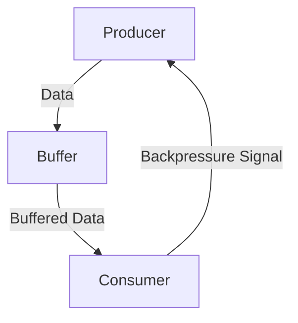

## 9.5 Backpressure Handling in Streaming Data

In the realm of reactive programming and data streaming, **backpressure** is a critical concept that ensures data flows smoothly from producers to consumers without overwhelming the system. In this section, we will delve into the intricacies of backpressure handling in Haskell, exploring how to implement it effectively in streaming data applications.

### Understanding Backpressure

**Backpressure** is a mechanism used to control the flow of data between producers and consumers. It prevents the consumer from being overwhelmed by the producer, ensuring that data is processed at a manageable rate. This is particularly important in systems where data is generated at a high rate, such as network applications, real-time analytics, and IoT systems.

#### Key Concepts

- **Producer**: The source of data, which generates data at a certain rate.
- **Consumer**: The entity that processes the data, which may have limited processing capacity.
- **Flow Control**: The process of managing the rate at which data is sent from the producer to the consumer.

### The Importance of Backpressure

Without backpressure, a fast producer can overwhelm a slow consumer, leading to data loss, increased latency, and system crashes. Implementing backpressure ensures that:

- **Data Integrity**: Data is not lost due to buffer overflows.
- **System Stability**: The system remains stable under varying loads.
- **Resource Efficiency**: Resources are used efficiently, avoiding unnecessary processing.

### Implementing Backpressure in Haskell

Haskell offers several libraries and constructs that facilitate backpressure handling in streaming data applications. Let's explore some of these tools and techniques.

#### Streaming Libraries in Haskell

Haskell provides several libraries for handling streaming data, each with its own approach to backpressure:

1. **Conduit**: A library for building composable streaming data pipelines with built-in backpressure support.
2. **Pipes**: A library that provides a simple and efficient way to build streaming data pipelines with backpressure.
3. **Streaming**: A library that offers a lightweight approach to streaming data with backpressure.

#### Using Conduit for Backpressure

Conduit is a popular choice for streaming data in Haskell due to its composability and efficiency. It provides a robust mechanism for handling backpressure through its `Conduit` type, which represents a data processing pipeline.

```haskell
import Conduit

-- A simple conduit that reads from a source, processes data, and writes to a sink
exampleConduit :: ConduitT () String IO ()
exampleConduit = source .| process .| sink
  where
    source = yieldMany ["data1", "data2", "data3"] -- Producer
    process = mapC (++ " processed") -- Processor
    sink = mapM_C putStrLn -- Consumer

main :: IO ()
main = runConduit exampleConduit
```

In this example, `yieldMany` acts as the producer, `mapC` processes the data, and `mapM_C` consumes the data. Conduit automatically manages backpressure, ensuring that data flows smoothly through the pipeline.

#### Using Pipes for Backpressure

Pipes is another powerful library for streaming data in Haskell. It provides a simple interface for building pipelines with backpressure.

```haskell
import Pipes
import qualified Pipes.Prelude as P

-- A simple pipe that reads from a producer, processes data, and writes to a consumer
examplePipe :: Producer String IO () -> IO ()
examplePipe producer = runEffect $ producer >-> process >-> consumer
  where
    process = P.map (++ " processed") -- Processor
    consumer = P.stdoutLn -- Consumer

main :: IO ()
main = examplePipe (each ["data1", "data2", "data3"])
```

In this example, `each` acts as the producer, `P.map` processes the data, and `P.stdoutLn` consumes the data. Pipes handles backpressure by controlling the flow of data between the producer and consumer.

### Advanced Backpressure Techniques

While libraries like Conduit and Pipes provide built-in backpressure handling, there are advanced techniques that can be employed to fine-tune data flow control.

#### Rate Limiting

Rate limiting is a technique used to control the rate at which data is produced. This can be useful in scenarios where the producer generates data faster than the consumer can process it.

```haskell
import Control.Concurrent (threadDelay)
import Conduit

-- A conduit that limits the rate of data production
rateLimitedSource :: ConduitT () String IO ()
rateLimitedSource = yieldMany ["data1", "data2", "data3"] .| rateLimit
  where
    rateLimit = awaitForever $ \x -> do
      liftIO $ threadDelay 1000000 -- 1 second delay
      yield x

main :: IO ()
main = runConduit $ rateLimitedSource .| mapM_C putStrLn
```

In this example, `threadDelay` is used to introduce a delay between data emissions, effectively limiting the rate at which data is produced.

#### Buffering

Buffering is another technique used to manage backpressure by temporarily storing data in a buffer. This allows the consumer to process data at its own pace without being overwhelmed by the producer.

```haskell
import Conduit

-- A conduit that buffers data before processing
bufferedConduit :: ConduitT () String IO ()
bufferedConduit = source .| buffer .| process .| sink
  where
    source = yieldMany ["data1", "data2", "data3"]
    buffer = bufferC 2 -- Buffer size of 2
    process = mapC (++ " processed")
    sink = mapM_C putStrLn

main :: IO ()
main = runConduit bufferedConduit
```

In this example, `bufferC` is used to create a buffer with a size of 2, allowing the consumer to process data at its own pace.

### Visualizing Backpressure in Streaming Data

To better understand how backpressure works in streaming data applications, let's visualize the flow of data between producers and consumers.



In this diagram, the producer generates data, which is temporarily stored in a buffer. The consumer processes the buffered data at its own pace, sending a backpressure signal to the producer to control the flow of data.

### Haskell Unique Features for Backpressure

Haskell's strong type system and functional programming paradigm offer unique advantages for implementing backpressure:

- **Type Safety**: Haskell's type system ensures that data flows are well-defined and errors are caught at compile time.
- **Immutability**: Immutable data structures prevent unintended side effects, making it easier to reason about data flow.
- **Concurrency**: Haskell's concurrency model, based on lightweight threads and Software Transactional Memory (STM), allows for efficient handling of concurrent data streams.

### Differences and Similarities with Other Patterns

Backpressure handling shares similarities with other flow control patterns, such as:

- **Flow Control in Networking**: Both involve managing data flow between entities to prevent overload.
- **Load Balancing**: Both aim to distribute work evenly across resources to optimize performance.

However, backpressure is distinct in its focus on controlling the rate of data flow between producers and consumers, rather than distributing work across multiple resources.

### Design Considerations

When implementing backpressure in Haskell, consider the following:

- **System Capacity**: Ensure that the system can handle the expected data load.
- **Latency Requirements**: Consider the impact of backpressure on latency and responsiveness.
- **Resource Constraints**: Be mindful of resource constraints, such as memory and CPU usage.

### Try It Yourself

To gain a deeper understanding of backpressure handling in Haskell, try modifying the code examples provided:

- **Experiment with Different Buffer Sizes**: Change the buffer size in the `bufferedConduit` example to see how it affects data flow.
- **Implement Custom Rate Limiting**: Modify the `rateLimitedSource` example to implement a custom rate-limiting strategy.

### Knowledge Check

- **What is backpressure, and why is it important in streaming data applications?**
- **How does Conduit handle backpressure in Haskell?**
- **What are some advanced techniques for managing backpressure?**

### Embrace the Journey

Remember, mastering backpressure handling is just one step in your journey to becoming an expert in Haskell and reactive programming. As you continue to explore and experiment, you'll discover new ways to optimize data flow and build efficient, scalable systems. Keep experimenting, stay curious, and enjoy the journey!

## Quiz: Backpressure Handling in Streaming Data



### What is the primary purpose of backpressure in streaming data applications?

- [x] To control the flow of data between producers and consumers
- [ ] To increase the speed of data processing
- [ ] To reduce memory usage
- [ ] To enhance data security

> **Explanation:** Backpressure is used to control the flow of data between producers and consumers to prevent overload.

### Which Haskell library is known for its composable streaming data pipelines with built-in backpressure support?

- [x] Conduit
- [ ] Aeson
- [ ] QuickCheck
- [ ] Warp

> **Explanation:** Conduit is a Haskell library known for its composable streaming data pipelines with built-in backpressure support.

### What technique involves temporarily storing data to allow the consumer to process it at its own pace?

- [x] Buffering
- [ ] Rate Limiting
- [ ] Load Balancing
- [ ] Data Sharding

> **Explanation:** Buffering involves temporarily storing data to allow the consumer to process it at its own pace.

### In the context of backpressure, what is a producer?

- [x] The source of data
- [ ] The entity that processes data
- [ ] A temporary data storage
- [ ] A network protocol

> **Explanation:** A producer is the source of data in a streaming data application.

### Which of the following is an advanced technique for managing backpressure?

- [x] Rate Limiting
- [ ] Data Encryption
- [ ] Load Balancing
- [ ] Data Compression

> **Explanation:** Rate limiting is an advanced technique for managing backpressure by controlling the rate of data production.

### What is the role of the consumer in a streaming data application?

- [x] To process the data
- [ ] To generate data
- [ ] To store data temporarily
- [ ] To encrypt data

> **Explanation:** The consumer is the entity that processes the data in a streaming data application.

### How does Haskell's type system benefit backpressure handling?

- [x] Ensures data flows are well-defined and errors are caught at compile time
- [ ] Increases data processing speed
- [ ] Reduces memory usage
- [ ] Enhances data security

> **Explanation:** Haskell's type system ensures that data flows are well-defined and errors are caught at compile time.

### What is the purpose of rate limiting in backpressure handling?

- [x] To control the rate at which data is produced
- [ ] To increase data processing speed
- [ ] To reduce memory usage
- [ ] To enhance data security

> **Explanation:** Rate limiting is used to control the rate at which data is produced to prevent overwhelming the consumer.

### Which of the following is a Haskell library for building streaming data pipelines with backpressure?

- [x] Pipes
- [ ] Aeson
- [ ] QuickCheck
- [ ] Warp

> **Explanation:** Pipes is a Haskell library for building streaming data pipelines with backpressure.

### True or False: Backpressure handling is only relevant in network applications.

- [ ] True
- [x] False

> **Explanation:** Backpressure handling is relevant in any application where data is streamed from producers to consumers, not just network applications.




