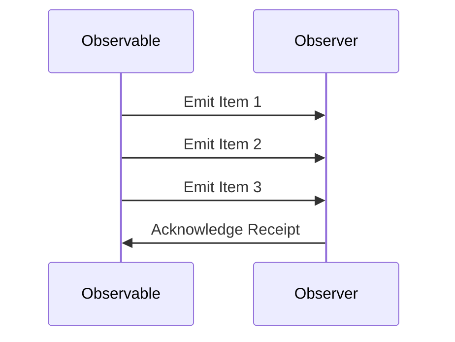

## 9.6 Reactive Extensions in Haskell

Reactive Extensions (Rx) provide a powerful set of tools for composing asynchronous and event-based programs. In Haskell, these concepts are implemented using libraries such as **rx-haskell**, which allow developers to handle complex event sequences and asynchronous data streams in a functional programming paradigm. This section will guide you through understanding and implementing Reactive Extensions in Haskell, leveraging its unique features to build scalable and responsive applications.

### Understanding Reactive Extensions

Reactive Extensions (Rx) are a set of libraries designed to handle asynchronous data streams and event-based programming. They enable developers to work with sequences of data that are pushed to them over time, rather than pulled as needed. This model is particularly useful for applications that require real-time updates, such as user interfaces, data feeds, and network communication.

#### Key Concepts

- **Observable**: Represents a stream of data or events that can be observed over time.
- **Observer**: Consumes the data or events emitted by an Observable.
- **Subscription**: Represents the connection between an Observable and an Observer, allowing for the management of resources.
- **Operators**: Functions that allow you to transform, filter, and combine Observables.

### Implementing Reactive Extensions in Haskell

In Haskell, Reactive Extensions can be implemented using libraries like **rx-haskell**. This library provides a set of abstractions and operators similar to those found in Rx libraries for other languages, allowing you to compose complex event sequences in a functional style.

#### Setting Up rx-haskell

To get started with **rx-haskell**, you'll need to install the library. You can do this using Cabal or Stack, Haskell's package management tools.

```bash
cabal update
cabal install rx-haskell
```

Or, if you're using Stack:

```bash
stack update
stack install rx-haskell
```

#### Basic Example: Creating an Observable

Let's start with a simple example of creating an Observable that emits a sequence of numbers.

```haskell
import Control.Concurrent (threadDelay)
import Control.Monad (forM_)
import Rx.Observable

main :: IO ()
main = do
    let observable = fromList [1..5] -- Create an Observable from a list
    subscribe observable print -- Subscribe to the Observable and print each item
```

In this example, we use `fromList` to create an Observable from a list of numbers. We then subscribe to the Observable, printing each item as it is emitted.

#### Composing Observables

One of the strengths of Reactive Extensions is the ability to compose Observables using operators. Let's look at an example where we filter and transform a stream of numbers.

```haskell
import Rx.Observable

main :: IO ()
main = do
    let observable = fromList [1..10]
    let evenNumbers = filterO even observable -- Filter even numbers
    let squaredNumbers = mapO (^2) evenNumbers -- Square each number
    subscribe squaredNumbers print -- Print each squared number
```

Here, we use `filterO` to filter out even numbers and `mapO` to square each number. The resulting Observable emits the squares of even numbers from the original list.

### Advanced Concepts and Patterns

Reactive Extensions in Haskell allow for more advanced patterns, such as combining multiple Observables, handling errors, and managing concurrency.

#### Combining Observables

You can combine multiple Observables using operators like `merge`, `zip`, and `combineLatest`.

```haskell
import Rx.Observable

main :: IO ()
main = do
    let observable1 = fromList [1, 2, 3]
    let observable2 = fromList [4, 5, 6]
    let combined = zipO observable1 observable2 -- Combine two Observables
    subscribe combined print -- Print each pair of combined items
```

In this example, `zipO` combines two Observables into a single Observable that emits pairs of items.

#### Error Handling

Reactive Extensions provide mechanisms for handling errors in a stream. You can use operators like `catchError` to handle errors gracefully.

```haskell
import Rx.Observable

main :: IO ()
main = do
    let observable = fromList [1, 2, 3, 0, 4]
    let safeObservable = mapO safeDivide observable `catchError` handleError
    subscribe safeObservable print

safeDivide :: Int -> Int
safeDivide x = 10 `div` x

handleError :: SomeException -> Observable Int
handleError _ = fromList [0] -- Return a default value on error
```

In this example, we attempt to divide 10 by each number in the list. If an error occurs (e.g., division by zero), we handle it by returning a default value.

#### Concurrency and Parallelism

Reactive Extensions in Haskell can also be used to manage concurrency and parallelism. You can use operators like `observeOn` to specify the execution context for an Observable.

```haskell
import Control.Concurrent (forkIO)
import Rx.Observable

main :: IO ()
main = do
    let observable = fromList [1..5]
    let concurrentObservable = observeOn forkIO observable -- Run on a separate thread
    subscribe concurrentObservable print
```

Here, `observeOn` is used to run the Observable on a separate thread, allowing for concurrent execution.

### Visualizing Reactive Extensions

To better understand how Reactive Extensions work, let's visualize the flow of data using a sequence diagram.



This diagram illustrates the interaction between an Observable and an Observer, where the Observable emits items and the Observer acknowledges receipt.

### Try It Yourself

Now that you have a basic understanding of Reactive Extensions in Haskell, try experimenting with the code examples. Modify the Observables, apply different operators, and observe the results. Here are some suggestions:

- Create an Observable that emits a sequence of strings and filters out those that don't match a specific pattern.
- Combine multiple Observables using `merge` and observe how the data flows.
- Implement error handling for a stream of network requests, providing fallback values in case of failure.

### References and Further Reading

- [ReactiveX Documentation](http://reactivex.io/documentation/observable.html)
- [rx-haskell GitHub Repository](https://github.com/ReactiveX/RxHaskell)
- [Haskell Wiki: Reactive Programming](https://wiki.haskell.org/Reactive_programming)

### Knowledge Check

- What are the key components of Reactive Extensions?
- How do you create an Observable in Haskell using rx-haskell?
- What operators can you use to combine multiple Observables?
- How can you handle errors in a stream using Reactive Extensions?
- What is the purpose of the `observeOn` operator?

### Embrace the Journey

Remember, mastering Reactive Extensions in Haskell is a journey. As you continue to explore and experiment, you'll discover new ways to leverage these powerful tools to build responsive and scalable applications. Stay curious, keep experimenting, and enjoy the process!

## Quiz: Reactive Extensions in Haskell



### What is an Observable in Reactive Extensions?

- [x] A stream of data or events that can be observed over time
- [ ] A function that transforms data
- [ ] A static data structure
- [ ] A type of database

> **Explanation:** An Observable represents a stream of data or events that can be observed over time, allowing for asynchronous programming.

### Which operator is used to filter items in an Observable?

- [ ] mapO
- [x] filterO
- [ ] zipO
- [ ] merge

> **Explanation:** The `filterO` operator is used to filter items in an Observable based on a predicate.

### How can you handle errors in a Reactive Extensions stream?

- [ ] By ignoring them
- [x] Using the `catchError` operator
- [ ] By stopping the stream
- [ ] By logging them

> **Explanation:** The `catchError` operator allows you to handle errors in a stream and provide fallback values or actions.

### What does the `observeOn` operator do?

- [ ] Filters items in a stream
- [ ] Combines multiple streams
- [x] Specifies the execution context for an Observable
- [ ] Transforms data in a stream

> **Explanation:** The `observeOn` operator specifies the execution context for an Observable, allowing for concurrent execution.

### Which library is used for Reactive Extensions in Haskell?

- [ ] HaskellRx
- [x] rx-haskell
- [ ] ReactiveHaskell
- [ ] HaskellReactive

> **Explanation:** The `rx-haskell` library is used for implementing Reactive Extensions in Haskell.

### What is the role of an Observer in Reactive Extensions?

- [x] Consumes the data or events emitted by an Observable
- [ ] Creates Observables
- [ ] Transforms data
- [ ] Manages subscriptions

> **Explanation:** An Observer consumes the data or events emitted by an Observable, processing them as they arrive.

### How do you combine two Observables in Haskell?

- [ ] Using `filterO`
- [ ] Using `mapO`
- [x] Using `zipO`
- [ ] Using `catchError`

> **Explanation:** The `zipO` operator is used to combine two Observables into a single Observable that emits pairs of items.

### What is the purpose of a Subscription in Reactive Extensions?

- [ ] To create Observables
- [ ] To transform data
- [x] To manage the connection between an Observable and an Observer
- [ ] To handle errors

> **Explanation:** A Subscription represents the connection between an Observable and an Observer, allowing for resource management.

### What is the main advantage of using Reactive Extensions?

- [x] Handling asynchronous data streams and event-based programming
- [ ] Simplifying database queries
- [ ] Improving static analysis
- [ ] Enhancing type inference

> **Explanation:** Reactive Extensions are designed to handle asynchronous data streams and event-based programming, making them ideal for real-time applications.

### True or False: Reactive Extensions can only be used for UI programming.

- [ ] True
- [x] False

> **Explanation:** Reactive Extensions can be used for a wide range of applications, including UI programming, network communication, and data processing.




