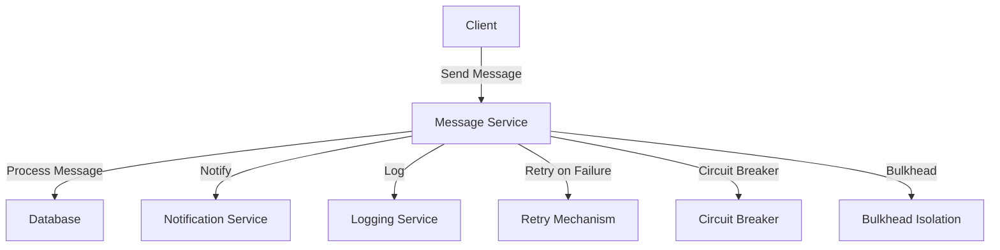
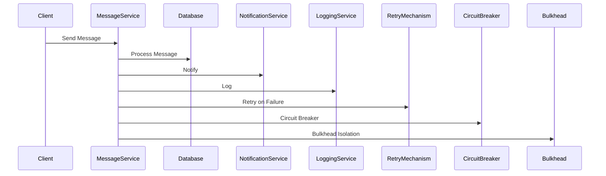

## 9.7 Designing Resilient Reactive Systems

In the world of software engineering, building resilient systems is crucial for ensuring that applications can withstand failures and varying loads. This section delves into designing resilient reactive systems using Haskell, focusing on patterns such as circuit breakers, bulkheads, and retries with exponential backoff. We will explore how these patterns can be implemented in Haskell to create fault-tolerant systems, using a fault-tolerant messaging application as an example.

### Understanding Resilience in Reactive Systems

**Resilience** refers to the ability of a system to handle failures gracefully and recover from them without significant downtime. In reactive systems, resilience is achieved by designing components that can adapt to changes in load and recover from unexpected errors. This involves implementing strategies for error handling, load management, and recovery.

#### Key Concepts

- **Fault Tolerance**: The ability of a system to continue operating in the event of a failure.
- **Load Management**: Techniques to handle varying loads efficiently.
- **Error Handling**: Strategies to manage and recover from errors.

### Patterns for Resilient Systems

To build resilient systems, we can employ several design patterns that help manage failures and ensure system stability. Let's explore some of these patterns in detail.

#### Circuit Breaker Pattern

The **circuit breaker pattern** is used to detect failures and prevent the application from trying to perform an operation that's likely to fail. It acts as a proxy that monitors the number of failures and opens the circuit if failures exceed a threshold, preventing further attempts until the system recovers.

**Key Participants**:
- **Service**: The component that performs the operation.
- **Circuit Breaker**: Monitors failures and controls access to the service.

**Applicability**:
- Use when you need to prevent cascading failures in distributed systems.
- Suitable for operations that may fail due to network issues or service unavailability.

**Sample Code Snippet**:

```haskell
data CircuitBreakerState = Closed | Open | HalfOpen

data CircuitBreaker = CircuitBreaker {
    state :: CircuitBreakerState,
    failureCount :: Int,
    threshold :: Int,
    resetTimeout :: Int
}

-- Function to execute an operation with a circuit breaker
executeWithCircuitBreaker :: CircuitBreaker -> IO a -> IO (Either String a)
executeWithCircuitBreaker cb operation = do
    case state cb of
        Open -> return $ Left "Circuit is open"
        _ -> do
            result <- try operation
            case result of
                Left _ -> handleFailure cb
                Right value -> handleSuccess cb value

handleFailure :: CircuitBreaker -> IO (Either String a)
handleFailure cb = do
    let newCount = failureCount cb + 1
    if newCount >= threshold cb
        then return $ Left "Circuit is open"
        else return $ Left "Operation failed"

handleSuccess :: CircuitBreaker -> a -> IO (Either String a)
handleSuccess cb value = do
    return $ Right value
```

**Design Considerations**:
- Determine the appropriate threshold and reset timeout for your use case.
- Consider using a state machine to manage the circuit breaker states.

#### Bulkhead Pattern

The **bulkhead pattern** isolates different parts of a system to prevent a failure in one part from affecting the entire system. This is similar to compartments in a ship, where a breach in one compartment doesn't sink the entire ship.

**Key Participants**:
- **Component**: A part of the system that can be isolated.
- **Bulkhead**: The mechanism that provides isolation.

**Applicability**:
- Use when you need to isolate failures to prevent them from affecting the entire system.
- Suitable for systems with multiple independent components.

**Sample Code Snippet**:

```haskell
import Control.Concurrent
import Control.Concurrent.STM

-- Function to execute a task with bulkhead isolation
executeWithBulkhead :: Int -> IO a -> IO (Either String a)
executeWithBulkhead maxConcurrentTasks task = do
    sem <- newQSem maxConcurrentTasks
    bracket_ (waitQSem sem) (signalQSem sem) (try task)

-- Example usage
main :: IO ()
main = do
    let task = putStrLn "Executing task"
    result <- executeWithBulkhead 5 task
    case result of
        Left err -> putStrLn $ "Error: " ++ err
        Right _ -> putStrLn "Task completed successfully"
```

**Design Considerations**:
- Determine the appropriate level of isolation for your components.
- Consider using STM (Software Transactional Memory) for managing concurrency.

#### Retry Pattern with Exponential Backoff

The **retry pattern** involves retrying a failed operation after a certain delay. Exponential backoff increases the delay between retries, reducing the load on the system and increasing the chances of success.

**Key Participants**:
- **Operation**: The task that needs to be retried.
- **Retry Policy**: Defines the delay and number of retries.

**Applicability**:
- Use when operations may fail due to transient issues.
- Suitable for network requests or database operations.

**Sample Code Snippet**:

```haskell
import Control.Concurrent
import Control.Exception

-- Function to retry an operation with exponential backoff
retryWithBackoff :: Int -> Int -> IO a -> IO (Either String a)
retryWithBackoff maxRetries delay operation = go maxRetries delay
  where
    go 0 _ = return $ Left "Max retries reached"
    go retries currentDelay = do
        result <- try operation
        case result of
            Left _ -> do
                threadDelay currentDelay
                go (retries - 1) (currentDelay * 2)
            Right value -> return $ Right value

-- Example usage
main :: IO ()
main = do
    let operation = putStrLn "Attempting operation"
    result <- retryWithBackoff 3 1000000 operation
    case result of
        Left err -> putStrLn $ "Error: " ++ err
        Right _ -> putStrLn "Operation succeeded"
```

**Design Considerations**:
- Determine the maximum number of retries and initial delay.
- Consider using a library for more complex retry policies.

### Implementing Resilient Systems in Haskell

Haskell's strong type system and functional programming paradigm make it an excellent choice for building resilient systems. Let's explore how we can leverage Haskell's features to implement these patterns effectively.

#### Error Handling and Recovery

Haskell provides powerful tools for error handling, such as the `Either` and `Maybe` monads, which allow us to handle errors gracefully without resorting to exceptions.

**Example**:

```haskell
safeDivide :: Double -> Double -> Either String Double
safeDivide _ 0 = Left "Division by zero"
safeDivide x y = Right (x / y)

main :: IO ()
main = do
    let result = safeDivide 10 0
    case result of
        Left err -> putStrLn $ "Error: " ++ err
        Right value -> putStrLn $ "Result: " ++ show value
```

#### Concurrency and Parallelism

Haskell's concurrency model, based on lightweight threads and Software Transactional Memory (STM), allows us to build systems that can handle high loads and recover from failures efficiently.

**Example**:

```haskell
import Control.Concurrent
import Control.Concurrent.STM

-- Function to perform a concurrent task
performConcurrentTask :: IO ()
performConcurrentTask = do
    atomically $ do
        -- Perform transactional operations
        return ()

main :: IO ()
main = do
    forkIO performConcurrentTask
    putStrLn "Task started"
```

### Example: A Fault-Tolerant Messaging Application

Let's apply these concepts to build a fault-tolerant messaging application. This application will use the circuit breaker, bulkhead, and retry patterns to ensure resilience.

**Architecture**:



**Implementation**:

```haskell
import Control.Concurrent
import Control.Concurrent.STM
import Control.Exception

-- Circuit breaker implementation
data CircuitBreakerState = Closed | Open | HalfOpen

data CircuitBreaker = CircuitBreaker {
    state :: CircuitBreakerState,
    failureCount :: Int,
    threshold :: Int,
    resetTimeout :: Int
}

-- Function to execute a message operation with a circuit breaker
executeMessageOperation :: CircuitBreaker -> IO () -> IO (Either String ())
executeMessageOperation cb operation = do
    case state cb of
        Open -> return $ Left "Circuit is open"
        _ -> do
            result <- try operation
            case result of
                Left _ -> handleFailure cb
                Right _ -> handleSuccess cb

-- Bulkhead implementation
executeWithBulkhead :: Int -> IO () -> IO (Either String ())
executeWithBulkhead maxConcurrentTasks task = do
    sem <- newQSem maxConcurrentTasks
    bracket_ (waitQSem sem) (signalQSem sem) (try task)

-- Retry implementation
retryWithBackoff :: Int -> Int -> IO () -> IO (Either String ())
retryWithBackoff maxRetries delay operation = go maxRetries delay
  where
    go 0 _ = return $ Left "Max retries reached"
    go retries currentDelay = do
        result <- try operation
        case result of
            Left _ -> do
                threadDelay currentDelay
                go (retries - 1) (currentDelay * 2)
            Right _ -> return $ Right ()

-- Main function
main :: IO ()
main = do
    let messageOperation = putStrLn "Processing message"
    let cb = CircuitBreaker Closed 0 3 1000000
    result <- executeMessageOperation cb messageOperation
    case result of
        Left err -> putStrLn $ "Error: " ++ err
        Right _ -> putStrLn "Message processed successfully"
```

### Visualizing Resilient Reactive Systems

To better understand the flow of a resilient reactive system, let's visualize the architecture and interactions using a Mermaid.js diagram.



### Key Takeaways

- **Resilience** is crucial for building systems that can withstand failures and varying loads.
- **Circuit Breaker**, **Bulkhead**, and **Retry with Exponential Backoff** are essential patterns for designing resilient systems.
- Haskell's strong type system and concurrency model make it an excellent choice for implementing these patterns.
- **Error Handling** and **Concurrency** are key components of resilient systems.

### Try It Yourself

Experiment with the code examples provided. Try modifying the circuit breaker threshold, bulkhead isolation level, and retry delay to see how they affect the system's resilience. Consider adding logging and monitoring to track the system's behavior under different conditions.

### Further Reading

- [Reactive Programming in Haskell](https://www.reactivemanifesto.org/)
- [Haskell Concurrency and Parallelism](https://wiki.haskell.org/Concurrency)
- [Building Resilient Systems](https://martinfowler.com/articles/collection-resiliency.html)

## Quiz: Designing Resilient Reactive Systems



### What is the primary goal of designing resilient reactive systems?

- [x] To handle failures gracefully and recover without significant downtime
- [ ] To increase the speed of data processing
- [ ] To reduce the cost of system maintenance
- [ ] To improve user interface design

> **Explanation:** Resilient reactive systems are designed to handle failures gracefully and recover without significant downtime, ensuring system stability.

### Which pattern is used to prevent cascading failures in distributed systems?

- [x] Circuit Breaker
- [ ] Bulkhead
- [ ] Retry with Exponential Backoff
- [ ] Observer

> **Explanation:** The Circuit Breaker pattern is used to prevent cascading failures by monitoring failures and controlling access to services.

### What is the purpose of the Bulkhead pattern?

- [x] To isolate failures and prevent them from affecting the entire system
- [ ] To increase the speed of data processing
- [ ] To improve user interface design
- [ ] To reduce the cost of system maintenance

> **Explanation:** The Bulkhead pattern isolates failures to prevent them from affecting the entire system, similar to compartments in a ship.

### How does the Retry pattern with Exponential Backoff work?

- [x] It retries a failed operation after increasing delays
- [ ] It retries a failed operation immediately
- [ ] It retries a failed operation after a fixed delay
- [ ] It does not retry failed operations

> **Explanation:** The Retry pattern with Exponential Backoff increases the delay between retries, reducing system load and increasing success chances.

### Which Haskell feature is beneficial for handling errors gracefully?

- [x] Either and Maybe monads
- [ ] List comprehensions
- [ ] Pattern matching
- [ ] Type classes

> **Explanation:** The Either and Maybe monads in Haskell allow for graceful error handling without exceptions.

### What is the role of Software Transactional Memory (STM) in Haskell?

- [x] To manage concurrency efficiently
- [ ] To handle errors gracefully
- [ ] To improve user interface design
- [ ] To reduce the cost of system maintenance

> **Explanation:** STM in Haskell is used to manage concurrency efficiently, allowing for safe and scalable concurrent operations.

### What is a key benefit of using Haskell for building resilient systems?

- [x] Strong type system and concurrency model
- [ ] Improved user interface design
- [ ] Reduced cost of system maintenance
- [ ] Increased speed of data processing

> **Explanation:** Haskell's strong type system and concurrency model make it an excellent choice for building resilient systems.

### What is the purpose of the Circuit Breaker pattern?

- [x] To monitor failures and prevent further attempts until recovery
- [ ] To isolate failures and prevent them from affecting the entire system
- [ ] To retry failed operations after increasing delays
- [ ] To handle errors gracefully

> **Explanation:** The Circuit Breaker pattern monitors failures and prevents further attempts until the system recovers.

### What is the main advantage of using the Bulkhead pattern?

- [x] It prevents a failure in one part from affecting the entire system
- [ ] It increases the speed of data processing
- [ ] It improves user interface design
- [ ] It reduces the cost of system maintenance

> **Explanation:** The Bulkhead pattern prevents a failure in one part of the system from affecting the entire system, ensuring stability.

### True or False: The Retry pattern with Exponential Backoff is suitable for operations that may fail due to transient issues.

- [x] True
- [ ] False

> **Explanation:** The Retry pattern with Exponential Backoff is suitable for operations that may fail due to transient issues, as it increases the delay between retries.



Remember, this is just the beginning. As you progress, you'll build more complex and resilient systems. Keep experimenting, stay curious, and enjoy the journey!
