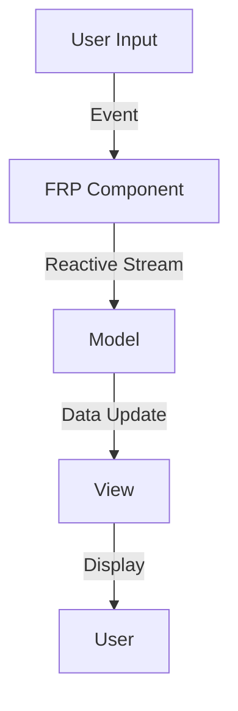

## 9.8 Combining FRP with Traditional Patterns

Functional Reactive Programming (FRP) offers a powerful paradigm for handling time-varying values and asynchronous events in a declarative manner. Integrating FRP with traditional design patterns in Haskell can significantly enhance the responsiveness and maintainability of your applications. In this section, we will explore how to effectively combine FRP with traditional patterns, focusing on integration strategies, encapsulation techniques, and practical examples.

### Introduction to FRP

FRP is a programming paradigm that treats time-varying values as first-class citizens. It allows developers to express dynamic behavior declaratively, using constructs like signals, events, and behaviors. This approach is particularly useful for applications that require real-time updates, such as user interfaces, games, and simulations.

#### Key Concepts of FRP

- **Signals**: Represent continuous time-varying values.
- **Events**: Represent discrete occurrences over time.
- **Behaviors**: Functions of time that produce values.

FRP libraries in Haskell, such as **Reactive-banana** and **Yampa**, provide abstractions to work with these concepts, enabling developers to build complex reactive systems with ease.

### Integration with Traditional Patterns

Integrating FRP into existing codebases often involves combining it with traditional design patterns. This integration can be achieved by encapsulating FRP components and interfacing them with imperative code.

#### Encapsulation of FRP Components

Encapsulation is a key strategy for integrating FRP with traditional patterns. By encapsulating FRP logic within modules or classes, you can isolate reactive behavior and expose a clean interface to the rest of your application.

```haskell
module ReactiveCounter where

import Reactive.Banana
import Reactive.Banana.Frameworks

-- Define a reactive counter using FRP
reactiveCounter :: MomentIO (Event Int)
reactiveCounter = do
    -- Create an event source
    (addEvent, fireAdd) <- newAddHandler
    -- Define the event network
    let networkDescription :: MomentIO ()
        networkDescription = do
            eAdd <- fromAddHandler addEvent
            let eCount = accumE 0 ((+1) <$ eAdd)
            reactimate $ fmap print eCount
    -- Compile and actuate the network
    network <- compile networkDescription
    actuate network
    return eAdd
```

In this example, we encapsulate a reactive counter within a module. The `reactiveCounter` function sets up an event network that increments a counter each time an event is fired. This encapsulation allows us to integrate the reactive counter into a larger application seamlessly.

#### Interfacing with Imperative Code

To interface FRP components with imperative code, you can use event handlers and callbacks. This approach allows you to bridge the gap between reactive and imperative paradigms.

```haskell
main :: IO ()
main = do
    -- Initialize the reactive counter
    eAdd <- reactiveCounter
    -- Simulate firing events from imperative code
    fireAdd ()
    fireAdd ()
    fireAdd ()
```

In the `main` function, we initialize the reactive counter and simulate firing events from imperative code. This demonstrates how FRP components can be integrated into traditional applications.

### Example: Adding Reactive Data Streams to MVC

Let's explore a practical example of integrating FRP with a traditional Model-View-Controller (MVC) application. We'll enhance the application by adding reactive data streams to handle user interactions and update the view in real-time.

#### Traditional MVC Architecture

In a traditional MVC architecture, the model represents the application's data, the view displays the data, and the controller handles user input. This separation of concerns allows for modular and maintainable code.

```haskell
-- Model
data Counter = Counter { count :: Int }

-- View
displayCounter :: Counter -> IO ()
displayCounter (Counter c) = putStrLn $ "Counter: " ++ show c

-- Controller
incrementCounter :: Counter -> Counter
incrementCounter (Counter c) = Counter (c + 1)
```

In this simple MVC example, the model is a `Counter` data type, the view is a function that displays the counter, and the controller is a function that increments the counter.

#### Enhancing MVC with FRP

To enhance the MVC application with FRP, we'll introduce reactive data streams to handle user interactions and update the view in real-time.

```haskell
import Reactive.Banana
import Reactive.Banana.Frameworks

-- Reactive MVC
reactiveMVC :: MomentIO (Event ())
reactiveMVC = do
    (addEvent, fireAdd) <- newAddHandler
    let networkDescription :: MomentIO ()
        networkDescription = do
            eAdd <- fromAddHandler addEvent
            let eCount = accumE (Counter 0) (incrementCounter <$ eAdd)
            reactimate $ fmap displayCounter eCount
    network <- compile networkDescription
    actuate network
    return eAdd
```

In the `reactiveMVC` function, we set up an event network that reacts to user interactions by incrementing the counter and updating the view. This integration allows us to handle user input reactively and update the view in real-time.

#### Integrating Reactive MVC into the Application

To integrate the reactive MVC into the application, we can use the following code:

```haskell
main :: IO ()
main = do
    eAdd <- reactiveMVC
    -- Simulate user interactions
    fireAdd ()
    fireAdd ()
    fireAdd ()
```

In the `main` function, we initialize the reactive MVC and simulate user interactions by firing events. This demonstrates how FRP can be seamlessly integrated into a traditional MVC application.

### Design Considerations

When combining FRP with traditional patterns, it's important to consider the following design considerations:

- **Separation of Concerns**: Maintain a clear separation between reactive and imperative components to ensure modularity and maintainability.
- **Performance**: Be mindful of the performance implications of FRP, especially in resource-constrained environments.
- **Complexity**: Avoid overcomplicating the architecture by introducing unnecessary reactive components.

### Haskell Unique Features

Haskell's strong type system and lazy evaluation make it particularly well-suited for FRP. The type system ensures type safety and allows for expressive abstractions, while lazy evaluation enables efficient handling of time-varying values.

### Differences and Similarities

FRP and traditional patterns share some similarities, such as the emphasis on modularity and separation of concerns. However, FRP introduces a declarative approach to handling time-varying values and asynchronous events, which can complement traditional patterns by enhancing responsiveness and maintainability.

### Visualizing FRP Integration

To better understand the integration of FRP with traditional patterns, let's visualize the architecture using a Mermaid.js diagram.



**Diagram Description**: This diagram illustrates the flow of data in an application that combines FRP with traditional patterns. User input triggers events that are processed by FRP components, which update the model and view reactively.

### Try It Yourself

To deepen your understanding of combining FRP with traditional patterns, try modifying the code examples provided. Experiment with different event sources, reactive behaviors, and view updates. Consider adding additional FRP components to handle more complex interactions.

### Knowledge Check

- What are the key concepts of FRP?
- How can you encapsulate FRP components in Haskell?
- What are the benefits of integrating FRP with traditional patterns?
- How does Haskell's type system enhance FRP?

### Embrace the Journey

Remember, integrating FRP with traditional patterns is just the beginning. As you progress, you'll discover new ways to enhance your applications with reactive data streams. Keep experimenting, stay curious, and enjoy the journey!

## Quiz: Combining FRP with Traditional Patterns



### What is a key concept of FRP?

- [x] Signals
- [ ] Classes
- [ ] Threads
- [ ] Locks

> **Explanation:** Signals represent continuous time-varying values in FRP.

### How can you encapsulate FRP components in Haskell?

- [x] Using modules
- [ ] Using threads
- [ ] Using locks
- [ ] Using classes

> **Explanation:** Encapsulating FRP components within modules allows for isolation and clean interfacing.

### What is a benefit of integrating FRP with traditional patterns?

- [x] Enhanced responsiveness
- [ ] Increased complexity
- [ ] Reduced modularity
- [ ] Decreased maintainability

> **Explanation:** Integrating FRP with traditional patterns enhances responsiveness and maintainability.

### How does Haskell's type system enhance FRP?

- [x] Ensures type safety
- [ ] Increases complexity
- [ ] Reduces performance
- [ ] Decreases modularity

> **Explanation:** Haskell's strong type system ensures type safety and allows for expressive abstractions.

### What is a design consideration when combining FRP with traditional patterns?

- [x] Separation of concerns
- [ ] Increased complexity
- [ ] Reduced modularity
- [ ] Decreased maintainability

> **Explanation:** Maintaining a clear separation between reactive and imperative components ensures modularity and maintainability.

### What is a similarity between FRP and traditional patterns?

- [x] Emphasis on modularity
- [ ] Emphasis on complexity
- [ ] Emphasis on performance
- [ ] Emphasis on resource constraints

> **Explanation:** Both FRP and traditional patterns emphasize modularity and separation of concerns.

### What is a difference between FRP and traditional patterns?

- [x] Declarative approach to time-varying values
- [ ] Emphasis on modularity
- [ ] Emphasis on separation of concerns
- [ ] Emphasis on performance

> **Explanation:** FRP introduces a declarative approach to handling time-varying values and asynchronous events.

### What is a key feature of Haskell that makes it well-suited for FRP?

- [x] Lazy evaluation
- [ ] Threading
- [ ] Locking
- [ ] Imperative programming

> **Explanation:** Haskell's lazy evaluation enables efficient handling of time-varying values.

### What is an example of integrating FRP with a traditional pattern?

- [x] Adding reactive data streams to MVC
- [ ] Using threads in MVC
- [ ] Using locks in MVC
- [ ] Using classes in MVC

> **Explanation:** Adding reactive data streams to MVC enhances the application with real-time updates.

### True or False: FRP can only be used in new applications.

- [ ] True
- [x] False

> **Explanation:** FRP can be integrated into existing codebases by combining it with traditional patterns.


