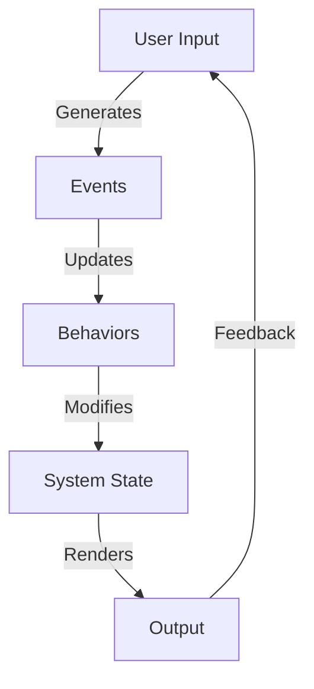

## 9.9 Time-Varying Values and Behaviors

In the realm of functional programming, the concept of time-varying values and behaviors is pivotal for creating dynamic and interactive applications. This section delves into the intricacies of modeling time in Haskell, implementing continuous signals, and crafting animations that respond to user input. By mastering these concepts, you can build sophisticated systems that react to changes over time, enhancing user experience and system interactivity.

### Modeling Time

Modeling time in functional programming involves representing values that change over time. In Haskell, this can be achieved using functions of time or specialized types that encapsulate the notion of time-varying values. Let's explore these concepts in detail.

#### Functions of Time

A fundamental approach to modeling time is to use functions where time is an explicit parameter. This method allows you to define values as functions that take time as an argument and return the corresponding value at that time.

```haskell
-- A simple function of time representing a linear motion
positionAtTime :: Double -> Double
positionAtTime t = 5 * t  -- Assuming a constant speed of 5 units per second
```

In this example, `positionAtTime` is a function that calculates the position of an object moving at a constant speed over time. By passing different time values, you can determine the object's position at any given moment.

#### Specialized Types for Time-Varying Values

Haskell's type system allows for the creation of specialized types that encapsulate time-varying values. Libraries like `reactive-banana` and `Yampa` provide abstractions for working with time-varying values, often referred to as "behaviors."

```haskell
-- Using reactive-banana to define a behavior
import Reactive.Banana
import Reactive.Banana.Frameworks

-- Define a behavior that represents the current time
currentTime :: Behavior Double
currentTime = accumB 0 (fmap (+) deltaTime)

-- deltaTime is an event that represents the passage of time
deltaTime :: Event Double
deltaTime = undefined  -- Implementation depends on the specific framework
```

In this code snippet, `currentTime` is a behavior that accumulates time increments, effectively modeling the passage of time. The `deltaTime` event represents discrete time steps, which can be generated by a timer or clock.

### Implementation of Continuous Signals

Continuous signals are a cornerstone of reactive programming, allowing you to represent user input, sensor data, or other continuously changing values. In Haskell, continuous signals can be implemented using libraries that support functional reactive programming (FRP).

#### Functional Reactive Programming (FRP)

FRP is a paradigm that treats time-varying values as first-class citizens, enabling you to build systems that react to changes over time. Haskell's FRP libraries, such as `reactive-banana`, `Yampa`, and `reflex`, provide powerful abstractions for working with continuous signals.

```haskell
-- Example of a continuous signal using Yampa
import FRP.Yampa

-- Define a signal function that outputs a sine wave
sineWave :: SF () Double
sineWave = arr (\t -> sin (2 * pi * t))

-- Run the signal function with a constant input
main :: IO ()
main = reactimate (return ()) (\_ -> return (0.1, Just ())) print sineWave
```

In this example, `sineWave` is a signal function that produces a sine wave over time. The `reactimate` function runs the signal function, printing the output at regular intervals.

#### User Input and Sensor Data

Continuous signals are particularly useful for modeling user input and sensor data, which can change unpredictably over time. By representing these inputs as continuous signals, you can create responsive applications that adapt to user actions or environmental changes.

```haskell
-- Example of handling user input as a continuous signal
import Reactive.Banana
import Reactive.Banana.Frameworks

-- Define an event network that reacts to mouse movements
mouseMovementNetwork :: MomentIO ()
mouseMovementNetwork = do
    eMouseMove <- fromAddHandler addMouseMoveHandler
    let bMousePosition = stepper (0, 0) eMouseMove
    reactimate $ fmap print bMousePosition

-- Function to add a mouse move handler
addMouseMoveHandler :: AddHandler (Int, Int)
addMouseMoveHandler = undefined  -- Implementation depends on the GUI framework
```

In this code, `bMousePosition` is a behavior that tracks the mouse position, updating whenever a `mouseMove` event occurs. This approach allows you to build interactive applications that respond to user input in real-time.

### Example: Animations Based on User Input

Animations are a compelling use case for time-varying values and behaviors. By leveraging continuous signals and FRP, you can create animations that respond dynamically to user input or other time-dependent factors.

#### Creating a Simple Animation

Let's create a simple animation where an object moves across the screen based on user input. We'll use `reactive-banana` to handle the input and update the object's position.

```haskell
import Reactive.Banana
import Reactive.Banana.Frameworks
import Graphics.Gloss.Interface.IO.Game

-- Define the main function to run the animation
main :: IO ()
main = playIO
    (InWindow "Reactive Animation" (800, 600) (100, 100))
    white
    60
    initialState
    drawState
    handleInput
    updateState

-- Define the initial state of the animation
initialState :: (Float, Float)
initialState = (0, 0)

-- Function to draw the current state
drawState :: (Float, Float) -> IO Picture
drawState (x, y) = return $ translate x y $ color red $ circleSolid 20

-- Function to handle user input
handleInput :: Event -> (Float, Float) -> IO (Float, Float)
handleInput (EventKey (SpecialKey KeyRight) Down _ _) (x, y) = return (x + 10, y)
handleInput (EventKey (SpecialKey KeyLeft) Down _ _) (x, y) = return (x - 10, y)
handleInput _ state = return state

-- Function to update the state based on time
updateState :: Float -> (Float, Float) -> IO (Float, Float)
updateState _ state = return state
```

In this example, we use the `Gloss` library to create a window and draw a circle that moves left or right based on user input. The `playIO` function manages the game loop, calling `handleInput` to process user input and `updateState` to update the animation state over time.

#### Enhancing the Animation with FRP

To enhance the animation, we can integrate FRP to smoothly interpolate the object's position based on continuous input signals.

```haskell
-- Define a behavior for the object's position
objectPosition :: Behavior (Float, Float)
objectPosition = accumB (0, 0) eMove

-- Define an event for movement
eMove :: Event (Float -> Float)
eMove = unionWith (.) eMoveRight eMoveLeft

-- Define events for right and left movement
eMoveRight, eMoveLeft :: Event (Float -> Float)
eMoveRight = fmap (\_ -> \\(x, y) -> (x + 10, y)) eKeyRight
eMoveLeft = fmap (\_ -> \\(x, y) -> (x - 10, y)) eKeyLeft

-- Define events for key presses
eKeyRight, eKeyLeft :: Event ()
eKeyRight = filterE (== SpecialKey KeyRight) eKey
eKeyLeft = filterE (== SpecialKey KeyLeft) eKey

-- Define the main function to run the enhanced animation
mainEnhanced :: IO ()
mainEnhanced = do
    network <- compile $ do
        eKey <- fromAddHandler addKeyHandler
        let bPosition = stepper (0, 0) eMove
        reactimate $ fmap drawState bPosition
    actuate network
```

In this enhanced version, we define a behavior `objectPosition` that updates based on key press events. The `eMove` event combines right and left movements, allowing for smooth transitions between states.

### Visualizing Time-Varying Values

To better understand how time-varying values and behaviors work, let's visualize the flow of data in a reactive system. The following diagram illustrates the interaction between events, behaviors, and the system's state.



**Diagram Description:** This flowchart represents the cycle of user input generating events, which update behaviors and modify the system state. The state is then rendered as output, providing feedback to the user.

### Key Takeaways

- **Time-Varying Values**: Use functions of time or specialized types to represent values that change over time.
- **Continuous Signals**: Implement continuous signals using FRP libraries to model user input and sensor data.
- **Animations**: Create dynamic animations by integrating time-varying values and behaviors with user input.
- **FRP Libraries**: Leverage Haskell's FRP libraries like `reactive-banana` and `Yampa` to build responsive applications.

### Try It Yourself

Experiment with the provided code examples by modifying the parameters or adding new features. For instance, try changing the speed of the animation or adding new input events to control the object's movement.

### Further Reading

- [Reactive-banana Documentation](https://hackage.haskell.org/package/reactive-banana)
- [Yampa Documentation](https://hackage.haskell.org/package/Yampa)
- [Gloss Library for Graphics](https://hackage.haskell.org/package/gloss)

### Quiz: Time-Varying Values and Behaviors



### What is a fundamental approach to modeling time in Haskell?

- [x] Using functions where time is an explicit parameter
- [ ] Using mutable variables
- [ ] Using global state
- [ ] Using imperative loops

> **Explanation:** Functions with time as an explicit parameter allow for modeling time-varying values in a functional paradigm.

### Which Haskell library is commonly used for functional reactive programming?

- [x] reactive-banana
- [ ] gloss
- [ ] aeson
- [ ] warp

> **Explanation:** `reactive-banana` is a library designed for functional reactive programming in Haskell.

### What is a behavior in the context of FRP?

- [x] A time-varying value
- [ ] A static value
- [ ] An event handler
- [ ] A mutable variable

> **Explanation:** In FRP, a behavior represents a value that changes over time.

### How can continuous signals be used in Haskell applications?

- [x] To model user input and sensor data
- [ ] To create static web pages
- [ ] To manage database connections
- [ ] To handle file I/O

> **Explanation:** Continuous signals are ideal for representing inputs that change over time, such as user actions or sensor readings.

### What does the `reactimate` function do in Yampa?

- [x] Runs a signal function with a constant input
- [ ] Compiles Haskell code
- [ ] Manages database transactions
- [ ] Handles HTTP requests

> **Explanation:** `reactimate` is used to execute a signal function continuously, often with a constant input.

### What is the purpose of the `stepper` function in reactive-banana?

- [x] To create a behavior from an event
- [ ] To initialize a database
- [ ] To compile a Haskell program
- [ ] To render a web page

> **Explanation:** `stepper` creates a behavior that updates its value based on incoming events.

### How can you enhance an animation with FRP?

- [x] By integrating continuous input signals
- [ ] By using global variables
- [ ] By writing imperative loops
- [ ] By using static images

> **Explanation:** FRP allows for smooth transitions and dynamic updates by using continuous signals.

### What is a key benefit of using FRP in Haskell?

- [x] It allows for declarative handling of time-varying values
- [ ] It simplifies imperative programming
- [ ] It increases global state usage
- [ ] It reduces type safety

> **Explanation:** FRP provides a declarative way to manage values that change over time, enhancing code clarity and maintainability.

### Which of the following is a common use case for time-varying values?

- [x] Animations that respond to user input
- [ ] Static configuration files
- [ ] Immutable data structures
- [ ] Compile-time constants

> **Explanation:** Time-varying values are ideal for creating responsive animations and interactive applications.

### True or False: Time-varying values can only be used for animations.

- [ ] True
- [x] False

> **Explanation:** Time-varying values are versatile and can be used for various applications, including user input handling and sensor data processing.



Remember, mastering time-varying values and behaviors in Haskell is just the beginning. As you continue to explore and experiment, you'll discover new ways to create responsive and dynamic applications. Keep pushing the boundaries of what's possible with functional reactive programming!


