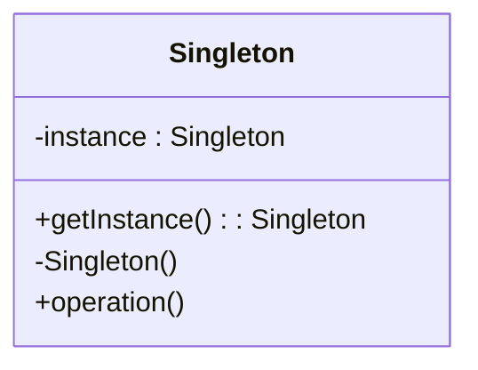
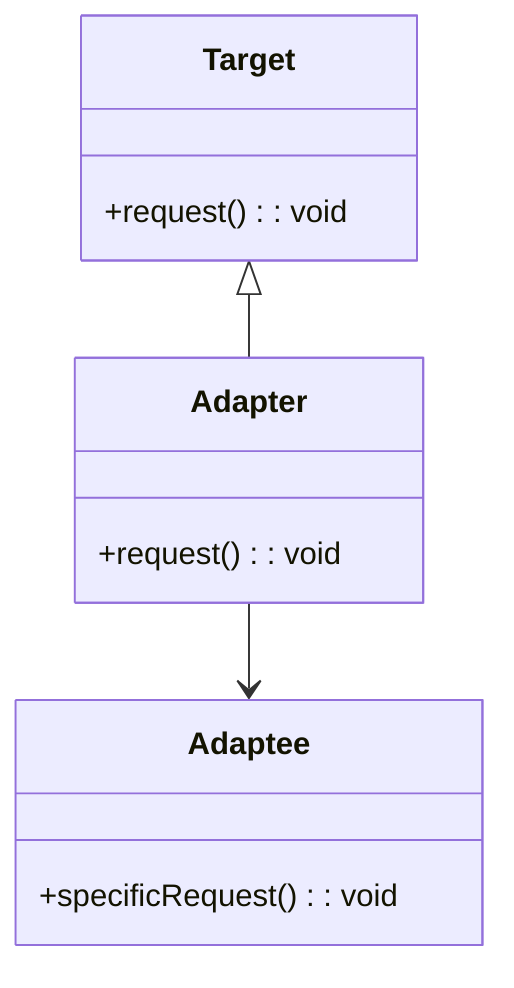
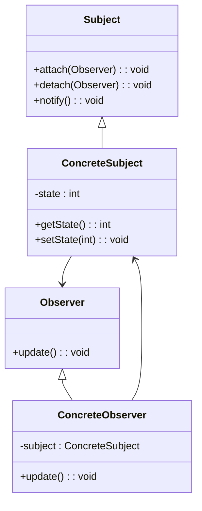

## 1.1 Understanding Design Patterns

In the realm of software engineering, design patterns serve as a crucial tool for developers and architects. They provide a proven solution to common design problems, allowing us to create robust and maintainable code. In this section, we will delve into the concept of design patterns, their purpose, and the various categories they fall into, with a particular focus on how they can be applied in the Haxe programming language.

### Definition of Design Patterns

**Design patterns** are reusable solutions to common problems that occur in software design. They are not finished designs that can be directly transformed into code but are templates for how to solve a problem in various contexts. The concept of design patterns was popularized by the "Gang of Four" (GoF) in their seminal book, "Design Patterns: Elements of Reusable Object-Oriented Software."

Design patterns help to standardize the way we approach software design, providing a common language for developers to communicate complex ideas succinctly. They encapsulate best practices and allow us to build on the experiences of others, reducing the time and effort required to solve recurring problems.

### Purpose of Design Patterns

The primary purpose of design patterns is to provide a standard solution to a recurring problem. They help in:

- **Improving Code Reusability:** By using design patterns, we can create solutions that are reusable across different projects and contexts.
- **Enhancing Code Maintainability:** Patterns help in organizing code in a way that makes it easier to understand, modify, and extend.
- **Facilitating Communication:** They provide a common vocabulary for developers, making it easier to discuss and reason about software design.
- **Encouraging Best Practices:** Design patterns promote the use of best practices in software development, leading to more efficient and reliable code.

### Categories of Design Patterns

Design patterns are generally categorized into three main types: creational, structural, and behavioral. Each category addresses a different aspect of software design.

#### Creational Patterns

Creational patterns focus on the process of object creation. They abstract the instantiation process, making it more flexible and dynamic. These patterns help in managing the complexity of creating objects, especially when dealing with complex object hierarchies or when the specific types of objects need to be determined at runtime.

**Key Creational Patterns:**

- **Singleton Pattern:** Ensures a class has only one instance and provides a global point of access to it.
- **Factory Method Pattern:** Defines an interface for creating an object but lets subclasses alter the type of objects that will be created.
- **Abstract Factory Pattern:** Provides an interface for creating families of related or dependent objects without specifying their concrete classes.
- **Builder Pattern:** Separates the construction of a complex object from its representation, allowing the same construction process to create different representations.
- **Prototype Pattern:** Creates new objects by copying an existing object, known as the prototype.

#### Structural Patterns

Structural patterns deal with the composition of classes or objects. They help ensure that if one part of a system changes, the entire system doesn't need to change. These patterns focus on how classes and objects can be combined to form larger structures.

**Key Structural Patterns:**

- **Adapter Pattern:** Allows incompatible interfaces to work together by converting the interface of a class into another interface clients expect.
- **Bridge Pattern:** Separates an object’s abstraction from its implementation so that the two can vary independently.
- **Composite Pattern:** Composes objects into tree structures to represent part-whole hierarchies, allowing clients to treat individual objects and compositions uniformly.
- **Decorator Pattern:** Adds new functionality to an object dynamically without altering its structure.
- **Facade Pattern:** Provides a simplified interface to a complex subsystem.
- **Flyweight Pattern:** Reduces the cost of creating and manipulating a large number of similar objects.
- **Proxy Pattern:** Provides a surrogate or placeholder for another object to control access to it.

#### Behavioral Patterns

Behavioral patterns are concerned with algorithms and the assignment of responsibilities between objects. They help in defining how objects interact in a system and how responsibilities are distributed among them.

**Key Behavioral Patterns:**

- **Strategy Pattern:** Defines a family of algorithms, encapsulates each one, and makes them interchangeable.
- **Observer Pattern:** Establishes a one-to-many dependency between objects so that when one object changes state, all its dependents are notified and updated automatically.
- **Command Pattern:** Encapsulates a request as an object, thereby allowing for parameterization of clients with queues, requests, and operations.
- **Chain of Responsibility Pattern:** Passes a request along a chain of handlers, allowing each handler to either process the request or pass it to the next handler in the chain.
- **Mediator Pattern:** Defines an object that encapsulates how a set of objects interact, promoting loose coupling by keeping objects from referring to each other explicitly.
- **State Pattern:** Allows an object to alter its behavior when its internal state changes.
- **Template Method Pattern:** Defines the skeleton of an algorithm in an operation, deferring some steps to subclasses.
- **Iterator Pattern:** Provides a way to access the elements of an aggregate object sequentially without exposing its underlying representation.
- **Visitor Pattern:** Represents an operation to be performed on the elements of an object structure, allowing new operations to be defined without changing the classes of the elements on which it operates.

### Visualizing Design Patterns

To better understand how design patterns work, let's visualize a few of them using diagrams. These diagrams will help illustrate the relationships and interactions between different components in each pattern.

#### Singleton Pattern Diagram



*Caption: This diagram illustrates the Singleton pattern, where a single instance of a class is maintained and accessed through a static method.*

#### Adapter Pattern Diagram



*Caption: The Adapter pattern allows an Adaptee to be used as a Target by wrapping it with an Adapter.*

#### Observer Pattern Diagram



*Caption: The Observer pattern establishes a one-to-many relationship between a Subject and its Observers, allowing Observers to be notified of changes in the Subject.*

### Code Examples

Let's explore some code examples to see how these patterns can be implemented in Haxe.

#### Singleton Pattern in Haxe

```haxe
class Singleton {
    private static var instance:Singleton;
    
    private function new() {
        // Private constructor to prevent instantiation
    }
    
    public static function getInstance():Singleton {
        if (instance == null) {
            instance = new Singleton();
        }
        return instance;
    }
    
    public function operation():Void {
        trace("Singleton operation");
    }
}

// Usage
var singleton = Singleton.getInstance();
singleton.operation();
```

*Explanation: This example demonstrates the Singleton pattern in Haxe, where a single instance of the class is maintained and accessed through the `getInstance` method.*

#### Adapter Pattern in Haxe

```haxe
interface Target {
    function request():Void;
}

class Adaptee {
    public function new() {}
    
    public function specificRequest():Void {
        trace("Specific request");
    }
}

class Adapter implements Target {
    private var adaptee:Adaptee;
    
    public function new(adaptee:Adaptee) {
        this.adaptee = adaptee;
    }
    
    public function request():Void {
        adaptee.specificRequest();
    }
}

// Usage
var adaptee = new Adaptee();
var adapter:Target = new Adapter(adaptee);
adapter.request();
```

*Explanation: In this example, the Adapter pattern is used to allow the `Adaptee` class to be used as a `Target` by wrapping it with an `Adapter`.*

#### Observer Pattern in Haxe

```haxe
interface Observer {
    function update():Void;
}

class ConcreteObserver implements Observer {
    private var subject:ConcreteSubject;
    
    public function new(subject:ConcreteSubject) {
        this.subject = subject;
        subject.attach(this);
    }
    
    public function update():Void {
        trace("Observer updated with state: " + subject.getState());
    }
}

class ConcreteSubject {
    private var observers:Array<Observer> = [];
    private var state:Int;
    
    public function new() {}
    
    public function attach(observer:Observer):Void {
        observers.push(observer);
    }
    
    public function detach(observer:Observer):Void {
        observers.remove(observer);
    }
    
    public function notify():Void {
        for (observer in observers) {
            observer.update();
        }
    }
    
    public function getState():Int {
        return state;
    }
    
    public function setState(state:Int):Void {
        this.state = state;
        notify();
    }
}

// Usage
var subject = new ConcreteSubject();
var observer1 = new ConcreteObserver(subject);
var observer2 = new ConcreteObserver(subject);

subject.setState(10);
```

*Explanation: This example illustrates the Observer pattern in Haxe, where `ConcreteObserver` instances are notified of changes in the `ConcreteSubject`.*

### Try It Yourself

To deepen your understanding, try modifying the code examples above:

- **Singleton Pattern:** Experiment with making the Singleton thread-safe by using synchronization techniques.
- **Adapter Pattern:** Create a new Adaptee class with a different interface and adapt it using the Adapter pattern.
- **Observer Pattern:** Add more observers and see how the system behaves when the subject's state changes.

### References and Links

For further reading on design patterns, consider the following resources:

- [Design Patterns: Elements of Reusable Object-Oriented Software](https://en.wikipedia.org/wiki/Design_Patterns) by Erich Gamma, Richard Helm, Ralph Johnson, and John Vlissides.
- [Refactoring Guru's Design Patterns](https://refactoring.guru/design-patterns) for comprehensive explanations and examples.
- [Haxe Manual](https://haxe.org/manual/) for detailed information on Haxe language features.

### Knowledge Check

Before moving on, let's review some key takeaways:

- Design patterns provide reusable solutions to common software design problems.
- They are categorized into creational, structural, and behavioral patterns.
- Patterns help improve code reusability, maintainability, and facilitate communication among developers.

### Embrace the Journey

Remember, mastering design patterns is a journey. As you continue to explore and apply these patterns in your projects, you'll gain a deeper understanding of their nuances and benefits. Keep experimenting, stay curious, and enjoy the process of becoming a more proficient software architect.

## Quiz Time!



### What is the primary purpose of design patterns?

- [x] To provide a standard solution to a recurring problem
- [ ] To replace the need for documentation
- [ ] To eliminate the need for testing
- [ ] To increase the complexity of code

> **Explanation:** Design patterns provide a standard solution to recurring problems, improving code reusability and maintainability.

### Which category of design patterns focuses on object creation?

- [x] Creational Patterns
- [ ] Structural Patterns
- [ ] Behavioral Patterns
- [ ] Functional Patterns

> **Explanation:** Creational patterns focus on the process of object creation, making it more flexible and dynamic.

### Which pattern ensures a class has only one instance?

- [x] Singleton Pattern
- [ ] Factory Method Pattern
- [ ] Observer Pattern
- [ ] Adapter Pattern

> **Explanation:** The Singleton pattern ensures a class has only one instance and provides a global point of access to it.

### What does the Adapter pattern do?

- [x] Allows incompatible interfaces to work together
- [ ] Separates an object’s abstraction from its implementation
- [ ] Establishes a one-to-many dependency between objects
- [ ] Provides a simplified interface to a complex subsystem

> **Explanation:** The Adapter pattern allows incompatible interfaces to work together by converting the interface of a class into another interface clients expect.

### Which pattern is used to notify multiple objects of changes in another object?

- [x] Observer Pattern
- [ ] Strategy Pattern
- [ ] Command Pattern
- [ ] State Pattern

> **Explanation:** The Observer pattern establishes a one-to-many dependency between objects, allowing multiple objects to be notified of changes in another object.

### What is a key benefit of using design patterns?

- [x] Enhancing code maintainability
- [ ] Increasing code complexity
- [ ] Reducing the need for testing
- [ ] Eliminating the need for documentation

> **Explanation:** Design patterns enhance code maintainability by providing a structured approach to solving common design problems.

### Which pattern allows an object to alter its behavior when its internal state changes?

- [x] State Pattern
- [ ] Strategy Pattern
- [ ] Observer Pattern
- [ ] Command Pattern

> **Explanation:** The State pattern allows an object to alter its behavior when its internal state changes.

### What is the role of the Facade pattern?

- [x] Provides a simplified interface to a complex subsystem
- [ ] Allows incompatible interfaces to work together
- [ ] Separates an object’s abstraction from its implementation
- [ ] Establishes a one-to-many dependency between objects

> **Explanation:** The Facade pattern provides a simplified interface to a complex subsystem, making it easier to use.

### Which pattern is used to encapsulate a request as an object?

- [x] Command Pattern
- [ ] Observer Pattern
- [ ] Strategy Pattern
- [ ] State Pattern

> **Explanation:** The Command pattern encapsulates a request as an object, allowing for parameterization of clients with queues, requests, and operations.

### True or False: Design patterns eliminate the need for testing.

- [ ] True
- [x] False

> **Explanation:** Design patterns do not eliminate the need for testing; they provide a structured approach to solving design problems, but testing is still essential to ensure functionality and reliability.


