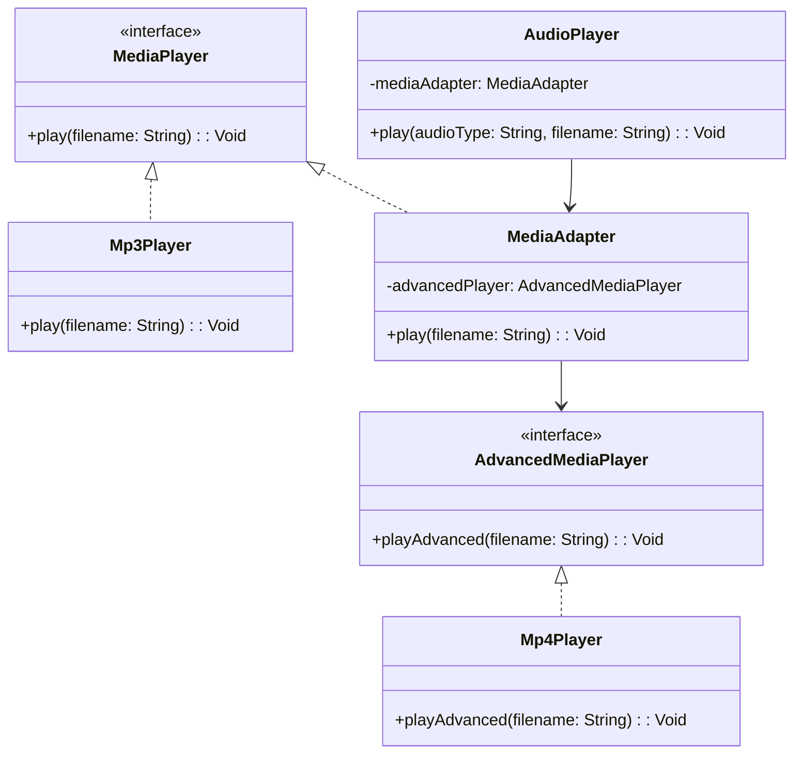
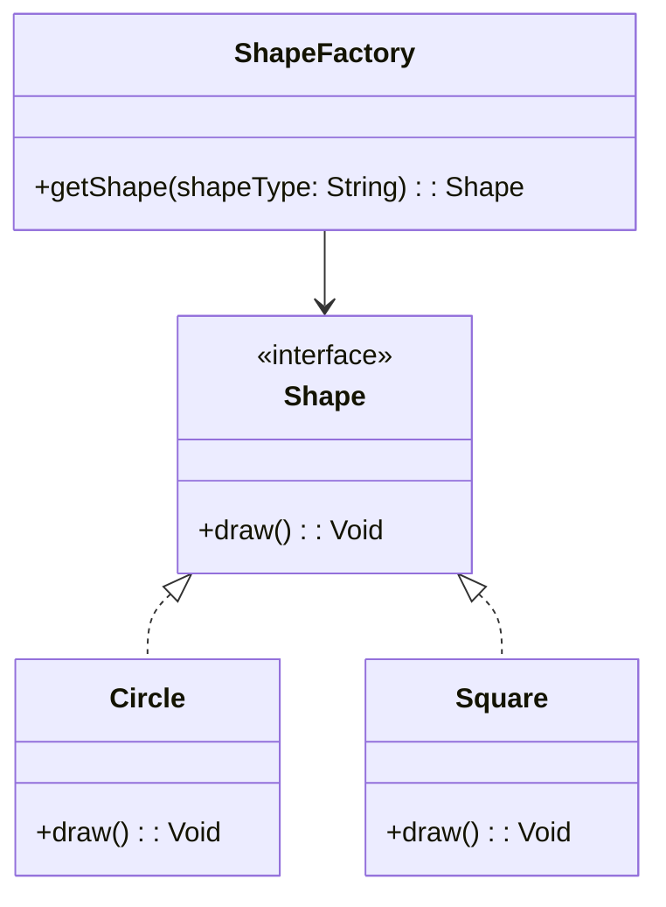

## 1.2 Importance of Design Patterns in Haxe

Design patterns are a crucial aspect of software development, providing proven solutions to common problems. In the context of Haxe, a powerful cross-platform toolkit, design patterns play an even more significant role. They not only help in writing efficient and maintainable code but also enable developers to leverage Haxe's unique features to create applications that can run seamlessly across multiple platforms. In this section, we will delve into the importance of design patterns in Haxe, focusing on their role in enhancing code reusability, maintainability, and facilitating team collaboration.

### Haxe's Cross-Platform Strength

Haxe is renowned for its ability to compile to multiple target languages, including JavaScript, C++, C#, Java, and Python. This cross-platform capability is one of Haxe's most compelling features, allowing developers to write code once and deploy it across various environments. Design patterns are instrumental in this process, as they provide a structured approach to solving problems that are common across different platforms.

#### Leveraging Design Patterns for Cross-Platform Development

Design patterns help in abstracting platform-specific details, allowing developers to focus on the core logic of their applications. By using patterns like the Adapter or Bridge, developers can create interfaces that interact with platform-specific APIs without altering the core functionality of the application. This abstraction is crucial for maintaining a single codebase that can be compiled to different targets.

```haxe
// Example of Adapter Pattern in Haxe
interface MediaPlayer {
    function play(filename:String):Void;
}

class Mp3Player implements MediaPlayer {
    public function new() {}
    public function play(filename:String):Void {
        trace("Playing mp3 file: " + filename);
    }
}

class MediaAdapter implements MediaPlayer {
    private var advancedPlayer:AdvancedMediaPlayer;

    public function new(advancedPlayer:AdvancedMediaPlayer) {
        this.advancedPlayer = advancedPlayer;
    }

    public function play(filename:String):Void {
        advancedPlayer.playAdvanced(filename);
    }
}

interface AdvancedMediaPlayer {
    function playAdvanced(filename:String):Void;
}

class Mp4Player implements AdvancedMediaPlayer {
    public function new() {}
    public function playAdvanced(filename:String):Void {
        trace("Playing mp4 file: " + filename);
    }
}

class AudioPlayer {
    private var mediaAdapter:MediaAdapter;

    public function new() {}

    public function play(audioType:String, filename:String):Void {
        if (audioType == "mp3") {
            trace("Playing mp3 file: " + filename);
        } else if (audioType == "mp4") {
            mediaAdapter = new MediaAdapter(new Mp4Player());
            mediaAdapter.play(filename);
        } else {
            trace("Invalid media. " + audioType + " format not supported");
        }
    }
}

class Main {
    static function main() {
        var audioPlayer = new AudioPlayer();
        audioPlayer.play("mp3", "song.mp3");
        audioPlayer.play("mp4", "video.mp4");
    }
}
```

In this example, the Adapter Pattern allows the `AudioPlayer` class to play both mp3 and mp4 files without changing its core logic. The `MediaAdapter` acts as a bridge between the `AudioPlayer` and the `AdvancedMediaPlayer` interface, demonstrating how design patterns can facilitate cross-platform development.

### Enhancing Code Reusability and Maintainability

One of the primary goals of using design patterns is to enhance code reusability and maintainability. In Haxe, this is particularly important due to its cross-platform nature. Design patterns provide a blueprint for structuring code in a way that is modular, extensible, and easy to understand.

#### Modular and Extensible Code

Design patterns encourage the separation of concerns, allowing developers to break down complex systems into smaller, manageable components. This modularity makes it easier to extend the functionality of an application without affecting existing code. For instance, the Factory Method Pattern can be used to create objects without specifying the exact class of object that will be created, promoting flexibility and scalability.

```haxe
// Example of Factory Method Pattern in Haxe
interface Shape {
    function draw():Void;
}

class Circle implements Shape {
    public function new() {}
    public function draw():Void {
        trace("Drawing a Circle");
    }
}

class Square implements Shape {
    public function new() {}
    public function draw():Void {
        trace("Drawing a Square");
    }
}

class ShapeFactory {
    public static function getShape(shapeType:String):Shape {
        switch (shapeType) {
            case "CIRCLE": return new Circle();
            case "SQUARE": return new Square();
            default: return null;
        }
    }
}

class Main {
    static function main() {
        var shape1 = ShapeFactory.getShape("CIRCLE");
        shape1.draw();

        var shape2 = ShapeFactory.getShape("SQUARE");
        shape2.draw();
    }
}
```

In this example, the Factory Method Pattern allows for the creation of different shapes without specifying their concrete classes. This makes the codebase more flexible and easier to maintain, as new shapes can be added without modifying existing code.

#### Clean and Maintainable Code

Design patterns promote clean code practices by providing a clear structure and guidelines for solving specific problems. This clarity makes the codebase easier to read and understand, reducing the likelihood of errors and simplifying the debugging process. Patterns like the Singleton or Observer can help manage state and communication between components, leading to more maintainable code.

```haxe
// Example of Singleton Pattern in Haxe
class Singleton {
    private static var instance:Singleton;

    private function new() {}

    public static function getInstance():Singleton {
        if (instance == null) {
            instance = new Singleton();
        }
        return instance;
    }

    public function showMessage():Void {
        trace("Hello from Singleton!");
    }
}

class Main {
    static function main() {
        var singleton = Singleton.getInstance();
        singleton.showMessage();
    }
}
```

The Singleton Pattern ensures that a class has only one instance and provides a global point of access to it. This pattern is useful for managing shared resources or configurations, contributing to a cleaner and more maintainable codebase.

### Facilitating Team Collaboration

Design patterns serve as a common language among developers, facilitating communication and collaboration within a team. By adhering to well-known patterns, developers can quickly understand each other's code, reducing the learning curve and improving productivity.

#### Common Language and Understanding

When developers use design patterns, they are essentially speaking the same language. This shared understanding is crucial for effective collaboration, especially in large teams or projects. Patterns like MVC (Model-View-Controller) or MVVM (Model-View-ViewModel) provide a standardized way of organizing code, making it easier for team members to work together.

```haxe
// Example of MVC Pattern in Haxe
class Model {
    private var data:String;

    public function new(data:String) {
        this.data = data;
    }

    public function getData():String {
        return data;
    }
}

class View {
    public function new() {}

    public function displayData(data:String):Void {
        trace("Displaying data: " + data);
    }
}

class Controller {
    private var model:Model;
    private var view:View;

    public function new(model:Model, view:View) {
        this.model = model;
        this.view = view;
    }

    public function updateView():Void {
        view.displayData(model.getData());
    }
}

class Main {
    static function main() {
        var model = new Model("Hello MVC");
        var view = new View();
        var controller = new Controller(model, view);
        controller.updateView();
    }
}
```

In this example, the MVC Pattern separates the application into three interconnected components: Model, View, and Controller. This separation of concerns allows developers to work on different parts of the application simultaneously, improving collaboration and efficiency.

#### Reducing Complexity and Improving Productivity

By providing a structured approach to problem-solving, design patterns reduce the complexity of software development. This reduction in complexity leads to improved productivity, as developers can focus on implementing solutions rather than reinventing the wheel. Patterns like the Command or Strategy can simplify complex logic, making it easier to manage and understand.

```haxe
// Example of Strategy Pattern in Haxe
interface Strategy {
    function execute(a:Int, b:Int):Int;
}

class AddStrategy implements Strategy {
    public function new() {}
    public function execute(a:Int, b:Int):Int {
        return a + b;
    }
}

class SubtractStrategy implements Strategy {
    public function new() {}
    public function execute(a:Int, b:Int):Int {
        return a - b;
    }
}

class Context {
    private var strategy:Strategy;

    public function new(strategy:Strategy) {
        this.strategy = strategy;
    }

    public function executeStrategy(a:Int, b:Int):Int {
        return strategy.execute(a, b);
    }
}

class Main {
    static function main() {
        var context = new Context(new AddStrategy());
        trace("10 + 5 = " + context.executeStrategy(10, 5));

        context = new Context(new SubtractStrategy());
        trace("10 - 5 = " + context.executeStrategy(10, 5));
    }
}
```

The Strategy Pattern allows for the definition of a family of algorithms, encapsulating each one and making them interchangeable. This pattern simplifies the management of complex logic, improving code readability and maintainability.

### Try It Yourself

Now that we've explored the importance of design patterns in Haxe, let's encourage some experimentation. Try modifying the code examples provided above to see how different patterns can be applied to solve various problems. For instance, you could:

- Extend the `ShapeFactory` example to include additional shapes like `Rectangle` or `Triangle`.
- Modify the `AudioPlayer` to support additional media formats using the Adapter Pattern.
- Experiment with different strategies in the `Strategy Pattern` example to perform multiplication or division.

By experimenting with these patterns, you'll gain a deeper understanding of their application and benefits in Haxe development.

### Visualizing Design Patterns in Haxe

To further enhance your understanding, let's visualize some of the design patterns we've discussed using Mermaid.js diagrams.

#### Adapter Pattern Diagram



This diagram illustrates the relationships between the classes in the Adapter Pattern example, highlighting how the `MediaAdapter` bridges the gap between `AudioPlayer` and `AdvancedMediaPlayer`.

#### Factory Method Pattern Diagram



This diagram shows the structure of the Factory Method Pattern, demonstrating how `ShapeFactory` creates instances of `Circle` and `Square` without specifying their concrete classes.

### Conclusion

Design patterns are indispensable tools in the Haxe developer's toolkit, offering a structured approach to solving common problems in cross-platform development. By enhancing code reusability, maintainability, and facilitating team collaboration, design patterns enable developers to harness the full potential of Haxe's cross-platform capabilities. As you continue your journey in mastering Haxe design patterns, remember to experiment, collaborate, and embrace the power of these patterns to create robust and scalable applications.

## Quiz Time!



### What is one of the primary benefits of using design patterns in Haxe?

- [x] Enhancing code reusability and maintainability
- [ ] Increasing code complexity
- [ ] Reducing the need for testing
- [ ] Eliminating the need for documentation

> **Explanation:** Design patterns enhance code reusability and maintainability by providing structured solutions to common problems.

### How do design patterns facilitate cross-platform development in Haxe?

- [x] By abstracting platform-specific details
- [ ] By increasing platform dependencies
- [ ] By simplifying the compilation process
- [ ] By eliminating the need for platform-specific code

> **Explanation:** Design patterns abstract platform-specific details, allowing developers to focus on core logic and maintain a single codebase for multiple platforms.

### Which design pattern is used to create objects without specifying the exact class of object that will be created?

- [x] Factory Method Pattern
- [ ] Singleton Pattern
- [ ] Observer Pattern
- [ ] Strategy Pattern

> **Explanation:** The Factory Method Pattern allows for the creation of objects without specifying their concrete classes.

### What role does the Adapter Pattern play in Haxe development?

- [x] It acts as a bridge between incompatible interfaces
- [ ] It manages object creation
- [ ] It ensures a class has only one instance
- [ ] It defines a family of algorithms

> **Explanation:** The Adapter Pattern acts as a bridge between incompatible interfaces, allowing them to work together.

### How do design patterns improve team collaboration?

- [x] By providing a common language among developers
- [ ] By increasing code complexity
- [ ] By reducing the need for communication
- [ ] By eliminating the need for documentation

> **Explanation:** Design patterns provide a common language among developers, facilitating communication and collaboration.

### Which pattern ensures that a class has only one instance and provides a global point of access to it?

- [x] Singleton Pattern
- [ ] Factory Method Pattern
- [ ] Observer Pattern
- [ ] Strategy Pattern

> **Explanation:** The Singleton Pattern ensures that a class has only one instance and provides a global point of access to it.

### What is a key benefit of using the Strategy Pattern?

- [x] It allows for interchangeable algorithms
- [ ] It manages object creation
- [ ] It ensures a class has only one instance
- [ ] It acts as a bridge between incompatible interfaces

> **Explanation:** The Strategy Pattern allows for the definition of a family of algorithms, making them interchangeable.

### How does the MVC Pattern facilitate team collaboration?

- [x] By separating the application into interconnected components
- [ ] By increasing code complexity
- [ ] By reducing the need for communication
- [ ] By eliminating the need for documentation

> **Explanation:** The MVC Pattern separates the application into interconnected components, allowing developers to work on different parts simultaneously.

### What is the primary goal of using design patterns in software development?

- [x] To provide structured solutions to common problems
- [ ] To increase code complexity
- [ ] To reduce the need for testing
- [ ] To eliminate the need for documentation

> **Explanation:** The primary goal of using design patterns is to provide structured solutions to common problems, enhancing code quality and maintainability.

### True or False: Design patterns eliminate the need for platform-specific code in Haxe development.

- [ ] True
- [x] False

> **Explanation:** Design patterns do not eliminate the need for platform-specific code but help abstract platform-specific details, allowing for a more unified codebase.


