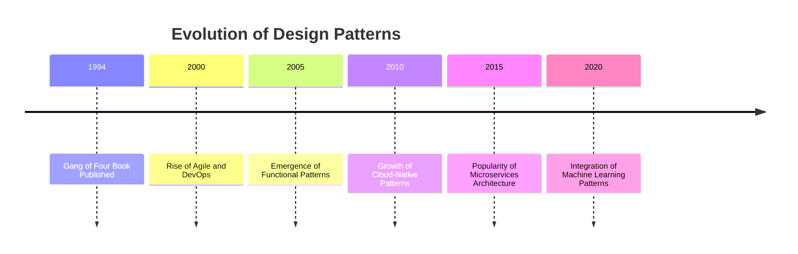

## 1.3 History and Evolution of Design Patterns

Design patterns have become an integral part of software engineering, providing reusable solutions to common problems. In this section, we will explore the origins, evolution, and contemporary relevance of design patterns, with a particular focus on their application in Haxe's cross-platform development environment.

### Origins with the "Gang of Four"

The concept of design patterns in software engineering was popularized by the seminal work "Design Patterns: Elements of Reusable Object-Oriented Software," published in 1994 by Erich Gamma, Richard Helm, Ralph Johnson, and John Vlissides, collectively known as the "Gang of Four" (GoF). This book introduced 23 classic design patterns, categorized into creational, structural, and behavioral patterns, providing a common vocabulary for software developers to communicate complex design concepts.

#### Key Contributions of the Gang of Four

1. **Standardization of Terminology**: The GoF book standardized the terminology used to describe design patterns, making it easier for developers to share and discuss design solutions.

2. **Pattern Catalog**: The book provided a comprehensive catalog of patterns, each with a clear description, intent, applicability, structure, participants, and consequences.

3. **Object-Oriented Design**: The GoF patterns emphasized object-oriented design principles, promoting encapsulation, inheritance, and polymorphism.

4. **Reusability and Flexibility**: By abstracting common design problems, the GoF patterns encouraged the creation of reusable and flexible software components.

#### Example: Singleton Pattern

The Singleton pattern is one of the most well-known GoF patterns. It ensures that a class has only one instance and provides a global point of access to it.

```haxe
class Singleton {
    private static var instance:Singleton;

    private function new() {
        // Private constructor to prevent instantiation
    }

    public static function getInstance():Singleton {
        if (instance == null) {
            instance = new Singleton();
        }
        return instance;
    }
}

// Usage
var singletonInstance = Singleton.getInstance();
```

### Evolution Over Time

Since the publication of the GoF book, design patterns have evolved to accommodate new programming paradigms, languages, and technologies. Let's explore how design patterns have adapted over time.

#### Expansion Beyond Object-Oriented Programming

While the GoF patterns were rooted in object-oriented programming (OOP), the rise of other paradigms, such as functional programming, has led to the development of new patterns and the adaptation of existing ones.

- **Functional Patterns**: Patterns like monads, functors, and higher-order functions have emerged in functional programming languages, emphasizing immutability and pure functions.

- **Concurrency Patterns**: With the increasing importance of concurrent and parallel programming, patterns such as the Actor model and the Producer-Consumer pattern have gained prominence.

#### Influence of Agile and DevOps

The adoption of Agile methodologies and DevOps practices has influenced the evolution of design patterns, emphasizing rapid development, continuous integration, and deployment.

- **Microservices Architecture**: The shift towards microservices has led to the development of patterns such as Service Discovery, API Gateway, and Circuit Breaker.

- **Event-Driven Patterns**: Patterns like Event Sourcing and CQRS (Command Query Responsibility Segregation) have become popular in event-driven architectures.

#### Impact of Modern Technologies

The advent of modern technologies, such as cloud computing, mobile development, and the Internet of Things (IoT), has further shaped the evolution of design patterns.

- **Cloud-Native Patterns**: Patterns like Autoscaling, Service Mesh, and Serverless have emerged to address the challenges of cloud-native applications.

- **Mobile and IoT Patterns**: Patterns for efficient resource management, offline synchronization, and device communication have become crucial in mobile and IoT development.

### Design Patterns in Modern Development

In contemporary software engineering, design patterns remain highly relevant, offering solutions to both traditional and emerging challenges. Let's examine their role in modern development, particularly in the context of Haxe.

#### Relevance in Cross-Platform Development

Haxe, with its ability to compile to multiple target languages, presents unique challenges and opportunities for design patterns. By leveraging Haxe's features, developers can create cross-platform applications that are both efficient and maintainable.

- **Conditional Compilation**: Haxe's conditional compilation allows developers to tailor design patterns to specific target platforms, optimizing performance and compatibility.

- **Macros and Meta-Programming**: Haxe's powerful macro system enables the creation of domain-specific languages and compile-time code generation, enhancing the flexibility of design patterns.

#### Integration with Modern Frameworks

Design patterns continue to play a crucial role in the integration of modern frameworks and libraries, providing a structured approach to building scalable and maintainable applications.

- **Framework-Specific Patterns**: Many modern frameworks, such as React, Angular, and Vue.js, incorporate design patterns like MVC (Model-View-Controller) and MVVM (Model-View-ViewModel) to manage application state and user interfaces.

- **API Design Patterns**: Patterns like RESTful APIs, GraphQL, and gRPC have become standard practices for designing robust and scalable APIs.

#### Embracing New Paradigms

As new programming paradigms and technologies emerge, design patterns continue to evolve, offering solutions that embrace these changes while maintaining the core principles of reusability and flexibility.

- **Reactive Programming**: Patterns like Observer and Publisher-Subscriber have been adapted for reactive programming, enabling the development of responsive and resilient applications.

- **Machine Learning Patterns**: With the rise of machine learning, patterns for data preprocessing, model training, and deployment have become essential for building intelligent applications.

### Visualizing the Evolution of Design Patterns

To better understand the evolution of design patterns, let's visualize the key milestones and trends using a timeline diagram.



### Conclusion

The history and evolution of design patterns demonstrate their enduring value in software engineering. From the foundational work of the Gang of Four to the adaptation of patterns for modern technologies, design patterns continue to provide a structured approach to solving complex design problems. As we explore design patterns in the context of Haxe, we will see how these patterns can be leveraged to create efficient, maintainable, and cross-platform applications.

Remember, this is just the beginning. As you progress through this guide, you'll gain a deeper understanding of how to apply design patterns in Haxe to build robust and scalable software solutions. Keep experimenting, stay curious, and enjoy the journey!

## Quiz Time!



### Who are the authors of the seminal book "Design Patterns: Elements of Reusable Object-Oriented Software"?

- [x] Erich Gamma, Richard Helm, Ralph Johnson, and John Vlissides
- [ ] Martin Fowler, Kent Beck, Ward Cunningham, and Ron Jeffries
- [ ] Robert C. Martin, Michael Feathers, Uncle Bob, and Steve McConnell
- [ ] Donald Knuth, Bjarne Stroustrup, James Gosling, and Linus Torvalds

> **Explanation:** The book was authored by Erich Gamma, Richard Helm, Ralph Johnson, and John Vlissides, collectively known as the "Gang of Four."

### What is the primary focus of the Gang of Four design patterns?

- [x] Object-Oriented Design
- [ ] Functional Programming
- [ ] Procedural Programming
- [ ] Logic Programming

> **Explanation:** The Gang of Four design patterns emphasize object-oriented design principles, promoting encapsulation, inheritance, and polymorphism.

### Which pattern ensures that a class has only one instance and provides a global point of access to it?

- [x] Singleton Pattern
- [ ] Factory Method Pattern
- [ ] Observer Pattern
- [ ] Strategy Pattern

> **Explanation:** The Singleton pattern ensures a class has only one instance and provides a global point of access to it.

### What has influenced the evolution of design patterns in recent years?

- [x] Agile methodologies and DevOps practices
- [ ] Only the original Gang of Four book
- [ ] Procedural programming languages
- [ ] Static website development

> **Explanation:** Agile methodologies and DevOps practices have influenced the evolution of design patterns, emphasizing rapid development and continuous integration.

### Which of the following is a pattern that emerged with the rise of cloud computing?

- [x] Autoscaling
- [ ] Singleton
- [ ] Observer
- [ ] Factory Method

> **Explanation:** Autoscaling is a pattern that emerged to address challenges in cloud-native applications, allowing systems to automatically adjust resources based on demand.

### How have design patterns adapted to functional programming?

- [x] By introducing patterns like monads and higher-order functions
- [ ] By focusing solely on object-oriented principles
- [ ] By eliminating the need for patterns
- [ ] By only using procedural patterns

> **Explanation:** Design patterns have adapted to functional programming by introducing patterns like monads, functors, and higher-order functions.

### What is a key feature of Haxe that enhances the flexibility of design patterns?

- [x] Macros and Meta-Programming
- [ ] Lack of type safety
- [ ] Single-target compilation
- [ ] Manual memory management

> **Explanation:** Haxe's powerful macro system enables the creation of domain-specific languages and compile-time code generation, enhancing the flexibility of design patterns.

### Which pattern is commonly used in reactive programming?

- [x] Observer Pattern
- [ ] Singleton Pattern
- [ ] Factory Method Pattern
- [ ] Builder Pattern

> **Explanation:** The Observer pattern is commonly used in reactive programming to enable responsive and resilient applications.

### What is a common pattern used in microservices architecture?

- [x] Service Discovery
- [ ] Singleton
- [ ] Observer
- [ ] Factory Method

> **Explanation:** Service Discovery is a common pattern used in microservices architecture to manage the dynamic nature of service instances.

### True or False: Design patterns are no longer relevant in modern software engineering.

- [ ] True
- [x] False

> **Explanation:** Design patterns remain highly relevant in modern software engineering, offering solutions to both traditional and emerging challenges.


