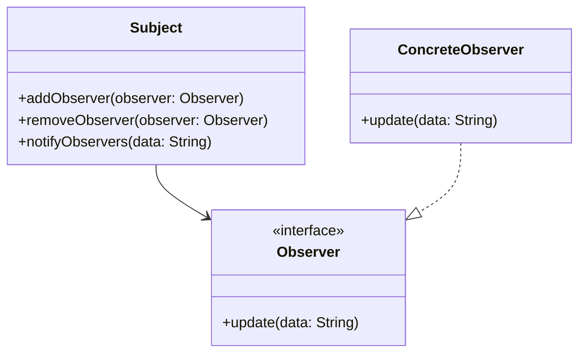

## 1.4 Benefits of Using Design Patterns in Haxe

In the realm of software engineering, design patterns are indispensable tools that provide time-tested solutions to common problems. When applied within the Haxe programming environment, these patterns unlock a multitude of benefits, particularly in the context of cross-platform development. In this section, we will delve into the myriad advantages of using design patterns in Haxe, focusing on solving recurrent problems, ensuring code consistency, improving communication, and enhancing flexibility and scalability.

### Solving Recurrent Problems

Design patterns are essentially blueprints that have been distilled from the collective experience of software architects and engineers. They offer standardized solutions to problems that frequently arise during software development. By leveraging these patterns in Haxe, developers can streamline their workflow and avoid reinventing the wheel.

#### Example: Singleton Pattern

The Singleton pattern is a classic example of a design pattern that addresses the problem of ensuring a class has only one instance and provides a global point of access to it. This is particularly useful in scenarios such as managing a configuration object or a connection pool.

```haxe
class Singleton {
    private static var instance:Singleton;
    
    private function new() {
        // Private constructor to prevent instantiation
    }
    
    public static function getInstance():Singleton {
        if (instance == null) {
            instance = new Singleton();
        }
        return instance;
    }
}

// Usage
var singletonInstance = Singleton.getInstance();
```

In this example, the Singleton pattern ensures that only one instance of the `Singleton` class is created, solving the problem of managing a single shared resource.

### Code Consistency

One of the key benefits of using design patterns is the promotion of consistent coding practices. By adhering to established patterns, developers can ensure that their codebase remains uniform, making it easier to read, maintain, and extend.

#### Consistency Across Projects

When multiple teams or developers work on different parts of a project, or even across different projects, maintaining a consistent coding style can be challenging. Design patterns provide a common language and structure that all developers can follow, reducing discrepancies and improving overall code quality.

#### Example: Factory Method Pattern

The Factory Method pattern is a creational pattern that provides an interface for creating objects in a superclass but allows subclasses to alter the type of objects that will be created.

```haxe
interface Product {
    public function use():Void;
}

class ConcreteProductA implements Product {
    public function new() {}
    public function use():Void {
        trace("Using Product A");
    }
}

class ConcreteProductB implements Product {
    public function new() {}
    public function use():Void {
        trace("Using Product B");
    }
}

class Creator {
    public function new() {}
    public function factoryMethod(type:String):Product {
        switch(type) {
            case "A": return new ConcreteProductA();
            case "B": return new ConcreteProductB();
            default: throw "Unknown product type";
        }
    }
}

// Usage
var creator = new Creator();
var product = creator.factoryMethod("A");
product.use();
```

By using the Factory Method pattern, developers can ensure that object creation is handled consistently, regardless of the specific type of product being instantiated.

### Improved Communication

Design patterns serve as a common vocabulary for developers, facilitating clearer and more effective communication about system architecture. When developers are familiar with design patterns, they can quickly convey complex ideas using concise terminology.

#### Example: Observer Pattern

The Observer pattern is a behavioral pattern that defines a one-to-many dependency between objects so that when one object changes state, all its dependents are notified and updated automatically.

```haxe
interface Observer {
    public function update(data:String):Void;
}

class ConcreteObserver implements Observer {
    public function new() {}
    public function update(data:String):Void {
        trace("Observer received data: " + data);
    }
}

class Subject {
    private var observers:Array<Observer> = [];
    
    public function new() {}
    
    public function addObserver(observer:Observer):Void {
        observers.push(observer);
    }
    
    public function removeObserver(observer:Observer):Void {
        observers.remove(observer);
    }
    
    public function notifyObservers(data:String):Void {
        for (observer in observers) {
            observer.update(data);
        }
    }
}

// Usage
var subject = new Subject();
var observer = new ConcreteObserver();
subject.addObserver(observer);
subject.notifyObservers("Hello, Observers!");
```

In this example, the Observer pattern provides a clear mechanism for managing dependencies between objects, making it easier for developers to discuss and implement such relationships.

### Flexibility and Scalability

Design patterns are instrumental in creating systems that are both flexible and scalable. By decoupling components and promoting modularity, design patterns enable systems to grow and adapt to changing requirements without significant rework.

#### Example: Strategy Pattern

The Strategy pattern is a behavioral pattern that enables selecting an algorithm's behavior at runtime. It defines a family of algorithms, encapsulates each one, and makes them interchangeable.

```haxe
interface Strategy {
    public function execute():Void;
}

class ConcreteStrategyA implements Strategy {
    public function new() {}
    public function execute():Void {
        trace("Executing Strategy A");
    }
}

class ConcreteStrategyB implements Strategy {
    public function new() {}
    public function execute():Void {
        trace("Executing Strategy B");
    }
}

class Context {
    private var strategy:Strategy;
    
    public function new(strategy:Strategy) {
        this.strategy = strategy;
    }
    
    public function setStrategy(strategy:Strategy):Void {
        this.strategy = strategy;
    }
    
    public function executeStrategy():Void {
        strategy.execute();
    }
}

// Usage
var context = new Context(new ConcreteStrategyA());
context.executeStrategy();
context.setStrategy(new ConcreteStrategyB());
context.executeStrategy();
```

The Strategy pattern allows developers to change the behavior of an algorithm at runtime, providing flexibility in how a system operates.

### Visualizing Design Patterns in Haxe

To further illustrate the benefits of using design patterns in Haxe, let's visualize the interaction between the components of the Observer pattern using a class diagram.



**Diagram Description:** This class diagram represents the Observer pattern, showing the relationship between the `Subject`, `Observer`, and `ConcreteObserver` classes. The `Subject` maintains a list of `Observer` objects and notifies them of any changes. The `ConcreteObserver` implements the `Observer` interface to receive updates.

### Try It Yourself

To deepen your understanding of design patterns in Haxe, try modifying the code examples provided. For instance, in the Strategy pattern example, create a new strategy class and integrate it into the existing context. Experiment with different scenarios to see how the pattern adapts to changes.

### References and Links

- [Design Patterns: Elements of Reusable Object-Oriented Software](https://en.wikipedia.org/wiki/Design_Patterns) - The seminal book on design patterns by Erich Gamma, Richard Helm, Ralph Johnson, and John Vlissides.
- [Haxe Language Reference](https://haxe.org/manual/introduction.html) - Official documentation for the Haxe programming language.
- [MDN Web Docs on Design Patterns](https://developer.mozilla.org/en-US/docs/Web/JavaScript/Guide/Design_Patterns) - A comprehensive guide to design patterns in web development.

### Knowledge Check

To reinforce your understanding of the benefits of using design patterns in Haxe, consider the following questions:

1. How do design patterns help in solving recurrent problems in software development?
2. What role do design patterns play in ensuring code consistency across projects?
3. How can design patterns improve communication among developers?
4. In what ways do design patterns enhance the flexibility and scalability of a system?
5. How does the Singleton pattern ensure that a class has only one instance?

### Embrace the Journey

Remember, mastering design patterns is a journey that requires practice and experimentation. As you continue to explore the world of Haxe and design patterns, you'll gain the skills needed to build robust, maintainable, and scalable software solutions. Keep experimenting, stay curious, and enjoy the journey!

## Quiz Time!



### How do design patterns help in solving recurrent problems in software development?

- [x] By providing standardized solutions
- [ ] By increasing code complexity
- [ ] By reducing code readability
- [ ] By enforcing strict coding rules

> **Explanation:** Design patterns offer standardized solutions to common problems, streamlining the development process.

### What is a key benefit of using design patterns for code consistency?

- [x] Promoting uniform coding practices
- [ ] Increasing code duplication
- [ ] Encouraging unique coding styles
- [ ] Limiting code reuse

> **Explanation:** Design patterns promote uniform coding practices, ensuring consistency across projects.

### How do design patterns improve communication among developers?

- [x] By providing a common vocabulary
- [ ] By complicating discussions
- [ ] By reducing documentation
- [ ] By enforcing strict hierarchies

> **Explanation:** Design patterns provide a common vocabulary, facilitating clearer communication about system architecture.

### In what way do design patterns enhance system flexibility?

- [x] By decoupling components
- [ ] By increasing dependencies
- [ ] By enforcing rigid structures
- [ ] By limiting scalability

> **Explanation:** Design patterns enhance flexibility by decoupling components, allowing systems to adapt to changes.

### What is the primary purpose of the Singleton pattern?

- [x] To ensure a class has only one instance
- [ ] To create multiple instances of a class
- [ ] To define a family of algorithms
- [ ] To encapsulate object creation

> **Explanation:** The Singleton pattern ensures that a class has only one instance, providing a global point of access.

### Which pattern is used to define a one-to-many dependency between objects?

- [x] Observer pattern
- [ ] Strategy pattern
- [ ] Factory Method pattern
- [ ] Singleton pattern

> **Explanation:** The Observer pattern defines a one-to-many dependency, notifying dependents of state changes.

### How does the Strategy pattern provide flexibility?

- [x] By allowing algorithm behavior selection at runtime
- [ ] By enforcing a single algorithm
- [ ] By increasing code complexity
- [ ] By reducing code readability

> **Explanation:** The Strategy pattern allows selecting an algorithm's behavior at runtime, providing flexibility.

### What is a benefit of using the Factory Method pattern?

- [x] Consistent object creation
- [ ] Increased code duplication
- [ ] Limited object creation
- [ ] Reduced code readability

> **Explanation:** The Factory Method pattern ensures consistent object creation, regardless of the specific type.

### How do design patterns contribute to scalability?

- [x] By promoting modularity
- [ ] By increasing dependencies
- [ ] By enforcing rigid structures
- [ ] By limiting code reuse

> **Explanation:** Design patterns promote modularity, enabling systems to scale and adapt to changing requirements.

### True or False: Design patterns are only useful for large-scale projects.

- [ ] True
- [x] False

> **Explanation:** Design patterns are beneficial for projects of all sizes, providing solutions to common problems and promoting best practices.


