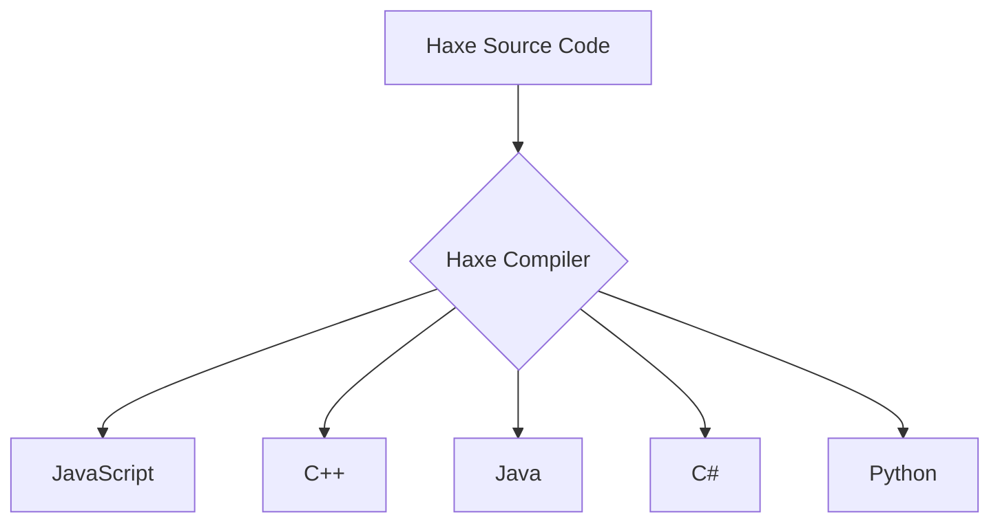

## 1.5 Overview of Haxe Language Features

Haxe is a unique and powerful programming language designed to facilitate cross-platform development. Its features make it an excellent choice for developers looking to write clean, maintainable, and efficient code that can be compiled to multiple targets. In this section, we'll explore the key features of Haxe, including static typing, multi-paradigm support, a powerful macro system, cross-platform compilation, and an advanced type system.

### Static Typing and Type Inference

Static typing is a cornerstone of Haxe, providing a balance between safety and convenience. It allows developers to catch errors at compile time, reducing runtime errors and improving code reliability. Haxe's type inference system further enhances this by automatically deducing types, reducing the need for explicit type annotations.

#### Example: Static Typing and Type Inference

```haxe
class Main {
    static function main() {
        var number:Int = 10; // Explicit type annotation
        var inferredNumber = 20; // Type inferred as Int
        trace(number + inferredNumber); // Outputs: 30
    }
}
```

In this example, `number` is explicitly declared as an `Int`, while `inferredNumber` is automatically inferred as an `Int` by the compiler. This combination of static typing and type inference allows for both safety and brevity in code.

### Multi-Paradigm Support

Haxe supports multiple programming paradigms, including object-oriented and functional programming. This flexibility allows developers to choose the best paradigm for their specific use case, leading to more expressive and maintainable code.

#### Object-Oriented Programming

Haxe's object-oriented features include classes, interfaces, and inheritance, enabling developers to create modular and reusable code.

```haxe
class Animal {
    public var name:String;
    
    public function new(name:String) {
        this.name = name;
    }
    
    public function speak():Void {
        trace(name + " makes a sound.");
    }
}

class Dog extends Animal {
    override public function speak():Void {
        trace(name + " barks.");
    }
}

class Main {
    static function main() {
        var dog = new Dog("Buddy");
        dog.speak(); // Outputs: Buddy barks.
    }
}
```

#### Functional Programming

Haxe also supports functional programming concepts such as higher-order functions, immutability, and pattern matching.

```haxe
class Main {
    static function main() {
        var numbers = [1, 2, 3, 4, 5];
        var doubledNumbers = numbers.map(function(n) return n * 2);
        trace(doubledNumbers); // Outputs: [2, 4, 6, 8, 10]
    }
}
```

In this example, the `map` function is used to apply a transformation to each element in the array, demonstrating Haxe's support for functional programming.

### Powerful Macro System

Haxe's macro system is one of its most powerful features, allowing developers to perform compile-time code generation and manipulation. This can lead to more flexible and efficient solutions by automating repetitive tasks and enabling domain-specific language creation.

#### Example: Macros in Haxe

```haxe
import haxe.macro.Expr;

class Main {
    static macro function log(expr:Expr):Expr {
        return macro trace($expr);
    }

    static function main() {
        log("Hello, World!"); // Outputs: Hello, World!
    }
}
```

In this example, a simple macro is defined to automatically wrap expressions with a `trace` call, demonstrating how macros can simplify code.

### Cross-Platform Compilation

One of Haxe's defining features is its ability to compile to multiple target platforms, including JavaScript, C++, Java, C#, Python, and more. This cross-platform capability allows developers to write code once and deploy it across different environments, saving time and effort.

#### Example: Cross-Platform Code

```haxe
class Main {
    static function main() {
        #if js
        trace("Running on JavaScript");
        #elseif cpp
        trace("Running on C++");
        #elseif java
        trace("Running on Java");
        #end
    }
}
```

This example demonstrates how conditional compilation can be used to tailor code for different target platforms, ensuring optimal performance and compatibility.

### Advanced Type System

Haxe's type system is both powerful and flexible, offering features such as enums, abstracts, and type parameters. These features enable developers to create robust and type-safe code.

#### Enums and Pattern Matching

Enums in Haxe are algebraic data types that can be used to represent a fixed set of values. Combined with pattern matching, they provide a powerful way to handle complex data structures.

```haxe
enum Color {
    Red;
    Green;
    Blue;
}

class Main {
    static function main() {
        var color:Color = Color.Red;
        
        switch (color) {
            case Red:
                trace("Color is Red");
            case Green:
                trace("Color is Green");
            case Blue:
                trace("Color is Blue");
        }
    }
}
```

#### Abstract Types

Abstract types in Haxe allow developers to create new types based on existing ones, providing additional type safety and abstraction.

```haxe
abstract PositiveInt(Int) from Int to Int {
    public inline function new(value:Int) {
        if (value < 0) throw "Value must be positive";
        this = value;
    }
}

class Main {
    static function main() {
        var positive:PositiveInt = new PositiveInt(10);
        trace(positive); // Outputs: 10
    }
}
```

### Try It Yourself

Experiment with the code examples provided above. Try modifying the `Dog` class to add more behaviors, or create a new enum to represent different shapes. Use the macro system to automate a repetitive task in your code. By experimenting with these features, you'll gain a deeper understanding of Haxe's capabilities.

### Visualizing Haxe's Cross-Platform Compilation

To better understand how Haxe's cross-platform compilation works, let's visualize the process using a Mermaid.js diagram.



This diagram illustrates how the Haxe compiler takes source code and compiles it into various target languages, enabling cross-platform development.

### References and Links

- [Haxe Official Documentation](https://haxe.org/documentation/)
- [Haxe Language Features](https://haxe.org/manual/introduction-features.html)
- [MDN Web Docs on Static Typing](https://developer.mozilla.org/en-US/docs/Glossary/Static_typing)

### Knowledge Check

- What are the benefits of static typing in Haxe?
- How does Haxe support both object-oriented and functional programming paradigms?
- What is the purpose of Haxe's macro system?
- How does Haxe achieve cross-platform compilation?
- What are some advanced features of Haxe's type system?

### Embrace the Journey

Remember, mastering Haxe's language features is just the beginning. As you continue to explore and experiment, you'll discover new ways to leverage these features to create powerful and efficient applications. Keep learning, stay curious, and enjoy the journey!

## Quiz Time!



### What is a key benefit of Haxe's static typing?

- [x] Catching errors at compile time
- [ ] Allowing dynamic type changes
- [ ] Reducing code verbosity
- [ ] Enabling runtime type checks

> **Explanation:** Static typing in Haxe helps catch errors at compile time, improving code reliability.

### How does Haxe support multiple programming paradigms?

- [x] By combining object-oriented and functional programming styles
- [ ] By enforcing a single programming style
- [ ] By using only procedural programming
- [ ] By excluding functional programming features

> **Explanation:** Haxe supports both object-oriented and functional programming, allowing developers to choose the best paradigm for their needs.

### What is the purpose of Haxe's macro system?

- [x] To perform compile-time code generation and manipulation
- [ ] To enable runtime code execution
- [ ] To simplify syntax for beginners
- [ ] To enforce strict coding standards

> **Explanation:** Haxe's macro system allows for compile-time code generation, enabling more flexible and efficient solutions.

### Which of the following is a target platform for Haxe?

- [x] JavaScript
- [ ] Ruby
- [ ] PHP
- [ ] Swift

> **Explanation:** Haxe can compile to JavaScript, among other platforms like C++, Java, C#, and Python.

### What is an example of an advanced feature in Haxe's type system?

- [x] Enums and pattern matching
- [ ] Dynamic typing
- [ ] Weak typing
- [ ] Implicit type conversion

> **Explanation:** Haxe's type system includes advanced features like enums and pattern matching for robust type safety.

### What does Haxe's cross-platform compilation allow developers to do?

- [x] Write code once and deploy it across different environments
- [ ] Write separate code for each platform
- [ ] Use only one programming paradigm
- [ ] Avoid using type annotations

> **Explanation:** Haxe's cross-platform compilation allows developers to write code once and deploy it across various platforms.

### How can Haxe's macro system simplify code?

- [x] By automating repetitive tasks
- [ ] By enforcing strict type checks
- [ ] By reducing code execution time
- [ ] By limiting code flexibility

> **Explanation:** Haxe's macro system can automate repetitive tasks, making code more efficient and maintainable.

### What is a benefit of using enums in Haxe?

- [x] Representing a fixed set of values
- [ ] Allowing dynamic value changes
- [ ] Enabling runtime type checks
- [ ] Reducing code readability

> **Explanation:** Enums in Haxe represent a fixed set of values, providing a clear and concise way to handle specific data.

### How does Haxe's type inference work?

- [x] By automatically deducing types
- [ ] By requiring explicit type annotations
- [ ] By allowing dynamic type changes
- [ ] By enforcing strict type checks

> **Explanation:** Haxe's type inference system automatically deduces types, reducing the need for explicit type annotations.

### True or False: Haxe can only compile to JavaScript.

- [ ] True
- [x] False

> **Explanation:** Haxe can compile to multiple target platforms, including JavaScript, C++, Java, C#, and Python.


