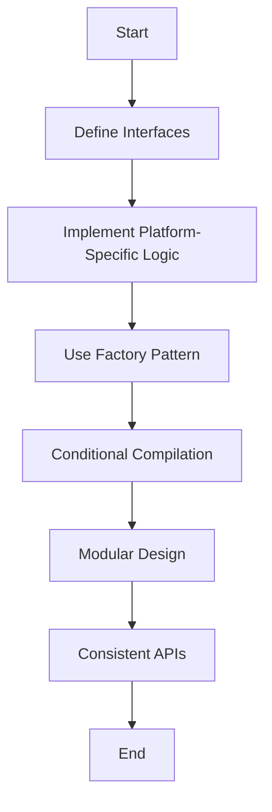

## 10.1 Managing Platform Differences

In the realm of cross-platform development, managing platform differences is a crucial aspect that can significantly impact the success of your software projects. Haxe, with its ability to compile to multiple target languages, offers a unique advantage in this area. However, it also presents challenges that require careful consideration and strategic planning. In this section, we will delve into the strategies for managing platform differences effectively, focusing on abstraction layers, conditional compilation, and best practices for modular design and consistent APIs.

### Understanding Platform Differences

Before we dive into the strategies, it's essential to understand what platform differences entail. These differences can arise from various factors, including:

- **Operating System Variations:** Different operating systems (e.g., Windows, macOS, Linux) have distinct APIs and system behaviors.
- **Hardware Differences:** Variations in hardware capabilities, such as screen sizes, input methods, and processing power.
- **Language and Runtime Differences:** Each target language (e.g., JavaScript, C++, C#, Java, Python) has its own syntax, libraries, and runtime behaviors.
- **User Interface Guidelines:** Different platforms have unique UI/UX guidelines and expectations.

### Strategies for Managing Platform Differences

#### 1. Abstraction Layers

**Definition:** Abstraction layers are interfaces that hide platform-specific details, allowing developers to write code that is agnostic of the underlying platform.

**Implementation:**

- **Define Interfaces:** Create interfaces that define the functionality required by your application. These interfaces should be implemented differently for each platform.
  
  ```haxe
  interface IFileSystem {
      function readFile(path: String): String;
      function writeFile(path: String, content: String): Void;
  }
  ```

- **Platform-Specific Implementations:** Implement the interface for each target platform, encapsulating the platform-specific logic.

  ```haxe
  #if js
  class JsFileSystem implements IFileSystem {
      public function readFile(path: String): String {
          // JavaScript-specific file reading logic
          return "File content from JS";
      }
      public function writeFile(path: String, content: String): Void {
          // JavaScript-specific file writing logic
      }
  }
  #elseif cpp
  class CppFileSystem implements IFileSystem {
      public function readFile(path: String): String {
          // C++-specific file reading logic
          return "File content from C++";
      }
      public function writeFile(path: String, content: String): Void {
          // C++-specific file writing logic
      }
  }
  #end
  ```

- **Factory Pattern:** Use a factory pattern to instantiate the appropriate implementation based on the target platform.

  ```haxe
  class FileSystemFactory {
      public static function create(): IFileSystem {
          #if js
          return new JsFileSystem();
          #elseif cpp
          return new CppFileSystem();
          #end
      }
  }
  ```

**Benefits:**

- **Code Reusability:** Abstraction layers promote code reuse by separating platform-specific logic from core functionality.
- **Maintainability:** Changes to platform-specific logic can be made independently, reducing the risk of introducing bugs.

#### 2. Conditional Compilation

**Definition:** Conditional compilation involves using compile-time directives to include or exclude code based on the target platform.

**Implementation:**

- **Compile-Time Directives:** Use Haxe's `#if`, `#elseif`, and `#end` directives to conditionally compile code.

  ```haxe
  class PlatformUtils {
      public static function getPlatformName(): String {
          #if js
          return "JavaScript";
          #elseif cpp
          return "C++";
          #else
          return "Unknown";
          #end
      }
  }
  ```

**Benefits:**

- **Flexibility:** Conditional compilation allows you to tailor your code to the specific needs of each platform.
- **Efficiency:** By excluding unnecessary code, you can reduce the size of your compiled binaries and improve performance.

#### 3. Best Practices for Managing Platform Differences

##### Modular Design

**Definition:** Modular design involves separating platform-specific code from core logic, allowing for easier maintenance and scalability.

**Implementation:**

- **Core Modules:** Develop core modules that contain platform-agnostic logic. These modules should be independent of any platform-specific details.

  ```haxe
  class CoreLogic {
      public function processData(data: String): String {
          // Platform-independent processing logic
          return data.toUpperCase();
      }
  }
  ```

- **Platform Modules:** Create separate modules for platform-specific logic. These modules should interact with the core modules through well-defined interfaces.

  ```haxe
  class PlatformSpecificLogic {
      private var fileSystem: IFileSystem;

      public function new() {
          fileSystem = FileSystemFactory.create();
      }

      public function saveData(data: String): Void {
          fileSystem.writeFile("data.txt", data);
      }
  }
  ```

**Benefits:**

- **Scalability:** Modular design makes it easier to add support for new platforms by simply implementing the necessary modules.
- **Maintainability:** Changes to platform-specific logic do not affect the core functionality, reducing the risk of introducing bugs.

##### Consistent APIs

**Definition:** Consistent APIs provide uniform interfaces for platform-dependent functionality, ensuring that your codebase remains coherent and easy to understand.

**Implementation:**

- **API Design:** Design APIs that abstract platform-specific details, providing a consistent interface for developers.

  ```haxe
  class NetworkManager {
      public function fetchData(url: String): String {
          #if js
          return fetchFromJs(url);
          #elseif cpp
          return fetchFromCpp(url);
          #end
      }

      private function fetchFromJs(url: String): String {
          // JavaScript-specific network logic
          return "Data from JS";
      }

      private function fetchFromCpp(url: String): String {
          // C++-specific network logic
          return "Data from C++";
      }
  }
  ```

**Benefits:**

- **Ease of Use:** Consistent APIs make it easier for developers to work with your codebase, reducing the learning curve.
- **Reduced Errors:** By providing a uniform interface, you minimize the risk of errors caused by platform-specific differences.

### Visualizing Platform Differences Management

To better understand how these strategies work together, let's visualize the process using a flowchart.



**Description:** This flowchart illustrates the process of managing platform differences, starting with defining interfaces, implementing platform-specific logic, using the factory pattern, applying conditional compilation, adopting modular design, and ensuring consistent APIs.

### Try It Yourself

Now that we've covered the strategies for managing platform differences, let's put them into practice. Try modifying the code examples provided to add support for a new platform, such as Python. Implement the necessary interfaces and platform-specific logic, and use conditional compilation to include the new code.

### References and Further Reading

- [Haxe Manual: Conditional Compilation](https://haxe.org/manual/lf-condition-compilation.html)
- [Design Patterns: Elements of Reusable Object-Oriented Software](https://en.wikipedia.org/wiki/Design_Patterns)
- [MDN Web Docs: Cross-Browser Testing](https://developer.mozilla.org/en-US/docs/Learn/Tools_and_testing/Cross_browser_testing)

### Knowledge Check

- What are the key challenges in managing platform differences?
- How do abstraction layers help in managing platform differences?
- What is the role of conditional compilation in cross-platform development?
- Why is modular design important in managing platform differences?
- How do consistent APIs contribute to a coherent codebase?

### Embrace the Journey

Remember, managing platform differences is an ongoing process that requires continuous learning and adaptation. As you gain experience, you'll develop a deeper understanding of the nuances of each platform and how to leverage Haxe's capabilities to create robust, cross-platform applications. Keep experimenting, stay curious, and enjoy the journey!

## Quiz Time!



### What is the primary purpose of abstraction layers in managing platform differences?

- [x] To hide platform-specific details and provide a uniform interface
- [ ] To increase the complexity of the codebase
- [ ] To reduce the need for platform-specific logic
- [ ] To eliminate the need for conditional compilation

> **Explanation:** Abstraction layers are used to hide platform-specific details and provide a uniform interface, allowing developers to write platform-agnostic code.

### How does conditional compilation benefit cross-platform development?

- [x] By allowing code to be tailored to specific platforms
- [ ] By eliminating the need for platform-specific logic
- [ ] By reducing the size of the codebase
- [ ] By making the codebase more complex

> **Explanation:** Conditional compilation allows code to be tailored to specific platforms, enabling developers to include or exclude code based on the target platform.

### What is a key benefit of modular design in managing platform differences?

- [x] It separates platform-specific code from core logic
- [ ] It increases the complexity of the codebase
- [ ] It eliminates the need for abstraction layers
- [ ] It reduces the need for consistent APIs

> **Explanation:** Modular design separates platform-specific code from core logic, making it easier to maintain and scale the codebase.

### Why are consistent APIs important in cross-platform development?

- [x] They provide a uniform interface for platform-dependent functionality
- [ ] They increase the complexity of the codebase
- [ ] They eliminate the need for abstraction layers
- [ ] They reduce the need for modular design

> **Explanation:** Consistent APIs provide a uniform interface for platform-dependent functionality, ensuring that the codebase remains coherent and easy to understand.

### What is the role of the factory pattern in managing platform differences?

- [x] To instantiate the appropriate implementation based on the target platform
- [ ] To eliminate the need for conditional compilation
- [ ] To increase the complexity of the codebase
- [ ] To reduce the need for abstraction layers

> **Explanation:** The factory pattern is used to instantiate the appropriate implementation based on the target platform, allowing for platform-specific logic to be encapsulated.

### What is a key challenge in managing platform differences?

- [x] Variations in operating systems, hardware, and runtime behaviors
- [ ] The need for consistent APIs
- [ ] The use of abstraction layers
- [ ] The implementation of modular design

> **Explanation:** A key challenge in managing platform differences is dealing with variations in operating systems, hardware, and runtime behaviors.

### How can abstraction layers improve code maintainability?

- [x] By allowing changes to platform-specific logic to be made independently
- [ ] By increasing the complexity of the codebase
- [ ] By eliminating the need for conditional compilation
- [ ] By reducing the need for consistent APIs

> **Explanation:** Abstraction layers improve code maintainability by allowing changes to platform-specific logic to be made independently, reducing the risk of introducing bugs.

### What is the benefit of using compile-time directives in Haxe?

- [x] They allow for conditional compilation based on the target platform
- [ ] They increase the complexity of the codebase
- [ ] They eliminate the need for abstraction layers
- [ ] They reduce the need for modular design

> **Explanation:** Compile-time directives in Haxe allow for conditional compilation based on the target platform, enabling developers to tailor their code to specific needs.

### How do consistent APIs reduce errors in cross-platform development?

- [x] By minimizing the risk of errors caused by platform-specific differences
- [ ] By increasing the complexity of the codebase
- [ ] By eliminating the need for abstraction layers
- [ ] By reducing the need for modular design

> **Explanation:** Consistent APIs reduce errors by minimizing the risk of errors caused by platform-specific differences, providing a uniform interface for developers.

### True or False: Managing platform differences is a one-time process.

- [ ] True
- [x] False

> **Explanation:** Managing platform differences is an ongoing process that requires continuous learning and adaptation as new platforms and technologies emerge.


