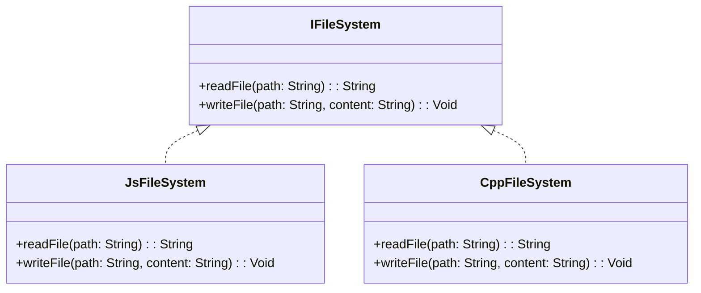

## 10.2 Abstracting Platform APIs

In the realm of cross-platform development, one of the most significant challenges is dealing with the differences in platform-specific APIs. Haxe, with its ability to compile to multiple target languages, provides a unique opportunity to abstract these platform-specific APIs into a unified interface. This section will guide you through the process of abstracting platform APIs using Haxe, focusing on interface definitions, platform implementations, and practical use cases such as file access and network communication.

### Understanding API Abstraction

**Definition:** Abstracting platform APIs involves creating a common set of APIs over diverse platform-specific implementations. This allows developers to write code that is agnostic of the underlying platform, enhancing portability and maintainability.

#### Why Abstract Platform APIs?

- **Portability:** Write once, run anywhere. By abstracting platform APIs, you can ensure that your codebase is portable across different platforms.
- **Maintainability:** Changes in platform-specific implementations can be isolated, reducing the impact on the overall codebase.
- **Scalability:** Easily extend your application to support new platforms by adding new implementations without altering the core logic.

### Implementing API Abstraction in Haxe

Haxe's powerful type system and its ability to target multiple platforms make it an excellent choice for API abstraction. Let's explore how to implement this in Haxe.

#### Interface Definitions

The first step in abstracting platform APIs is to define interfaces that specify the required functionality. Interfaces in Haxe are similar to those in other object-oriented languages and serve as contracts that platform-specific implementations must fulfill.

```haxe
interface IFileSystem {
    function readFile(path: String): String;
    function writeFile(path: String, content: String): Void;
}
```

In this example, `IFileSystem` defines two methods: `readFile` and `writeFile`. Any platform-specific implementation must provide these methods.

#### Platform Implementations

Once the interface is defined, the next step is to provide concrete implementations for each target platform. This involves writing classes that implement the interface for each platform's specific API.

```haxe
#if js
class JsFileSystem implements IFileSystem {
    public function new() {}

    public function readFile(path: String): String {
        // JavaScript-specific file reading logic
        return "File content from JS";
    }

    public function writeFile(path: String, content: String): Void {
        // JavaScript-specific file writing logic
    }
}
#end

#if cpp
class CppFileSystem implements IFileSystem {
    public function new() {}

    public function readFile(path: String): String {
        // C++-specific file reading logic
        return "File content from C++";
    }

    public function writeFile(path: String, content: String): Void {
        // C++-specific file writing logic
    }
}
#end
```

In this code, we have two implementations of `IFileSystem`: `JsFileSystem` for JavaScript and `CppFileSystem` for C++. Each class provides the platform-specific logic for reading and writing files.

#### Selecting the Appropriate Implementation

To use the correct implementation at runtime, we can utilize Haxe's conditional compilation feature. This allows us to select the appropriate class based on the target platform.

```haxe
class FileSystemFactory {
    public static function create(): IFileSystem {
        #if js
        return new JsFileSystem();
        #elseif cpp
        return new CppFileSystem();
        #else
        throw "Unsupported platform";
        #end
    }
}
```

The `FileSystemFactory` class provides a static method `create` that returns an instance of the appropriate `IFileSystem` implementation based on the platform.

### Use Cases and Examples

Now that we have a basic understanding of how to abstract platform APIs in Haxe, let's explore some practical use cases.

#### File Access

File access is a common requirement in many applications, and different platforms have different APIs for handling files. By abstracting file access APIs, we can write code that works seamlessly across platforms.

```haxe
class FileManager {
    private var fileSystem: IFileSystem;

    public function new() {
        this.fileSystem = FileSystemFactory.create();
    }

    public function readConfig(): String {
        return fileSystem.readFile("config.txt");
    }

    public function saveConfig(data: String): Void {
        fileSystem.writeFile("config.txt", data);
    }
}
```

In this example, `FileManager` uses the abstracted `IFileSystem` to read and write configuration files. The underlying platform-specific logic is hidden, allowing the rest of the application to remain platform-agnostic.

#### Network Communication

Network communication is another area where platform-specific differences can be abstracted. By defining a common interface for network operations, we can ensure consistent behavior across platforms.

```haxe
interface INetworkClient {
    function sendRequest(url: String, data: String): String;
}

#if js
class JsNetworkClient implements INetworkClient {
    public function new() {}

    public function sendRequest(url: String, data: String): String {
        // JavaScript-specific network request logic
        return "Response from JS";
    }
}
#end

#if cpp
class CppNetworkClient implements INetworkClient {
    public function new() {}

    public function sendRequest(url: String, data: String): String {
        // C++-specific network request logic
        return "Response from C++";
    }
}
#end
```

Here, `INetworkClient` defines a method `sendRequest`, and we provide platform-specific implementations for JavaScript and C++.

### Visualizing the Abstraction Process

To better understand the abstraction process, let's visualize the relationship between interfaces and platform-specific implementations using a class diagram.



This diagram illustrates how `JsFileSystem` and `CppFileSystem` implement the `IFileSystem` interface, providing platform-specific functionality.

### Try It Yourself

To solidify your understanding, try modifying the code examples to add support for another platform, such as Python or Java. Implement the necessary platform-specific logic and update the factory class to include your new implementation.

### References and Further Reading

- [Haxe Manual: Conditional Compilation](https://haxe.org/manual/lf-condition-compilation.html)
- [Design Patterns: Elements of Reusable Object-Oriented Software](https://en.wikipedia.org/wiki/Design_Patterns)
- [MDN Web Docs: File API](https://developer.mozilla.org/en-US/docs/Web/API/File_API)

### Knowledge Check

Before we wrap up, let's test your understanding with a few questions.

## Quiz Time!



### What is the primary purpose of abstracting platform APIs?

- [x] To create a common set of APIs over diverse platform-specific implementations
- [ ] To make the code more complex
- [ ] To reduce the number of lines of code
- [ ] To increase the execution speed

> **Explanation:** Abstracting platform APIs allows developers to write code that is agnostic of the underlying platform, enhancing portability and maintainability.

### Which Haxe feature is used to select the appropriate platform-specific implementation at runtime?

- [ ] Interfaces
- [ ] Enums
- [x] Conditional Compilation
- [ ] Generics

> **Explanation:** Haxe's conditional compilation feature allows developers to select the appropriate class based on the target platform.

### In the provided example, what does the `FileSystemFactory` class do?

- [x] It provides a static method to return an instance of the appropriate `IFileSystem` implementation.
- [ ] It reads and writes files directly.
- [ ] It defines the `IFileSystem` interface.
- [ ] It handles network communication.

> **Explanation:** The `FileSystemFactory` class provides a static method `create` that returns an instance of the appropriate `IFileSystem` implementation based on the platform.

### What is the benefit of using interfaces in API abstraction?

- [x] They define a contract that platform-specific implementations must fulfill.
- [ ] They increase the complexity of the code.
- [ ] They allow for dynamic typing.
- [ ] They reduce the need for documentation.

> **Explanation:** Interfaces define a contract that platform-specific implementations must fulfill, ensuring consistent behavior across platforms.

### Which of the following is a use case for abstracting platform APIs?

- [x] File Access
- [x] Network Communication
- [ ] User Interface Design
- [ ] Database Management

> **Explanation:** File access and network communication are common areas where platform-specific differences can be abstracted.

### What is the role of the `IFileSystem` interface in the example?

- [x] It specifies the required functionality for file operations.
- [ ] It implements platform-specific logic.
- [ ] It handles network requests.
- [ ] It manages user input.

> **Explanation:** The `IFileSystem` interface specifies the required functionality for file operations, which platform-specific implementations must provide.

### How can you extend the example to support a new platform?

- [x] Implement the necessary platform-specific logic and update the factory class.
- [ ] Modify the existing platform-specific classes.
- [ ] Change the interface definitions.
- [ ] Use dynamic typing.

> **Explanation:** To support a new platform, implement the necessary platform-specific logic and update the factory class to include the new implementation.

### What is a potential challenge when abstracting platform APIs?

- [x] Handling platform-specific limitations and differences
- [ ] Writing more lines of code
- [ ] Increasing code execution speed
- [ ] Reducing code complexity

> **Explanation:** A potential challenge is handling platform-specific limitations and differences, which may require additional logic or workarounds.

### Why is maintainability improved by abstracting platform APIs?

- [x] Changes in platform-specific implementations can be isolated.
- [ ] The code becomes more complex.
- [ ] The code execution speed increases.
- [ ] The number of lines of code is reduced.

> **Explanation:** Maintainability is improved because changes in platform-specific implementations can be isolated, reducing the impact on the overall codebase.

### True or False: Abstracting platform APIs in Haxe allows for seamless cross-platform development.

- [x] True
- [ ] False

> **Explanation:** True. Abstracting platform APIs in Haxe allows developers to write code that is agnostic of the underlying platform, enabling seamless cross-platform development.



Remember, mastering the art of abstracting platform APIs is a journey. As you continue to explore and experiment, you'll gain a deeper understanding of how to leverage Haxe's unique features to create robust, cross-platform applications. Keep pushing the boundaries, stay curious, and enjoy the process!
