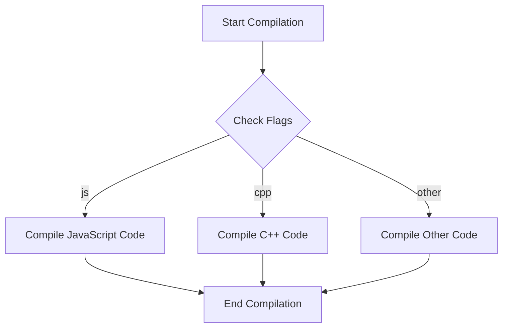

## 10.3 Conditional Compilation Strategies

Conditional compilation is a powerful feature in Haxe that allows developers to include or exclude code based on specific compilation conditions. This is particularly useful in cross-platform development, where different platforms may require different implementations or optimizations. In this section, we will explore how to implement conditional compilation in Haxe, best practices for its use, and how it can be leveraged to create efficient and maintainable cross-platform applications.

### Understanding Conditional Compilation

Conditional compilation enables developers to write code that is selectively compiled based on certain conditions. This is achieved through the use of compiler directives, which instruct the compiler to include or exclude specific blocks of code. In Haxe, conditional compilation is primarily managed using the `#if`, `#elseif`, `#else`, and `#end` directives.

#### Key Concepts

- **Compiler Directives:** Special instructions in the code that guide the compiler on how to process certain sections.
- **Flags:** Conditions or variables that determine whether a block of code should be compiled.
- **Cross-Platform Development:** The practice of developing software that can run on multiple platforms with minimal changes.

### Implementing Conditional Compilation in Haxe

Haxe provides a robust system for conditional compilation, allowing developers to define and use compiler flags to manage platform-specific code. Let's delve into how you can implement this in your Haxe projects.

#### Compiler Flags

Compiler flags are the cornerstone of conditional compilation in Haxe. They are used to define conditions under which certain blocks of code should be included or excluded during compilation.

**Syntax:**

```haxe
#if flag
    // Code to include if 'flag' is true
#elseif anotherFlag
    // Code to include if 'anotherFlag' is true
#else
    // Code to include if none of the above flags are true
#end
```

**Example:**

```haxe
class Main {
    static function main() {
        #if js
            trace("This code is compiled for JavaScript.");
        #elseif cpp
            trace("This code is compiled for C++.");
        #else
            trace("This code is compiled for another target.");
        #end
    }
}
```

In this example, the code block that gets compiled depends on the target platform specified during the build process.

#### Build Configurations

Build configurations allow you to define custom flags and manage them through your build process. This is useful for setting up different environments, such as development, testing, and production.

**Defining Custom Flags:**

You can define custom flags in your build configuration file or directly in the command line when invoking the Haxe compiler.

**Example:**

```bash
haxe -D myCustomFlag -main Main -js main.js
```

In your Haxe code, you can then use this flag:

```haxe
#if myCustomFlag
    trace("Custom flag is active.");
#end
```

### Best Practices for Conditional Compilation

While conditional compilation is a powerful tool, it should be used judiciously to maintain code clarity and prevent complexity.

#### Minimal Use

- **Limit Conditional Code:** Only use conditional compilation for essential differences between platforms. Overusing it can lead to code that is difficult to read and maintain.
- **Centralize Platform-Specific Code:** Try to keep platform-specific code in separate modules or classes to isolate changes and reduce the impact on the rest of the codebase.

#### Documentation

- **Document Conditions:** Clearly document why conditional compilation is used and what each flag represents. This helps other developers understand the purpose and necessity of the conditional code.
- **Use Descriptive Flag Names:** Choose flag names that clearly indicate their purpose or the platform they target.

### Visualizing Conditional Compilation

To better understand how conditional compilation works, let's visualize the process using a flowchart.



**Diagram Explanation:** This flowchart illustrates the decision-making process during compilation based on the flags provided. Depending on the active flag, different code paths are compiled.

### Try It Yourself

To get hands-on experience with conditional compilation, try modifying the code examples provided. Experiment with different flags and observe how the compiled output changes. Here are a few suggestions:

- **Add a New Flag:** Define a new flag for a hypothetical platform and implement a code block for it.
- **Combine Flags:** Use logical operators to combine multiple flags and create more complex conditions.
- **Refactor Code:** Move platform-specific code into separate functions or classes and use conditional compilation to manage them.

### References and Further Reading

- [Haxe Manual: Conditional Compilation](https://haxe.org/manual/lf-condition-compilation.html)
- [MDN Web Docs: Preprocessor Directives](https://developer.mozilla.org/en-US/docs/Glossary/Preprocessor_directive)

### Knowledge Check

Before we wrap up, let's reinforce what we've learned with a few questions and exercises.

- **Question:** What are the primary directives used for conditional compilation in Haxe?
- **Exercise:** Implement a simple Haxe program that uses conditional compilation to print different messages based on the target platform.

### Embrace the Journey

Remember, mastering conditional compilation is a journey. As you continue to explore Haxe's capabilities, you'll find more opportunities to apply these strategies effectively. Keep experimenting, stay curious, and enjoy the process of creating versatile cross-platform applications.

## Quiz Time!



### What is the primary purpose of conditional compilation in Haxe?

- [x] To include or exclude code based on compilation conditions
- [ ] To optimize code performance
- [ ] To manage memory allocation
- [ ] To handle user input

> **Explanation:** Conditional compilation is used to include or exclude code based on specific conditions, allowing for platform-specific implementations.

### Which directive is used to start a conditional compilation block in Haxe?

- [x] #if
- [ ] #else
- [ ] #end
- [ ] #elseif

> **Explanation:** The `#if` directive is used to start a conditional compilation block in Haxe.

### How can you define a custom flag for conditional compilation in Haxe?

- [x] By using the `-D` option in the Haxe compiler command
- [ ] By editing the Haxe source code
- [ ] By modifying the Haxe standard library
- [ ] By using a third-party tool

> **Explanation:** Custom flags can be defined using the `-D` option when invoking the Haxe compiler.

### What is a best practice when using conditional compilation?

- [x] Limit its use to essential differences
- [ ] Use it for all code differences
- [ ] Avoid using it entirely
- [ ] Use it to replace all function calls

> **Explanation:** It's best to limit conditional compilation to essential differences to maintain code clarity.

### Which directive is used to end a conditional compilation block in Haxe?

- [x] #end
- [ ] #else
- [ ] #elseif
- [ ] #if

> **Explanation:** The `#end` directive is used to close a conditional compilation block in Haxe.

### What should you do to ensure other developers understand your conditional compilation code?

- [x] Document the conditions and flags used
- [ ] Use complex flag names
- [ ] Avoid using comments
- [ ] Only use default flags

> **Explanation:** Documenting the conditions and flags helps other developers understand the purpose of the conditional code.

### Which of the following is a benefit of using conditional compilation?

- [x] It allows for platform-specific code inclusion
- [ ] It increases code execution speed
- [ ] It reduces code size
- [ ] It simplifies code logic

> **Explanation:** Conditional compilation allows developers to include platform-specific code, making it a powerful tool for cross-platform development.

### What is a potential downside of overusing conditional compilation?

- [x] It can make the code difficult to read and maintain
- [ ] It increases code performance
- [ ] It simplifies debugging
- [ ] It reduces the need for documentation

> **Explanation:** Overusing conditional compilation can lead to complex and hard-to-maintain code.

### How can you manage platform-specific code effectively?

- [x] Centralize it in separate modules or classes
- [ ] Spread it throughout the codebase
- [ ] Avoid using modules
- [ ] Use inline comments extensively

> **Explanation:** Centralizing platform-specific code helps isolate changes and reduces the impact on the rest of the codebase.

### True or False: Conditional compilation can be used to manage different build configurations.

- [x] True
- [ ] False

> **Explanation:** Conditional compilation can be used to manage different build configurations by defining custom flags for various environments.



Remember, this is just the beginning. As you progress, you'll build more complex and interactive applications. Keep experimenting, stay curious, and enjoy the journey!
