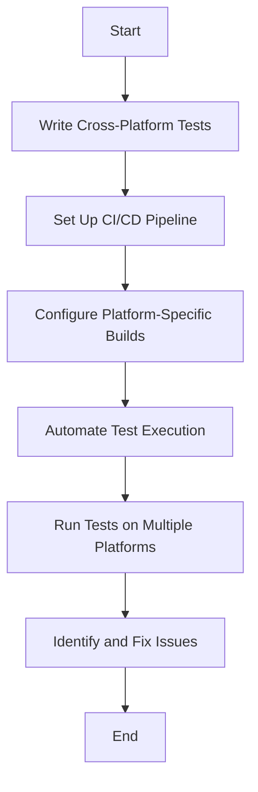

## 10.4 Testing and Debugging Across Targets

In the realm of cross-platform development, testing and debugging are crucial components that ensure the reliability and performance of your applications across different environments. Haxe, with its ability to compile to multiple targets such as JavaScript, C++, C#, Java, and Python, presents unique challenges and opportunities in this regard. In this section, we will explore strategies, tools, and best practices for testing and debugging Haxe applications across various platforms.

### Understanding Cross-Platform Testing

Cross-platform testing involves verifying that your application behaves consistently and correctly across different operating systems, browsers, and devices. This process is essential for identifying platform-specific issues and ensuring a seamless user experience.

#### Key Concepts

- **Automated Testing:** Automate the execution of tests to ensure consistent results and save time.
- **Platform-Specific Tests:** Develop tests that target specific features or behaviors unique to a platform.
- **Continuous Integration (CI):** Integrate testing into your development workflow to catch issues early.

### Strategies for Cross-Platform Testing

#### Automated Testing

Automated testing is a cornerstone of cross-platform development. By automating your tests, you can quickly verify that your application works as expected on all supported platforms. Here are some strategies for effective automated testing:

1. **Use a Testing Framework:** Leverage testing frameworks like [MUnit](https://github.com/massiveinteractive/MUnit) for Haxe to write and manage your tests. MUnit supports unit testing and can be integrated into your CI pipeline.

2. **Write Cross-Platform Tests:** Ensure your tests are designed to run on all target platforms. This involves abstracting platform-specific logic and using conditional compilation to handle differences.

3. **Run Tests on Multiple Platforms:** Use tools like [Travis CI](https://travis-ci.org/) or [GitHub Actions](https://github.com/features/actions) to automate the execution of tests across different environments.

4. **Mock Platform-Specific Features:** Use mocking techniques to simulate platform-specific features and behaviors in your tests. This allows you to test your application logic without relying on the actual platform.

#### Platform-Specific Tests

While cross-platform tests are essential, it's also important to include tests that cover platform-specific features. These tests help identify issues that may arise due to differences in platform APIs or behavior.

1. **Identify Platform-Specific Features:** Determine which features or behaviors are unique to each platform and require special attention.

2. **Use Conditional Compilation:** Leverage Haxe's conditional compilation feature to include or exclude platform-specific tests based on the target platform.

3. **Test Platform APIs:** Write tests that specifically target platform APIs to ensure they are used correctly and behave as expected.

### Tools for Cross-Platform Testing

#### Continuous Integration and Delivery (CI/CD) Pipelines

CI/CD pipelines are essential for automating the build, test, and deployment processes. By integrating testing into your CI/CD pipeline, you can ensure that your application is continuously tested across all supported platforms.

1. **Set Up a CI/CD Pipeline:** Use tools like [Jenkins](https://www.jenkins.io/), [CircleCI](https://circleci.com/), or [GitLab CI/CD](https://docs.gitlab.com/ee/ci/) to automate your build and test processes.

2. **Configure Platform-Specific Builds:** Set up your CI/CD pipeline to build and test your application on all target platforms. This may involve configuring different build environments or using Docker containers.

3. **Automate Test Execution:** Integrate your testing framework with your CI/CD pipeline to automatically run tests after each build.

#### Remote Debugging

Remote debugging allows you to inspect and debug your application running on a different platform or device. This is particularly useful for identifying platform-specific issues that cannot be reproduced locally.

1. **Use Platform-Specific Debuggers:** Utilize debuggers that are designed for the target platform. For example, use [Chrome DevTools](https://developer.chrome.com/docs/devtools/) for debugging JavaScript applications or [Visual Studio](https://visualstudio.microsoft.com/) for C# applications.

2. **Set Up Remote Debugging Sessions:** Configure your development environment to connect to the remote platform or device for debugging. This may involve setting up SSH tunnels or using remote debugging tools.

3. **Inspect Platform-Specific Issues:** Use remote debugging to identify and resolve issues that are specific to the target platform, such as differences in rendering or API behavior.

### Best Practices for Cross-Platform Testing and Debugging

1. **Maintain a Consistent Codebase:** Ensure your codebase is consistent across all platforms by using Haxe's cross-platform features and avoiding platform-specific hacks.

2. **Use Version Control:** Leverage version control systems like Git to manage your codebase and track changes. This is essential for collaborating with team members and managing different platform configurations.

3. **Document Platform-Specific Differences:** Keep detailed documentation of any platform-specific differences or issues you encounter. This will help you and your team understand and address these issues in the future.

4. **Regularly Update Dependencies:** Keep your dependencies up to date to ensure compatibility with the latest platform versions and features.

5. **Engage with the Community:** Participate in the Haxe community to share knowledge and learn from others' experiences with cross-platform development.

### Code Example: Cross-Platform Testing with MUnit

Let's look at a simple example of how to set up cross-platform tests using MUnit in Haxe.

```haxe
import munit.TestCase;
import munit.Assert;

class CrossPlatformTest extends TestCase {
    public function new() {
        super();
    }

    public function testAddition() {
        Assert.equals(4, add(2, 2), "2 + 2 should equal 4");
    }

    public function testPlatformSpecificFeature() {
        #if js
        Assert.isTrue(jsSpecificFeature(), "Feature should be available on JavaScript");
        #elseif cpp
        Assert.isTrue(cppSpecificFeature(), "Feature should be available on C++");
        #end
    }

    private function add(a:Int, b:Int):Int {
        return a + b;
    }

    private function jsSpecificFeature():Bool {
        // Simulate a JavaScript-specific feature
        return true;
    }

    private function cppSpecificFeature():Bool {
        // Simulate a C++-specific feature
        return true;
    }
}
```

In this example, we define a test case using MUnit. The `testAddition` method tests a simple addition function, while the `testPlatformSpecificFeature` method uses conditional compilation to test platform-specific features.

### Try It Yourself

Experiment with the code example by adding more tests or modifying the existing ones to cover additional platform-specific features. Consider setting up a CI/CD pipeline to automate the execution of these tests across different platforms.

### Visualizing the Testing Workflow

To better understand the cross-platform testing workflow, let's visualize it using a flowchart.



This flowchart illustrates the process of writing cross-platform tests, setting up a CI/CD pipeline, and running tests on multiple platforms to identify and fix issues.

### References and Links

- [MUnit Documentation](https://github.com/massiveinteractive/MUnit)
- [Travis CI](https://travis-ci.org/)
- [GitHub Actions](https://github.com/features/actions)
- [Jenkins](https://www.jenkins.io/)
- [Chrome DevTools](https://developer.chrome.com/docs/devtools/)
- [Visual Studio](https://visualstudio.microsoft.com/)

### Knowledge Check

- What are the benefits of automated testing in cross-platform development?
- How can you use conditional compilation to handle platform-specific tests?
- What are some tools you can use to set up a CI/CD pipeline for cross-platform testing?

### Embrace the Journey

Remember, mastering cross-platform testing and debugging is a journey. As you continue to develop your skills, you'll become more adept at identifying and resolving platform-specific issues, ensuring your applications perform flawlessly across all targets. Keep experimenting, stay curious, and enjoy the process!

## Quiz Time!



### What is the primary benefit of automated testing in cross-platform development?

- [x] Consistent results and time savings
- [ ] Increased code complexity
- [ ] Reduced test coverage
- [ ] Manual intervention

> **Explanation:** Automated testing ensures consistent results and saves time by running tests automatically across different platforms.

### Which tool can be used for remote debugging of JavaScript applications?

- [x] Chrome DevTools
- [ ] Visual Studio
- [ ] Jenkins
- [ ] GitHub Actions

> **Explanation:** Chrome DevTools is a powerful tool for debugging JavaScript applications running in the browser.

### What is the purpose of platform-specific tests?

- [x] To cover features unique to a platform
- [ ] To increase test execution time
- [ ] To reduce test coverage
- [ ] To simplify the codebase

> **Explanation:** Platform-specific tests are designed to cover features or behaviors that are unique to a particular platform.

### How can you handle platform-specific logic in your tests?

- [x] Use conditional compilation
- [ ] Ignore platform differences
- [ ] Use the same code for all platforms
- [ ] Manually adjust tests for each platform

> **Explanation:** Conditional compilation allows you to include or exclude code based on the target platform, making it ideal for handling platform-specific logic.

### What is a key component of a CI/CD pipeline?

- [x] Automated test execution
- [ ] Manual code review
- [ ] Increased code complexity
- [ ] Reduced test coverage

> **Explanation:** Automated test execution is a key component of a CI/CD pipeline, ensuring that tests are run automatically after each build.

### Which version control system is commonly used for managing codebases?

- [x] Git
- [ ] SVN
- [ ] Mercurial
- [ ] CVS

> **Explanation:** Git is a widely used version control system for managing codebases and tracking changes.

### What should you do to maintain a consistent codebase across platforms?

- [x] Use Haxe's cross-platform features
- [ ] Write platform-specific hacks
- [ ] Ignore platform differences
- [ ] Use different codebases for each platform

> **Explanation:** Using Haxe's cross-platform features helps maintain a consistent codebase across different platforms.

### What is the benefit of engaging with the Haxe community?

- [x] Sharing knowledge and learning from others
- [ ] Increasing code complexity
- [ ] Reducing test coverage
- [ ] Ignoring platform differences

> **Explanation:** Engaging with the Haxe community allows you to share knowledge and learn from others' experiences with cross-platform development.

### What is the purpose of documenting platform-specific differences?

- [x] To help understand and address issues
- [ ] To increase code complexity
- [ ] To reduce test coverage
- [ ] To simplify the codebase

> **Explanation:** Documenting platform-specific differences helps you and your team understand and address issues that may arise due to platform variations.

### True or False: Remote debugging is only useful for local development.

- [ ] True
- [x] False

> **Explanation:** Remote debugging is useful for inspecting and debugging applications running on different platforms or devices, not just for local development.


