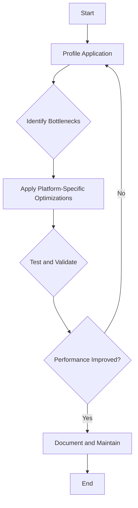

## 10.5 Performance Optimization per Target

In the realm of cross-platform development, performance optimization is not a one-size-fits-all endeavor. Each platform—be it JavaScript, C++, C#, Java, Python, or others—has its unique characteristics and constraints. As expert software engineers and architects, our goal is to tailor performance improvements to these specific characteristics, ensuring that our Haxe applications run efficiently across all targets. In this section, we will delve into the strategies and techniques for optimizing performance per target, leveraging Haxe's unique features to achieve cross-platform excellence.

### Understanding Performance Optimization

**Definition:** Performance optimization per target involves tailoring performance improvements to the specific characteristics of each platform. This requires a deep understanding of both the Haxe language and the target platforms to make informed decisions about where and how to optimize.

#### Key Concepts

- **Profiling:** Use profiling tools to identify bottlenecks in your application. Profiling helps you understand where your application spends most of its time and which parts of the code are most resource-intensive.
- **Platform-Specific Optimizations:** Apply optimizations that are relevant to each target platform. This may involve using platform-specific libraries, APIs, or techniques to enhance performance.
- **Maintainability:** Balance performance gains with code complexity. Optimizations should not make the codebase difficult to maintain or understand.
- **Fallbacks:** Provide default implementations when optimizations are not possible. This ensures that your application remains functional even if certain optimizations cannot be applied.

### Profiling: The First Step to Optimization

Before diving into optimization, it's crucial to understand where the performance bottlenecks lie. Profiling is the process of measuring the performance of your application to identify these bottlenecks.

#### Profiling Tools

- **JavaScript:** Use browser developer tools such as Chrome DevTools or Firefox Developer Edition to profile JavaScript applications. These tools provide insights into CPU usage, memory consumption, and network activity.
- **C++:** Tools like Valgrind, gprof, or Visual Studio Profiler can be used to profile C++ applications. They offer detailed reports on function call times and memory usage.
- **C#:** Visual Studio's built-in profiler or JetBrains dotTrace can be used to analyze C# applications.
- **Java:** Use tools like JProfiler or VisualVM to profile Java applications, focusing on CPU and memory usage.
- **Python:** cProfile and PyCharm's profiler are popular choices for profiling Python applications.

#### Example: Profiling a Haxe Application

```haxe
class Main {
    static function main() {
        var startTime = Date.now().getTime();
        
        // Code to be profiled
        for (i in 0...1000000) {
            var x = Math.sqrt(i);
        }
        
        var endTime = Date.now().getTime();
        trace("Execution time: " + (endTime - startTime) + "ms");
    }
}
```

In this example, we measure the execution time of a loop that calculates the square root of numbers from 0 to 1,000,000. This simple profiling technique can help identify time-consuming operations.

### Platform-Specific Optimizations

Once you've identified the bottlenecks, the next step is to apply optimizations that are specific to each target platform. Let's explore some common strategies for different platforms.

#### JavaScript

- **Minification and Compression:** Use tools like UglifyJS or Terser to minify JavaScript code, reducing file size and improving load times.
- **Asynchronous Programming:** Leverage Promises and async/await to handle asynchronous operations efficiently, preventing blocking of the main thread.
- **Lazy Loading:** Load resources only when needed to reduce initial load time and improve perceived performance.

#### C++

- **Memory Management:** Use smart pointers (e.g., `std::shared_ptr`, `std::unique_ptr`) to manage memory efficiently and prevent leaks.
- **Inline Functions:** Use the `inline` keyword for small, frequently called functions to reduce function call overhead.
- **Compiler Optimizations:** Enable compiler optimizations (e.g., `-O2`, `-O3` in GCC) to improve performance.

#### C#

- **Garbage Collection:** Optimize garbage collection by minimizing object allocations and using value types where possible.
- **Parallelism:** Use the `Task Parallel Library (TPL)` to parallelize CPU-bound operations and improve performance.
- **JIT Compilation:** Take advantage of Just-In-Time (JIT) compilation optimizations by structuring code to benefit from method inlining and loop unrolling.

#### Java

- **JVM Tuning:** Adjust JVM parameters (e.g., heap size, garbage collection settings) to optimize performance for specific workloads.
- **Concurrency:** Use the `java.util.concurrent` package to manage concurrent operations efficiently.
- **Profiling and HotSpot:** Leverage the HotSpot JVM's profiling capabilities to identify and optimize hot code paths.

#### Python

- **C Extensions:** Use Cython or write C extensions to optimize performance-critical sections of code.
- **Concurrency:** Use `asyncio` for asynchronous programming and `multiprocessing` for parallel execution.
- **NumPy and SciPy:** Use these libraries for efficient numerical computations and data processing.

### Considerations for Cross-Platform Optimization

While optimizing for specific platforms, it's important to keep the following considerations in mind:

#### Maintainability

Optimizations should not make the codebase difficult to maintain or understand. Strive for a balance between performance gains and code complexity. Use comments and documentation to explain complex optimizations.

#### Fallbacks

Provide default implementations when optimizations are not possible. This ensures that your application remains functional even if certain optimizations cannot be applied. For example, if a platform-specific library is not available, use a generic implementation as a fallback.

#### Testing and Validation

Test your optimizations thoroughly to ensure they do not introduce bugs or regressions. Use automated testing frameworks to validate the correctness of your code across all target platforms.

### Try It Yourself

Experiment with the following code example by applying different optimization techniques and observing their impact on performance.

```haxe
class OptimizationExample {
    static function main() {
        var data = new Array<Int>();
        for (i in 0...1000000) {
            data.push(i);
        }
        
        // Experiment with different sorting algorithms
        data.sort((a, b) -> a - b);
        
        trace("Data sorted successfully.");
    }
}
```

Try replacing the built-in sort function with a custom sorting algorithm and measure the performance difference. Consider using platform-specific libraries or techniques to optimize the sorting process.

### Visualizing Performance Optimization

To better understand the process of performance optimization, let's visualize the workflow using a flowchart.



**Figure 1:** Performance Optimization Workflow

This flowchart illustrates the iterative process of profiling, identifying bottlenecks, applying optimizations, and testing to ensure performance improvements.

### References and Further Reading

- [MDN Web Docs: JavaScript Performance](https://developer.mozilla.org/en-US/docs/Web/JavaScript/Performance)
- [GCC Optimization Options](https://gcc.gnu.org/onlinedocs/gcc/Optimize-Options.html)
- [Python Performance Tips](https://wiki.python.org/moin/PythonSpeed/PerformanceTips)

### Knowledge Check

- What are the key steps in the performance optimization process?
- How can profiling help identify performance bottlenecks?
- What are some platform-specific optimization techniques for JavaScript?
- Why is maintainability important when optimizing code?
- How can you provide fallbacks for platform-specific optimizations?

### Embrace the Journey

Remember, performance optimization is an ongoing process. As you gain experience and knowledge, you'll become more adept at identifying and addressing performance issues. Keep experimenting, stay curious, and enjoy the journey!

## Quiz Time!



### What is the first step in performance optimization?

- [x] Profiling the application
- [ ] Applying platform-specific optimizations
- [ ] Testing and validation
- [ ] Providing fallbacks

> **Explanation:** Profiling is the first step to identify where the performance bottlenecks lie.

### Which tool can be used to profile JavaScript applications?

- [x] Chrome DevTools
- [ ] Valgrind
- [ ] Visual Studio Profiler
- [ ] cProfile

> **Explanation:** Chrome DevTools is a popular tool for profiling JavaScript applications.

### What is a key consideration when optimizing code?

- [x] Maintainability
- [ ] Using the latest libraries
- [ ] Writing more code
- [ ] Ignoring fallbacks

> **Explanation:** Maintainability ensures that the code remains understandable and manageable after optimization.

### Which optimization technique is specific to C++?

- [x] Using smart pointers
- [ ] Using Promises
- [ ] Using async/await
- [ ] Using Cython

> **Explanation:** Smart pointers are a C++ feature for efficient memory management.

### What should be done if platform-specific optimizations are not possible?

- [x] Provide default implementations
- [ ] Ignore the issue
- [ ] Rewrite the entire codebase
- [ ] Use only platform-specific libraries

> **Explanation:** Providing default implementations ensures functionality even without specific optimizations.

### Which library is recommended for efficient numerical computations in Python?

- [x] NumPy
- [ ] Terser
- [ ] UglifyJS
- [ ] JProfiler

> **Explanation:** NumPy is a library for efficient numerical computations in Python.

### What is the purpose of lazy loading in JavaScript?

- [x] To load resources only when needed
- [ ] To increase initial load time
- [ ] To block the main thread
- [ ] To use more memory

> **Explanation:** Lazy loading improves perceived performance by loading resources only when needed.

### Which package is used for concurrency in Java?

- [x] java.util.concurrent
- [ ] asyncio
- [ ] multiprocessing
- [ ] TPL

> **Explanation:** The `java.util.concurrent` package is used for managing concurrent operations in Java.

### What is a benefit of using inline functions in C++?

- [x] Reducing function call overhead
- [ ] Increasing memory usage
- [ ] Slowing down execution
- [ ] Making code less readable

> **Explanation:** Inline functions reduce function call overhead by expanding the function code at the call site.

### True or False: Performance optimization is a one-time process.

- [ ] True
- [x] False

> **Explanation:** Performance optimization is an ongoing process that requires continuous monitoring and improvement.


