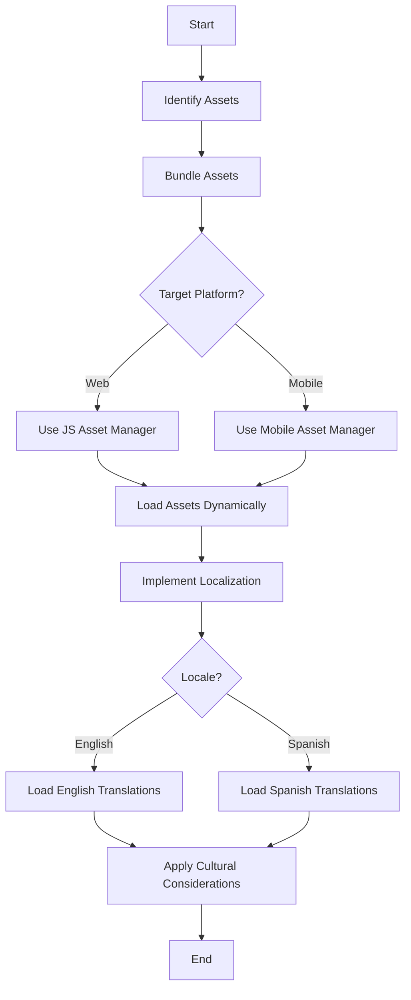

## 10.6 Asset Management and Localization

In the realm of cross-platform development, managing assets and localizing applications are crucial tasks that ensure your software is both efficient and accessible to a global audience. In this section, we will delve into the strategies and best practices for asset management and localization in Haxe, a language renowned for its cross-platform capabilities. 

### Understanding Asset Management

**Asset Management** involves the handling of resources such as images, sounds, and other media files that your application needs to function. Effective asset management ensures that these resources are efficiently loaded, stored, and utilized across different platforms.

#### Resource Bundling

Resource bundling is the process of packaging assets in a way that is optimal for each target platform. This involves organizing assets into bundles that can be easily accessed and loaded by your application.

- **Implementing Resource Bundling in Haxe:**
  - Use Haxe's build tools to create platform-specific asset bundles.
  - Leverage conditional compilation to include or exclude assets based on the target platform.
  - Utilize Haxe libraries such as `hxcpp` for C++ targets or `hxjs` for JavaScript targets to manage asset loading.

```haxe
// Example of conditional compilation for asset bundling
#if cpp
import cpp.AssetManager;
#elseif js
import js.AssetManager;
#end

class AssetLoader {
    public static function loadAssets():Void {
        #if cpp
        AssetManager.load("assets_cpp.bundle");
        #elseif js
        AssetManager.load("assets_js.bundle");
        #end
    }
}
```

#### Dynamic Loading

Dynamic loading refers to the practice of loading assets only when they are needed, rather than at the start of the application. This approach reduces memory usage and can improve application performance.

- **Implementing Dynamic Loading in Haxe:**
  - Use lazy loading techniques to defer the loading of assets until they are required.
  - Implement caching mechanisms to store frequently accessed assets in memory.

```haxe
class DynamicAssetLoader {
    private static var cache:Map<String, Dynamic> = new Map();

    public static function getAsset(assetName:String):Dynamic {
        if (cache.exists(assetName)) {
            return cache.get(assetName);
        } else {
            var asset = loadAssetFromDisk(assetName);
            cache.set(assetName, asset);
            return asset;
        }
    }

    private static function loadAssetFromDisk(assetName:String):Dynamic {
        // Simulate loading asset from disk
        trace("Loading asset: " + assetName);
        return new Dynamic();
    }
}
```

### Localization in Haxe

**Localization** is the process of adapting your application to different languages and cultural contexts. This involves translating text, adjusting layouts, and considering cultural nuances to ensure your application is accessible to a global audience.

#### Localization Frameworks

Localization frameworks provide the tools and structures needed to manage translations and cultural adaptations within your application.

- **Using Localization Frameworks in Haxe:**
  - Utilize existing Haxe libraries such as `haxe.I18n` for managing translations.
  - Implement a custom localization system if specific needs arise that are not covered by existing libraries.

```haxe
import haxe.I18n;

class LocalizationManager {
    private static var translations:Map<String, String> = new Map();

    public static function loadTranslations(locale:String):Void {
        // Load translations for the specified locale
        translations.set("greeting", "Hello");
        if (locale == "es") {
            translations.set("greeting", "Hola");
        }
    }

    public static function translate(key:String):String {
        return translations.get(key);
    }
}
```

#### Cultural Considerations

When localizing your application, it is important to consider cultural differences that may affect how your application is perceived and used.

- **Implementing Cultural Considerations:**
  - Adapt content to suit different locales, such as changing date formats, currency symbols, and reading directions.
  - Be mindful of cultural sensitivities and avoid content that may be offensive or inappropriate in certain regions.

### Best Practices for Asset Management and Localization

To ensure your application is both efficient and accessible, follow these best practices:

- **Optimize Asset Bundles:** Create separate bundles for different platforms to reduce load times and memory usage.
- **Implement Lazy Loading:** Load assets on demand to improve performance and reduce initial load times.
- **Use Localization Libraries:** Leverage existing libraries to manage translations and cultural adaptations efficiently.
- **Test Across Locales:** Regularly test your application in different languages and cultural contexts to ensure functionality and usability.
- **Consider Accessibility:** Ensure that your application is accessible to users with disabilities by providing alternative text for images and supporting screen readers.

### Visualizing Asset Management and Localization

To better understand the process of asset management and localization, let's visualize the workflow using a Mermaid.js diagram.



### Try It Yourself

To deepen your understanding, try modifying the code examples provided:

- Experiment with different asset loading strategies, such as preloading vs. lazy loading.
- Implement a simple localization system that supports multiple languages and test it with different locales.
- Create a custom asset manager that handles both images and sounds, and test its performance across different platforms.

### References and Further Reading

- [Haxe Documentation](https://haxe.org/documentation/)
- [MDN Web Docs on Internationalization](https://developer.mozilla.org/en-US/docs/Web/JavaScript/Guide/Internationalization)
- [W3C Internationalization](https://www.w3.org/International/)

### Knowledge Check

Let's reinforce what we've learned with some questions and exercises:

- What are the benefits of dynamic asset loading?
- How can you implement a simple localization system in Haxe?
- Why is it important to consider cultural differences when localizing an application?

### Embrace the Journey

Remember, mastering asset management and localization is a journey. As you continue to develop cross-platform applications, you'll discover new challenges and opportunities to optimize your approach. Keep experimenting, stay curious, and enjoy the process!

## Quiz Time!



### What is the primary benefit of resource bundling in Haxe?

- [x] Optimizes asset loading for each platform
- [ ] Increases application size
- [ ] Reduces code complexity
- [ ] Enhances security

> **Explanation:** Resource bundling optimizes asset loading by packaging assets in a way that is optimal for each target platform, reducing load times and memory usage.

### Which technique is used to load assets only when they are needed?

- [x] Dynamic Loading
- [ ] Static Loading
- [ ] Preloading
- [ ] Batch Loading

> **Explanation:** Dynamic loading refers to the practice of loading assets only when they are needed, rather than at the start of the application, to reduce memory usage and improve performance.

### What is the purpose of localization in software development?

- [x] Adapting applications to different languages and cultural contexts
- [ ] Increasing application speed
- [ ] Reducing application size
- [ ] Enhancing security

> **Explanation:** Localization involves adapting applications to different languages and cultural contexts to ensure they are accessible to a global audience.

### Which Haxe library can be used for managing translations?

- [x] haxe.I18n
- [ ] haxe.AssetManager
- [ ] haxe.Dynamic
- [ ] haxe.Locale

> **Explanation:** The `haxe.I18n` library is used for managing translations and localization in Haxe applications.

### What should be considered when localizing an application?

- [x] Cultural differences and sensitivities
- [ ] Application speed
- [ ] Code complexity
- [ ] Security vulnerabilities

> **Explanation:** When localizing an application, it's important to consider cultural differences and sensitivities to ensure the application is appropriate and accessible to users in different regions.

### How can lazy loading improve application performance?

- [x] By loading assets on demand
- [ ] By preloading all assets
- [ ] By reducing application size
- [ ] By enhancing security

> **Explanation:** Lazy loading improves application performance by loading assets on demand, reducing initial load times and memory usage.

### What is a key consideration when managing assets for cross-platform applications?

- [x] Creating platform-specific asset bundles
- [ ] Increasing application size
- [ ] Reducing code complexity
- [ ] Enhancing security

> **Explanation:** Creating platform-specific asset bundles is a key consideration to ensure efficient asset management and loading across different platforms.

### Which of the following is NOT a benefit of using localization frameworks?

- [ ] Efficient management of translations
- [ ] Simplified cultural adaptations
- [x] Increased application size
- [ ] Improved accessibility

> **Explanation:** Localization frameworks help manage translations and cultural adaptations efficiently, but they do not inherently increase application size.

### What is the role of caching in dynamic asset loading?

- [x] Storing frequently accessed assets in memory
- [ ] Increasing application size
- [ ] Reducing code complexity
- [ ] Enhancing security

> **Explanation:** Caching in dynamic asset loading involves storing frequently accessed assets in memory to improve performance and reduce load times.

### True or False: Asset management and localization are only important for web applications.

- [ ] True
- [x] False

> **Explanation:** Asset management and localization are important for all types of applications, including web, mobile, and desktop, to ensure efficiency and accessibility across platforms.


