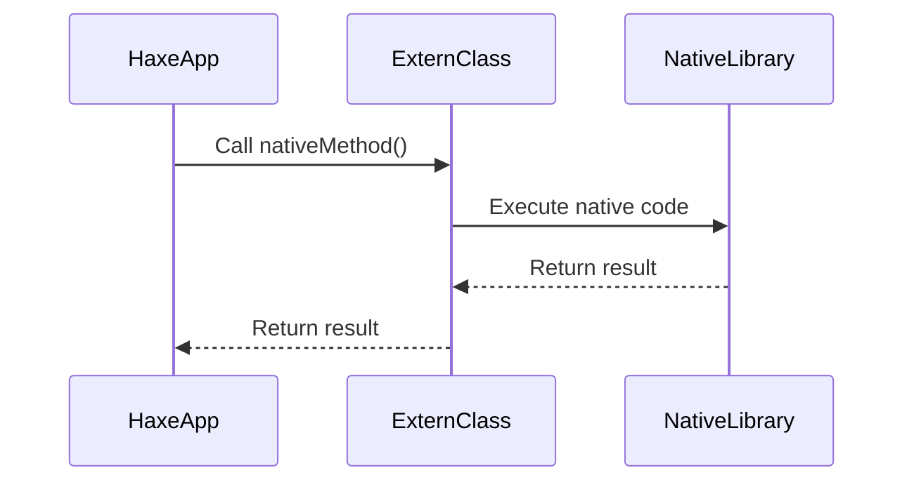

## 10.7 Interfacing with Native Libraries

In the realm of cross-platform development, interfacing with native libraries is a crucial skill for software engineers and architects. Haxe, with its powerful multi-platform capabilities, allows developers to integrate platform-specific native code seamlessly. This section will guide you through the process of interfacing with native libraries in Haxe, covering key concepts such as extern classes, native extensions, and practical use cases.

### Understanding Native Libraries

Native libraries are platform-specific code libraries written in languages like C, C++, or Java. They provide access to low-level system functionality and optimized performance for critical operations. Interfacing with these libraries enables Haxe applications to leverage native capabilities, enhancing performance and extending functionality.

### Implementing Native Interfaces in Haxe

Haxe provides several mechanisms to interface with native libraries, primarily through extern classes and native extensions. Let's explore these concepts in detail.

#### Extern Classes

Extern classes in Haxe are used to declare external classes and methods that exist outside the Haxe environment. They act as a bridge between Haxe code and native libraries, allowing you to call native functions directly from Haxe.

**Key Features of Extern Classes:**

- **Declaration:** Define the structure of native classes and methods without implementing them in Haxe.
- **Type Safety:** Ensure type safety by specifying method signatures and return types.
- **Platform-Specific:** Tailor extern classes to target specific platforms, such as JavaScript, C++, or Java.

**Example: Declaring an Extern Class**

```haxe
// Declare an extern class for a native library
extern class NativeLibrary {
    // Declare a static method from the native library
    public static function nativeMethod(param: String): Int;
}
```

In this example, `NativeLibrary` is an extern class that declares a static method `nativeMethod`, which takes a `String` parameter and returns an `Int`. This method can be implemented in a native library, allowing Haxe code to call it directly.

#### Native Extensions

Native extensions are another powerful way to interface with native libraries in Haxe. They involve writing or using extensions that bridge Haxe and native code, providing a seamless integration.

**Key Features of Native Extensions:**

- **Custom Implementation:** Write custom native code to extend Haxe functionality.
- **Cross-Platform Support:** Create extensions that work across multiple platforms.
- **Performance Optimization:** Implement performance-critical sections in optimized native code.

**Example: Creating a Native Extension**

To create a native extension, you typically need to:

1. **Write Native Code:** Implement the desired functionality in a native language (e.g., C++).

2. **Define Haxe Interface:** Use extern classes to define the interface for the native code.

3. **Compile and Link:** Compile the native code and link it with the Haxe application.

**Example: Native Extension Workflow**

```haxe
// Define an extern class for the native extension
extern class NativeExtension {
    public static function performTask(data: Array<Int>): Void;
}
```

In this example, `NativeExtension` is an extern class that declares a method `performTask`, which can be implemented in a native language to perform a specific task.

### Use Cases and Examples

Interfacing with native libraries opens up a wide range of possibilities for Haxe applications. Let's explore some common use cases and examples.

#### Accessing System APIs

Native libraries provide access to low-level system APIs, enabling Haxe applications to interact with the underlying operating system. This is particularly useful for tasks such as file I/O, network communication, and hardware access.

**Example: Accessing File System API**

```haxe
// Extern class for file system operations
extern class FileSystem {
    public static function readFile(path: String): String;
    public static function writeFile(path: String, content: String): Void;
}
```

In this example, `FileSystem` is an extern class that declares methods for reading and writing files. These methods can be implemented in a native library to access the file system directly.

#### Performance Optimization

For performance-critical sections of an application, native libraries offer optimized implementations that can significantly improve execution speed. This is especially important for computationally intensive tasks such as image processing, data encryption, and mathematical computations.

**Example: Optimizing Image Processing**

```haxe
// Extern class for image processing
extern class ImageProcessor {
    public static function applyFilter(imageData: Array<Int>): Array<Int>;
}
```

In this example, `ImageProcessor` is an extern class that declares a method `applyFilter`, which can be implemented in a native library to apply image filters efficiently.

### Visualizing the Integration Process

To better understand how Haxe interfaces with native libraries, let's visualize the integration process using a sequence diagram.



**Diagram Description:** This sequence diagram illustrates the interaction between a Haxe application, an extern class, and a native library. The Haxe application calls a method on the extern class, which in turn executes the native code in the library and returns the result.

### Best Practices for Interfacing with Native Libraries

When interfacing with native libraries, it's important to follow best practices to ensure a smooth integration and maintainable codebase.

1. **Define Clear Interfaces:** Use extern classes to define clear and concise interfaces for native libraries, specifying method signatures and return types.

2. **Handle Errors Gracefully:** Implement error handling mechanisms to manage exceptions and errors that may occur during native code execution.

3. **Optimize for Performance:** Identify performance-critical sections and implement them in optimized native code to enhance application performance.

4. **Test Across Platforms:** Thoroughly test the integration across all target platforms to ensure consistent behavior and performance.

5. **Document Extensively:** Provide detailed documentation for the native interfaces, including usage examples and platform-specific considerations.

### Try It Yourself

To gain hands-on experience with interfacing native libraries in Haxe, try modifying the code examples provided in this section. Experiment with different native methods and observe how they interact with Haxe applications. Remember, practice is key to mastering this skill!

### References and Further Reading

- [Haxe Extern Classes Documentation](https://haxe.org/manual/lf-externs.html)
- [Native Extensions in Haxe](https://haxe.org/manual/target-native-extensions.html)
- [MDN Web Docs: Using Native Libraries](https://developer.mozilla.org/en-US/docs/Web/JavaScript/Guide/Interoperability_with_Native_Libraries)

### Knowledge Check

Before we conclude, let's reinforce what we've learned with a few questions and exercises.

1. **What are extern classes in Haxe, and how do they facilitate interfacing with native libraries?**

2. **Describe the process of creating a native extension in Haxe. What are the key steps involved?**

3. **Provide an example of a use case where interfacing with a native library would be beneficial.**

4. **What are some best practices to follow when integrating native libraries with Haxe applications?**

### Embrace the Journey

Interfacing with native libraries is a powerful technique that enhances the capabilities of Haxe applications. As you continue to explore this topic, remember that each integration is an opportunity to learn and grow as a developer. Stay curious, keep experimenting, and enjoy the journey!

## Quiz Time!



### What is the primary purpose of extern classes in Haxe?

- [x] To declare external classes and methods that exist outside the Haxe environment.
- [ ] To implement native code directly in Haxe.
- [ ] To compile Haxe code into native binaries.
- [ ] To manage cross-platform dependencies.

> **Explanation:** Extern classes in Haxe are used to declare external classes and methods, allowing Haxe code to interface with native libraries.

### Which of the following is a key feature of native extensions in Haxe?

- [x] Custom implementation of native code.
- [ ] Automatic code generation.
- [ ] Built-in error handling.
- [ ] Platform-independent execution.

> **Explanation:** Native extensions allow developers to write custom native code to extend Haxe functionality, providing a bridge between Haxe and native libraries.

### What is a common use case for interfacing with native libraries in Haxe?

- [x] Accessing low-level system APIs.
- [ ] Writing cross-platform UI components.
- [ ] Implementing Haxe macros.
- [ ] Managing Haxe dependencies.

> **Explanation:** Interfacing with native libraries is commonly used to access low-level system APIs, enabling Haxe applications to interact with the underlying operating system.

### How can performance be optimized when interfacing with native libraries?

- [x] Implement performance-critical sections in optimized native code.
- [ ] Use Haxe macros for all native interactions.
- [ ] Avoid using extern classes.
- [ ] Compile Haxe code with debug symbols.

> **Explanation:** Performance-critical sections can be implemented in optimized native code to enhance execution speed and efficiency.

### What is a best practice when defining interfaces for native libraries in Haxe?

- [x] Use extern classes to define clear and concise interfaces.
- [ ] Implement all methods directly in Haxe.
- [ ] Avoid specifying method signatures.
- [ ] Use dynamic typing for all parameters.

> **Explanation:** Extern classes should be used to define clear and concise interfaces, specifying method signatures and return types for native libraries.

### What should be done to ensure consistent behavior across platforms when interfacing with native libraries?

- [x] Thoroughly test the integration across all target platforms.
- [ ] Use platform-specific code for each target.
- [ ] Avoid using native libraries altogether.
- [ ] Compile Haxe code with platform-specific flags.

> **Explanation:** Thorough testing across all target platforms ensures consistent behavior and performance when interfacing with native libraries.

### Why is it important to document native interfaces extensively?

- [x] To provide usage examples and platform-specific considerations.
- [ ] To increase code complexity.
- [ ] To reduce the need for testing.
- [ ] To avoid using extern classes.

> **Explanation:** Extensive documentation provides usage examples and platform-specific considerations, aiding developers in understanding and using native interfaces effectively.

### What is the role of error handling when interfacing with native libraries?

- [x] To manage exceptions and errors during native code execution.
- [ ] To automatically fix all errors.
- [ ] To prevent the use of native libraries.
- [ ] To compile Haxe code without errors.

> **Explanation:** Error handling is crucial for managing exceptions and errors that may occur during native code execution, ensuring robust and reliable applications.

### What is a key benefit of using native libraries for performance-critical tasks?

- [x] Optimized implementations can significantly improve execution speed.
- [ ] Native libraries are easier to write than Haxe code.
- [ ] Native libraries automatically handle all errors.
- [ ] Native libraries are platform-independent.

> **Explanation:** Native libraries offer optimized implementations that can significantly improve execution speed for performance-critical tasks.

### True or False: Extern classes in Haxe can be used to implement native code directly.

- [ ] True
- [x] False

> **Explanation:** Extern classes in Haxe are used to declare external classes and methods, not to implement native code directly.


