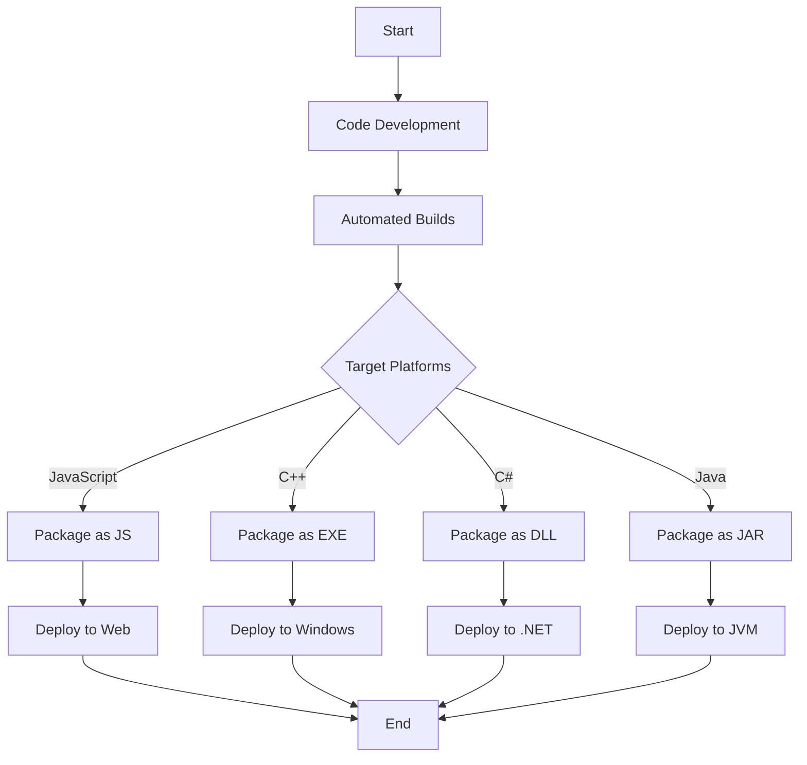

## 10.8 Deployment Strategies for Multiple Platforms

In the world of software development, deploying applications across multiple platforms is a critical task that requires careful planning and execution. Haxe, with its ability to compile to various target languages, offers a unique advantage for cross-platform development. However, deploying Haxe applications efficiently across different platforms requires a strategic approach. In this section, we will explore deployment strategies that leverage Haxe's capabilities, focusing on automated builds, packaging, and best practices to ensure consistency and clarity.

### Understanding Cross-Platform Deployment

Cross-platform deployment involves distributing software applications to run on multiple operating systems or environments. This process is crucial for reaching a broader audience and ensuring that your application performs consistently across different platforms. With Haxe, you can target platforms like JavaScript, C++, C#, Java, Python, and more, making it a versatile tool for cross-platform development.

### Approaches to Deployment

#### Automated Builds

Automated builds are a cornerstone of modern software deployment. They involve using continuous integration (CI) tools to automate the process of compiling and packaging your application for different platforms. This approach not only saves time but also reduces the risk of human error.

- **Continuous Integration Tools:** Utilize CI tools like Jenkins, Travis CI, or GitHub Actions to automate your build process. These tools can be configured to trigger builds automatically whenever changes are pushed to your repository.
  
- **Build Scripts:** Write build scripts using tools like Make, Gradle, or custom scripts in Haxe to define the steps required to compile and package your application for each target platform.

- **Environment Configuration:** Ensure that your CI environment is configured with the necessary dependencies and tools for each platform. This might include specific compilers, libraries, or SDKs.

```haxe
// Example Haxe build script using HXML
-cp src
-main Main
-js bin/app.js
-cpp bin/cpp
-cs bin/csharp
-java bin/java
```

#### Packaging

Packaging involves creating installers or packages that are suitable for each target platform. This step is crucial for delivering your application to end-users in a format that is easy to install and use.

- **Platform-Specific Packages:** Create platform-specific packages using tools like NSIS for Windows, DMG for macOS, and DEB or RPM for Linux. For mobile platforms, use APK for Android and IPA for iOS.

- **Universal Packages:** Consider using universal packaging formats like Docker containers or Snap packages that can run on multiple platforms with minimal configuration.

- **Versioning:** Implement a versioning strategy to track changes and updates across different platforms. Semantic versioning (e.g., 1.0.0) is a popular choice.

```bash
OutFile "MyAppInstaller.exe"
InstallDir "$PROGRAMFILES\MyApp"
Section
  SetOutPath "$INSTDIR"
  File "bin\app.exe"
SectionEnd
```

### Best Practices for Cross-Platform Deployment

#### Consistency

Ensuring consistency across platforms is vital for maintaining a unified user experience. This involves keeping features, performance, and appearance consistent, regardless of the platform.

- **Feature Parity:** Ensure that all features are available and function similarly across platforms. This might involve using platform-specific APIs or libraries to achieve the same functionality.

- **Performance Optimization:** Optimize your application for each platform to ensure smooth performance. This might involve profiling and tweaking code for specific platforms.

- **User Interface Consistency:** Maintain a consistent look and feel across platforms while respecting platform-specific design guidelines.

#### Documentation

Clear documentation is essential for guiding users through the installation and usage of your application on different platforms.

- **Installation Guides:** Provide step-by-step installation guides for each platform, including screenshots and troubleshooting tips.

- **Usage Instructions:** Offer detailed usage instructions, highlighting any platform-specific features or limitations.

- **Update Notes:** Communicate updates and changes clearly, including any platform-specific considerations.

### Visualizing the Deployment Process

To better understand the deployment process, let's visualize it using a flowchart. This diagram illustrates the steps involved in deploying a Haxe application across multiple platforms.



### Try It Yourself

To gain hands-on experience, try modifying the provided build and packaging scripts to target additional platforms or customize the installation process. Experiment with different CI tools and packaging formats to find the best fit for your project.

### References and Links

- [Haxe Manual](https://haxe.org/manual/)
- [Jenkins CI](https://www.jenkins.io/)
- [Travis CI](https://travis-ci.org/)
- [GitHub Actions](https://github.com/features/actions)
- [NSIS](https://nsis.sourceforge.io/Main_Page)

### Knowledge Check

- What are the benefits of using automated builds for cross-platform deployment?
- How can you ensure consistency across different platforms?
- What are some common tools used for packaging applications for different platforms?

### Embrace the Journey

Remember, mastering cross-platform deployment is a journey. As you progress, you'll discover new tools and techniques that can streamline your process. Stay curious, keep experimenting, and enjoy the journey!

## Quiz Time!



### What is the primary benefit of using automated builds in deployment?

- [x] Reduces human error and saves time
- [ ] Increases manual intervention
- [ ] Complicates the deployment process
- [ ] Limits platform compatibility

> **Explanation:** Automated builds streamline the deployment process by reducing human error and saving time through automation.

### Which tool can be used for creating Windows installers?

- [x] NSIS
- [ ] Docker
- [ ] Snap
- [ ] Gradle

> **Explanation:** NSIS is a tool specifically used for creating Windows installers.

### What is a key aspect of ensuring consistency across platforms?

- [x] Feature parity
- [ ] Ignoring platform-specific guidelines
- [ ] Using different codebases for each platform
- [ ] Avoiding performance optimization

> **Explanation:** Ensuring feature parity is crucial for maintaining consistency across platforms.

### What is a universal packaging format mentioned in the text?

- [x] Docker containers
- [ ] APK
- [ ] IPA
- [ ] DEB

> **Explanation:** Docker containers are a universal packaging format that can run on multiple platforms.

### Which CI tool is mentioned for automating builds?

- [x] Jenkins
- [ ] NSIS
- [ ] Snap
- [ ] Gradle

> **Explanation:** Jenkins is a CI tool mentioned for automating the build process.

### What should be included in installation guides?

- [x] Step-by-step instructions and troubleshooting tips
- [ ] Only a download link
- [ ] A brief overview
- [ ] Platform-specific code

> **Explanation:** Installation guides should include detailed step-by-step instructions and troubleshooting tips.

### What is a common versioning strategy for tracking changes?

- [x] Semantic versioning
- [ ] Random versioning
- [ ] Alphabetic versioning
- [ ] Chronological versioning

> **Explanation:** Semantic versioning is a common strategy for tracking changes across platforms.

### What is a benefit of using CI tools?

- [x] Automates the build process
- [ ] Increases manual workload
- [ ] Decreases build reliability
- [ ] Limits platform support

> **Explanation:** CI tools automate the build process, reducing manual workload and increasing reliability.

### What is a key consideration for user interface consistency?

- [x] Respecting platform-specific design guidelines
- [ ] Ignoring user feedback
- [ ] Using the same design for all platforms
- [ ] Avoiding UI testing

> **Explanation:** Respecting platform-specific design guidelines is crucial for maintaining UI consistency.

### True or False: Docker containers can be used as a universal packaging format.

- [x] True
- [ ] False

> **Explanation:** Docker containers are indeed a universal packaging format that can be used across multiple platforms.


