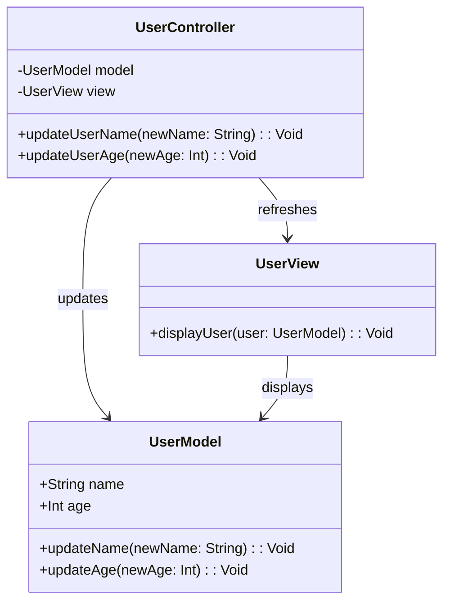

## 11.1 Model-View-Controller (MVC)

The Model-View-Controller (MVC) pattern is a cornerstone of software architecture, especially in the realm of cross-platform development. It provides a structured approach to building applications by separating concerns into three interconnected components: the Model, the View, and the Controller. This separation facilitates organized, scalable, and maintainable code, making it an ideal choice for complex applications.

### Understanding MVC

**Definition:** MVC is an architectural pattern that divides an application into three main components:

- **Model:** Represents the data and business logic. It is responsible for managing the data of the application, responding to requests for information, and updating itself when data changes.
- **View:** Represents the user interface. It displays data to the user and sends user commands to the Controller.
- **Controller:** Acts as an intermediary between Model and View. It processes user input, interacts with the Model, and updates the View accordingly.

### Implementing MVC in Haxe

Haxe's multi-paradigm capabilities and cross-platform nature make it an excellent choice for implementing the MVC pattern. Let's explore how each component can be implemented in Haxe.

#### Model

The Model in Haxe can be implemented using classes, enums, and Haxe's robust type system. It encapsulates the application's data and business logic.

```haxe
// Define a simple Model class
class UserModel {
    public var name:String;
    public var age:Int;

    public function new(name:String, age:Int) {
        this.name = name;
        this.age = age;
    }

    public function updateName(newName:String):Void {
        this.name = newName;
    }

    public function updateAge(newAge:Int):Void {
        this.age = newAge;
    }
}
```

In this example, `UserModel` is a simple representation of a user with methods to update the user's name and age. The Model is responsible for maintaining the state and logic related to user data.

#### View

The View is responsible for rendering the user interface. In Haxe, you can target different platforms, such as HTML5 for web applications or OpenFL for cross-platform UIs.

```haxe
// Define a simple View class
class UserView {
    public function displayUser(user:UserModel):Void {
        trace('User Name: ' + user.name);
        trace('User Age: ' + user.age);
    }
}
```

The `UserView` class takes a `UserModel` instance and displays its data. This separation ensures that the UI logic is distinct from the business logic.

#### Controller

The Controller handles user input and updates the Model and View accordingly. It acts as a bridge between the Model and View.

```haxe
// Define a simple Controller class
class UserController {
    private var model:UserModel;
    private var view:UserView;

    public function new(model:UserModel, view:UserView) {
        this.model = model;
        this.view = view;
    }

    public function updateUserName(newName:String):Void {
        model.updateName(newName);
        view.displayUser(model);
    }

    public function updateUserAge(newAge:Int):Void {
        model.updateAge(newAge);
        view.displayUser(model);
    }
}
```

The `UserController` class updates the `UserModel` and refreshes the `UserView` whenever user input is received.

### Communication in MVC

In Haxe, you can leverage the strong type system to define interfaces and contracts between the Model, View, and Controller. This ensures that each component adheres to a specific contract, promoting loose coupling and high cohesion.

### Use Cases and Examples

#### Web Applications

For web applications, Haxe can target JavaScript, allowing you to build Single Page Applications (SPAs) using frameworks like haxe-react. The MVC pattern helps manage the complexity of SPAs by organizing code into distinct components.

#### Desktop Applications

Haxe's ability to compile to multiple targets makes it suitable for creating cross-platform desktop applications. By implementing MVC, you can ensure consistent logic across different platforms, simplifying maintenance and updates.

### Visualizing MVC in Haxe

To better understand the interaction between the components in the MVC pattern, let's visualize it using a Mermaid.js diagram.



**Diagram Description:** This class diagram illustrates the relationships between the `UserModel`, `UserView`, and `UserController` classes in the MVC pattern. The `UserController` updates the `UserModel` and refreshes the `UserView`, while the `UserView` displays data from the `UserModel`.

### Design Considerations

When implementing MVC in Haxe, consider the following:

- **Separation of Concerns:** Ensure that each component has a distinct responsibility. The Model should not handle UI logic, and the View should not contain business logic.
- **Loose Coupling:** Use interfaces and contracts to define interactions between components, allowing for flexibility and easier maintenance.
- **Scalability:** MVC facilitates scalability by allowing you to add new features or modify existing ones without affecting other components.

### Differences and Similarities

MVC is often confused with other architectural patterns like MVVM (Model-View-ViewModel) or MVP (Model-View-Presenter). The key difference is in how the components interact:

- **MVVM:** The ViewModel acts as an intermediary between the Model and View, often using data binding.
- **MVP:** The Presenter handles user input and updates the View, similar to MVC, but the View is more passive.

### Try It Yourself

To deepen your understanding of MVC in Haxe, try modifying the code examples:

- **Add a new method** in `UserModel` to update both name and age simultaneously.
- **Implement a new View** that displays user data in a different format, such as JSON.
- **Create a new Controller method** that resets the user data to default values.

### References and Links

For further reading on MVC and its implementation in Haxe, consider the following resources:

- [MDN Web Docs on MVC](https://developer.mozilla.org/en-US/docs/Glossary/MVC)
- [Haxe Manual](https://haxe.org/manual/)
- [OpenFL Documentation](https://www.openfl.org/learn/docs/)

### Knowledge Check

Before moving on, let's summarize the key takeaways:

- MVC separates an application into three components: Model, View, and Controller.
- Haxe's type system and cross-platform capabilities make it suitable for implementing MVC.
- Use interfaces and contracts to define interactions between components.

## Quiz Time!



### What is the primary role of the Model in MVC?

- [x] To manage the data and business logic of the application
- [ ] To handle user input and update the View
- [ ] To display data to the user
- [ ] To act as an intermediary between the Model and View

> **Explanation:** The Model is responsible for managing the data and business logic of the application.

### In MVC, what is the primary responsibility of the View?

- [ ] To manage the data and business logic
- [ ] To handle user input
- [x] To display data to the user
- [ ] To act as an intermediary between the Model and Controller

> **Explanation:** The View is responsible for displaying data to the user.

### How does the Controller interact with the Model in MVC?

- [x] It updates the Model based on user input
- [ ] It displays data from the Model
- [ ] It manages the data and business logic
- [ ] It acts as an intermediary between the Model and View

> **Explanation:** The Controller updates the Model based on user input.

### Which Haxe feature is particularly useful for defining interfaces between MVC components?

- [ ] Dynamic typing
- [x] Strong type system
- [ ] Null safety
- [ ] Anonymous structures

> **Explanation:** Haxe's strong type system is useful for defining interfaces and contracts between MVC components.

### What is a key benefit of using MVC in cross-platform applications?

- [x] Organized and scalable code structure
- [ ] Faster compilation times
- [ ] Reduced memory usage
- [ ] Simplified user interface design

> **Explanation:** MVC provides an organized and scalable code structure, which is beneficial for cross-platform applications.

### In Haxe, which target can be used for implementing the View in web applications?

- [x] HTML5
- [ ] C++
- [ ] Java
- [ ] Python

> **Explanation:** HTML5 is a suitable target for implementing the View in web applications using Haxe.

### What is a common confusion between MVC and MVVM?

- [x] The role of the intermediary component
- [ ] The way data is displayed
- [ ] The use of interfaces
- [ ] The separation of concerns

> **Explanation:** A common confusion is the role of the intermediary component, which is the ViewModel in MVVM and the Controller in MVC.

### Which component in MVC is responsible for handling user input?

- [ ] Model
- [ ] View
- [x] Controller
- [ ] ViewModel

> **Explanation:** The Controller is responsible for handling user input in MVC.

### What is a key difference between MVC and MVP?

- [x] The View is more passive in MVP
- [ ] The Model is more active in MVP
- [ ] The Controller is more active in MVP
- [ ] The View is more active in MVC

> **Explanation:** In MVP, the View is more passive, and the Presenter handles more of the logic.

### True or False: In MVC, the View should contain business logic.

- [ ] True
- [x] False

> **Explanation:** The View should not contain business logic; it should only be responsible for displaying data.



Remember, mastering MVC in Haxe is a journey. As you continue to explore and experiment, you'll gain a deeper understanding of how to build robust, cross-platform applications. Keep pushing your boundaries, and enjoy the process!
