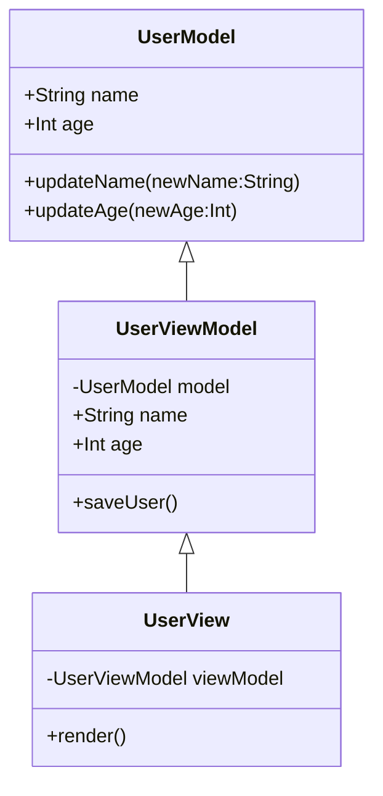

## 11.2 Model-View-ViewModel (MVVM)

The Model-View-ViewModel (MVVM) pattern is a powerful architectural pattern that facilitates the separation of concerns in software development, particularly in applications with graphical user interfaces (GUIs). This pattern is especially beneficial in Haxe, given its cross-platform capabilities and robust macro system. In this section, we will delve into the MVVM pattern, its implementation in Haxe, and its applicability in various scenarios.

### Understanding MVVM

**Definition:** MVVM is an architectural pattern that separates the development of the user interface from business logic by introducing a ViewModel, which acts as an intermediary between the View and the Model.

- **Model:** Represents the application's data and business logic. It is responsible for managing the data and ensuring the integrity of the business rules.
- **View:** The user interface that displays data and sends user commands to the ViewModel. It binds UI elements to ViewModel properties.
- **ViewModel:** Acts as an intermediary between the View and the Model. It exposes data and commands to the View and handles user interactions, updating the Model as necessary.

### Implementing MVVM in Haxe

#### Model

In the MVVM pattern, the Model is responsible for the data and business logic. It is similar to the Model in the Model-View-Controller (MVC) pattern. In Haxe, you can define a Model using classes, interfaces, and enums to represent the data structure and business rules.

```haxe
class UserModel {
    public var name:String;
    public var age:Int;

    public function new(name:String, age:Int) {
        this.name = name;
        this.age = age;
    }

    public function updateName(newName:String):Void {
        this.name = newName;
    }

    public function updateAge(newAge:Int):Void {
        this.age = newAge;
    }
}
```

#### ViewModel

The ViewModel in MVVM is responsible for exposing data and commands to the View. It implements properties and commands that the View binds to, handling the View's interactions and updating the Model.

```haxe
class UserViewModel {
    private var model:UserModel;

    public var name(get, set):String;
    public var age(get, set):Int;

    public function new(model:UserModel) {
        this.model = model;
        this.name = model.name;
        this.age = model.age;
    }

    private function get_name():String {
        return model.name;
    }

    private function set_name(value:String):String {
        model.updateName(value);
        return value;
    }

    private function get_age():Int {
        return model.age;
    }

    private function set_age(value:Int):Int {
        model.updateAge(value);
        return value;
    }

    public function saveUser():Void {
        // Logic to save user data
    }
}
```

#### View

The View in MVVM binds UI elements to ViewModel properties, using data binding techniques. In Haxe, you can leverage the macro system to implement two-way data binding, ensuring that changes in the ViewModel are reflected in the View and vice versa.

```haxe
class UserView {
    private var viewModel:UserViewModel;

    public function new(viewModel:UserViewModel) {
        this.viewModel = viewModel;
        bindUI();
    }

    private function bindUI():Void {
        // Pseudo-code for binding UI elements to ViewModel properties
        // Bind name input to viewModel.name
        // Bind age input to viewModel.age
    }

    public function render():Void {
        // Render the UI
    }
}
```

### Data Binding in Haxe

Data binding is a crucial aspect of the MVVM pattern, allowing automatic synchronization between the View and the ViewModel. Haxe's macro system can be leveraged to implement efficient two-way data binding.

```haxe
// Example of a simple data binding macro
macro function bind(property:String, element:Dynamic):Void {
    // Logic to bind the property to the UI element
}
```

### Use Cases and Examples

#### Cross-Platform Mobile Apps

One of the significant advantages of using MVVM in Haxe is the ability to share ViewModel code across different platforms while customizing Views per platform. This approach reduces code duplication and enhances maintainability.

#### Real-Time Data Applications

In applications where real-time data updates are crucial, such as stock trading platforms or live sports scores, MVVM allows the View to automatically reflect changes in the Model, providing a seamless user experience.

### Visualizing MVVM in Haxe

To better understand the interaction between the components in the MVVM pattern, let's visualize the architecture using a class diagram.



### Design Considerations

- **When to Use MVVM:** MVVM is ideal for applications with complex user interfaces and a need for clear separation between UI and business logic. It is particularly beneficial in cross-platform development, where the same ViewModel can be reused across different platforms.
- **Haxe-Specific Features:** Haxe's macro system can be used to implement efficient data binding, reducing boilerplate code and enhancing performance.
- **Pitfalls:** Overcomplicating the ViewModel with too much logic can lead to maintenance challenges. Keep the ViewModel focused on data presentation and user interaction.

### Differences and Similarities

- **MVVM vs. MVC:** While both patterns separate concerns, MVVM introduces the ViewModel, which allows for more sophisticated data binding and interaction logic compared to MVC's Controller.
- **MVVM vs. MVP (Model-View-Presenter):** MVVM and MVP both aim to separate UI from business logic, but MVVM uses data binding to connect the View and ViewModel, whereas MVP relies on a Presenter to handle interactions.

### Try It Yourself

To deepen your understanding of MVVM in Haxe, try modifying the code examples provided:

- **Experiment with Data Binding:** Implement a custom data binding macro in Haxe and bind additional properties.
- **Extend the Model:** Add more fields to the `UserModel` and update the ViewModel and View accordingly.
- **Create a New View:** Design a new View for a different platform, reusing the same ViewModel.

### References and Links

- [Haxe Language Reference](https://haxe.org/manual/)
- [MVVM Pattern on Wikipedia](https://en.wikipedia.org/wiki/Model%E2%80%93view%E2%80%93viewmodel)
- [Haxe Macros Documentation](https://haxe.org/manual/macro.html)

### Knowledge Check

- **What is the primary role of the ViewModel in MVVM?**
- **How does data binding enhance the MVVM pattern?**
- **What are the benefits of using MVVM in cross-platform development?**

### Embrace the Journey

Remember, mastering MVVM in Haxe is a journey. As you continue to explore and experiment, you'll discover new ways to leverage this pattern for efficient and maintainable cross-platform applications. Stay curious, keep learning, and enjoy the process!

## Quiz Time!



### What is the primary role of the ViewModel in MVVM?

- [x] To act as an intermediary between the View and the Model
- [ ] To handle all business logic
- [ ] To render the user interface
- [ ] To manage database connections

> **Explanation:** The ViewModel acts as an intermediary between the View and the Model, exposing data and commands to the View.

### How does data binding enhance the MVVM pattern?

- [x] By synchronizing the View and ViewModel automatically
- [ ] By simplifying database queries
- [ ] By reducing the need for a Model
- [ ] By eliminating the need for a View

> **Explanation:** Data binding allows automatic synchronization between the View and the ViewModel, enhancing the MVVM pattern.

### What is a key benefit of using MVVM in cross-platform development?

- [x] Reusing ViewModel code across different platforms
- [ ] Eliminating the need for a View
- [ ] Simplifying database management
- [ ] Reducing application size

> **Explanation:** MVVM allows for the reuse of ViewModel code across different platforms, reducing code duplication.

### Which Haxe feature is particularly useful for implementing data binding in MVVM?

- [x] Macros
- [ ] Enums
- [ ] Interfaces
- [ ] Abstract types

> **Explanation:** Haxe's macro system is particularly useful for implementing efficient data binding in MVVM.

### What is a potential pitfall of the MVVM pattern?

- [x] Overcomplicating the ViewModel with too much logic
- [ ] Making the View too simple
- [ ] Ignoring the Model
- [ ] Using too many Views

> **Explanation:** Overcomplicating the ViewModel with too much logic can lead to maintenance challenges.

### How does MVVM differ from MVC?

- [x] MVVM introduces a ViewModel for data binding
- [ ] MVVM eliminates the need for a Model
- [ ] MVVM uses a Presenter instead of a Controller
- [ ] MVVM combines the View and Model

> **Explanation:** MVVM introduces a ViewModel, which allows for more sophisticated data binding compared to MVC's Controller.

### In MVVM, what is the primary responsibility of the Model?

- [x] Managing the application's data and business logic
- [ ] Rendering the user interface
- [ ] Handling user interactions
- [ ] Synchronizing the View and ViewModel

> **Explanation:** The Model is responsible for managing the application's data and business logic.

### What is a common use case for MVVM in Haxe?

- [x] Cross-platform mobile apps
- [ ] Database management
- [ ] Network communication
- [ ] File handling

> **Explanation:** MVVM is commonly used in cross-platform mobile apps to share ViewModel code across platforms.

### Which component in MVVM is responsible for user interface rendering?

- [x] View
- [ ] Model
- [ ] ViewModel
- [ ] Controller

> **Explanation:** The View is responsible for rendering the user interface in MVVM.

### True or False: MVVM is only suitable for desktop applications.

- [ ] True
- [x] False

> **Explanation:** MVVM is suitable for various types of applications, including mobile and web applications, not just desktop.


