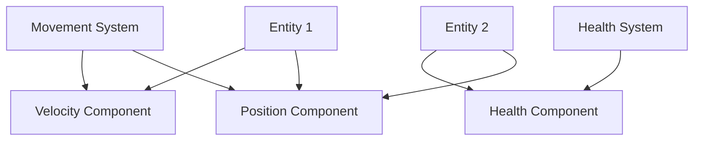

## 11.3 Entity-Component-System (ECS)

The Entity-Component-System (ECS) is a powerful architectural pattern that emphasizes composition over inheritance, making it particularly suitable for applications that require high flexibility and scalability, such as games and simulations. In this section, we will delve into the ECS pattern, its implementation in Haxe, and its practical applications.

### Understanding ECS

**Definition:** ECS is an architectural pattern that separates data (components) from behavior (systems) and uses entities as unique identifiers to associate components with systems. This separation allows for greater flexibility and reusability of code.

- **Entities:** These are unique identifiers, often implemented as simple integers or minimal classes, that represent objects in the system.
- **Components:** These are plain data objects or structures that hold the state or data of entities. Components are devoid of behavior.
- **Systems:** These are the logic processors that operate on entities possessing specific components. Systems encapsulate the behavior of the application.

#### Why Use ECS?

1. **Flexibility:** ECS allows for dynamic composition of behaviors by adding or removing components from entities.
2. **Performance:** By decoupling data from behavior, ECS can optimize cache usage and parallel processing.
3. **Scalability:** ECS can handle a large number of entities efficiently, making it ideal for complex simulations and games.

### Implementing ECS in Haxe

Haxe, with its cross-platform capabilities and strong typing, is well-suited for implementing ECS. Let's explore how to implement each part of the ECS pattern in Haxe.

#### Entities

Entities in ECS are typically represented by simple IDs. In Haxe, you can use integers or minimal classes to represent entities.

```haxe
class Entity {
    public var id:Int;
    
    public function new(id:Int) {
        this.id = id;
    }
}
```

#### Components

Components are plain data structures. In Haxe, you can use classes or typedefs to define components.

```haxe
typedef PositionComponent = {
    var x:Float;
    var y:Float;
}

typedef VelocityComponent = {
    var vx:Float;
    var vy:Float;
}
```

#### Systems

Systems contain the logic that operates on entities with specific components. In Haxe, you can define systems as classes that process entities.

```haxe
class MovementSystem {
    public function update(entities:Array<Entity>, positions:Map<Int, PositionComponent>, velocities:Map<Int, VelocityComponent>) {
        for (entity in entities) {
            var position = positions.get(entity.id);
            var velocity = velocities.get(entity.id);
            if (position != null && velocity != null) {
                position.x += velocity.vx;
                position.y += velocity.vy;
            }
        }
    }
}
```

### ECS Frameworks in Haxe

While you can implement ECS from scratch, using an existing ECS framework can save time and effort. Two popular ECS frameworks in Haxe are `ECX` and `Ash-Haxe`.

- **ECX:** A lightweight ECS framework for Haxe that provides a simple API for managing entities, components, and systems.
- **Ash-Haxe:** A port of the Ash framework, offering a more feature-rich ECS implementation with support for entity templates and system priorities.

#### Example with ECX

```haxe
import ecx.*;

class MyGame {
    var world:World;
    
    public function new() {
        world = new World();
        
        // Create entities and add components
        var entity = world.createEntity();
        world.addComponent(entity, new PositionComponent(0, 0));
        world.addComponent(entity, new VelocityComponent(1, 1));
        
        // Add systems
        world.addSystem(new MovementSystem());
    }
    
    public function update() {
        world.update();
    }
}
```

### Use Cases and Examples

#### Game Development

ECS is widely used in game development to manage game objects and behaviors efficiently. By decoupling data from behavior, ECS allows developers to create complex game mechanics with ease.

- **Example:** In a game, you might have entities representing players, enemies, and projectiles. Each entity can have components like position, velocity, and health. Systems can then process these components to update the game state.

#### Simulation Software

ECS is also suitable for simulation software that handles large numbers of objects with dynamic behaviors. The pattern's scalability and flexibility make it ideal for simulations that require frequent updates and changes.

- **Example:** In a traffic simulation, entities can represent vehicles, pedestrians, and traffic lights. Components can include position, speed, and state, while systems handle movement, collision detection, and traffic control.

### Visualizing ECS

To better understand the ECS pattern, let's visualize the relationships between entities, components, and systems.



**Diagram Description:** This diagram illustrates two entities, each with different components. The Movement System processes entities with Position and Velocity components, while the Health System processes entities with the Health component.

### Design Considerations

When implementing ECS in Haxe, consider the following:

- **Component Granularity:** Define components with a single responsibility to maximize reusability.
- **System Efficiency:** Optimize systems to process only the necessary entities and components.
- **Data-Oriented Design:** Structure components to leverage data-oriented design principles for better performance.

### Differences and Similarities

ECS is often compared to other architectural patterns like Object-Oriented Programming (OOP) and Model-View-Controller (MVC). While OOP focuses on inheritance and encapsulation, ECS emphasizes composition and separation of data from behavior. Unlike MVC, which separates concerns into models, views, and controllers, ECS separates concerns into entities, components, and systems.

### Try It Yourself

Experiment with the ECS pattern by modifying the code examples provided. Try adding new components and systems, or implement a simple game using the ECS framework of your choice. This hands-on approach will deepen your understanding of ECS and its benefits.

### References and Links

- [ECX GitHub Repository](https://github.com/eliasku/ecx)
- [Ash-Haxe GitHub Repository](https://github.com/nadako/ash-haxe)
- [ECS Pattern Overview on Wikipedia](https://en.wikipedia.org/wiki/Entity_component_system)

### Knowledge Check

- **Question:** What are the three main parts of the ECS pattern?
- **Exercise:** Implement a simple ECS system in Haxe that simulates a bouncing ball.

### Embrace the Journey

Remember, mastering ECS is a journey. As you explore this pattern, you'll discover new ways to design flexible and scalable applications. Keep experimenting, stay curious, and enjoy the process!

## Quiz Time!



### What is the primary benefit of using the ECS pattern?

- [x] Flexibility and scalability
- [ ] Simplified inheritance
- [ ] Reduced code complexity
- [ ] Enhanced security

> **Explanation:** ECS provides flexibility and scalability by allowing dynamic composition of behaviors and efficient handling of large numbers of entities.

### In ECS, what role do components play?

- [x] They store data for entities.
- [ ] They define the behavior of systems.
- [ ] They act as unique identifiers.
- [ ] They manage system updates.

> **Explanation:** Components are plain data structures that store the state or data of entities.

### Which Haxe ECS framework is known for its lightweight implementation?

- [x] ECX
- [ ] Ash-Haxe
- [ ] Unity ECS
- [ ] Unreal ECS

> **Explanation:** ECX is a lightweight ECS framework for Haxe, providing a simple API for managing entities, components, and systems.

### How are entities typically represented in ECS?

- [x] As unique identifiers or minimal classes
- [ ] As complex objects with behavior
- [ ] As systems with logic
- [ ] As data structures with multiple components

> **Explanation:** Entities are typically represented as unique identifiers, often implemented as simple integers or minimal classes.

### What is a key design consideration when implementing ECS?

- [x] Component granularity
- [ ] System inheritance
- [ ] Entity encapsulation
- [ ] Data hiding

> **Explanation:** Component granularity is important to maximize reusability and maintain a single responsibility for each component.

### What is the role of systems in ECS?

- [x] They contain the logic that operates on entities with specific components.
- [ ] They store data for entities.
- [ ] They act as unique identifiers.
- [ ] They manage component updates.

> **Explanation:** Systems contain the logic that processes entities with specific components, encapsulating the behavior of the application.

### Which of the following is a common use case for ECS?

- [x] Game development
- [ ] Database management
- [ ] Web page rendering
- [ ] Network communication

> **Explanation:** ECS is widely used in game development to manage game objects and behaviors efficiently.

### How does ECS differ from traditional OOP?

- [x] ECS emphasizes composition over inheritance.
- [ ] ECS focuses on encapsulation.
- [ ] ECS uses classes to define behavior.
- [ ] ECS relies on polymorphism.

> **Explanation:** ECS emphasizes composition over inheritance, separating data from behavior for greater flexibility.

### What is the purpose of using existing ECS frameworks in Haxe?

- [x] To save time and effort in implementing ECS
- [ ] To enforce strict inheritance rules
- [ ] To simplify component creation
- [ ] To manage system updates automatically

> **Explanation:** Using existing ECS frameworks can save time and effort by providing pre-built structures for managing entities, components, and systems.

### True or False: ECS is only suitable for game development.

- [ ] True
- [x] False

> **Explanation:** While ECS is popular in game development, it is also suitable for other applications like simulation software that require handling large numbers of objects with dynamic behaviors.


