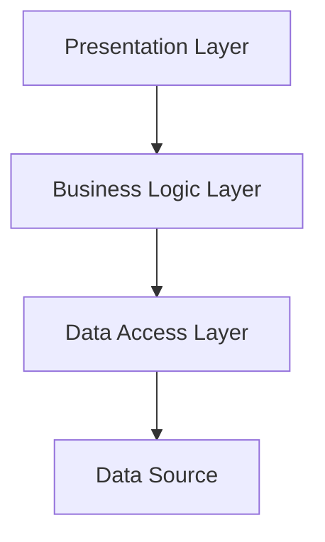

## 11.4 Layered Architecture

In the realm of software design, the **Layered Architecture** pattern stands as a cornerstone for building robust, maintainable, and scalable applications. This architectural style divides an application into distinct layers, each responsible for a specific aspect of the application's functionality. In this section, we will explore how to implement a Layered Architecture in Haxe, leveraging its cross-platform capabilities to create applications that are both modular and adaptable.

### Definition and Intent

**Layered Architecture** is a design pattern that organizes an application into layers, each with a specific responsibility. This separation of concerns enhances modularity, making it easier to maintain and extend the application. The typical layers include:

- **Presentation Layer:** Manages the user interface and user interaction.
- **Business Logic Layer:** Contains the core functionality and business rules.
- **Data Access Layer:** Handles data storage and retrieval.

By isolating these concerns, developers can focus on one aspect of the application at a time, improving both development speed and code quality.

### Implementing Layered Architecture in Haxe

Haxe's unique features, such as static typing and cross-platform compilation, make it an excellent choice for implementing a Layered Architecture. Let's delve into how each layer can be structured and implemented in Haxe.

#### Presentation Layer

The Presentation Layer is responsible for the user interface and user interaction. In a cross-platform context, this layer may vary significantly between platforms, such as web, mobile, or desktop. Haxe allows you to define platform-specific interfaces while sharing the underlying business logic.

```haxe
// Presentation Layer Example
interface IView {
    function displayData(data:String):Void;
}

class WebView implements IView {
    public function new() {}
    public function displayData(data:String):Void {
        trace("Displaying on Web: " + data);
    }
}

class MobileView implements IView {
    public function new() {}
    public function displayData(data:String):Void {
        trace("Displaying on Mobile: " + data);
    }
}
```

In this example, `IView` is an interface that defines a method `displayData`. `WebView` and `MobileView` are concrete implementations for different platforms.

#### Business Logic Layer

The Business Logic Layer contains the core functionality of the application. This layer is platform-agnostic and can be shared across different targets, making it a perfect candidate for Haxe's cross-platform capabilities.

```haxe
// Business Logic Layer Example
class BusinessLogic {
    public function new() {}

    public function processData(input:String):String {
        // Simulate some business logic
        return "Processed: " + input.toUpperCase();
    }
}
```

The `BusinessLogic` class encapsulates the core functionality, allowing it to be reused across different presentation layers.

#### Data Access Layer

The Data Access Layer abstracts the details of data storage and retrieval. This abstraction allows for different implementations, such as databases, files, or even remote services, without affecting the rest of the application.

```haxe
// Data Access Layer Example
interface IDataAccess {
    function fetchData():String;
}

class FileDataAccess implements IDataAccess {
    public function new() {}
    public function fetchData():String {
        // Simulate data fetching from a file
        return "Data from file";
    }
}

class DatabaseDataAccess implements IDataAccess {
    public function new() {}
    public function fetchData():String {
        // Simulate data fetching from a database
        return "Data from database";
    }
}
```

Here, `IDataAccess` is an interface for data access operations, with `FileDataAccess` and `DatabaseDataAccess` providing different implementations.

#### Interaction Between Layers

Interaction between layers should be managed through well-defined interfaces and dependency injection. This approach ensures loose coupling and enhances testability.

```haxe
// Layer Interaction Example
class Application {
    private var view:IView;
    private var logic:BusinessLogic;
    private var dataAccess:IDataAccess;

    public function new(view:IView, logic:BusinessLogic, dataAccess:IDataAccess) {
        this.view = view;
        this.logic = logic;
        this.dataAccess = dataAccess;
    }

    public function run():Void {
        var data = dataAccess.fetchData();
        var processedData = logic.processData(data);
        view.displayData(processedData);
    }
}

// Application Setup
var app = new Application(new WebView(), new BusinessLogic(), new FileDataAccess());
app.run();
```

In this example, the `Application` class orchestrates the interaction between layers, using dependency injection to provide the necessary components.

### Use Cases and Examples

Layered Architecture is particularly beneficial in scenarios where separation of concerns is critical. Here are some common use cases:

- **Enterprise Applications:** These applications often have complex business rules and require a clear separation between user interface, business logic, and data access.
- **Applications Targeting Multiple Platforms:** By sharing business logic and data access layers, developers can customize the presentation layer for each platform without duplicating code.

### Visualizing Layered Architecture

To better understand the flow and interaction within a Layered Architecture, let's visualize it using a diagram.



**Diagram Description:** This diagram illustrates the flow of data and control in a Layered Architecture. The Presentation Layer interacts with the Business Logic Layer, which in turn communicates with the Data Access Layer to retrieve or store data.

### Design Considerations

When implementing a Layered Architecture, consider the following:

- **Separation of Concerns:** Ensure each layer has a single responsibility and interacts with other layers through well-defined interfaces.
- **Scalability:** Design layers to be scalable independently, allowing for easy modification and extension.
- **Testability:** Use dependency injection to facilitate unit testing of individual layers.

### Differences and Similarities

Layered Architecture is often confused with other architectural patterns, such as:

- **Microservices Architecture:** While both promote modularity, microservices focus on distributing functionality across independent services, whereas layered architecture organizes functionality within a single application.
- **Hexagonal Architecture:** Also known as Ports and Adapters, this pattern emphasizes decoupling the core logic from external systems, similar to layered architecture but with a focus on adaptability to change.

### Try It Yourself

To deepen your understanding, try modifying the code examples:

- Implement a new presentation layer for a desktop application.
- Add a new data access implementation for a remote API.
- Experiment with different business logic scenarios.

### Knowledge Check

Let's reinforce what we've learned with some questions and exercises.

## Quiz Time!



### What is the primary benefit of using a Layered Architecture?

- [x] Separation of concerns
- [ ] Increased performance
- [ ] Reduced code size
- [ ] Simplified user interface

> **Explanation:** Layered Architecture enhances modularity by separating concerns into distinct layers.

### Which layer is responsible for user interaction in a Layered Architecture?

- [x] Presentation Layer
- [ ] Business Logic Layer
- [ ] Data Access Layer
- [ ] Network Layer

> **Explanation:** The Presentation Layer manages the user interface and interaction.

### How does Haxe's cross-platform capability benefit Layered Architecture?

- [x] Allows sharing of business logic across platforms
- [ ] Increases application size
- [ ] Complicates data access
- [ ] Limits platform-specific features

> **Explanation:** Haxe enables sharing of business logic, making it easier to target multiple platforms.

### What is a key design consideration for Layered Architecture?

- [x] Separation of concerns
- [ ] Single-layer design
- [ ] Direct database access from UI
- [ ] Hard-coded dependencies

> **Explanation:** Separation of concerns ensures each layer has a specific responsibility.

### Which pattern is often confused with Layered Architecture?

- [x] Hexagonal Architecture
- [ ] Singleton Pattern
- [ ] Factory Pattern
- [ ] Observer Pattern

> **Explanation:** Hexagonal Architecture also focuses on decoupling and modularity.

### What is the role of the Data Access Layer?

- [x] Handle data storage and retrieval
- [ ] Manage user interface
- [ ] Implement business rules
- [ ] Control application flow

> **Explanation:** The Data Access Layer abstracts data storage and retrieval operations.

### How can interaction between layers be managed?

- [x] Using interfaces and dependency injection
- [ ] Direct method calls
- [ ] Global variables
- [ ] Hard-coded values

> **Explanation:** Interfaces and dependency injection promote loose coupling and testability.

### What is a common use case for Layered Architecture?

- [x] Enterprise applications
- [ ] Simple scripts
- [ ] Static websites
- [ ] Single-function programs

> **Explanation:** Enterprise applications benefit from the modularity and scalability of Layered Architecture.

### True or False: Layered Architecture is only suitable for web applications.

- [ ] True
- [x] False

> **Explanation:** Layered Architecture is applicable to various types of applications, not just web.

### Which layer in Layered Architecture is platform-agnostic?

- [x] Business Logic Layer
- [ ] Presentation Layer
- [ ] Data Access Layer
- [ ] Network Layer

> **Explanation:** The Business Logic Layer contains core functionality that can be shared across platforms.



Remember, mastering Layered Architecture in Haxe is a journey. As you continue to experiment and apply these concepts, you'll gain deeper insights into building scalable and maintainable cross-platform applications. Keep exploring, stay curious, and enjoy the process!
