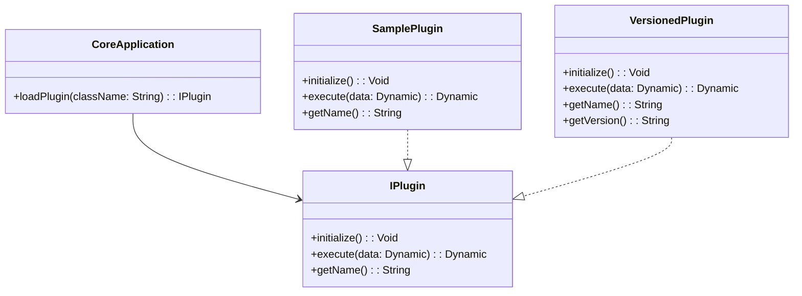

## 11.5 Plugin and Modular Architecture

In today's rapidly evolving software landscape, the ability to extend and modify applications without altering the core code is paramount. Plugin and Modular Architecture provides a robust framework for achieving this flexibility, allowing developers to build systems that are both extensible and maintainable. In this section, we will delve into the principles of Plugin and Modular Architecture, explore how to implement these concepts in Haxe, and provide practical examples to illustrate their application.

### Definition

**Plugin and Modular Architecture** structures the application so that functionality can be extended or modified by adding or updating modules or plugins without changing the core code. This approach promotes separation of concerns, enhances scalability, and facilitates easier maintenance and updates.

### Implementing Modular Architecture in Haxe

Haxe, with its cross-platform capabilities and powerful features, is well-suited for implementing modular architectures. Let's explore the key components and strategies for building modular systems in Haxe.

#### Module Interfaces

**Module Interfaces** define contracts that modules must fulfill. By establishing clear interfaces, we ensure that modules can be developed independently and integrated seamlessly into the application.

```haxe
// Define a module interface
interface IPlugin {
    public function initialize():Void;
    public function execute(data:Dynamic):Dynamic;
    public function getName():String;
}

// Example implementation of a plugin
class SamplePlugin implements IPlugin {
    public function new() {}

    public function initialize():Void {
        trace("SamplePlugin initialized.");
    }

    public function execute(data:Dynamic):Dynamic {
        trace("Executing SamplePlugin with data: " + data);
        return data;
    }

    public function getName():String {
        return "SamplePlugin";
    }
}
```

In this example, the `IPlugin` interface defines the methods that any plugin must implement. The `SamplePlugin` class provides a concrete implementation of this interface.

#### Dynamic Loading

Dynamic loading allows the application to load modules at runtime, providing flexibility and enabling the addition of new functionality without recompiling the core application. In Haxe, we can use reflection or the `Type` class to achieve dynamic loading.

```haxe
// Dynamic loading of plugins
class PluginLoader {
    public static function loadPlugin(className:String):IPlugin {
        var pluginClass = Type.resolveClass(className);
        if (pluginClass != null) {
            var plugin:IPlugin = Type.createInstance(pluginClass, []);
            plugin.initialize();
            return plugin;
        } else {
            throw "Plugin class not found: " + className;
        }
    }
}

// Usage
var plugin:IPlugin = PluginLoader.loadPlugin("SamplePlugin");
plugin.execute("Hello, Haxe!");
```

In this code snippet, the `PluginLoader` class uses the `Type` class to resolve and instantiate a plugin class by its name. This approach allows for loading plugins dynamically at runtime.

#### Versioning and Compatibility

As applications evolve, managing different versions of modules becomes crucial. Implement mechanisms to handle versioning and compatibility to ensure that modules work harmoniously with the core application and each other.

```haxe
// Versioned plugin interface
interface IVersionedPlugin extends IPlugin {
    public function getVersion():String;
}

// Example versioned plugin
class VersionedPlugin implements IVersionedPlugin {
    public function new() {}

    public function initialize():Void {
        trace("VersionedPlugin initialized.");
    }

    public function execute(data:Dynamic):Dynamic {
        trace("Executing VersionedPlugin with data: " + data);
        return data;
    }

    public function getName():String {
        return "VersionedPlugin";
    }

    public function getVersion():String {
        return "1.0.0";
    }
}
```

By extending the `IPlugin` interface to include versioning information, we can track and manage different versions of plugins, ensuring compatibility and facilitating updates.

### Use Cases and Examples

Plugin and Modular Architecture is widely applicable across various domains. Here are some common use cases and examples:

#### IDE Extensions

Integrated Development Environments (IDEs) often support extensions or plugins to allow users to add custom functionality. This modular approach enables developers to tailor the IDE to their specific needs without altering the core software.

#### Game Mods

In the gaming industry, enabling user-generated content and extensions through mods is a popular practice. By adopting a modular architecture, game developers can provide a framework for players to create and share custom content, enhancing the game's longevity and community engagement.

### Visualizing Plugin and Modular Architecture

To better understand the structure and flow of Plugin and Modular Architecture, let's visualize it using a class diagram.



**Diagram Description:** This class diagram illustrates the relationship between the core application and plugins. The `CoreApplication` class interacts with the `IPlugin` interface, which is implemented by `SamplePlugin` and `VersionedPlugin`.

### Design Considerations

When implementing Plugin and Modular Architecture in Haxe, consider the following:

- **Separation of Concerns:** Ensure that the core application and plugins are decoupled, allowing for independent development and testing.
- **Scalability:** Design the system to accommodate future growth, enabling the addition of new plugins without significant refactoring.
- **Security:** Implement security measures to prevent malicious plugins from compromising the application.
- **Performance:** Optimize the loading and execution of plugins to minimize impact on application performance.

### Differences and Similarities

Plugin and Modular Architecture is often compared to other architectural patterns, such as Microservices and Service-Oriented Architecture (SOA). While all these patterns promote modularity, Plugin and Modular Architecture focuses on extending application functionality through plugins, whereas Microservices and SOA emphasize distributed systems and service interactions.

### Try It Yourself

To deepen your understanding of Plugin and Modular Architecture in Haxe, try modifying the code examples provided:

- **Create a new plugin:** Implement a new class that fulfills the `IPlugin` interface and test its integration with the core application.
- **Add versioning:** Extend the `IVersionedPlugin` interface to include additional metadata, such as author information or release notes.
- **Experiment with dynamic loading:** Modify the `PluginLoader` class to load plugins from an external configuration file or database.

### References and Links

For further reading on Plugin and Modular Architecture, consider exploring the following resources:

- [Haxe Manual: Reflection and Type](https://haxe.org/manual/std-reflection.html)
- [Design Patterns: Elements of Reusable Object-Oriented Software](https://en.wikipedia.org/wiki/Design_Patterns)
- [Modular Programming on Wikipedia](https://en.wikipedia.org/wiki/Modular_programming)

### Knowledge Check

To reinforce your understanding of Plugin and Modular Architecture, consider the following questions:

- What are the benefits of using Plugin and Modular Architecture in software development?
- How does dynamic loading enhance the flexibility of a modular system?
- What are some potential challenges when implementing versioning and compatibility in a modular architecture?

### Embrace the Journey

Remember, mastering Plugin and Modular Architecture is a journey. As you continue to explore and experiment with these concepts, you'll gain valuable insights and skills that will enhance your ability to build flexible and maintainable systems. Keep pushing the boundaries, stay curious, and enjoy the process!

## Quiz Time!



### What is the primary benefit of Plugin and Modular Architecture?

- [x] Extensibility without altering core code
- [ ] Improved security
- [ ] Faster execution
- [ ] Reduced memory usage

> **Explanation:** Plugin and Modular Architecture allows for extending functionality without changing the core code, enhancing flexibility and maintainability.

### Which Haxe feature is used for dynamic loading of plugins?

- [x] Type class
- [ ] Enum
- [ ] Abstract types
- [ ] Anonymous structures

> **Explanation:** The `Type` class in Haxe is used for reflection and dynamic loading of classes at runtime.

### What is a key consideration when implementing modular architecture?

- [x] Separation of concerns
- [ ] Increased coupling
- [ ] Hardcoding dependencies
- [ ] Ignoring versioning

> **Explanation:** Separation of concerns ensures that modules can be developed and tested independently, promoting modularity.

### How can versioning be managed in a modular system?

- [x] By extending interfaces to include version information
- [ ] By hardcoding version numbers
- [ ] By ignoring compatibility
- [ ] By using global variables

> **Explanation:** Extending interfaces to include version information helps manage compatibility and updates in a modular system.

### What is a common use case for Plugin and Modular Architecture?

- [x] IDE extensions
- [ ] Monolithic applications
- [ ] Single-threaded programs
- [ ] Static websites

> **Explanation:** IDEs often use plugins to allow users to add custom functionality, making them a common use case for modular architecture.

### What is the role of the `IPlugin` interface in the example?

- [x] To define a contract for plugins
- [ ] To execute core application logic
- [ ] To manage memory allocation
- [ ] To handle user input

> **Explanation:** The `IPlugin` interface defines the methods that any plugin must implement, serving as a contract for plugin development.

### What does the `initialize` method in a plugin typically do?

- [x] Sets up the plugin for execution
- [ ] Executes the main application logic
- [ ] Handles user input
- [ ] Manages memory allocation

> **Explanation:** The `initialize` method is used to set up the plugin, preparing it for execution within the application.

### How does dynamic loading benefit a modular system?

- [x] Allows loading of modules at runtime
- [ ] Increases compile-time errors
- [ ] Reduces flexibility
- [ ] Hardcodes dependencies

> **Explanation:** Dynamic loading enables the application to load modules at runtime, providing flexibility and extensibility.

### What is a potential challenge of Plugin and Modular Architecture?

- [x] Managing version compatibility
- [ ] Reduced flexibility
- [ ] Increased coupling
- [ ] Hardcoding dependencies

> **Explanation:** Managing version compatibility is crucial to ensure that modules work harmoniously with the core application and each other.

### True or False: Plugin and Modular Architecture is the same as Microservices Architecture.

- [ ] True
- [x] False

> **Explanation:** While both promote modularity, Plugin and Modular Architecture focuses on extending application functionality through plugins, whereas Microservices Architecture emphasizes distributed systems and service interactions.


