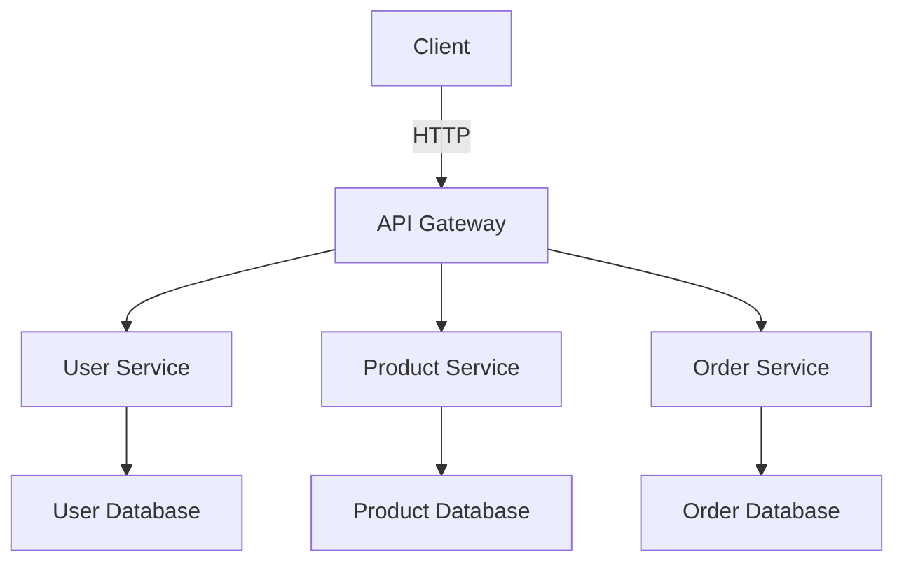

## 11.6 Microservices and Service-Oriented Architecture (SOA)

### Introduction

Microservices and Service-Oriented Architecture (SOA) represent two architectural styles that have gained significant traction in modern software development. Both paradigms focus on decomposing applications into smaller, manageable, and independently deployable services. This section explores how Haxe, with its cross-platform capabilities, can be leveraged to implement these architectures effectively.

### Understanding Microservices and SOA

**Microservices** are an architectural style where an application is structured as a collection of loosely coupled services. Each service is fine-grained and performs a single function. This approach allows for independent deployment, scaling, and development of services.

**Service-Oriented Architecture (SOA)**, on the other hand, is a design pattern where services are provided to other components by application components, through a communication protocol over a network. SOA emphasizes reusability, interoperability, and integration.

### Key Characteristics

- **Service Isolation:** Each service is a separate entity that can be developed, deployed, and scaled independently.
- **Communication:** Services communicate over a network using protocols such as HTTP, AMQP, or gRPC.
- **Decentralized Data Management:** Each service manages its own database or data storage.
- **Automated Deployment:** Continuous integration and deployment pipelines are essential for managing microservices.

### Implementing Microservices with Haxe

#### Service Isolation

In Haxe, service isolation can be achieved by developing each service as a separate Haxe project. This allows each service to be compiled to the most suitable target platform, such as Node.js for server-side logic or JVM for enterprise applications.

```haxe
// Example of a simple Haxe service
class UserService {
    public function new() {}

    public function getUser(id:Int):User {
        // Logic to retrieve user data
        return new User(id, "John Doe");
    }
}

class User {
    public var id:Int;
    public var name:String;

    public function new(id:Int, name:String) {
        this.id = id;
        this.name = name;
    }
}
```

#### Communication

Communication between services can be implemented using various protocols. Haxe's ability to compile to multiple targets makes it versatile for implementing different communication strategies.

- **HTTP APIs:** Use Haxe to create RESTful services that communicate over HTTP.
- **Message Queues:** Implement asynchronous communication using message brokers like RabbitMQ.
- **Remote Procedure Calls (RPC):** Use gRPC or similar technologies for efficient service-to-service communication.

```haxe
// Example of a simple HTTP server in Haxe
import tink.http.Server;
import tink.http.Response;
import tink.http.Request;

class Main {
    static function main() {
        Server.serve({
            host: "localhost",
            port: 8080,
            handler: function(req:Request) {
                return new Response(200, "Hello, World!");
            }
        });
    }
}
```

#### Deployment Targets

Haxe's cross-platform nature allows each service to be compiled to the most appropriate target. For instance, a service handling heavy computations might be compiled to C++ for performance, while a service with extensive I/O operations might be compiled to Node.js.

### Use Cases and Examples

#### Distributed Systems

Microservices are ideal for distributed systems where different components need to scale independently. For example, an e-commerce platform might have separate services for user management, product catalog, and order processing.

#### Backend Services

Microservices can modularize backend functionality for web or mobile applications, allowing teams to work on different services simultaneously without affecting others.

### Visualizing Microservices Architecture



**Figure 1:** A typical microservices architecture with an API Gateway and separate services for user, product, and order management.

### Design Considerations

- **Service Granularity:** Determine the right level of granularity for services to avoid overly complex systems.
- **Data Consistency:** Implement strategies for maintaining data consistency across services.
- **Security:** Ensure secure communication between services and implement authentication and authorization mechanisms.

### Differences and Similarities

While both microservices and SOA focus on service decomposition, microservices emphasize smaller, more granular services, whereas SOA often involves larger, more coarse-grained services. Both architectures aim for loose coupling and high cohesion.

### Try It Yourself

Experiment with the provided code examples by modifying the service logic or communication protocols. Try compiling the services to different targets and observe the performance and behavior.

### References and Links

- [Microservices Architecture on AWS](https://aws.amazon.com/microservices/)
- [Service-Oriented Architecture (SOA) on Microsoft Docs](https://docs.microsoft.com/en-us/azure/architecture/guide/architecture-styles/soa)
- [Haxe Manual](https://haxe.org/manual/)

### Knowledge Check

- What are the key differences between microservices and SOA?
- How does Haxe's cross-platform capability benefit microservices architecture?
- What are some common communication protocols used in microservices?

### Embrace the Journey

Remember, mastering microservices and SOA with Haxe is a journey. As you progress, you'll build more robust and scalable applications. Keep experimenting, stay curious, and enjoy the journey!

## Quiz Time!



### What is a key characteristic of microservices?

- [x] Service isolation
- [ ] Monolithic architecture
- [ ] Centralized data management
- [ ] Tight coupling

> **Explanation:** Microservices are characterized by service isolation, allowing each service to be developed and deployed independently.

### Which protocol is commonly used for communication between microservices?

- [x] HTTP
- [ ] FTP
- [ ] SMTP
- [ ] POP3

> **Explanation:** HTTP is commonly used for communication between microservices, especially in RESTful architectures.

### What is a benefit of using Haxe for microservices?

- [x] Cross-platform compilation
- [ ] Single language support
- [ ] Limited deployment options
- [ ] Centralized architecture

> **Explanation:** Haxe's ability to compile to multiple platforms makes it ideal for microservices, allowing each service to be optimized for its specific use case.

### In a microservices architecture, what is the role of an API Gateway?

- [x] To route requests to the appropriate service
- [ ] To store data for all services
- [ ] To compile services to different targets
- [ ] To manage user authentication

> **Explanation:** An API Gateway routes client requests to the appropriate microservice, often handling tasks like authentication and load balancing.

### What is a common challenge in microservices architecture?

- [x] Data consistency
- [ ] Monolithic codebase
- [ ] Single point of failure
- [ ] Lack of scalability

> **Explanation:** Maintaining data consistency across distributed services is a common challenge in microservices architecture.

### Which Haxe feature is beneficial for service isolation in microservices?

- [x] Separate project compilation
- [ ] Centralized codebase
- [ ] Single-threaded execution
- [ ] Limited language features

> **Explanation:** Haxe allows each service to be developed as a separate project, facilitating service isolation.

### What is a common use case for microservices?

- [x] Distributed systems
- [ ] Single-page applications
- [ ] Desktop applications
- [ ] Embedded systems

> **Explanation:** Microservices are well-suited for distributed systems where different components need to scale independently.

### How can Haxe's cross-platform nature be leveraged in microservices?

- [x] By compiling services to the most suitable target platform
- [ ] By using a single target for all services
- [ ] By limiting services to web applications
- [ ] By avoiding platform-specific optimizations

> **Explanation:** Haxe's cross-platform nature allows each service to be compiled to the most appropriate target, optimizing performance and compatibility.

### What is a key difference between microservices and SOA?

- [x] Microservices are more granular
- [ ] SOA is more granular
- [ ] Microservices use centralized data management
- [ ] SOA uses decentralized data management

> **Explanation:** Microservices are typically more granular than SOA, focusing on smaller, independently deployable services.

### True or False: Microservices and SOA both aim for loose coupling and high cohesion.

- [x] True
- [ ] False

> **Explanation:** Both microservices and SOA aim for loose coupling and high cohesion, although they differ in service granularity and implementation details.


