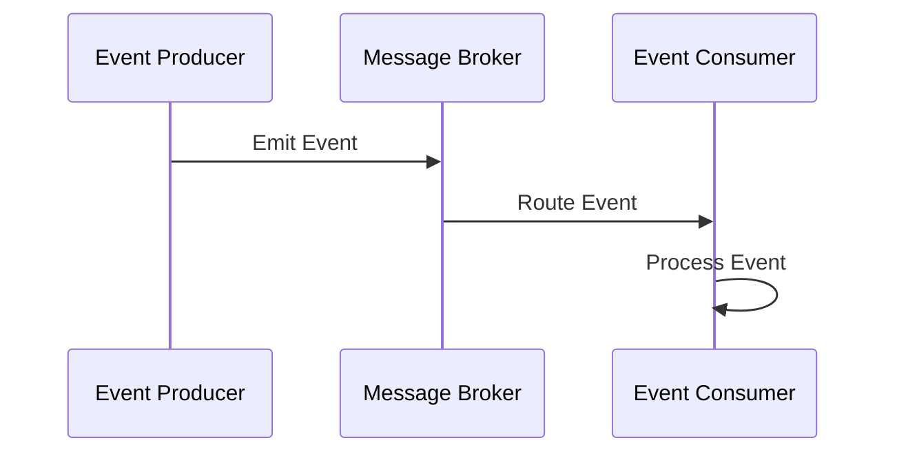

## 11.7 Event-Driven Architecture

Event-Driven Architecture (EDA) is a design paradigm that structures applications around the production, detection, and consumption of events. This approach promotes loose coupling, scalability, and responsiveness, making it ideal for modern, distributed systems. In this section, we will explore how to implement EDA in Haxe, leveraging its cross-platform capabilities to build robust applications.

### Understanding Event-Driven Architecture

**Event-Driven Architecture** is a software architecture pattern that relies on the generation, transmission, and processing of events. An event can be defined as a significant change in state or an occurrence that is of interest to the system. In EDA, components communicate by emitting and responding to events, rather than direct method calls, which decouples the components and enhances scalability.

#### Key Concepts

- **Event Producers:** These are components that generate events. They are responsible for detecting changes in state and broadcasting these changes as events.
- **Event Consumers:** These components listen for events and react accordingly. They are decoupled from the producers, allowing for independent evolution.
- **Message Brokers:** Optional intermediaries that facilitate communication between producers and consumers. They can provide features like message queuing, filtering, and routing.

### Implementing Event-Driven Architecture in Haxe

Haxe, with its powerful macro system and cross-platform capabilities, is well-suited for implementing EDA. Let's delve into how we can structure an event-driven system in Haxe.

#### Event Producers

Event producers are responsible for generating events. In Haxe, we can define a simple event producer using classes and interfaces. Here's an example:

```haxe
interface IEventProducer {
    function emit(event: String, data: Dynamic): Void;
}

class Button implements IEventProducer {
    private var listeners: Map<String, Array<Dynamic -> Void>> = new Map();

    public function new() {}

    public function on(event: String, listener: Dynamic -> Void): Void {
        if (!listeners.exists(event)) {
            listeners.set(event, []);
        }
        listeners.get(event).push(listener);
    }

    public function emit(event: String, data: Dynamic): Void {
        if (listeners.exists(event)) {
            for (listener in listeners.get(event)) {
                listener(data);
            }
        }
    }

    public function click(): Void {
        emit("click", {message: "Button clicked!"});
    }
}
```

In this example, the `Button` class acts as an event producer. It maintains a list of listeners for different events and provides methods to register listeners and emit events.

#### Event Consumers

Event consumers listen for and react to events. Here's how we can define a simple event consumer in Haxe:

```haxe
class Logger {
    public function new() {}

    public function log(data: Dynamic): Void {
        trace("Event received: " + data.message);
    }
}

class Main {
    static function main() {
        var button = new Button();
        var logger = new Logger();

        button.on("click", logger.log);
        button.click();
    }
}
```

In this example, the `Logger` class acts as an event consumer. It registers a listener with the `Button` producer and logs the event data when the button is clicked.

#### Message Brokers

In more complex systems, you might use a message broker to manage event routing. While Haxe doesn't have a built-in message broker, you can implement one using existing libraries or frameworks. Here's a simple example of a message broker:

```haxe
class MessageBroker {
    private var channels: Map<String, Array<Dynamic -> Void>> = new Map();

    public function new() {}

    public function subscribe(channel: String, listener: Dynamic -> Void): Void {
        if (!channels.exists(channel)) {
            channels.set(channel, []);
        }
        channels.get(channel).push(listener);
    }

    public function publish(channel: String, data: Dynamic): Void {
        if (channels.exists(channel)) {
            for (listener in channels.get(channel)) {
                listener(data);
            }
        }
    }
}
```

This `MessageBroker` class allows components to subscribe to channels and publish events to those channels, facilitating decoupled communication.

### Use Cases and Examples

Event-Driven Architecture is particularly useful in scenarios where responsiveness and scalability are critical. Let's explore some common use cases.

#### Real-Time Applications

Real-time applications, such as stock trading platforms and IoT systems, benefit greatly from EDA. These applications require immediate processing of events to provide timely updates and actions.

**Example: Stock Trading Platform**

In a stock trading platform, events such as price changes, trade executions, and order updates can be emitted by various components. Consumers, such as user interfaces and analytics engines, can listen for these events and update the display or perform calculations in real-time.

#### Asynchronous Processing

EDA is ideal for asynchronous processing, where tasks are decoupled to improve responsiveness. This is common in web applications, where user actions trigger background processes.

**Example: Web Application**

In a web application, user actions such as form submissions can emit events that trigger background processes like data validation, storage, and notification. This allows the application to remain responsive while handling complex tasks asynchronously.

### Visualizing Event-Driven Architecture

To better understand the flow of events in an EDA system, let's visualize the architecture using a sequence diagram.



This diagram illustrates the flow of events from the producer to the consumer via a message broker. The producer emits an event, the broker routes it, and the consumer processes it.

### Design Considerations

When implementing Event-Driven Architecture in Haxe, consider the following:

- **Scalability:** EDA naturally supports scalability by decoupling components. Ensure your system can handle increased load by optimizing event processing and routing.
- **Fault Tolerance:** Implement error handling and retries to ensure events are not lost in case of failures.
- **Performance:** Minimize latency by optimizing event emission and consumption. Consider using asynchronous processing to improve responsiveness.
- **Security:** Protect sensitive data by encrypting events and securing communication channels.

### Differences and Similarities

EDA is often compared to other architectural patterns, such as:

- **Service-Oriented Architecture (SOA):** Both EDA and SOA promote loose coupling, but EDA focuses on event-based communication, while SOA emphasizes service interfaces.
- **Microservices:** EDA can be used within a microservices architecture to facilitate communication between services. Both patterns promote scalability and flexibility.

### Try It Yourself

Experiment with the code examples provided by modifying the event types and adding new consumers. Try implementing a simple chat application where users can send and receive messages as events.

### Knowledge Check

- What are the key components of Event-Driven Architecture?
- How does EDA promote scalability and responsiveness?
- What are some common use cases for EDA?
- How can message brokers enhance an EDA system?

### Embrace the Journey

Remember, mastering Event-Driven Architecture is a journey. As you explore this pattern, you'll discover new ways to build scalable and responsive applications. Keep experimenting, stay curious, and enjoy the process!

## Quiz Time!



### What is the primary benefit of Event-Driven Architecture?

- [x] Loose coupling and scalability
- [ ] Simplified code structure
- [ ] Reduced development time
- [ ] Enhanced security

> **Explanation:** Event-Driven Architecture promotes loose coupling and scalability by decoupling components and enabling asynchronous communication.


### Which component in EDA is responsible for generating events?

- [x] Event Producer
- [ ] Event Consumer
- [ ] Message Broker
- [ ] Event Handler

> **Explanation:** Event Producers are responsible for generating and emitting events in an Event-Driven Architecture.


### What role does a Message Broker play in EDA?

- [x] Routes events between producers and consumers
- [ ] Generates events
- [ ] Consumes events
- [ ] Logs events

> **Explanation:** A Message Broker routes events between producers and consumers, facilitating communication in an EDA system.


### In which scenario is EDA particularly useful?

- [x] Real-time applications
- [ ] Batch processing
- [ ] Static websites
- [ ] Single-threaded applications

> **Explanation:** EDA is particularly useful in real-time applications where immediate processing of events is required.


### How does EDA improve responsiveness in web applications?

- [x] By decoupling tasks and allowing asynchronous processing
- [ ] By simplifying the codebase
- [ ] By reducing the number of components
- [ ] By increasing server resources

> **Explanation:** EDA improves responsiveness by decoupling tasks and allowing asynchronous processing, enabling the application to handle complex tasks in the background.


### What is a common use case for Event-Driven Architecture?

- [x] IoT systems
- [ ] Static content delivery
- [ ] Image processing
- [ ] Data entry

> **Explanation:** IoT systems are a common use case for EDA due to their need for real-time event processing and responsiveness.


### How can you enhance fault tolerance in an EDA system?

- [x] Implement error handling and retries
- [ ] Increase server resources
- [ ] Simplify the code structure
- [ ] Use synchronous processing

> **Explanation:** Implementing error handling and retries enhances fault tolerance by ensuring events are not lost in case of failures.


### What is the relationship between EDA and Microservices?

- [x] EDA can be used within a microservices architecture to facilitate communication
- [ ] EDA replaces microservices
- [ ] EDA is a subset of microservices
- [ ] EDA and microservices are unrelated

> **Explanation:** EDA can be used within a microservices architecture to facilitate communication between services, promoting scalability and flexibility.


### Which of the following is NOT a key component of EDA?

- [ ] Event Producer
- [ ] Event Consumer
- [x] Database
- [ ] Message Broker

> **Explanation:** While databases can be part of an EDA system, they are not a key component. The key components are Event Producers, Event Consumers, and Message Brokers.


### True or False: EDA is only suitable for large-scale applications.

- [ ] True
- [x] False

> **Explanation:** EDA is suitable for applications of all sizes, as it promotes scalability and responsiveness, which can benefit both small and large-scale applications.


