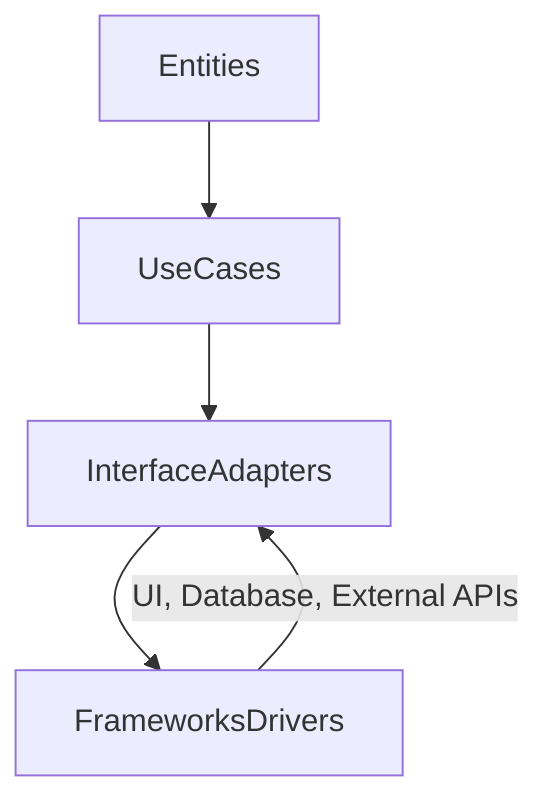
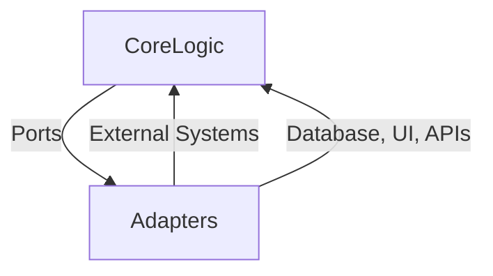

## 11.8 Clean Architecture and Hexagonal Architecture

In the realm of software architecture, Clean Architecture and Hexagonal Architecture stand out as paradigms that emphasize the separation of concerns and independence from frameworks, UI, or databases. These architectural styles focus on the core domain logic, ensuring that applications are maintainable, testable, and adaptable to change. In this section, we will explore how these architectures can be implemented in Haxe, leveraging its unique features to build robust cross-platform applications.

### Understanding Clean Architecture

**Clean Architecture** is a software design philosophy introduced by Robert C. Martin (Uncle Bob). It aims to create systems that are easy to understand, maintain, and extend. The core idea is to separate the software into layers, each with a specific responsibility, and to ensure that the core business logic is independent of external concerns such as databases, UI, or frameworks.

#### Key Principles of Clean Architecture

1. **Independence of Frameworks:** The architecture should not depend on any specific framework. Frameworks are tools, not the core of the application.
2. **Testability:** Business rules can be tested independently of external elements.
3. **Independence of UI:** The UI can change without affecting the core business rules.
4. **Independence of Database:** The database can be swapped without affecting the business rules.
5. **Independence of External Agencies:** External systems can be integrated or replaced without affecting the core logic.

#### Layers of Clean Architecture

Clean Architecture is typically visualized as a series of concentric circles, each representing a different layer of the application:

- **Entities:** The innermost circle, representing the core business logic and rules.
- **Use Cases:** This layer contains application-specific business rules.
- **Interface Adapters:** This layer converts data from the format most convenient for the use cases and entities to the format most convenient for external agents such as databases and the web.
- **Frameworks and Drivers:** The outermost layer, containing frameworks and tools such as the database, UI, and external APIs.

#### Implementing Clean Architecture in Haxe

Let's explore how we can implement Clean Architecture in Haxe, utilizing its features like static typing, macros, and cross-platform capabilities.

##### Core Domain

The core domain encapsulates the business rules and logic. In Haxe, we can define this using classes and interfaces that represent the entities and use cases.

```haxe
// Define an entity
class User {
    public var id:Int;
    public var name:String;
    public var email:String;

    public function new(id:Int, name:String, email:String) {
        this.id = id;
        this.name = name;
        this.email = email;
    }
}

// Define a use case
interface UserRepository {
    function getUserById(id:Int):User;
    function saveUser(user:User):Void;
}
```

##### Interfaces and Adapters

Interfaces define the contracts for the outer layers, such as the UI or database. Adapters implement these interfaces, allowing the core logic to remain unchanged even if the underlying technology changes.

```haxe
// Interface for a database adapter
interface DatabaseAdapter {
    function fetchUser(id:Int):User;
    function storeUser(user:User):Void;
}

// Implementation of the database adapter
class MySQLAdapter implements DatabaseAdapter {
    public function new() {}

    public function fetchUser(id:Int):User {
        // Fetch user from MySQL database
        return new User(id, "John Doe", "john@example.com");
    }

    public function storeUser(user:User):Void {
        // Store user in MySQL database
    }
}
```

##### Independence from Frameworks

By keeping the core logic free from external dependencies, we ensure that the application can be easily tested and maintained. Haxe's static typing and type inference can help in defining clear interfaces and contracts.

### Understanding Hexagonal Architecture

**Hexagonal Architecture**, also known as the **Ports and Adapters Architecture**, was introduced by Alistair Cockburn. It aims to make the application independent of external systems, allowing it to be easily tested and adapted to different environments.

#### Key Principles of Hexagonal Architecture

1. **Separation of Concerns:** The core logic is separated from the external systems.
2. **Ports and Adapters:** The application communicates with the outside world through ports, which are implemented by adapters.
3. **Testability:** The core logic can be tested independently of the external systems.
4. **Flexibility:** The application can be easily adapted to different environments or technologies.

#### Implementing Hexagonal Architecture in Haxe

Hexagonal Architecture can be implemented in Haxe by defining ports as interfaces and adapters as implementations of these interfaces.

##### Defining Ports

Ports define the operations that the application can perform. They are implemented as interfaces in Haxe.

```haxe
// Define a port for user operations
interface UserPort {
    function getUser(id:Int):User;
    function createUser(name:String, email:String):User;
}
```

##### Implementing Adapters

Adapters implement the ports and provide the actual functionality. They can interact with databases, APIs, or other systems.

```haxe
// Adapter for user operations
class UserAdapter implements UserPort {
    private var database:DatabaseAdapter;

    public function new(database:DatabaseAdapter) {
        this.database = database;
    }

    public function getUser(id:Int):User {
        return database.fetchUser(id);
    }

    public function createUser(name:String, email:String):User {
        var user = new User(0, name, email);
        database.storeUser(user);
        return user;
    }
}
```

### Use Cases and Examples

Clean Architecture and Hexagonal Architecture are particularly useful in scenarios where high testability and adaptability are required.

#### Applications Requiring High Testability

By isolating the business logic from external dependencies, we can easily test the core functionality of the application. This is especially important in applications with complex business rules or those that require frequent updates.

#### Long-Lived Applications

For applications that need to be maintained over a long period, these architectures facilitate adaptability to new technologies and frameworks. By keeping the core logic independent, we can easily integrate new systems or replace outdated components.

### Visualizing Clean and Hexagonal Architecture

To better understand these architectures, let's visualize them using Mermaid.js diagrams.

#### Clean Architecture Diagram



**Description:** This diagram illustrates the layers of Clean Architecture, showing how each layer interacts with the next, while keeping the core business logic independent of external systems.

#### Hexagonal Architecture Diagram



**Description:** This diagram represents Hexagonal Architecture, highlighting the separation of the core logic from external systems through ports and adapters.

### Design Considerations

When implementing Clean or Hexagonal Architecture in Haxe, consider the following:

- **Haxe's Cross-Platform Capabilities:** Leverage Haxe's ability to compile to multiple targets, ensuring that your architecture is adaptable to different environments.
- **Static Typing and Type Inference:** Use Haxe's strong typing to define clear interfaces and contracts, enhancing maintainability and testability.
- **Macro System:** Utilize Haxe's macro system to automate repetitive tasks and enforce architectural constraints.

### Differences and Similarities

While Clean Architecture and Hexagonal Architecture share many similarities, such as the emphasis on separation of concerns and testability, they differ in their approach to external systems. Clean Architecture focuses on layers, while Hexagonal Architecture uses ports and adapters to achieve independence from external systems.

### Try It Yourself

To deepen your understanding, try implementing a simple application using Clean or Hexagonal Architecture in Haxe. Start by defining the core business logic and interfaces, then create adapters for different external systems. Experiment with swapping out adapters to see how the architecture supports flexibility and adaptability.

### References and Links

- [Clean Architecture by Robert C. Martin](https://blog.cleancoder.com/uncle-bob/2012/08/13/the-clean-architecture.html)
- [Hexagonal Architecture by Alistair Cockburn](https://alistair.cockburn.us/hexagonal-architecture/)
- [Haxe Language Documentation](https://haxe.org/documentation/)

### Knowledge Check

- **What are the key principles of Clean Architecture?**
- **How does Hexagonal Architecture achieve separation of concerns?**
- **What are the benefits of using Clean Architecture in long-lived applications?**
- **How can Haxe's features be leveraged in implementing these architectures?**

### Embrace the Journey

Remember, mastering architectural patterns like Clean and Hexagonal Architecture is a journey. As you progress, you'll build more robust and adaptable applications. Keep experimenting, stay curious, and enjoy the journey!

## Quiz Time!



### What is the primary goal of Clean Architecture?

- [x] To separate business logic from external concerns
- [ ] To integrate tightly with frameworks
- [ ] To focus solely on UI design
- [ ] To prioritize database design

> **Explanation:** Clean Architecture aims to separate business logic from external concerns such as frameworks, UI, and databases.

### Which layer in Clean Architecture contains the core business logic?

- [x] Entities
- [ ] Use Cases
- [ ] Interface Adapters
- [ ] Frameworks and Drivers

> **Explanation:** The Entities layer contains the core business logic and rules in Clean Architecture.

### What is a key feature of Hexagonal Architecture?

- [x] Ports and Adapters
- [ ] Layered Structure
- [ ] Monolithic Design
- [ ] Tight Coupling

> **Explanation:** Hexagonal Architecture uses Ports and Adapters to separate the core logic from external systems.

### How does Haxe's static typing benefit Clean Architecture?

- [x] By defining clear interfaces and contracts
- [ ] By allowing dynamic typing
- [ ] By enforcing runtime checks
- [ ] By supporting only one platform

> **Explanation:** Haxe's static typing helps define clear interfaces and contracts, enhancing maintainability and testability.

### What is a commonality between Clean and Hexagonal Architecture?

- [x] Emphasis on separation of concerns
- [ ] Focus on database design
- [ ] Dependence on specific frameworks
- [ ] Prioritization of UI design

> **Explanation:** Both architectures emphasize separation of concerns and independence from external systems.

### In Hexagonal Architecture, what role do adapters play?

- [x] Implementing ports to interact with external systems
- [ ] Defining core business logic
- [ ] Managing UI components
- [ ] Storing data in databases

> **Explanation:** Adapters implement ports to interact with external systems, allowing the core logic to remain independent.

### How can Haxe's macro system be utilized in these architectures?

- [x] To automate repetitive tasks and enforce constraints
- [ ] To dynamically type variables
- [ ] To create UI components
- [ ] To manage database connections

> **Explanation:** Haxe's macro system can automate repetitive tasks and enforce architectural constraints.

### What is a benefit of using Clean Architecture in testable applications?

- [x] Isolation of business logic for easier testing
- [ ] Tight integration with UI components
- [ ] Dependence on specific databases
- [ ] Focus on external APIs

> **Explanation:** Clean Architecture isolates business logic, making it easier to test independently of external systems.

### Which architecture uses concentric circles to represent layers?

- [x] Clean Architecture
- [ ] Hexagonal Architecture
- [ ] Monolithic Architecture
- [ ] Microservices Architecture

> **Explanation:** Clean Architecture is often visualized as a series of concentric circles, each representing a different layer.

### True or False: Hexagonal Architecture is also known as Ports and Adapters Architecture.

- [x] True
- [ ] False

> **Explanation:** Hexagonal Architecture is indeed also known as Ports and Adapters Architecture, emphasizing the separation of core logic from external systems.


