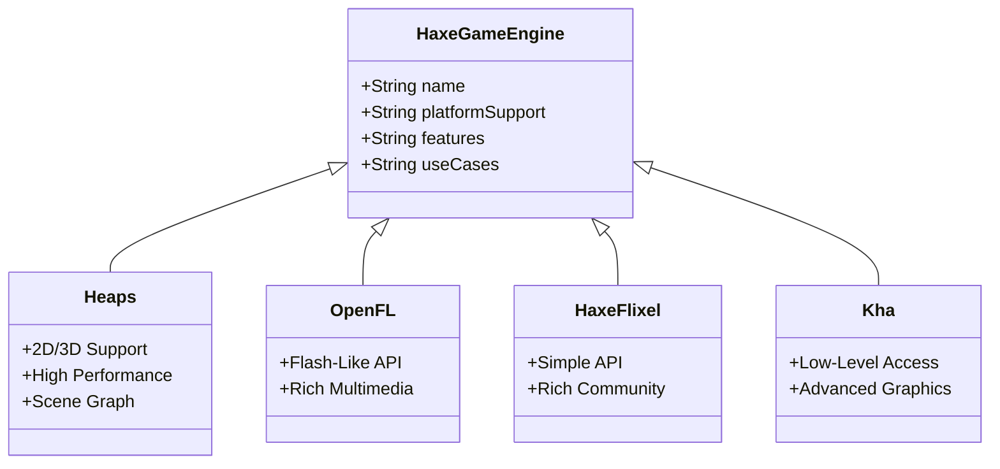

## 12.1 Overview of Haxe Game Engines

In the realm of game development, choosing the right engine is crucial for the success of your project. Haxe, with its cross-platform capabilities and robust language features, offers several game engines that cater to different needs and preferences. In this section, we will explore some of the most popular Haxe game engines: Heaps, OpenFL, HaxeFlixel, and Kha. We will discuss their features, strengths, and ideal use cases, as well as provide guidance on how to choose the right engine for your project.

### Introduction to Haxe Game Engines

Haxe is a versatile language that compiles to multiple platforms, making it an excellent choice for game development. The Haxe ecosystem includes several game engines, each with its unique features and strengths. Let's delve into the details of these engines.

#### Heaps

**Heaps** is a high-performance 2D/3D game engine designed for cross-platform development. It is known for its efficiency and flexibility, making it suitable for both small and large-scale projects.

- **Features:**
  - **2D and 3D Support:** Heaps provides robust support for both 2D and 3D graphics, allowing developers to create visually stunning games.
  - **Cross-Platform:** Heaps can target multiple platforms, including Windows, macOS, Linux, iOS, Android, and web browsers.
  - **High Performance:** Optimized for performance, Heaps is capable of handling complex graphics and large-scale environments.
  - **Scene Graph:** Heaps uses a scene graph to manage and render objects, simplifying the development process.

- **Use Cases:**
  - Ideal for developers looking to create high-performance games with complex graphics.
  - Suitable for projects that require both 2D and 3D capabilities.

- **Code Example:**

```haxe
import hxd.App;
import h2d.Scene;
import h2d.Bitmap;

class Main extends App {
    override function init() {
        var scene = new Scene();
        var bitmap = new Bitmap(scene, "assets/image.png");
        bitmap.x = 100;
        bitmap.y = 100;
    }
}
```

> **Try It Yourself:** Modify the code to change the position of the bitmap or load a different image to see how Heaps handles assets.

#### OpenFL

**OpenFL** is a framework that mirrors the Flash API, enabling developers to create rich multimedia applications. It is particularly popular among developers who have experience with Flash and ActionScript.

- **Features:**
  - **Flash-Like API:** OpenFL provides an API similar to Flash, making it easy for developers familiar with Flash to transition to Haxe.
  - **Rich Multimedia Support:** OpenFL excels at handling multimedia content, including animations, audio, and video.
  - **Cross-Platform:** OpenFL supports multiple platforms, including HTML5, Flash, Windows, macOS, Linux, iOS, and Android.

- **Use Cases:**
  - Ideal for developers transitioning from Flash to Haxe.
  - Suitable for projects that require rich multimedia content and animations.

- **Code Example:**

```haxe
import openfl.display.Sprite;
import openfl.text.TextField;

class Main extends Sprite {
    public function new() {
        super();
        var textField = new TextField();
        textField.text = "Hello, OpenFL!";
        addChild(textField);
    }
}
```

> **Try It Yourself:** Experiment with different text properties or add more graphical elements to explore OpenFL's capabilities.

#### HaxeFlixel

**HaxeFlixel** is a 2D game engine built on top of OpenFL. It is known for its simplicity and ease of use, making it a great choice for beginners and rapid development.

- **Features:**
  - **Simple API:** HaxeFlixel offers a straightforward API, allowing developers to quickly prototype and develop games.
  - **Rich Community:** HaxeFlixel has a vibrant community, providing extensive documentation, tutorials, and support.
  - **Cross-Platform:** Like OpenFL, HaxeFlixel supports multiple platforms, including HTML5, Windows, macOS, Linux, iOS, and Android.

- **Use Cases:**
  - Ideal for beginners and developers looking for a simple and efficient 2D game engine.
  - Suitable for rapid prototyping and development of 2D games.

- **Code Example:**

```haxe
import flixel.FlxGame;
import flixel.FlxState;
import flixel.text.FlxText;

class Main extends FlxGame {
    public function new() {
        super(640, 480, PlayState);
    }
}

class PlayState extends FlxState {
    override public function create():Void {
        var text = new FlxText(0, 0, 100, "Hello, HaxeFlixel!");
        add(text);
    }
}
```

> **Try It Yourself:** Modify the text properties or add new game objects to explore HaxeFlixel's features.

#### Kha

**Kha** is a low-level, high-performance framework designed for advanced graphics and multimedia applications. It provides developers with fine-grained control over rendering and performance.

- **Features:**
  - **Low-Level Access:** Kha offers low-level access to graphics APIs, allowing developers to optimize performance and rendering.
  - **Cross-Platform:** Kha supports a wide range of platforms, including HTML5, Windows, macOS, Linux, iOS, Android, and consoles.
  - **Advanced Graphics:** Kha is capable of handling advanced graphics techniques, making it suitable for high-performance applications.

- **Use Cases:**
  - Ideal for developers with experience in graphics programming and optimization.
  - Suitable for projects that require advanced graphics and performance tuning.

- **Code Example:**

```haxe
import kha.System;
import kha.Framebuffer;
import kha.graphics4.Graphics;

class Main {
    static function main() {
        System.init({title: "Kha Example"}, init);
    }

    static function init() {
        System.notifyOnRender(render);
    }

    static function render(framebuffer: Framebuffer) {
        var g = framebuffer.g4;
        g.begin();
        g.clear(0, 0, 0, 1);
        // Add rendering code here
        g.end();
    }
}
```

> **Try It Yourself:** Add rendering code to draw shapes or images and explore Kha's rendering capabilities.

### Choosing an Engine

Choosing the right game engine depends on several factors, including project requirements, target platforms, performance needs, and community support. Here are some considerations to help you make an informed decision:

- **Project Requirements:** Consider the specific needs of your project, such as 2D vs. 3D graphics, performance requirements, and target platforms. For example, if you need both 2D and 3D capabilities, Heaps might be the best choice.

- **Community and Support:** Evaluate the documentation, tutorials, and community activity for each engine. A strong community can provide valuable support and resources, especially for beginners.

- **Performance Needs:** If your project requires advanced graphics and performance optimization, consider using Kha for its low-level access and fine-grained control.

- **Ease of Use:** For rapid development and prototyping, HaxeFlixel offers a simple and efficient API, making it a great choice for beginners.

### Visualizing Haxe Game Engines

To better understand the relationships and features of these game engines, let's visualize them using a class diagram.



> **Diagram Description:** This class diagram illustrates the hierarchy and features of the Haxe game engines discussed. Each engine inherits from the `HaxeGameEngine` class, showcasing their unique features and capabilities.

### Conclusion

Choosing the right Haxe game engine is a critical decision that can significantly impact the success of your project. By understanding the features and strengths of Heaps, OpenFL, HaxeFlixel, and Kha, you can make an informed choice that aligns with your project requirements and goals. Remember, the journey of game development is filled with learning and experimentation. Embrace the process, explore the capabilities of each engine, and enjoy the creative freedom that Haxe offers.

## Quiz Time!



### Which Haxe game engine is known for its high-performance 2D/3D support?

- [x] Heaps
- [ ] OpenFL
- [ ] HaxeFlixel
- [ ] Kha

> **Explanation:** Heaps is a high-performance 2D/3D game engine designed for cross-platform development.

### What is a key feature of OpenFL?

- [ ] Low-Level Access
- [x] Flash-Like API
- [ ] Simple API
- [ ] Scene Graph

> **Explanation:** OpenFL provides a Flash-like API, making it easy for developers familiar with Flash to transition to Haxe.

### Which engine is built on top of OpenFL?

- [ ] Heaps
- [ ] Kha
- [x] HaxeFlixel
- [ ] None of the above

> **Explanation:** HaxeFlixel is a 2D game engine built on top of OpenFL.

### What is a primary use case for Kha?

- [ ] Beginners looking for a simple API
- [ ] Developers transitioning from Flash
- [x] Projects requiring advanced graphics and performance tuning
- [ ] Rapid prototyping of 2D games

> **Explanation:** Kha is suitable for projects that require advanced graphics and performance tuning.

### Which engine is ideal for rapid prototyping and development of 2D games?

- [ ] Heaps
- [ ] OpenFL
- [x] HaxeFlixel
- [ ] Kha

> **Explanation:** HaxeFlixel offers a simple and efficient API, making it ideal for rapid prototyping and development of 2D games.

### What does Heaps use to manage and render objects?

- [ ] Flash-Like API
- [ ] Low-Level Access
- [ ] Simple API
- [x] Scene Graph

> **Explanation:** Heaps uses a scene graph to manage and render objects.

### Which engine provides low-level access to graphics APIs?

- [ ] Heaps
- [ ] OpenFL
- [ ] HaxeFlixel
- [x] Kha

> **Explanation:** Kha offers low-level access to graphics APIs, allowing developers to optimize performance and rendering.

### What is a key consideration when choosing a game engine?

- [ ] Only the API style
- [ ] Only the community size
- [x] Project requirements, community support, and performance needs
- [ ] Only the platform support

> **Explanation:** Choosing a game engine depends on project requirements, community support, and performance needs.

### Which engine is particularly popular among developers with Flash experience?

- [ ] Heaps
- [x] OpenFL
- [ ] HaxeFlixel
- [ ] Kha

> **Explanation:** OpenFL is popular among developers with Flash experience due to its Flash-like API.

### True or False: HaxeFlixel is suitable for advanced graphics programming.

- [ ] True
- [x] False

> **Explanation:** HaxeFlixel is designed for simplicity and rapid development, not advanced graphics programming.



Remember, this is just the beginning. As you progress, you'll build more complex and interactive games. Keep experimenting, stay curious, and enjoy the journey!
