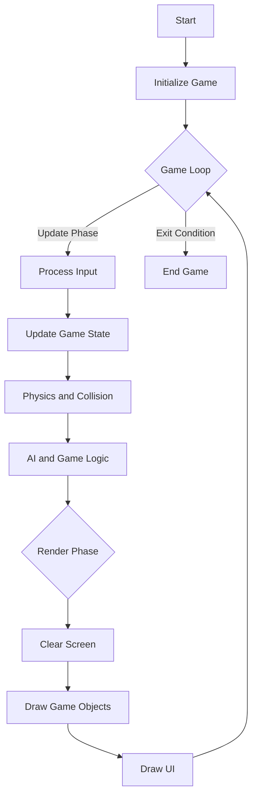

## 12.2 Game Loop Pattern

In the world of game development, the Game Loop Pattern is a fundamental design pattern that serves as the backbone of any game. It is responsible for continuously updating the game state and rendering the game world, ensuring that the game runs smoothly and responds to player inputs in real-time. In this section, we will delve into the intricacies of the Game Loop Pattern, explore its implementation in Haxe, and examine its applications in various types of games.

### Definition

The Game Loop Pattern is the core loop in a game that processes input, updates the game state, and renders frames. It typically runs at a fixed or variable rate, depending on the requirements of the game. The loop ensures that the game remains responsive and provides a consistent experience to the player.

### Implementing Game Loop in Haxe

Haxe, with its cross-platform capabilities, offers several ways to implement the Game Loop Pattern. Whether you're developing a game for the web, desktop, or mobile platforms, Haxe provides the tools and flexibility needed to create efficient game loops.

#### Event-Based Loops

Event-based loops leverage the game engine's native loop or event system to manage the game loop. This approach is often used in game engines like OpenFL or Heaps, which provide built-in support for handling game loops.

```haxe
// Example of an event-based game loop using OpenFL
import openfl.display.Sprite;
import openfl.events.Event;

class Main extends Sprite {
    public function new() {
        super();
        addEventListener(Event.ENTER_FRAME, onEnterFrame);
    }

    private function onEnterFrame(event:Event):Void {
        update();
        render();
    }

    private function update():Void {
        // Update game logic here
    }

    private function render():Void {
        // Render game objects here
    }
}
```

In this example, we use the `Event.ENTER_FRAME` event to trigger the game loop. The `update` and `render` methods are called on each frame, ensuring that the game logic and rendering are executed consistently.

#### Manual Loops

Manual loops involve implementing custom loops using timers or `requestAnimationFrame` (for web targets). This approach provides more control over the game loop, allowing developers to fine-tune the timing and execution of game updates and rendering.

```haxe
// Example of a manual game loop using requestAnimationFrame
import js.Browser;
import js.html.Window;

class Game {
    private var lastTime:Float;

    public function new() {
        lastTime = Browser.window.performance.now();
        loop();
    }

    private function loop():Void {
        var currentTime = Browser.window.performance.now();
        var deltaTime = currentTime - lastTime;
        lastTime = currentTime;

        update(deltaTime);
        render();

        Browser.window.requestAnimationFrame(loop);
    }

    private function update(deltaTime:Float):Void {
        // Update game logic with deltaTime
    }

    private function render():Void {
        // Render game objects
    }
}
```

In this example, we use `requestAnimationFrame` to create a manual game loop. The `deltaTime` variable is used to calculate the time elapsed between frames, allowing for time-based updates to the game logic.

#### Update and Render Phases

Separating the update and render phases is a crucial aspect of the Game Loop Pattern. This separation ensures that game logic and rendering are handled independently, allowing for smoother gameplay and more efficient rendering.

- **Update Phase:** This phase involves updating the game state, processing player inputs, and handling game logic. It is essential to ensure that the update phase is consistent, regardless of the frame rate.

- **Render Phase:** This phase involves drawing the game world and objects on the screen. The render phase should be optimized to minimize performance overhead and ensure smooth visuals.

```haxe
// Example of separating update and render phases
class GameLoop {
    private var lastUpdateTime:Float;

    public function new() {
        lastUpdateTime = Browser.window.performance.now();
        loop();
    }

    private function loop():Void {
        var currentTime = Browser.window.performance.now();
        var deltaTime = currentTime - lastUpdateTime;
        lastUpdateTime = currentTime;

        update(deltaTime);
        render();

        Browser.window.requestAnimationFrame(loop);
    }

    private function update(deltaTime:Float):Void {
        // Handle game logic and input processing
    }

    private function render():Void {
        // Draw game objects and world
    }
}
```

### Use Cases and Examples

The Game Loop Pattern is applicable in various types of games, each with its unique requirements and challenges.

#### Real-Time Games

Real-time games, such as action games and shooters, require consistent frame rates to ensure smooth gameplay and responsive controls. The Game Loop Pattern is essential in these games to manage the rapid updates and rendering needed for real-time interactions.

#### Simulations

Simulations, such as physics-based games or strategy games, rely on time-based updates to accurately simulate real-world phenomena. The Game Loop Pattern allows for precise control over the timing and execution of these updates, ensuring that the simulation remains accurate and consistent.

### Visualizing the Game Loop

To better understand the flow of the Game Loop Pattern, let's visualize it using a flowchart. This diagram illustrates the sequence of operations in a typical game loop, highlighting the update and render phases.



### Design Considerations

When implementing the Game Loop Pattern in Haxe, consider the following design considerations:

- **Frame Rate Independence:** Ensure that the game loop is independent of the frame rate to maintain consistent gameplay across different devices and platforms.
- **Performance Optimization:** Optimize the update and render phases to minimize performance overhead and ensure smooth gameplay.
- **Cross-Platform Compatibility:** Leverage Haxe's cross-platform capabilities to ensure that the game loop functions correctly on all target platforms.

### Differences and Similarities

The Game Loop Pattern is often compared to other patterns, such as the Observer Pattern or the Command Pattern. While these patterns may share similarities in terms of event handling and input processing, the Game Loop Pattern is unique in its focus on continuous updates and rendering.

### Try It Yourself

To gain a deeper understanding of the Game Loop Pattern, try modifying the code examples provided. Experiment with different update and render intervals, implement additional game logic, or integrate the game loop with a game engine like OpenFL or Heaps. By experimenting with these concepts, you'll gain valuable insights into the intricacies of game development and the power of the Game Loop Pattern.

### References and Links

For further reading on the Game Loop Pattern and game development in Haxe, consider exploring the following resources:

- [HaxeFlixel Documentation](https://haxeflixel.com/documentation/)
- [OpenFL Documentation](https://www.openfl.org/learn/)
- [Heaps.io Documentation](https://heaps.io/documentation/home.html)
- [Game Programming Patterns](http://gameprogrammingpatterns.com/game-loop.html)

### Knowledge Check

To reinforce your understanding of the Game Loop Pattern, consider the following questions and challenges:

- What are the key phases of the Game Loop Pattern, and why is it important to separate them?
- How can you ensure that the game loop remains independent of the frame rate?
- Experiment with implementing a simple game using the Game Loop Pattern in Haxe. What challenges did you encounter, and how did you overcome them?

### Embrace the Journey

Remember, mastering the Game Loop Pattern is just the beginning of your journey in game development. As you progress, you'll build more complex and interactive games, leveraging Haxe's powerful features and cross-platform capabilities. Keep experimenting, stay curious, and enjoy the journey!

## Quiz Time!



### What is the primary purpose of the Game Loop Pattern in game development?

- [x] To continuously update the game state and render frames
- [ ] To handle user input exclusively
- [ ] To manage game assets and resources
- [ ] To optimize game performance

> **Explanation:** The Game Loop Pattern is responsible for continuously updating the game state and rendering frames, ensuring smooth gameplay and responsiveness.

### Which of the following is a key phase in the Game Loop Pattern?

- [x] Update Phase
- [ ] Initialization Phase
- [ ] Asset Loading Phase
- [ ] Cleanup Phase

> **Explanation:** The Update Phase is a key phase in the Game Loop Pattern, where game logic and state are updated.

### How can you implement a manual game loop in Haxe for web targets?

- [x] Using requestAnimationFrame
- [ ] Using setInterval
- [ ] Using setTimeout
- [ ] Using a while loop

> **Explanation:** requestAnimationFrame is used to implement a manual game loop in Haxe for web targets, providing smooth animations.

### What is the benefit of separating the update and render phases in a game loop?

- [x] It allows for smoother gameplay and more efficient rendering
- [ ] It simplifies the game loop code
- [ ] It reduces memory usage
- [ ] It increases the game's frame rate

> **Explanation:** Separating the update and render phases allows for smoother gameplay and more efficient rendering by handling logic and visuals independently.

### Which game engine provides built-in support for event-based game loops in Haxe?

- [x] OpenFL
- [ ] Unity
- [ ] Unreal Engine
- [ ] Godot

> **Explanation:** OpenFL provides built-in support for event-based game loops in Haxe, leveraging its native event system.

### What is a common use case for the Game Loop Pattern?

- [x] Real-Time Games
- [ ] Turn-Based Games
- [ ] Puzzle Games
- [ ] Text-Based Games

> **Explanation:** Real-time games, such as action games, require consistent frame rates and are a common use case for the Game Loop Pattern.

### How can you ensure frame rate independence in a game loop?

- [x] By using delta time for updates
- [ ] By fixing the frame rate
- [ ] By optimizing rendering
- [ ] By reducing game logic complexity

> **Explanation:** Using delta time for updates ensures frame rate independence, allowing the game to run consistently across different devices.

### What is the role of the render phase in a game loop?

- [x] To draw the game world and objects on the screen
- [ ] To process player inputs
- [ ] To update game logic
- [ ] To manage game assets

> **Explanation:** The render phase is responsible for drawing the game world and objects on the screen, providing visual feedback to the player.

### Which Haxe feature is leveraged for cross-platform game loop implementation?

- [x] Cross-platform capabilities
- [ ] Static typing
- [ ] Macros
- [ ] Type inference

> **Explanation:** Haxe's cross-platform capabilities are leveraged for implementing game loops that function correctly on all target platforms.

### True or False: The Game Loop Pattern is only applicable to action games.

- [ ] True
- [x] False

> **Explanation:** False. The Game Loop Pattern is applicable to various types of games, including simulations and real-time games, not just action games.




