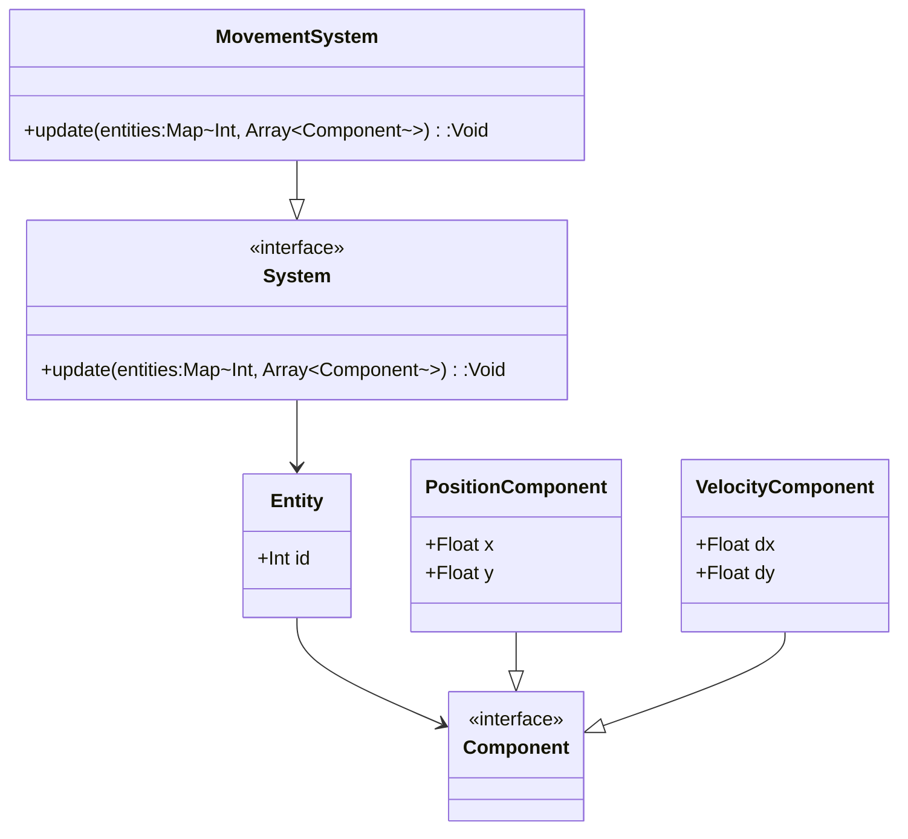

## 12.3 Entity-Component-System (ECS) in Games

The Entity-Component-System (ECS) pattern is a powerful architectural pattern used in game development that emphasizes composition over inheritance. This pattern allows developers to create flexible, reusable, and maintainable game objects by decoupling data from behavior. In this section, we will delve into the ECS pattern, explore its implementation in Haxe, and provide practical examples to illustrate its use in game development.

### Understanding the ECS Pattern

**Definition:** The ECS pattern is a design pattern that separates data (components) from behavior (systems) and organizes them around entities. This separation allows for greater flexibility and scalability in game development.

#### Key Concepts

- **Entity:** An entity is a unique identifier that represents a game object. It does not contain any data or behavior itself but serves as a container for components.
- **Component:** A component is a data structure that holds specific attributes or properties of an entity. Components are reusable and can be attached to multiple entities.
- **System:** A system is responsible for processing entities that possess specific components. Systems contain the logic that operates on the data provided by components.

### Implementing ECS in Haxe

Haxe's multi-paradigm capabilities and performance features make it an excellent choice for implementing the ECS pattern. Let's explore how to manage entities, components, and systems in Haxe.

#### Entity Management

Entities in Haxe can be managed using arrays or maps. Each entity is typically represented by an integer or a unique identifier. Here's a simple example of entity management using a map:

```haxe
class EntityManager {
    private var entities:Map<Int, Array<Component>>;

    public function new() {
        entities = new Map<Int, Array<Component>>();
    }

    public function createEntity():Int {
        var entityId = entities.keys().length;
        entities.set(entityId, []);
        return entityId;
    }

    public function addComponent(entityId:Int, component:Component):Void {
        if (entities.exists(entityId)) {
            entities.get(entityId).push(component);
        }
    }

    public function getComponents(entityId:Int):Array<Component> {
        return entities.get(entityId);
    }
}
```

In this example, `EntityManager` is responsible for creating entities and managing their components. Each entity is associated with an array of components.

#### Systems Processing

Systems iterate over entities and process those that have specific component combinations. This is where the logic of the game is implemented. Here's an example of a simple system:

```haxe
class MovementSystem {
    public function update(entities:Map<Int, Array<Component>>):Void {
        for (entityId in entities.keys()) {
            var components = entities.get(entityId);
            var position = getComponent<PositionComponent>(components);
            var velocity = getComponent<VelocityComponent>(components);

            if (position != null && velocity != null) {
                position.x += velocity.dx;
                position.y += velocity.dy;
            }
        }
    }

    private function getComponent<T:Component>(components:Array<Component>):T {
        for (component in components) {
            if (Std.is(component, T)) {
                return cast component;
            }
        }
        return null;
    }
}
```

The `MovementSystem` processes entities with `PositionComponent` and `VelocityComponent`, updating their positions based on their velocities.

#### Optimizations

Haxe's performance features, such as static typing and efficient data structures, can be leveraged to optimize ECS implementations. Consider using typed arrays or specialized data structures to improve data access speed.

### Use Cases and Examples

The ECS pattern is particularly useful in scenarios where game objects need to be dynamic and scalable. Let's explore some practical use cases.

#### Dynamic Game Objects

In games, objects often need to change behavior dynamically. With ECS, you can easily add or remove components to modify an entity's behavior. For example, you can add a `HealthComponent` to an entity to make it destructible or a `RenderComponent` to make it visible.

#### Large-Scale Games

ECS is well-suited for managing thousands of entities efficiently. By decoupling data from behavior, ECS allows for parallel processing and optimization, making it ideal for large-scale games with complex interactions.

### Visualizing ECS Architecture

Let's visualize the ECS architecture using a class diagram to better understand the relationships between entities, components, and systems.



**Diagram Explanation:** This diagram illustrates the ECS architecture, showing how entities are associated with components and how systems interact with entities to process their components.

### Try It Yourself

Experiment with the ECS pattern by modifying the code examples. Try adding new components, such as `HealthComponent` or `RenderComponent`, and create systems to process them. Observe how easily you can extend the functionality of your game objects.

### References and Links

- [Haxe Manual](https://haxe.org/manual/)
- [ECS Pattern in Game Development](https://gameprogrammingpatterns.com/component.html)

### Knowledge Check

- What are the main components of the ECS pattern?
- How does the ECS pattern differ from traditional object-oriented design?
- Why is ECS particularly useful for large-scale games?

### Embrace the Journey

Remember, mastering the ECS pattern is just the beginning. As you continue to explore game development with Haxe, you'll discover new ways to optimize and enhance your games. Keep experimenting, stay curious, and enjoy the journey!

## Quiz Time!



### What is the primary advantage of using the ECS pattern in game development?

- [x] Flexibility and reusability of components
- [ ] Faster rendering of graphics
- [ ] Simplified user interface design
- [ ] Easier network communication

> **Explanation:** The ECS pattern allows for flexible and reusable components, making it easier to manage dynamic game objects.

### In the ECS pattern, what does an entity represent?

- [x] A unique identifier for a game object
- [ ] A data structure holding attributes
- [ ] A system processing logic
- [ ] A graphical user interface element

> **Explanation:** An entity is a unique identifier that represents a game object, serving as a container for components.

### Which Haxe feature can be leveraged to optimize ECS implementations?

- [x] Static typing
- [ ] Dynamic typing
- [ ] Automatic memory management
- [ ] Built-in graphics rendering

> **Explanation:** Haxe's static typing can be used to optimize ECS implementations by improving data access speed.

### What is the role of a system in the ECS pattern?

- [x] Processing entities with specific components
- [ ] Storing data attributes
- [ ] Rendering graphics
- [ ] Managing user input

> **Explanation:** A system processes entities that have specific components, implementing the logic of the game.

### How can you dynamically change a game object's behavior in ECS?

- [x] By adding or removing components
- [ ] By modifying the entity's identifier
- [ ] By changing the system's logic
- [ ] By updating the user interface

> **Explanation:** In ECS, you can dynamically change a game object's behavior by adding or removing components.

### What is a common use case for the ECS pattern?

- [x] Managing thousands of entities efficiently
- [ ] Simplifying user interface design
- [ ] Enhancing network communication
- [ ] Improving graphics rendering

> **Explanation:** ECS is well-suited for managing thousands of entities efficiently, making it ideal for large-scale games.

### Which component might you add to an entity to make it destructible?

- [x] HealthComponent
- [ ] PositionComponent
- [ ] VelocityComponent
- [ ] RenderComponent

> **Explanation:** Adding a `HealthComponent` to an entity can make it destructible by tracking its health status.

### What is the purpose of the `MovementSystem` in the provided code example?

- [x] To update entity positions based on velocity
- [ ] To render graphics on the screen
- [ ] To manage user input
- [ ] To handle network communication

> **Explanation:** The `MovementSystem` updates entity positions based on their velocity, implementing movement logic.

### What is a key benefit of separating data from behavior in ECS?

- [x] Greater flexibility and scalability
- [ ] Faster graphics rendering
- [ ] Simplified user interface design
- [ ] Easier network communication

> **Explanation:** Separating data from behavior in ECS allows for greater flexibility and scalability in game development.

### True or False: In ECS, components can be reused across multiple entities.

- [x] True
- [ ] False

> **Explanation:** Components in ECS are reusable and can be attached to multiple entities, promoting code reuse.


