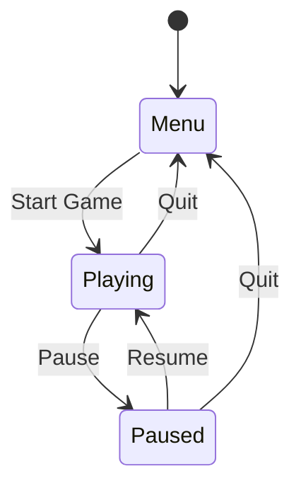

## 12.4 State Management in Game Development

State management is a crucial aspect of game development, enabling developers to handle different states of a game, such as menus, gameplay, and pause screens, and to transition smoothly between them. In this section, we will explore various techniques for implementing state management in Haxe, focusing on state machines, stack-based management, and event dispatchers. We will also provide use cases and examples to illustrate these concepts in action.

### Understanding State Management

State management in game development refers to the process of handling the various states a game can be in and managing transitions between these states. A state can be anything from a main menu, a gameplay session, a pause screen, or even different levels within the game. Effective state management ensures that the game behaves correctly and consistently as players interact with it.

### Implementing State Management in Haxe

Haxe, with its cross-platform capabilities and robust language features, provides several ways to implement state management. Let's delve into some of the most common techniques:

#### State Machines

A state machine is a design pattern used to manage the state of an object. It defines a set of states and the transitions between them. In the context of game development, a state machine can be used to manage game states, such as transitioning from a menu to gameplay or from gameplay to a pause screen.

**Key Components of a State Machine:**

- **States:** Represent different conditions or situations in the game.
- **Transitions:** Define how the game moves from one state to another.
- **Events:** Trigger transitions between states.

**Example: Implementing a Simple State Machine in Haxe**

```haxe
class GameState {
    public static var MENU = new GameState("Menu");
    public static var PLAYING = new GameState("Playing");
    public static var PAUSED = new GameState("Paused");

    private var name:String;

    public function new(name:String) {
        this.name = name;
    }

    public function toString():String {
        return name;
    }
}

class Game {
    private var currentState:GameState;

    public function new() {
        currentState = GameState.MENU;
    }

    public function changeState(newState:GameState):Void {
        trace('Transitioning from ' + currentState + ' to ' + newState);
        currentState = newState;
    }

    public function update():Void {
        switch (currentState) {
            case GameState.MENU:
                trace('In Menu');
            case GameState.PLAYING:
                trace('Playing Game');
            case GameState.PAUSED:
                trace('Game Paused');
        }
    }
}

class Main {
    static function main() {
        var game = new Game();
        game.update();
        game.changeState(GameState.PLAYING);
        game.update();
        game.changeState(GameState.PAUSED);
        game.update();
    }
}
```

In this example, we define a simple state machine with three states: `MENU`, `PLAYING`, and `PAUSED`. The `Game` class manages the current state and transitions between states.

#### Stack-Based Management

Stack-based state management is a technique where states are managed using a stack data structure. This approach is particularly useful for handling overlays or pause screens, where you need to temporarily suspend the current state and return to it later.

**Example: Implementing Stack-Based State Management in Haxe**

```haxe
class StateStack {
    private var stack:Array<GameState>;

    public function new() {
        stack = [];
    }

    public function pushState(state:GameState):Void {
        stack.push(state);
        trace('Pushed state: ' + state);
    }

    public function popState():GameState {
        var state = stack.pop();
        trace('Popped state: ' + state);
        return state;
    }

    public function currentState():GameState {
        return stack[stack.length - 1];
    }
}

class Main {
    static function main() {
        var stateStack = new StateStack();
        stateStack.pushState(GameState.MENU);
        stateStack.pushState(GameState.PLAYING);
        trace('Current state: ' + stateStack.currentState());
        stateStack.popState();
        trace('Current state: ' + stateStack.currentState());
    }
}
```

In this example, we implement a `StateStack` class that manages states using a stack. We can push and pop states to manage transitions, such as pausing and resuming gameplay.

#### Event Dispatchers

Event dispatchers are used to notify components of state changes. This approach is useful when you have multiple components that need to respond to state changes, such as updating the UI or triggering animations.

**Example: Using Event Dispatchers in Haxe**

```haxe
import haxe.ds.StringMap;

class EventDispatcher {
    private var listeners:StringMap<Array<Dynamic->Void>>;

    public function new() {
        listeners = new StringMap();
    }

    public function addEventListener(event:String, listener:Dynamic->Void):Void {
        if (!listeners.exists(event)) {
            listeners.set(event, []);
        }
        listeners.get(event).push(listener);
    }

    public function dispatchEvent(event:String, data:Dynamic):Void {
        if (listeners.exists(event)) {
            for (listener in listeners.get(event)) {
                listener(data);
            }
        }
    }
}

class Main {
    static function main() {
        var dispatcher = new EventDispatcher();
        dispatcher.addEventListener("stateChange", function(data) {
            trace('State changed to: ' + data);
        });

        dispatcher.dispatchEvent("stateChange", "Playing");
        dispatcher.dispatchEvent("stateChange", "Paused");
    }
}
```

In this example, we create an `EventDispatcher` class that allows components to register listeners for specific events. When an event is dispatched, all registered listeners are notified.

### Use Cases and Examples

State management is essential in various game development scenarios. Let's explore some common use cases:

#### Level Progression

In games with multiple levels, state management is used to change game logic and assets between levels. This involves transitioning from one level to another, loading new assets, and updating the game state accordingly.

#### Game Modes

Games often have different modes, such as single-player, multiplayer, or cooperative modes. State management is used to switch between these modes, ensuring that the game behaves correctly in each mode.

### Visualizing State Management

To better understand state management, let's visualize a simple state machine using a diagram:



This diagram represents a basic state machine with states for `Menu`, `Playing`, and `Paused`, along with transitions between them.

### Try It Yourself

Experiment with the code examples provided in this section. Try modifying the state machine to add new states or transitions. For the stack-based management example, implement a feature to handle multiple pause screens. Use the event dispatcher to notify different components of state changes and observe how they respond.

### References and Links

- [State Machines in Game Development](https://gameprogrammingpatterns.com/state.html)
- [Haxe Manual: Enums and Pattern Matching](https://haxe.org/manual/types-enum.html)
- [Event Dispatchers in Haxe](https://api.haxe.org/haxe/ds/StringMap.html)

### Knowledge Check

- What are the key components of a state machine?
- How does stack-based state management differ from a simple state machine?
- What are the benefits of using event dispatchers in state management?

### Embrace the Journey

State management is a fundamental aspect of game development, and mastering it will greatly enhance your ability to create complex and engaging games. Remember, this is just the beginning. As you progress, you'll build more sophisticated state management systems. Keep experimenting, stay curious, and enjoy the journey!

## Quiz Time!



### What is a state machine in game development?

- [x] A design pattern used to manage the state of an object
- [ ] A tool for rendering graphics
- [ ] A method for optimizing game performance
- [ ] A type of game engine

> **Explanation:** A state machine is a design pattern used to manage the state of an object, defining a set of states and transitions between them.

### What is the purpose of stack-based state management?

- [x] To manage states using a stack data structure
- [ ] To optimize game graphics
- [ ] To handle network communication
- [ ] To improve game audio

> **Explanation:** Stack-based state management uses a stack data structure to manage states, allowing for temporary suspension and resumption of states.

### How do event dispatchers work in state management?

- [x] They notify components of state changes
- [ ] They render game graphics
- [ ] They manage game audio
- [ ] They optimize game performance

> **Explanation:** Event dispatchers notify components of state changes, allowing multiple components to respond to these changes.

### What is a common use case for state management in games?

- [x] Level progression
- [ ] Audio optimization
- [ ] Network communication
- [ ] Graphics rendering

> **Explanation:** State management is commonly used for level progression, handling transitions between different levels and updating game logic and assets.

### What is the benefit of using a state machine in game development?

- [x] It provides a clear structure for managing states and transitions
- [ ] It improves game graphics
- [ ] It enhances game audio
- [ ] It optimizes network performance

> **Explanation:** A state machine provides a clear structure for managing states and transitions, ensuring consistent game behavior.

### How can stack-based management be useful in game development?

- [x] For handling overlays or pause screens
- [ ] For optimizing game graphics
- [ ] For managing game audio
- [ ] For improving network performance

> **Explanation:** Stack-based management is useful for handling overlays or pause screens, allowing temporary suspension and resumption of states.

### What is the role of transitions in a state machine?

- [x] They define how the game moves from one state to another
- [ ] They render game graphics
- [ ] They manage game audio
- [ ] They optimize network performance

> **Explanation:** Transitions in a state machine define how the game moves from one state to another, ensuring smooth state changes.

### What is an example of a state in a game?

- [x] Main menu
- [ ] Game graphics
- [ ] Game audio
- [ ] Network communication

> **Explanation:** A state in a game can be the main menu, representing a specific condition or situation in the game.

### How can event dispatchers enhance state management?

- [x] By allowing multiple components to respond to state changes
- [ ] By rendering game graphics
- [ ] By managing game audio
- [ ] By optimizing network performance

> **Explanation:** Event dispatchers enhance state management by allowing multiple components to respond to state changes, ensuring consistent game behavior.

### True or False: State management is only used for handling game graphics.

- [ ] True
- [x] False

> **Explanation:** False. State management is used for handling various states of a game, such as menus, gameplay, and pause screens, not just game graphics.


