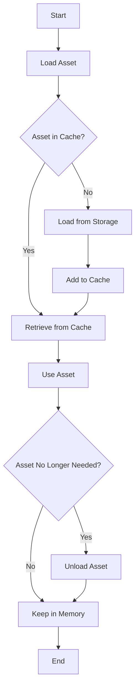

## 12.5 Resource and Asset Management

In the realm of game development, efficient resource and asset management is crucial for optimizing performance and ensuring a smooth user experience. This section delves into the intricacies of managing game assets in Haxe, focusing on techniques for loading, caching, and unloading assets to maintain optimal performance and memory usage.

### Understanding Resource and Asset Management

**Definition:** Resource and asset management in game development involves the efficient handling of game assets such as textures, models, sounds, and other media. The goal is to load, cache, and unload these assets in a way that minimizes memory usage and maximizes performance.

**Key Concepts:**
- **Asset Loading:** The process of retrieving assets from storage and preparing them for use in the game.
- **Asset Caching:** Storing assets in memory for quick access, reducing the need to reload them from storage.
- **Memory Management:** Efficiently managing memory by unloading assets that are no longer needed.

### Implementing Asset Management in Haxe

Haxe provides a robust platform for implementing asset management strategies due to its cross-platform capabilities and powerful language features. Let's explore how to implement asset management in Haxe.

#### Asset Loading

Efficient asset loading is critical to prevent blocking the game loop and ensure smooth gameplay. Here are some strategies for asset loading in Haxe:

1. **Asynchronous Loading:** Use asynchronous loading to load assets in the background without interrupting the game loop. This approach prevents frame drops and ensures a seamless gaming experience.

   ```haxe
   class AssetLoader {
       public static function loadAssetAsync(assetPath: String, onComplete: Dynamic -> Void): Void {
           // Simulate asynchronous loading
           haxe.Timer.delay(() -> {
               var asset = loadAsset(assetPath);
               onComplete(asset);
           }, 100); // Simulate a delay of 100ms
       }

       private static function loadAsset(assetPath: String): Dynamic {
           // Load the asset from the given path
           trace("Loading asset: " + assetPath);
           return {}; // Return a dummy asset
       }
   }
   ```

   In this example, `loadAssetAsync` simulates asynchronous loading by using a timer to delay the loading process. The `onComplete` callback is invoked once the asset is loaded.

2. **Batch Loading:** Load multiple assets simultaneously to reduce loading times. This technique is particularly useful for games with large numbers of assets.

   ```haxe
   class BatchAssetLoader {
       public static function loadAssetsAsync(assetPaths: Array<String>, onComplete: Array<Dynamic> -> Void): Void {
           var loadedAssets = [];
           var remaining = assetPaths.length;

           for (path in assetPaths) {
               AssetLoader.loadAssetAsync(path, (asset) -> {
                   loadedAssets.push(asset);
                   remaining--;

                   if (remaining == 0) {
                       onComplete(loadedAssets);
                   }
               });
           }
       }
   }
   ```

   The `BatchAssetLoader` class demonstrates how to load multiple assets asynchronously and invoke a callback once all assets are loaded.

#### Asset Caching

Caching assets in memory allows for quick access and reduces the need to reload them from storage. Here are some strategies for asset caching:

1. **Simple Caching:** Store loaded assets in a dictionary for quick retrieval.

   ```haxe
   class AssetCache {
       private static var cache: Map<String, Dynamic> = new Map();

       public static function getAsset(assetPath: String): Dynamic {
           if (cache.exists(assetPath)) {
               return cache.get(assetPath);
           } else {
               var asset = AssetLoader.loadAsset(assetPath);
               cache.set(assetPath, asset);
               return asset;
           }
       }
   }
   ```

   The `AssetCache` class provides a simple caching mechanism using a `Map` to store and retrieve assets.

2. **LRU Caching:** Implement a Least Recently Used (LRU) cache to manage memory usage by removing the least recently accessed assets when the cache reaches a certain size.

   ```haxe
   class LRUCache {
       private var capacity: Int;
       private var cache: Map<String, Dynamic>;
       private var usageOrder: Array<String>;

       public function new(capacity: Int) {
           this.capacity = capacity;
           this.cache = new Map();
           this.usageOrder = [];
       }

       public function getAsset(assetPath: String): Dynamic {
           if (cache.exists(assetPath)) {
               updateUsageOrder(assetPath);
               return cache.get(assetPath);
           } else {
               var asset = AssetLoader.loadAsset(assetPath);
               addAsset(assetPath, asset);
               return asset;
           }
       }

       private function addAsset(assetPath: String, asset: Dynamic): Void {
           if (cache.size >= capacity) {
               var leastUsed = usageOrder.shift();
               cache.remove(leastUsed);
           }
           cache.set(assetPath, asset);
           updateUsageOrder(assetPath);
       }

       private function updateUsageOrder(assetPath: String): Void {
           usageOrder.remove(assetPath);
           usageOrder.push(assetPath);
       }
   }
   ```

   The `LRUCache` class implements an LRU caching strategy, maintaining a usage order to determine which assets to remove when the cache is full.

#### Memory Management

Efficient memory management involves unloading assets that are no longer needed to free up memory. Here are some strategies for memory management:

1. **Reference Counting:** Use reference counting to track the number of references to an asset and unload it when the count reaches zero.

   ```haxe
   class ReferenceCountedAsset {
       private var asset: Dynamic;
       private var refCount: Int;

       public function new(asset: Dynamic) {
           this.asset = asset;
           this.refCount = 1;
       }

       public function addReference(): Void {
           refCount++;
       }

       public function removeReference(): Void {
           refCount--;
           if (refCount == 0) {
               unloadAsset();
           }
       }

       private function unloadAsset(): Void {
           trace("Unloading asset");
           asset = null;
       }
   }
   ```

   The `ReferenceCountedAsset` class demonstrates a simple reference counting mechanism to manage asset unloading.

2. **Garbage Collection:** Leverage Haxe's garbage collection to automatically manage memory. Ensure that assets are no longer referenced when they are no longer needed.

### Use Cases and Examples

Let's explore some practical use cases and examples of resource and asset management in Haxe game development.

#### Large Textures and Models

Managing high-resolution textures and 3D models is a common challenge in game development. Here are some strategies for handling large assets:

- **Mipmapping:** Use mipmaps to store multiple resolutions of a texture, allowing the game to use the appropriate resolution based on the distance from the camera.

- **Level of Detail (LOD):** Implement LOD techniques to use simpler models when objects are far from the camera, reducing the rendering load.

- **Streaming:** Stream large assets on demand, loading only the necessary parts as needed.

#### Dynamic Content

Loading levels or content packs on demand is essential for games with dynamic content. Here are some strategies for managing dynamic content:

- **On-Demand Loading:** Load levels or content packs only when needed, reducing initial loading times and memory usage.

- **Content Bundling:** Bundle related assets together to reduce the number of loading operations.

### Visualizing Asset Management

To better understand the flow of asset management in a game, let's visualize the process using a flowchart.



**Figure 1:** Asset Management Flowchart - This diagram illustrates the process of loading, caching, and unloading assets in a game.

### Try It Yourself

Experiment with the code examples provided in this section. Try modifying the `AssetLoader` to simulate different loading times or implement additional caching strategies. Consider creating a simple game scene that loads and unloads assets based on user interaction.

### References and Links

For further reading on asset management in game development, consider the following resources:

- [Game Programming Patterns](http://gameprogrammingpatterns.com/)
- [Haxe Manual](https://haxe.org/manual/)
- [HaxeFlixel Documentation](https://haxeflixel.com/documentation/)

### Knowledge Check

To reinforce your understanding of resource and asset management, consider the following questions and exercises:

- How does asynchronous loading improve game performance?
- Implement a simple game scene that uses the `LRUCache` class to manage assets.
- What are the benefits of using mipmaps for texture management?

### Embrace the Journey

Remember, mastering resource and asset management is a journey. As you progress, you'll develop more efficient and optimized games. Keep experimenting, stay curious, and enjoy the process!

## Quiz Time!



### What is the primary goal of resource and asset management in game development?

- [x] To optimize performance and memory usage
- [ ] To increase the number of assets used in a game
- [ ] To ensure all assets are loaded at the start of the game
- [ ] To reduce the quality of game assets

> **Explanation:** The primary goal of resource and asset management is to optimize performance and memory usage by efficiently loading, caching, and unloading assets.

### How does asynchronous loading benefit game performance?

- [x] It prevents blocking the game loop
- [ ] It increases the resolution of textures
- [ ] It reduces the number of assets needed
- [ ] It simplifies the game code

> **Explanation:** Asynchronous loading prevents blocking the game loop, ensuring smooth gameplay by loading assets in the background.

### What is the purpose of asset caching?

- [x] To store assets in memory for quick access
- [ ] To reduce the quality of assets
- [ ] To increase the number of assets in a game
- [ ] To ensure assets are never unloaded

> **Explanation:** Asset caching stores assets in memory for quick access, reducing the need to reload them from storage.

### What is a common technique for managing large textures in games?

- [x] Mipmapping
- [ ] Increasing texture resolution
- [ ] Reducing the number of textures
- [ ] Using only 2D textures

> **Explanation:** Mipmapping is a technique used to manage large textures by storing multiple resolutions of a texture.

### What is the role of reference counting in asset management?

- [x] To track the number of references to an asset
- [ ] To increase the number of assets in a game
- [ ] To reduce the quality of assets
- [ ] To ensure assets are never unloaded

> **Explanation:** Reference counting tracks the number of references to an asset and unloads it when the count reaches zero.

### How does the LRU caching strategy manage memory usage?

- [x] By removing the least recently accessed assets
- [ ] By increasing the cache size
- [ ] By storing all assets permanently
- [ ] By reducing asset quality

> **Explanation:** The LRU caching strategy manages memory usage by removing the least recently accessed assets when the cache reaches a certain size.

### What is a benefit of on-demand loading for dynamic content?

- [x] It reduces initial loading times
- [ ] It increases the number of assets in a game
- [ ] It simplifies game code
- [ ] It ensures all assets are loaded at the start

> **Explanation:** On-demand loading reduces initial loading times by loading levels or content packs only when needed.

### What is the purpose of using a flowchart in asset management?

- [x] To visualize the process of loading, caching, and unloading assets
- [ ] To increase the number of assets in a game
- [ ] To reduce the quality of assets
- [ ] To ensure all assets are loaded at the start

> **Explanation:** A flowchart visualizes the process of loading, caching, and unloading assets, helping developers understand the asset management workflow.

### What is a common challenge when managing high-resolution textures?

- [x] Memory usage
- [ ] Increasing texture resolution
- [ ] Reducing the number of textures
- [ ] Using only 2D textures

> **Explanation:** Managing high-resolution textures is challenging due to their high memory usage, requiring efficient asset management strategies.

### True or False: Asset management is only important for 3D games.

- [ ] True
- [x] False

> **Explanation:** Asset management is important for both 2D and 3D games, as it optimizes performance and memory usage regardless of the game's dimensionality.


