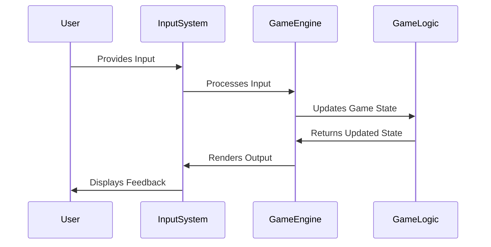

## 12.6 Input Handling and Event Systems

In the realm of game development, input handling and event systems are crucial components that determine how a game interacts with its players. In this section, we will delve into the intricacies of implementing input handling and event systems using Haxe, a powerful cross-platform toolkit. We will explore the differences between polling and event-driven approaches, discuss input abstraction, and provide practical examples to illustrate these concepts.

### Understanding Input Handling and Event Systems

**Definition:** Input handling refers to the process of capturing and responding to user inputs across various devices, such as keyboards, mice, game controllers, and touchscreens. Event systems are mechanisms that allow a program to respond to specific events, such as user inputs, in a structured manner.

#### Key Concepts

- **Polling vs. Event-Driven:** These are two primary methods for handling inputs. Polling involves continuously checking the state of input devices, while event-driven systems rely on callbacks triggered by specific events.
- **Input Abstraction:** This involves mapping device-specific inputs to game actions, allowing for a more flexible and scalable input system.
- **Cross-Platform Input Libraries:** Utilizing libraries that abstract input handling across different platforms can simplify development and ensure consistency.

### Implementing Input Handling in Haxe

#### Cross-Platform Input Libraries

Haxe's cross-platform capabilities make it an excellent choice for game development. When implementing input handling, consider using the input systems provided by game engines like HaxeFlixel or Heaps. These engines offer built-in support for various input devices and abstract away platform-specific details.

```haxe
import flixel.FlxG;

class InputExample {
    public function new() {
        // Check if the space key is pressed
        if (FlxG.keys.pressed.SPACE) {
            trace("Space key is pressed!");
        }

        // Check if the mouse button is clicked
        if (FlxG.mouse.justPressed()) {
            trace("Mouse button clicked at: " + FlxG.mouse.x + ", " + FlxG.mouse.y);
        }
    }
}
```

In this example, we use HaxeFlixel's `FlxG` class to handle keyboard and mouse inputs. This approach abstracts the input handling, making it easier to manage across different platforms.

#### Polling vs. Event-Driven Input Handling

**Polling** involves continuously checking the state of input devices. This method is straightforward but can be inefficient if not managed properly, as it requires constant checking even when no input is present.

**Event-Driven** systems, on the other hand, rely on callbacks that are triggered by specific events. This approach is more efficient as it only processes inputs when they occur.

```haxe
import flixel.FlxG;
import flixel.input.keyboard.FlxKey;

class EventDrivenExample {
    public function new() {
        FlxG.keys.addKeyCallback(FlxKey.SPACE, onSpacePressed);
    }

    private function onSpacePressed():Void {
        trace("Space key was pressed!");
    }
}
```

In this event-driven example, we add a callback for the space key using HaxeFlixel's `addKeyCallback` method. This approach is efficient and allows for more responsive input handling.

#### Input Abstraction

Input abstraction is a technique used to map device-specific inputs to game actions. This allows developers to define actions in a way that is independent of the input device, making it easier to support multiple input methods.

```haxe
enum GameAction {
    Jump;
    Shoot;
    MoveLeft;
    MoveRight;
}

class InputMapper {
    private var actionMap:Map<GameAction, FlxKey>;

    public function new() {
        actionMap = new Map();
        actionMap.set(GameAction.Jump, FlxKey.SPACE);
        actionMap.set(GameAction.Shoot, FlxKey.CONTROL);
        actionMap.set(GameAction.MoveLeft, FlxKey.LEFT);
        actionMap.set(GameAction.MoveRight, FlxKey.RIGHT);
    }

    public function isActionPressed(action:GameAction):Bool {
        return FlxG.keys.pressed(actionMap.get(action));
    }
}
```

In this example, we define a `GameAction` enum to represent different game actions. The `InputMapper` class maps these actions to specific keys, allowing us to check if an action is pressed in a device-independent manner.

### Use Cases and Examples

#### Action Games

Action games often require precise and responsive input handling to ensure a smooth gameplay experience. Implementing an efficient input system is crucial for capturing rapid inputs and providing immediate feedback to players.

```haxe
class ActionGame {
    private var inputMapper:InputMapper;

    public function new() {
        inputMapper = new InputMapper();
    }

    public function update():Void {
        if (inputMapper.isActionPressed(GameAction.Jump)) {
            trace("Player jumps!");
        }
        if (inputMapper.isActionPressed(GameAction.Shoot)) {
            trace("Player shoots!");
        }
    }
}
```

In this action game example, we use the `InputMapper` class to check for jump and shoot actions. This approach ensures that inputs are handled efficiently and consistently.

#### Gesture Recognition

For touch-based devices, gesture recognition is an essential aspect of input handling. Haxe's cross-platform capabilities allow developers to implement gesture recognition systems that work seamlessly across different devices.

```haxe
import flixel.input.touch.FlxTouch;

class GestureExample {
    public function new() {
        FlxG.touches.addTouchCallback(onTouch);
    }

    private function onTouch(touch:FlxTouch):Void {
        if (touch.justPressed) {
            trace("Touch started at: " + touch.screenX + ", " + touch.screenY);
        }
        if (touch.justReleased) {
            trace("Touch ended at: " + touch.screenX + ", " + touch.screenY);
        }
    }
}
```

In this gesture recognition example, we use HaxeFlixel's `FlxTouch` class to handle touch inputs. The `addTouchCallback` method allows us to respond to touch events, making it easy to implement gesture-based controls.

### Visualizing Input Handling and Event Systems

To better understand the flow of input handling and event systems, let's visualize the process using a sequence diagram.



**Diagram Description:** This sequence diagram illustrates the flow of input handling in a game. The user provides input, which is processed by the input system. The game engine updates the game state based on the input and renders the output, providing feedback to the user.

### Try It Yourself

To deepen your understanding of input handling and event systems in Haxe, try modifying the code examples provided. Experiment with different input devices, such as game controllers or touchscreens, and implement additional game actions. Consider creating a simple game that utilizes gesture recognition for touch-based controls.

### References and Links

- [HaxeFlixel Documentation](https://haxeflixel.com/documentation/)
- [Heaps.io Documentation](https://heaps.io/documentation/)
- [MDN Web Docs on Event Handling](https://developer.mozilla.org/en-US/docs/Web/Guide/Events/Event_handlers)

### Knowledge Check

- What are the differences between polling and event-driven input handling?
- How does input abstraction benefit cross-platform game development?
- What are some use cases for gesture recognition in games?

### Embrace the Journey

Remember, mastering input handling and event systems is a journey. As you continue to develop games using Haxe, you'll gain a deeper understanding of these concepts and how they contribute to creating engaging and interactive experiences. Keep experimenting, stay curious, and enjoy the process!

## Quiz Time!



### What is input handling in game development?

- [x] Capturing and responding to user inputs across various devices.
- [ ] Managing game state transitions.
- [ ] Rendering graphics on the screen.
- [ ] Optimizing game performance.

> **Explanation:** Input handling involves capturing and responding to user inputs, such as keyboard, mouse, or touch inputs, across various devices.

### Which method involves continuously checking the state of input devices?

- [x] Polling
- [ ] Event-Driven
- [ ] Callback
- [ ] Abstraction

> **Explanation:** Polling involves continuously checking the state of input devices to determine if any input has occurred.

### What is the advantage of event-driven input handling?

- [x] It processes inputs only when they occur, making it more efficient.
- [ ] It requires less code to implement.
- [ ] It is easier to debug.
- [ ] It supports more input devices.

> **Explanation:** Event-driven input handling processes inputs only when they occur, making it more efficient compared to polling.

### What is input abstraction?

- [x] Mapping device-specific inputs to game actions.
- [ ] Creating a graphical user interface.
- [ ] Optimizing game performance.
- [ ] Managing game state transitions.

> **Explanation:** Input abstraction involves mapping device-specific inputs to game actions, allowing for a more flexible and scalable input system.

### Which game genre often requires precise and responsive input handling?

- [x] Action Games
- [ ] Puzzle Games
- [ ] Simulation Games
- [ ] Strategy Games

> **Explanation:** Action games often require precise and responsive input handling to ensure a smooth gameplay experience.

### What is a common use case for gesture recognition in games?

- [x] Touch-based controls
- [ ] Keyboard shortcuts
- [ ] Mouse clicks
- [ ] Game controller inputs

> **Explanation:** Gesture recognition is commonly used for touch-based controls, allowing players to interact with the game using gestures.

### Which Haxe class is used for handling keyboard inputs in HaxeFlixel?

- [x] FlxG.keys
- [ ] FlxTouch
- [ ] FlxSprite
- [ ] FlxSound

> **Explanation:** The `FlxG.keys` class in HaxeFlixel is used for handling keyboard inputs.

### What is the purpose of the `addKeyCallback` method in HaxeFlixel?

- [x] To add a callback for a specific key event.
- [ ] To render graphics on the screen.
- [ ] To manage game state transitions.
- [ ] To optimize game performance.

> **Explanation:** The `addKeyCallback` method in HaxeFlixel is used to add a callback for a specific key event, allowing for event-driven input handling.

### Which diagram type is used to visualize the flow of input handling in a game?

- [x] Sequence Diagram
- [ ] Class Diagram
- [ ] Flowchart
- [ ] State Diagram

> **Explanation:** A sequence diagram is used to visualize the flow of input handling in a game, showing the interactions between different components.

### True or False: Input handling is only relevant for keyboard and mouse inputs.

- [ ] True
- [x] False

> **Explanation:** Input handling is relevant for various input devices, including keyboards, mice, game controllers, and touchscreens.


