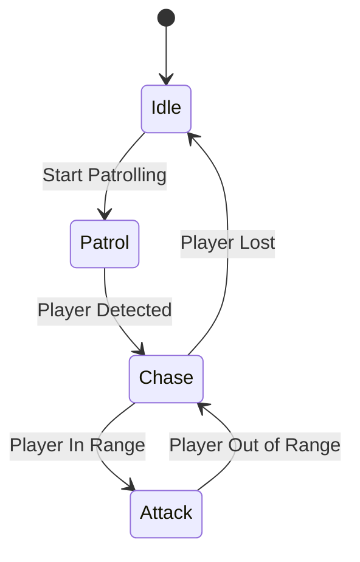
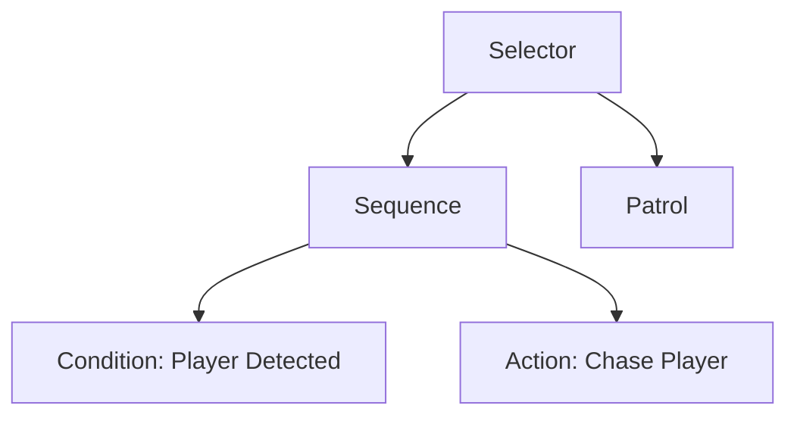

## 12.7 AI and Behavior Patterns

In the realm of game development, artificial intelligence (AI) plays a pivotal role in creating engaging and dynamic experiences. AI and behavior patterns are essential for designing intelligent game entities, such as non-player characters (NPCs), that can interact with players in meaningful ways. In this section, we will delve into the implementation of AI in Haxe, focusing on key patterns like Finite State Machines (FSM), Behavior Trees, and Pathfinding Algorithms. We'll also explore practical use cases and examples to illustrate these concepts in action.

### Implementing AI in Haxe

Haxe, with its cross-platform capabilities and robust language features, provides an excellent environment for implementing AI in games. Let's explore some of the most common AI patterns used in game development.

#### Finite State Machines (FSM)

**Definition:** A Finite State Machine is a computational model used to design algorithms that transition between a finite number of states based on inputs. FSMs are particularly useful for implementing predictable and manageable AI behaviors.

**Key Participants:**
- **States:** Represent different conditions or behaviors of an entity.
- **Transitions:** Define the conditions under which an entity moves from one state to another.
- **Events:** Trigger transitions between states.

**Applicability:** Use FSMs when you need a simple and effective way to manage predictable behaviors, such as enemy NPCs switching between patrolling, chasing, and attacking states.

**Sample Code Snippet:**

```haxe
class EnemyAI {
    enum State {
        Idle;
        Patrol;
        Chase;
        Attack;
    }

    var currentState: State;

    public function new() {
        currentState = State.Idle;
    }

    public function update(): Void {
        switch (currentState) {
            case Idle:
                // Logic for idle state
                if (playerDetected()) {
                    currentState = State.Chase;
                }
            case Patrol:
                // Logic for patrol state
                if (playerDetected()) {
                    currentState = State.Chase;
                }
            case Chase:
                // Logic for chase state
                if (playerInRange()) {
                    currentState = State.Attack;
                }
            case Attack:
                // Logic for attack state
                if (!playerInRange()) {
                    currentState = State.Chase;
                }
        }
    }

    function playerDetected(): Bool {
        // Implement detection logic
        return true;
    }

    function playerInRange(): Bool {
        // Implement range checking logic
        return false;
    }
}
```

**Design Considerations:** FSMs are easy to implement and understand, making them ideal for simple AI behaviors. However, they can become cumbersome when dealing with complex behaviors due to the exponential growth of states and transitions.

#### Behavior Trees

**Definition:** Behavior Trees are a hierarchical model used to control the decision-making process of game entities. They offer a modular and scalable approach to implementing complex behaviors.

**Key Participants:**
- **Nodes:** Represent tasks or decisions. Types include action nodes, condition nodes, and composite nodes.
- **Composite Nodes:** Include sequences, selectors, and decorators that control the flow of execution.
- **Leaf Nodes:** Perform actions or check conditions.

**Applicability:** Use Behavior Trees when you need to implement complex and dynamic behaviors that require flexibility and scalability.

**Sample Code Snippet:**

```haxe
class BehaviorTree {
    var root: Node;

    public function new() {
        root = new SelectorNode([
            new SequenceNode([
                new ConditionNode(playerDetected),
                new ActionNode(chasePlayer)
            ]),
            new ActionNode(patrol)
        ]);
    }

    public function update(): Void {
        root.execute();
    }

    function playerDetected(): Bool {
        // Implement detection logic
        return true;
    }

    function chasePlayer(): Void {
        // Implement chase logic
    }

    function patrol(): Void {
        // Implement patrol logic
    }
}

abstract Node {
    public function execute(): Bool;
}

class SelectorNode extends Node {
    var children: Array<Node>;

    public function new(children: Array<Node>) {
        this.children = children;
    }

    public override function execute(): Bool {
        for (child in children) {
            if (child.execute()) {
                return true;
            }
        }
        return false;
    }
}

class SequenceNode extends Node {
    var children: Array<Node>;

    public function new(children: Array<Node>) {
        this.children = children;
    }

    public override function execute(): Bool {
        for (child in children) {
            if (!child.execute()) {
                return false;
            }
        }
        return true;
    }
}

class ConditionNode extends Node {
    var condition: () -> Bool;

    public function new(condition: () -> Bool) {
        this.condition = condition;
    }

    public override function execute(): Bool {
        return condition();
    }
}

class ActionNode extends Node {
    var action: () -> Void;

    public function new(action: () -> Void) {
        this.action = action;
    }

    public override function execute(): Bool {
        action();
        return true;
    }
}
```

**Design Considerations:** Behavior Trees provide a clear and organized structure for complex behaviors. They are highly modular, allowing for easy modification and extension. However, they can be more challenging to implement than FSMs.

#### Pathfinding Algorithms

**Definition:** Pathfinding algorithms are used to determine the optimal path for an entity to move from one point to another. Common algorithms include A* and Dijkstra's algorithm.

**Key Participants:**
- **Nodes:** Represent points in the game world.
- **Edges:** Connect nodes and represent possible paths.
- **Heuristic Function:** Estimates the cost to reach the goal from a node.

**Applicability:** Use pathfinding algorithms when you need to implement realistic movement for game entities, such as navigating around obstacles or finding the shortest path to a target.

**Sample Code Snippet:**

```haxe
class Pathfinding {
    var grid: Array<Array<Node>>;
    var openList: Array<Node>;
    var closedList: Array<Node>;

    public function new(grid: Array<Array<Node>>) {
        this.grid = grid;
        openList = [];
        closedList = [];
    }

    public function findPath(start: Node, goal: Node): Array<Node> {
        openList.push(start);

        while (openList.length > 0) {
            var current = getLowestCostNode();
            if (current == goal) {
                return reconstructPath(current);
            }

            openList.remove(current);
            closedList.push(current);

            for (neighbor in current.getNeighbors()) {
                if (closedList.indexOf(neighbor) != -1) {
                    continue;
                }

                var tentativeGScore = current.gScore + distance(current, neighbor);
                if (openList.indexOf(neighbor) == -1) {
                    openList.push(neighbor);
                } else if (tentativeGScore >= neighbor.gScore) {
                    continue;
                }

                neighbor.cameFrom = current;
                neighbor.gScore = tentativeGScore;
                neighbor.fScore = neighbor.gScore + heuristic(neighbor, goal);
            }
        }

        return [];
    }

    function getLowestCostNode(): Node {
        var lowest = openList[0];
        for (node in openList) {
            if (node.fScore < lowest.fScore) {
                lowest = node;
            }
        }
        return lowest;
    }

    function reconstructPath(current: Node): Array<Node> {
        var path = [current];
        while (current.cameFrom != null) {
            current = current.cameFrom;
            path.unshift(current);
        }
        return path;
    }

    function distance(a: Node, b: Node): Float {
        // Implement distance calculation
        return 1.0;
    }

    function heuristic(a: Node, b: Node): Float {
        // Implement heuristic calculation
        return 0.0;
    }
}

class Node {
    public var gScore: Float;
    public var fScore: Float;
    public var cameFrom: Node;
    public function getNeighbors(): Array<Node> {
        // Implement neighbor retrieval
        return [];
    }
}
```

**Design Considerations:** Pathfinding algorithms are essential for realistic movement in games. A* is often preferred due to its efficiency and accuracy. Consider the complexity of the game world when choosing an algorithm.

### Use Cases and Examples

Let's explore some practical use cases and examples of AI and behavior patterns in Haxe game development.

#### Enemy NPCs

**Chasing and Fleeing:** Implement FSMs or Behavior Trees to create enemy NPCs that can chase the player when detected and flee when low on health.

**Patrolling:** Use FSMs to design NPCs that patrol a predefined path and switch to chasing when the player is detected.

#### Strategic AI

**Chess or Strategy Games:** Implement Behavior Trees to design AI that can evaluate multiple strategies and make decisions based on the current game state.

**Resource Management:** Use FSMs to manage AI behaviors related to gathering and utilizing resources in strategy games.

### Visualizing AI and Behavior Patterns

To better understand the flow of AI and behavior patterns, let's visualize a simple FSM and Behavior Tree using Mermaid.js diagrams.

#### Finite State Machine Diagram



**Description:** This diagram illustrates a simple FSM for an enemy NPC. The NPC starts in the Idle state, transitions to Patrol, and then to Chase when the player is detected. If the player is in range, the NPC attacks. If the player is out of range, it returns to Chase.

#### Behavior Tree Diagram



**Description:** This diagram represents a Behavior Tree for an enemy NPC. The Selector node chooses between patrolling and chasing the player. The Sequence node ensures that the player is detected before chasing.

### References and Links

- [Understanding Finite State Machines](https://en.wikipedia.org/wiki/Finite-state_machine)
- [Introduction to Behavior Trees](https://en.wikipedia.org/wiki/Behavior_tree_(artificial_intelligence,_robotics_and_control))
- [A* Pathfinding Algorithm](https://en.wikipedia.org/wiki/A*_search_algorithm)

### Knowledge Check

To reinforce your understanding of AI and behavior patterns in Haxe, consider the following questions and challenges:

- How would you implement a more complex behavior using a Behavior Tree?
- What are the advantages and disadvantages of using FSMs versus Behavior Trees?
- How can you optimize pathfinding algorithms for large game worlds?

### Embrace the Journey

Remember, mastering AI and behavior patterns is a journey. As you experiment with different patterns and techniques, you'll gain a deeper understanding of how to create intelligent and engaging game entities. Keep exploring, stay curious, and enjoy the process!

## Quiz Time!



### What is a Finite State Machine (FSM) used for in game development?

- [x] Managing predictable behaviors of game entities
- [ ] Rendering graphics
- [ ] Handling user input
- [ ] Networking

> **Explanation:** FSMs are used to manage predictable behaviors by transitioning between a finite number of states based on inputs.

### Which pattern is more suitable for complex and dynamic behaviors?

- [ ] Finite State Machine
- [x] Behavior Tree
- [ ] Singleton
- [ ] Observer

> **Explanation:** Behavior Trees offer a modular and scalable approach, making them suitable for complex and dynamic behaviors.

### What is the primary advantage of using Behavior Trees over FSMs?

- [x] Modularity and scalability
- [ ] Simplicity
- [ ] Faster execution
- [ ] Less memory usage

> **Explanation:** Behavior Trees provide a modular and scalable structure, allowing for easy modification and extension of behaviors.

### Which algorithm is commonly used for pathfinding in games?

- [ ] Bubble Sort
- [ ] Quick Sort
- [x] A* Algorithm
- [ ] Binary Search

> **Explanation:** The A* Algorithm is commonly used for pathfinding due to its efficiency and accuracy.

### What is the role of a heuristic function in pathfinding algorithms?

- [x] Estimating the cost to reach the goal from a node
- [ ] Sorting nodes
- [ ] Rendering graphics
- [ ] Handling user input

> **Explanation:** The heuristic function estimates the cost to reach the goal from a node, guiding the pathfinding process.

### In a Behavior Tree, what type of node performs actions or checks conditions?

- [x] Leaf Node
- [ ] Composite Node
- [ ] Root Node
- [ ] Selector Node

> **Explanation:** Leaf Nodes perform actions or check conditions in a Behavior Tree.

### What is a common use case for FSMs in game development?

- [x] Enemy NPCs switching between patrolling, chasing, and attacking states
- [ ] Rendering graphics
- [ ] Handling user input
- [ ] Networking

> **Explanation:** FSMs are commonly used for managing predictable behaviors, such as enemy NPCs switching between different states.

### Which node type in a Behavior Tree controls the flow of execution?

- [ ] Leaf Node
- [x] Composite Node
- [ ] Root Node
- [ ] Action Node

> **Explanation:** Composite Nodes, such as sequences and selectors, control the flow of execution in a Behavior Tree.

### What is the main challenge of implementing FSMs for complex behaviors?

- [x] Exponential growth of states and transitions
- [ ] Lack of modularity
- [ ] Slow execution
- [ ] High memory usage

> **Explanation:** FSMs can become cumbersome for complex behaviors due to the exponential growth of states and transitions.

### True or False: Behavior Trees are less modular than FSMs.

- [ ] True
- [x] False

> **Explanation:** Behavior Trees are more modular than FSMs, allowing for easy modification and extension of behaviors.


