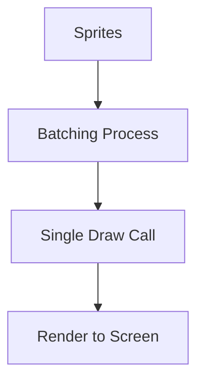
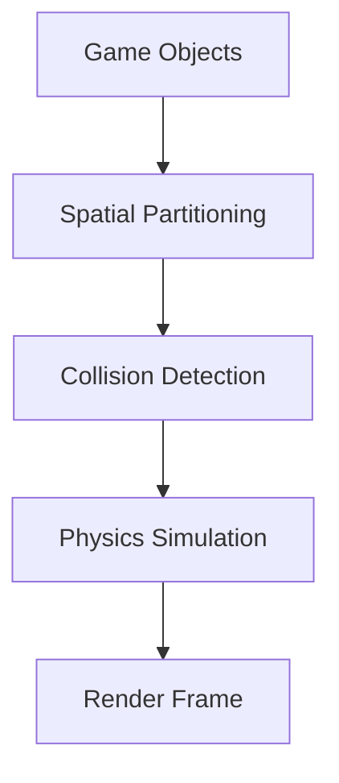

## 12.8 Performance Optimization in Games

In the realm of game development, performance optimization is crucial to ensure smooth gameplay and an immersive experience. As games become more complex and graphically intensive, the need to optimize performance becomes even more critical. In this section, we will explore various strategies for optimizing game performance using Haxe, a versatile language known for its cross-platform capabilities.

### Strategies for Performance Optimization

#### Profiling: Identify Bottlenecks

Profiling is the first step in performance optimization. It involves analyzing your game's performance to identify bottlenecks that may be causing slowdowns. Profiling tools can help you pinpoint areas of your code that require optimization.

- **Use Profiling Tools:** Tools like Visual Studio's Profiler, Haxe's built-in profiler, or third-party tools like Telemetry can provide insights into CPU and memory usage.
- **Analyze Frame Rate Drops:** Identify sections of your game where frame rates drop and investigate the cause.
- **Monitor Memory Usage:** Keep an eye on memory allocation and garbage collection to prevent memory leaks.

#### Rendering Optimization

Rendering is often one of the most resource-intensive processes in a game. Optimizing rendering can significantly improve performance.

- **Sprite Batching:** Combine multiple sprites into a single draw call to reduce the overhead of rendering each sprite individually.
- **Culling:** Implement frustum culling to avoid rendering objects that are outside the player's view.
- **Level of Detail (LOD):** Use different models or textures based on the distance from the camera to reduce rendering complexity.

```haxe
// Example of sprite batching in Haxe
class SpriteBatch {
    var sprites:Array<Sprite>;

    public function new() {
        sprites = [];
    }

    public function addSprite(sprite:Sprite):Void {
        sprites.push(sprite);
    }

    public function render():Void {
        // Render all sprites in a single draw call
        for (sprite in sprites) {
            sprite.draw();
        }
    }
}
```

#### Physics Optimization

Physics calculations can be computationally expensive. Optimizing physics can lead to significant performance gains.

- **Simplify Collision Detection:** Use simpler shapes for collision detection, such as bounding boxes or spheres, instead of complex polygons.
- **Physics Time Step:** Adjust the physics time step to balance accuracy and performance.
- **Use Spatial Partitioning:** Implement techniques like quad-trees or octrees to efficiently manage and query objects in the game world.

```haxe
// Example of simple collision detection using bounding boxes
class BoundingBox {
    var x:Float;
    var y:Float;
    var width:Float;
    var height:Float;

    public function new(x:Float, y:Float, width:Float, height:Float) {
        this.x = x;
        this.y = y;
        this.width = width;
        this.height = height;
    }

    public function intersects(other:BoundingBox):Bool {
        return !(x + width < other.x || x > other.x + other.width || y + height < other.y || y > other.y + other.height);
    }
}
```

### Implementing Optimization in Haxe

#### Efficient Data Structures

Choosing the right data structures is essential for performance optimization. Haxe provides a variety of collections that can be used to optimize data handling.

- **Arrays vs. Lists:** Use arrays for fixed-size collections and lists for dynamic collections.
- **HashMaps:** Use hash maps for fast lookups when dealing with key-value pairs.
- **Custom Data Structures:** Implement custom data structures when built-in options do not meet performance requirements.

```haxe
// Example of using a HashMap in Haxe
var playerScores:Map<String, Int> = new Map();
playerScores.set("Player1", 100);
playerScores.set("Player2", 150);

// Fast lookup
trace(playerScores.get("Player1")); // Output: 100
```

#### Memory Management

Efficient memory management is crucial for preventing memory leaks and ensuring smooth gameplay.

- **Object Reuse:** Reuse objects instead of creating new ones to reduce garbage collection overhead.
- **Pooling:** Implement object pooling for frequently used objects to minimize memory allocation.
- **Garbage Collection:** Manage garbage collection by controlling object lifetimes and minimizing unnecessary allocations.

```haxe
// Example of object pooling in Haxe
class ObjectPool<T> {
    var pool:Array<T>;

    public function new() {
        pool = [];
    }

    public function getObject(create:() -> T):T {
        return pool.length > 0 ? pool.pop() : create();
    }

    public function releaseObject(obj:T):Void {
        pool.push(obj);
    }
}
```

#### Target-Specific Optimizations

Haxe's cross-platform nature allows you to tailor optimizations to specific compilation targets.

- **Platform-Specific Code:** Use conditional compilation to include platform-specific optimizations.
- **Hardware Considerations:** Optimize for the hardware capabilities of the target platform, such as using lower-resolution textures for mobile devices.
- **API Utilization:** Leverage platform-specific APIs for performance-critical tasks.

```haxe
// Example of conditional compilation in Haxe
#if js
    // JavaScript-specific optimization
    trace("Running on JavaScript");
#elseif cpp
    // C++-specific optimization
    trace("Running on C++");
#end
```

### Use Cases and Examples

#### Mobile Games

Mobile games often run on devices with limited hardware resources. Optimizing for performance is essential to ensure a smooth gaming experience.

- **Reduce Texture Sizes:** Use compressed textures to save memory and improve loading times.
- **Optimize Network Usage:** Minimize network requests and use efficient data formats to reduce latency.
- **Battery Optimization:** Implement techniques to reduce battery consumption, such as lowering frame rates during idle times.

#### High-Fidelity Games

High-fidelity games require maintaining high frame rates to provide an immersive experience.

- **Advanced Rendering Techniques:** Use techniques like deferred rendering and dynamic lighting to enhance visual quality without sacrificing performance.
- **Parallel Processing:** Utilize multi-threading to distribute computational tasks across multiple cores.
- **Dynamic Resource Management:** Load and unload resources dynamically based on the player's location and actions.

### Visualizing Optimization Techniques

To better understand the optimization techniques discussed, let's visualize some of these concepts using Mermaid.js diagrams.

#### Sprite Batching Process



*Caption: The sprite batching process combines multiple sprites into a single draw call, reducing rendering overhead.*

#### Physics Optimization Workflow



*Caption: Physics optimization involves spatial partitioning to efficiently manage collision detection and physics simulation.*

### References and Links

- [Haxe Manual](https://haxe.org/manual/)
- [HaxeFlixel Documentation](https://haxeflixel.com/documentation/)
- [OpenFL Documentation](https://www.openfl.org/learn/docs/)
- [Game Optimization Techniques](https://developer.mozilla.org/en-US/docs/Games/Techniques)

### Knowledge Check

To reinforce your understanding of performance optimization in games, consider the following questions and challenges:

1. What are the benefits of using sprite batching in rendering optimization?
2. How can you implement object pooling in Haxe to improve memory management?
3. Describe the process of physics optimization using spatial partitioning.
4. How can conditional compilation be used to tailor optimizations for specific platforms?
5. What are some strategies for optimizing mobile games with limited hardware resources?

### Embrace the Journey

Remember, performance optimization is an ongoing process. As you develop your games, continue to profile, analyze, and refine your code to achieve the best possible performance. Keep experimenting, stay curious, and enjoy the journey of creating immersive gaming experiences with Haxe!

## Quiz Time!



### What is the primary purpose of profiling in game development?

- [x] To identify performance bottlenecks
- [ ] To improve graphics quality
- [ ] To add new features
- [ ] To increase game difficulty

> **Explanation:** Profiling is used to identify performance bottlenecks in a game, allowing developers to focus on optimizing specific areas.

### Which technique is used to reduce rendering overhead by combining multiple sprites into a single draw call?

- [x] Sprite Batching
- [ ] Level of Detail
- [ ] Frustum Culling
- [ ] Deferred Rendering

> **Explanation:** Sprite batching combines multiple sprites into a single draw call, reducing rendering overhead.

### What is the benefit of using bounding boxes for collision detection?

- [x] Simplifies collision detection
- [ ] Increases rendering quality
- [ ] Enhances sound effects
- [ ] Improves AI behavior

> **Explanation:** Bounding boxes simplify collision detection by using simple shapes, reducing computational complexity.

### How can object pooling improve memory management in games?

- [x] By reusing objects and reducing garbage collection overhead
- [ ] By increasing the number of objects created
- [ ] By using larger data structures
- [ ] By decreasing frame rates

> **Explanation:** Object pooling improves memory management by reusing objects, reducing the need for frequent memory allocation and garbage collection.

### What is the purpose of conditional compilation in Haxe?

- [x] To include platform-specific optimizations
- [ ] To increase code readability
- [ ] To enhance sound quality
- [ ] To add new game levels

> **Explanation:** Conditional compilation allows developers to include platform-specific optimizations in their code.

### Which optimization technique is crucial for mobile games with limited hardware resources?

- [x] Reducing texture sizes
- [ ] Increasing frame rates
- [ ] Adding more features
- [ ] Enhancing AI complexity

> **Explanation:** Reducing texture sizes is crucial for optimizing mobile games with limited hardware resources.

### How can spatial partitioning improve physics optimization?

- [x] By efficiently managing and querying objects in the game world
- [ ] By increasing the number of physics calculations
- [ ] By enhancing sound effects
- [ ] By improving graphics quality

> **Explanation:** Spatial partitioning improves physics optimization by efficiently managing and querying objects in the game world.

### What is the advantage of using hash maps in Haxe for performance optimization?

- [x] Fast lookups for key-value pairs
- [ ] Improved sound quality
- [ ] Enhanced graphics rendering
- [ ] Increased game difficulty

> **Explanation:** Hash maps provide fast lookups for key-value pairs, improving performance in data handling.

### Which rendering technique can enhance visual quality without sacrificing performance in high-fidelity games?

- [x] Deferred Rendering
- [ ] Sprite Batching
- [ ] Frustum Culling
- [ ] Object Pooling

> **Explanation:** Deferred rendering enhances visual quality without sacrificing performance in high-fidelity games.

### True or False: Object reuse is a strategy to reduce garbage collection overhead in games.

- [x] True
- [ ] False

> **Explanation:** Object reuse is a strategy to reduce garbage collection overhead by minimizing the creation of new objects.


