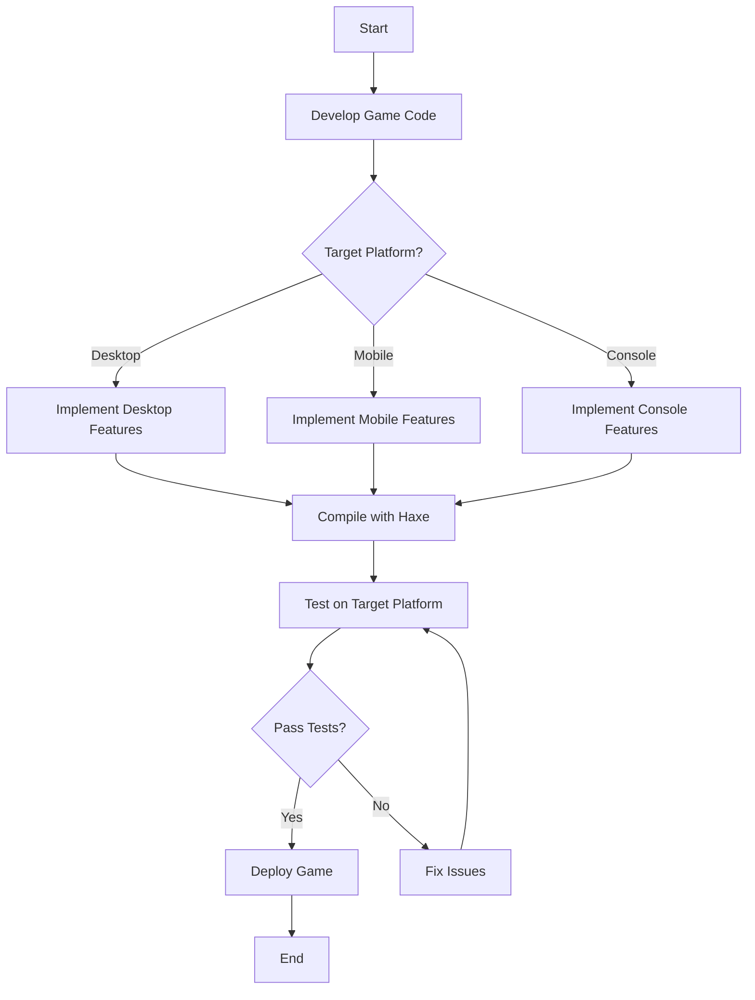

## 12.9 Cross-Platform Game Deployment

Cross-platform game deployment is a crucial aspect of modern game development, enabling developers to reach a broader audience by releasing games on multiple platforms such as desktop, mobile, and consoles. Haxe, with its ability to compile to various target languages, offers a powerful toolset for achieving seamless cross-platform deployment. In this section, we will explore the key considerations, strategies, and best practices for deploying games across different platforms using Haxe.

### Considerations for Cross-Platform Deployment

#### Platform Differences

When deploying games across multiple platforms, it's essential to account for the differences in input methods, screen resolutions, and performance capabilities. Each platform may have unique requirements and limitations that need to be addressed to ensure a consistent user experience.

- **Input Methods:** Different platforms may use various input methods such as touch, keyboard, mouse, or game controllers. It's important to design your game to support these diverse input mechanisms.
- **Screen Resolutions:** Devices come with varying screen sizes and resolutions. Implement responsive design techniques to ensure your game looks great on all devices.
- **Performance Capabilities:** Different platforms have different hardware capabilities. Optimize your game to run smoothly on both high-end and low-end devices.

#### Testing

Rigorous testing on all target platforms is crucial to identify and fix platform-specific issues. This includes functional testing, performance testing, and user experience testing.

- **Functional Testing:** Ensure that all game features work as expected on each platform.
- **Performance Testing:** Test the game's performance under different conditions to ensure it runs smoothly.
- **User Experience Testing:** Evaluate the user experience on each platform to ensure it meets user expectations.

#### Asset Management

Optimizing assets for different devices is essential to ensure efficient loading times and smooth gameplay. This includes managing textures, audio files, and other resources.

- **Texture Optimization:** Use appropriate texture formats and resolutions for each platform.
- **Audio Compression:** Compress audio files to reduce file size without compromising quality.
- **Resource Management:** Implement efficient resource loading and unloading techniques to manage memory usage.

### Implementing Cross-Platform Deployment in Haxe

Haxe provides several features that facilitate cross-platform game deployment, including conditional compilation and abstraction layers.

#### Conditional Compilation

Haxe's conditional compilation feature allows you to include or exclude code based on the target platform. This is achieved using `#if` directives, which enable you to write platform-specific code within the same codebase.

```haxe
#if js
// JavaScript-specific code
trace("Running on JavaScript platform");
#end

#if cpp
// C++-specific code
trace("Running on C++ platform");
#end
```

By using conditional compilation, you can maintain a single codebase while accommodating platform-specific requirements.

#### Abstraction Layers

Abstracting platform functionalities behind interfaces allows you to write platform-independent code. This involves creating a common interface for platform-specific features and implementing it for each target platform.

```haxe
interface IPlatformFeatures {
    function getInputMethod():String;
    function getScreenResolution():String;
}

class DesktopPlatform implements IPlatformFeatures {
    public function getInputMethod():String {
        return "Keyboard and Mouse";
    }
    
    public function getScreenResolution():String {
        return "1920x1080";
    }
}

class MobilePlatform implements IPlatformFeatures {
    public function getInputMethod():String {
        return "Touch";
    }
    
    public function getScreenResolution():String {
        return "1080x1920";
    }
}
```

By using abstraction layers, you can easily switch between different platform implementations without modifying the core game logic.

### Use Cases and Examples

#### Multi-Platform Releases

Many successful games have been released on multiple platforms, including desktop, mobile, and consoles. By leveraging Haxe's cross-platform capabilities, you can achieve similar success.

- **Desktop and Mobile:** Develop a game that runs on both desktop and mobile platforms, ensuring a consistent experience across devices.
- **Console Support:** Extend your game's reach by deploying it on popular gaming consoles.

#### Browser Games

Browser games require compatibility across different web browsers. Haxe's ability to compile to JavaScript makes it an excellent choice for developing browser-based games.

- **Cross-Browser Compatibility:** Ensure your game works seamlessly on all major web browsers.
- **Responsive Design:** Implement responsive design techniques to adapt to different screen sizes and orientations.

### Code Example: Cross-Platform Input Handling

Let's explore a code example that demonstrates cross-platform input handling using Haxe's conditional compilation and abstraction layers.

```haxe
interface IInputHandler {
    function handleInput():Void;
}

class DesktopInputHandler implements IInputHandler {
    public function handleInput():Void {
        trace("Handling input for desktop");
        // Implement desktop-specific input handling
    }
}

class MobileInputHandler implements IInputHandler {
    public function handleInput():Void {
        trace("Handling input for mobile");
        // Implement mobile-specific input handling
    }
}

class Game {
    var inputHandler:IInputHandler;

    public function new() {
        #if desktop
        inputHandler = new DesktopInputHandler();
        #end

        #if mobile
        inputHandler = new MobileInputHandler();
        #end
    }

    public function update():Void {
        inputHandler.handleInput();
    }
}

class Main {
    static function main() {
        var game = new Game();
        game.update();
    }
}
```

In this example, we define an `IInputHandler` interface and implement it for both desktop and mobile platforms. The `Game` class uses conditional compilation to select the appropriate input handler based on the target platform.

### Try It Yourself

Experiment with the code example above by adding new input handlers for additional platforms, such as consoles or web browsers. Modify the `handleInput` method to implement platform-specific input handling logic.

### Visualizing Cross-Platform Deployment

To better understand the process of cross-platform game deployment, let's visualize the workflow using a flowchart.



This flowchart illustrates the steps involved in developing, compiling, testing, and deploying a cross-platform game using Haxe.

### References and Further Reading

- [Haxe Manual: Conditional Compilation](https://haxe.org/manual/lf-condition-compilation.html)
- [MDN Web Docs: Responsive Design](https://developer.mozilla.org/en-US/docs/Learn/CSS/CSS_layout/Responsive_Design)
- [W3Schools: HTML5 Game Development](https://www.w3schools.com/graphics/game_intro.asp)

### Knowledge Check

- What are the key considerations for cross-platform game deployment?
- How does Haxe's conditional compilation feature facilitate cross-platform development?
- Why is it important to abstract platform functionalities behind interfaces?
- How can you optimize assets for different devices?
- What are some common challenges in cross-platform game deployment?

### Embrace the Journey

Remember, cross-platform game deployment is an ongoing journey of learning and adaptation. As you progress, you'll gain valuable insights into the intricacies of each platform and develop strategies to overcome challenges. Keep experimenting, stay curious, and enjoy the journey!

## Quiz Time!



### What is a key consideration when deploying games across multiple platforms?

- [x] Platform differences
- [ ] Using the same input method for all platforms
- [ ] Ignoring screen resolutions
- [ ] Focusing only on high-end devices

> **Explanation:** Platform differences, such as input methods, screen resolutions, and performance capabilities, are crucial considerations for cross-platform deployment.

### How does Haxe's conditional compilation feature help in cross-platform development?

- [x] It allows platform-specific code within the same codebase.
- [ ] It compiles code only for desktop platforms.
- [ ] It eliminates the need for testing on different platforms.
- [ ] It automatically optimizes assets for all platforms.

> **Explanation:** Conditional compilation enables developers to include or exclude code based on the target platform, allowing for platform-specific implementations within a single codebase.

### Why is it important to abstract platform functionalities behind interfaces?

- [x] To write platform-independent code
- [ ] To increase code complexity
- [ ] To reduce code readability
- [ ] To avoid using conditional compilation

> **Explanation:** Abstracting platform functionalities behind interfaces allows developers to write platform-independent code and easily switch between different platform implementations.

### What is a common challenge in cross-platform game deployment?

- [x] Ensuring compatibility across different platforms
- [ ] Using the same asset formats for all platforms
- [ ] Ignoring user experience testing
- [ ] Focusing only on desktop platforms

> **Explanation:** Ensuring compatibility across different platforms is a common challenge in cross-platform game deployment, requiring rigorous testing and optimization.

### How can you optimize assets for different devices?

- [x] By using appropriate texture formats and resolutions
- [ ] By using the same texture format for all devices
- [ ] By ignoring audio compression
- [ ] By loading all resources at once

> **Explanation:** Optimizing assets involves using appropriate texture formats and resolutions, compressing audio files, and implementing efficient resource loading techniques.

### What is a benefit of using abstraction layers in cross-platform development?

- [x] It allows for easy switching between platform implementations.
- [ ] It increases the complexity of the codebase.
- [ ] It reduces the need for testing.
- [ ] It eliminates the need for conditional compilation.

> **Explanation:** Abstraction layers allow developers to easily switch between different platform implementations without modifying the core game logic.

### What is a use case for cross-platform game deployment?

- [x] Multi-platform releases
- [ ] Single-platform releases
- [ ] Ignoring browser compatibility
- [ ] Focusing only on mobile platforms

> **Explanation:** Multi-platform releases, where games are deployed on desktop, mobile, and console platforms, are a common use case for cross-platform game deployment.

### What is the purpose of user experience testing in cross-platform deployment?

- [x] To evaluate the user experience on each platform
- [ ] To ignore platform-specific issues
- [ ] To focus only on performance testing
- [ ] To reduce the need for functional testing

> **Explanation:** User experience testing evaluates the user experience on each platform to ensure it meets user expectations and provides a consistent experience.

### What is a key feature of Haxe that facilitates cross-platform game deployment?

- [x] Conditional compilation
- [ ] Lack of abstraction layers
- [ ] Platform-specific codebase
- [ ] Ignoring platform differences

> **Explanation:** Conditional compilation is a key feature of Haxe that facilitates cross-platform game deployment by allowing platform-specific code within a single codebase.

### True or False: Cross-platform game deployment requires rigorous testing on all target platforms.

- [x] True
- [ ] False

> **Explanation:** Rigorous testing on all target platforms is essential to identify and fix platform-specific issues, ensuring a consistent user experience across devices.


