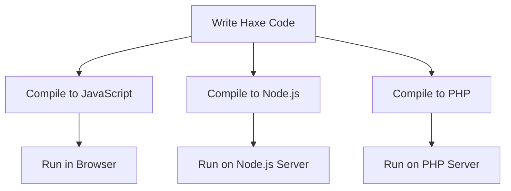

## 13.1 Building Web Applications with Haxe

Building web applications with Haxe offers a unique blend of flexibility, efficiency, and power. By leveraging Haxe's cross-platform capabilities, developers can create both client-side and server-side applications with ease. In this section, we will explore how to harness Haxe for web development, focusing on its advantages, practical implementation strategies, and real-world examples.

### Overview

#### Client-Side Applications

Haxe can be compiled to JavaScript, allowing developers to create rich client-side applications. This capability enables the use of Haxe's robust type system and powerful language features in the browser environment, providing a seamless development experience.

#### Server-Side Applications

Haxe's versatility extends to server-side development, where it can target platforms like Node.js and PHP. This allows developers to write server-side logic in Haxe, benefiting from its type safety and code reuse capabilities.

### Advantages of Using Haxe for Web Development

#### Code Reuse

One of the most significant advantages of using Haxe for web development is the ability to share code between the client and server. This reduces duplication, minimizes errors, and accelerates development time.

#### Type Safety

Haxe's static typing system helps catch errors at compile time, reducing the likelihood of runtime errors. This feature is particularly beneficial in large-scale web applications where type-related bugs can be challenging to track down.

### Building Client-Side Applications with Haxe

To build client-side applications with Haxe, we need to compile Haxe code to JavaScript. Let's explore the steps involved in setting up a Haxe project for client-side development.

#### Setting Up a Haxe Project

1. **Install Haxe and Haxelib**: Ensure you have Haxe and its package manager, Haxelib, installed on your system. You can download them from the [official Haxe website](https://haxe.org/download/).

2. **Create a New Haxe Project**: Use the following command to create a new Haxe project:

   ```bash
   haxelib new my-web-app
   cd my-web-app
   ```

3. **Configure the Build File**: Create a `build.hxml` file to specify the compilation target and other settings. Here's an example configuration for a JavaScript target:

   ```hxml
   -main Main
   -js bin/main.js
   ```

4. **Write Your Haxe Code**: Create a `Main.hx` file and start writing your Haxe code. Here's a simple example:

   ```haxe
   class Main {
       static function main() {
           js.Browser.alert("Hello, Haxe!");
       }
   }
   ```

5. **Compile the Project**: Run the following command to compile your Haxe code to JavaScript:

   ```bash
   haxe build.hxml
   ```

6. **Run the Application**: Open `bin/main.js` in a web browser to see the result.

#### Integrating with JavaScript Libraries

Haxe can seamlessly integrate with existing JavaScript libraries, allowing you to leverage popular frameworks like React, Vue.js, or Angular. To use a JavaScript library in Haxe, you can create externs, which are Haxe definitions that describe the JavaScript API.

Here's an example of how to create an extern for a simple JavaScript library:

```haxe
@:jsRequire("myLibrary")
extern class MyLibrary {
    static function doSomething(): Void;
}
```

#### Using Haxe with React

To use Haxe with React, you can utilize the [haxe-react](https://github.com/massiveinteractive/haxe-react) library, which provides Haxe externs for React. Here's a simple example of a Haxe React component:

```haxe
import react.ReactComponent;
import react.ReactMacro.jsx;

class MyComponent extends ReactComponent {
    override function render() {
        return jsx('<div>Hello, React with Haxe!</div>');
    }
}
```

### Building Server-Side Applications with Haxe

Haxe can target various server-side platforms, including Node.js and PHP. Let's explore how to set up a Haxe project for server-side development.

#### Setting Up a Node.js Project

1. **Install Node.js**: Ensure you have Node.js installed on your system. You can download it from the [official Node.js website](https://nodejs.org/).

2. **Create a New Haxe Project**: Use the following command to create a new Haxe project:

   ```bash
   haxelib new my-node-app
   cd my-node-app
   ```

3. **Configure the Build File**: Create a `build.hxml` file to specify the Node.js target:

   ```hxml
   -main Main
   -js bin/main.js
   ```

4. **Write Your Haxe Code**: Create a `Main.hx` file and start writing your server-side Haxe code. Here's an example using Node.js:

   ```haxe
   class Main {
       static function main() {
           var http = js.node.Http;
           var server = http.createServer((req, res) -> {
               res.writeHead(200, {'Content-Type': 'text/plain'});
               res.end('Hello, Haxe on Node.js!\n');
           });
           server.listen(8080);
           trace('Server running at http://127.0.0.1:8080/');
       }
   }
   ```

5. **Compile and Run the Project**: Compile your Haxe code and run the resulting JavaScript file with Node.js:

   ```bash
   haxe build.hxml
   node bin/main.js
   ```

#### Using Haxe with PHP

Haxe can also target PHP, allowing you to write server-side logic in Haxe and compile it to PHP. Here's how to set up a Haxe project for PHP:

1. **Create a New Haxe Project**: Use the following command to create a new Haxe project:

   ```bash
   haxelib new my-php-app
   cd my-php-app
   ```

2. **Configure the Build File**: Create a `build.hxml` file to specify the PHP target:

   ```hxml
   -main Main
   -php bin/
   ```

3. **Write Your Haxe Code**: Create a `Main.hx` file and start writing your server-side Haxe code. Here's an example:

   ```haxe
   class Main {
       static function main() {
           php.Web.setContentType("text/plain");
           php.Web.print("Hello, Haxe on PHP!");
       }
   }
   ```

4. **Compile and Run the Project**: Compile your Haxe code and run the resulting PHP file with a web server:

   ```bash
   haxe build.hxml
   php -S localhost:8080 -t bin
   ```

### Visualizing Haxe's Role in Web Development

To better understand how Haxe fits into the web development ecosystem, let's visualize the process of building a web application with Haxe.



**Figure 1:** Visualizing Haxe's Compilation Targets for Web Development

### Try It Yourself

Experiment with the examples provided in this section. Try modifying the code to add new features or integrate additional libraries. For instance, you could:

- Extend the client-side example to include a simple form and handle user input.
- Modify the Node.js server example to serve HTML content instead of plain text.
- Integrate a database with the PHP example to store and retrieve data.

### References and Links

- [Haxe Official Website](https://haxe.org/)
- [MDN Web Docs on JavaScript](https://developer.mozilla.org/en-US/docs/Web/JavaScript)
- [Node.js Official Website](https://nodejs.org/)
- [PHP Official Website](https://www.php.net/)

### Knowledge Check

1. What are the advantages of using Haxe for web development?
2. How can Haxe be used to build client-side applications?
3. Describe the process of setting up a Haxe project for Node.js.
4. How does Haxe's type system benefit web development?
5. What are externs in Haxe, and how are they used?

### Embrace the Journey

Remember, this is just the beginning. As you progress, you'll build more complex and interactive web applications. Keep experimenting, stay curious, and enjoy the journey!

## Quiz Time!



### What is one of the main advantages of using Haxe for web development?

- [x] Code reuse between client and server
- [ ] Limited platform support
- [ ] Lack of type safety
- [ ] High runtime errors

> **Explanation:** Haxe allows developers to share code between client and server, reducing duplication and errors.

### How can Haxe be used to build client-side applications?

- [x] By compiling Haxe code to JavaScript
- [ ] By compiling Haxe code to Python
- [ ] By using Haxe directly in the browser
- [ ] By compiling Haxe code to C++

> **Explanation:** Haxe can be compiled to JavaScript, enabling client-side development.

### What is the purpose of externs in Haxe?

- [x] To describe JavaScript APIs for integration
- [ ] To compile Haxe to PHP
- [ ] To manage Haxe dependencies
- [ ] To optimize Haxe performance

> **Explanation:** Externs are Haxe definitions that describe JavaScript APIs, allowing integration with JavaScript libraries.

### Which server-side platform can Haxe target?

- [x] Node.js
- [ ] Ruby on Rails
- [ ] Django
- [ ] ASP.NET

> **Explanation:** Haxe can target Node.js for server-side development.

### What is the benefit of Haxe's static typing system?

- [x] Reduces runtime errors
- [ ] Increases code complexity
- [ ] Limits platform compatibility
- [ ] Slows down development

> **Explanation:** Haxe's static typing helps catch errors at compile time, reducing runtime errors.

### How can Haxe be used with React?

- [x] By using the haxe-react library
- [ ] By compiling Haxe to Python
- [ ] By using Haxe directly in HTML
- [ ] By compiling Haxe to C++

> **Explanation:** The haxe-react library provides Haxe externs for React, enabling integration.

### What is the first step in setting up a Haxe project for Node.js?

- [x] Install Node.js
- [ ] Create a PHP script
- [ ] Compile Haxe to JavaScript
- [ ] Write HTML code

> **Explanation:** Installing Node.js is the first step in setting up a Haxe project for Node.js.

### How can Haxe be used with PHP?

- [x] By compiling Haxe code to PHP
- [ ] By using Haxe directly in PHP files
- [ ] By compiling Haxe to JavaScript
- [ ] By using Haxe with Ruby on Rails

> **Explanation:** Haxe can be compiled to PHP, allowing server-side development with Haxe.

### What is the role of the `build.hxml` file in a Haxe project?

- [x] To specify the compilation target and settings
- [ ] To manage Haxe dependencies
- [ ] To optimize Haxe performance
- [ ] To write Haxe code

> **Explanation:** The `build.hxml` file specifies the compilation target and settings for a Haxe project.

### True or False: Haxe can only be used for client-side web development.

- [ ] True
- [x] False

> **Explanation:** Haxe can be used for both client-side and server-side web development.


