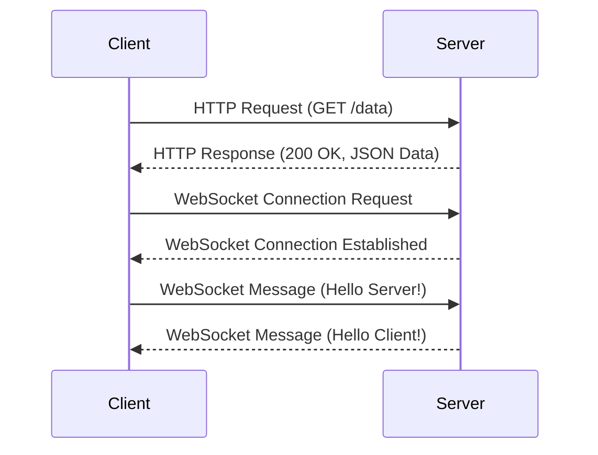

## 13.2 Client-Server Communication

In the realm of web development, client-server communication is a cornerstone that enables applications to interact with servers, fetch data, and provide dynamic content to users. This section delves into the nuances of implementing client-server communication using Haxe, a versatile language that compiles to multiple platforms. We will explore designing RESTful APIs, data serialization techniques, and secure authentication methods. Additionally, we will provide practical use cases and examples to solidify your understanding.

### Implementing Communication

#### APIs: Designing RESTful Services

RESTful APIs (Representational State Transfer) are a popular architectural style for designing networked applications. They use HTTP requests to perform CRUD (Create, Read, Update, Delete) operations on resources. In Haxe, you can design RESTful services for both server and client, leveraging its cross-platform capabilities.

**Key Concepts:**

- **Resource Identification:** Use URIs to identify resources.
- **Statelessness:** Each request from a client contains all the information needed to process it.
- **Cacheability:** Responses must define themselves as cacheable or not.
- **Layered System:** A client cannot ordinarily tell whether it is connected directly to the end server or an intermediary.

**Haxe Code Example:**

```haxe
// Define a simple RESTful API client in Haxe
class RestClient {
    public function new() {}

    public function get(url:String, callback:Dynamic->Void):Void {
        // Use Haxe's Http class for making HTTP requests
        var http = new haxe.Http(url);
        http.onData = function(data:String) {
            callback(data);
        };
        http.onError = function(error:String) {
            trace("Error: " + error);
        };
        http.request();
    }
}

// Usage
class Main {
    static function main() {
        var client = new RestClient();
        client.get("https://api.example.com/data", function(response) {
            trace("Response: " + response);
        });
    }
}
```

**Try It Yourself:**

- Modify the `get` method to handle different HTTP methods like POST, PUT, and DELETE.
- Implement error handling for different HTTP status codes.

#### Data Serialization: JSON, XML, and Binary Formats

Data serialization is the process of converting data structures into a format that can be easily stored or transmitted and then reconstructed later. Common formats include JSON, XML, and binary.

**JSON Serialization in Haxe:**

JSON is a lightweight data interchange format that's easy for humans to read and write and easy for machines to parse and generate.

```haxe
import haxe.Json;

class JsonExample {
    public static function main() {
        var data = { name: "Haxe", type: "Programming Language" };
        var jsonData = Json.stringify(data);
        trace("Serialized JSON: " + jsonData);

        var parsedData = Json.parse(jsonData);
        trace("Parsed Data: " + parsedData.name);
    }
}
```

**XML Serialization in Haxe:**

XML is a markup language that defines a set of rules for encoding documents in a format that is both human-readable and machine-readable.

```haxe
import haxe.xml.Parser;

class XmlExample {
    public static function main() {
        var xmlString = "<language><name>Haxe</name><type>Programming Language</type></language>";
        var xml = Parser.parse(xmlString);
        trace("XML Name: " + xml.firstElement().firstElement().get());
    }
}
```

**Binary Serialization:**

Binary serialization is used for compact data storage and transmission. Haxe provides libraries like `haxe.io.Bytes` for handling binary data.

**Try It Yourself:**

- Experiment with serializing complex data structures.
- Compare the size and speed of JSON vs. XML serialization.

#### Authentication: Secure Methods for Client-Server Authentication

Authentication is a critical aspect of client-server communication, ensuring that only authorized users can access certain resources.

**Common Authentication Methods:**

- **Basic Authentication:** Simple method using a username and password encoded in the HTTP header.
- **Token-Based Authentication:** Uses tokens (e.g., JWT) to authenticate requests.
- **OAuth:** An open standard for access delegation, commonly used for token-based authentication.

**Implementing Token-Based Authentication in Haxe:**

```haxe
class AuthClient {
    public function new() {}

    public function authenticate(url:String, token:String, callback:Dynamic->Void):Void {
        var http = new haxe.Http(url);
        http.setHeader("Authorization", "Bearer " + token);
        http.onData = function(data:String) {
            callback(data);
        };
        http.onError = function(error:String) {
            trace("Error: " + error);
        };
        http.request();
    }
}

// Usage
class Main {
    static function main() {
        var authClient = new AuthClient();
        authClient.authenticate("https://api.example.com/secure-data", "your_token_here", function(response) {
            trace("Authenticated Response: " + response);
        });
    }
}
```

**Try It Yourself:**

- Implement OAuth authentication by integrating with a third-party library.
- Securely store and manage tokens on the client side.

### Use Cases and Examples

#### Data-Driven Applications: Fetching and Updating Data from a Server

Data-driven applications rely heavily on client-server communication to fetch and update data. Consider an application that retrieves user profiles from a server and allows users to update their information.

**Example:**

```haxe
class UserProfileClient {
    public function new() {}

    public function fetchUserProfile(userId:String, callback:Dynamic->Void):Void {
        var url = "https://api.example.com/users/" + userId;
        var http = new haxe.Http(url);
        http.onData = function(data:String) {
            callback(data);
        };
        http.request();
    }

    public function updateUserProfile(userId:String, data:Dynamic, callback:Dynamic->Void):Void {
        var url = "https://api.example.com/users/" + userId;
        var http = new haxe.Http(url);
        http.setHeader("Content-Type", "application/json");
        http.onData = function(response:String) {
            callback(response);
        };
        http.request(true, Json.stringify(data));
    }
}

// Usage
class Main {
    static function main() {
        var client = new UserProfileClient();
        client.fetchUserProfile("123", function(profile) {
            trace("User Profile: " + profile);
        });

        var updatedData = { name: "New Name", email: "newemail@example.com" };
        client.updateUserProfile("123", updatedData, function(response) {
            trace("Update Response: " + response);
        });
    }
}
```

**Try It Yourself:**

- Add error handling for network failures.
- Implement caching to reduce server load.

#### Real-Time Updates: Using WebSockets or Other Real-Time Protocols

Real-time communication is essential for applications that require instant data updates, such as chat applications or live dashboards. WebSockets provide a full-duplex communication channel over a single TCP connection.

**Implementing WebSockets in Haxe:**

```haxe
import js.html.WebSocket;

class WebSocketExample {
    public static function main() {
        var socket = new WebSocket("wss://example.com/socket");

        socket.onopen = function(event) {
            trace("WebSocket connection opened");
            socket.send("Hello Server!");
        };

        socket.onmessage = function(event) {
            trace("Message from server: " + event.data);
        };

        socket.onclose = function(event) {
            trace("WebSocket connection closed");
        };

        socket.onerror = function(event) {
            trace("WebSocket error: " + event);
        };
    }
}
```

**Try It Yourself:**

- Implement a simple chat application using WebSockets.
- Explore using other real-time protocols like Server-Sent Events (SSE).

### Visualizing Client-Server Communication

To better understand the flow of client-server communication, let's visualize the interaction using a sequence diagram.



**Diagram Explanation:**

- The client initiates an HTTP request to fetch data from the server.
- The server responds with the requested data in JSON format.
- The client establishes a WebSocket connection for real-time communication.
- Messages are exchanged over the WebSocket connection.

### References and Links

- [MDN Web Docs: REST](https://developer.mozilla.org/en-US/docs/Glossary/REST)
- [MDN Web Docs: JSON](https://developer.mozilla.org/en-US/docs/Web/JavaScript/Reference/Global_Objects/JSON)
- [MDN Web Docs: WebSockets](https://developer.mozilla.org/en-US/docs/Web/API/WebSockets_API)

### Knowledge Check

- What are the key principles of RESTful APIs?
- How does JSON serialization differ from XML serialization?
- What are the advantages of using token-based authentication?

### Embrace the Journey

Remember, mastering client-server communication is a journey. As you progress, you'll build more complex and interactive applications. Keep experimenting, stay curious, and enjoy the journey!

## Quiz Time!



### What is a key principle of RESTful APIs?

- [x] Statelessness
- [ ] Stateful connections
- [ ] Client-side caching
- [ ] Server-side rendering

> **Explanation:** RESTful APIs are stateless, meaning each request from a client must contain all the information needed to process it.

### Which data format is lightweight and easy for both humans and machines to read and write?

- [x] JSON
- [ ] XML
- [ ] Binary
- [ ] CSV

> **Explanation:** JSON is a lightweight data interchange format that is easy for humans to read and write and easy for machines to parse and generate.

### What is a common use case for WebSockets?

- [x] Real-time communication
- [ ] Static content delivery
- [ ] Batch processing
- [ ] File storage

> **Explanation:** WebSockets are commonly used for real-time communication, providing a full-duplex communication channel over a single TCP connection.

### What is a benefit of token-based authentication?

- [x] Statelessness
- [ ] Requires session storage
- [ ] Increases server load
- [ ] Reduces security

> **Explanation:** Token-based authentication is stateless, meaning the server does not need to store session information, reducing server load.

### Which HTTP method is used to update a resource?

- [x] PUT
- [ ] GET
- [ ] DELETE
- [ ] TRACE

> **Explanation:** The PUT method is used to update a resource on the server.

### What is the purpose of data serialization?

- [x] Convert data structures into a format for storage or transmission
- [ ] Execute code on the server
- [ ] Authenticate users
- [ ] Render web pages

> **Explanation:** Data serialization converts data structures into a format that can be easily stored or transmitted and then reconstructed later.

### Which protocol is commonly used for real-time updates in web applications?

- [x] WebSockets
- [ ] HTTP
- [ ] FTP
- [ ] SMTP

> **Explanation:** WebSockets provide a full-duplex communication channel for real-time updates in web applications.

### What is a common format for data serialization in web applications?

- [x] JSON
- [ ] HTML
- [ ] CSS
- [ ] JPEG

> **Explanation:** JSON is a common format for data serialization in web applications due to its lightweight and easy-to-read structure.

### Which of the following is a secure method for client-server authentication?

- [x] Token-based authentication
- [ ] Plain text passwords
- [ ] Session IDs in URLs
- [ ] IP-based authentication

> **Explanation:** Token-based authentication is a secure method for client-server authentication, as it does not require storing sensitive information on the server.

### True or False: RESTful APIs require the use of HTTP.

- [x] True
- [ ] False

> **Explanation:** RESTful APIs are typically implemented using HTTP, as it provides the necessary methods for performing CRUD operations on resources.




