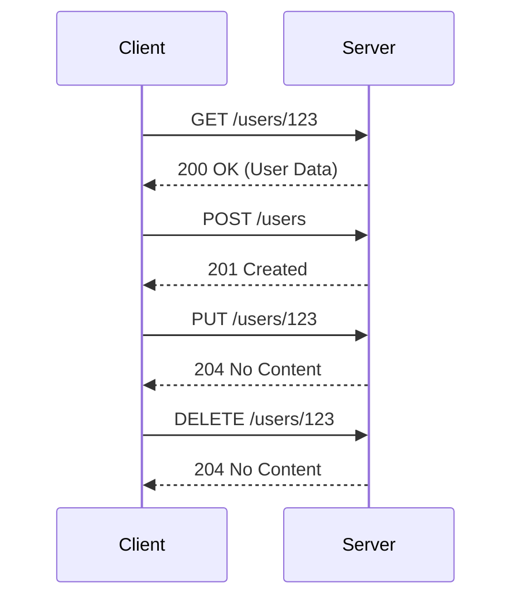

## 13.3 RESTful API Design and Implementation

In today's interconnected world, RESTful APIs have become the backbone of web services, enabling seamless communication between clients and servers. In this section, we will delve into the principles of RESTful API design and implementation using Haxe, a versatile language known for its cross-platform capabilities. We'll explore key concepts, provide practical examples, and guide you through the process of creating efficient and scalable APIs.

### Principles of RESTful API Design

REST (Representational State Transfer) is an architectural style that defines a set of constraints for creating web services. Understanding these principles is crucial for designing APIs that are easy to use, scalable, and maintainable.

#### Resource-Oriented Design

At the heart of REST is the concept of resources. A resource is any piece of information that can be named, such as a document, image, or service. In RESTful design, resources are treated as addressable entities, each identified by a unique URI (Uniform Resource Identifier).

- **Resource Identification:** Use URIs to identify resources. For example, `/users/123` might represent a user with ID 123.
- **Resource Representation:** Resources can have multiple representations, such as JSON, XML, or HTML. The client specifies the desired format using the `Accept` header.

#### HTTP Methods

RESTful APIs leverage standard HTTP methods to perform operations on resources. Each method has a specific purpose:

- **GET:** Retrieve a representation of a resource. It should be safe and idempotent.
- **POST:** Create a new resource or perform an action. It is neither safe nor idempotent.
- **PUT:** Update an existing resource. It is idempotent.
- **DELETE:** Remove a resource. It is idempotent.
- **PATCH:** Partially update a resource. It is not idempotent.

#### Statelessness

RESTful APIs are stateless, meaning each request from a client contains all the information needed by the server to fulfill the request. This simplifies server design and improves scalability.

- **Self-Contained Requests:** Include authentication tokens and other necessary data in each request.
- **No Session State:** Avoid storing session state on the server. Instead, use cookies or tokens to maintain client state.

### Implementing RESTful APIs in Haxe

Haxe offers several libraries and frameworks that facilitate the development of RESTful APIs. Let's explore some of the tools and techniques available.

#### Server-Side Frameworks

Haxe provides powerful libraries like `tink_web` and `haxe-http` for building server-side applications.

- **tink_web:** A flexible web framework that supports RESTful design. It offers routing, request handling, and response generation.
- **haxe-http:** A lightweight library for handling HTTP requests and responses.

#### Routing

Routing is the process of mapping URLs to handler functions. In a RESTful API, each route corresponds to a specific resource and operation.

```haxe
import tink.web.routing.*;
import tink.web.*;

class MyApi {
  static function main() {
    var router = new Router();
    router.get("/users/:id", getUser);
    router.post("/users", createUser);
    router.put("/users/:id", updateUser);
    router.delete("/users/:id", deleteUser);

    // Start the server
    Server.create(router).listen(8080);
  }

  static function getUser(req:Request, res:Response) {
    var userId = req.params.get("id");
    // Fetch user from database
    res.sendJson({ id: userId, name: "John Doe" });
  }

  static function createUser(req:Request, res:Response) {
    // Create a new user
    res.sendStatus(201);
  }

  static function updateUser(req:Request, res:Response) {
    var userId = req.params.get("id");
    // Update user in database
    res.sendStatus(204);
  }

  static function deleteUser(req:Request, res:Response) {
    var userId = req.params.get("id");
    // Delete user from database
    res.sendStatus(204);
  }
}
```

In this example, we define routes for common operations on a `users` resource. Each route is associated with a handler function that processes the request and sends a response.

### Use Cases and Examples

RESTful APIs are widely used in various applications, from web services to microservices. Let's explore some common use cases.

#### Web Services

RESTful APIs are often used to provide backend services for web or mobile applications. They enable clients to interact with server-side resources, such as retrieving user data or submitting forms.

- **Example:** A social media app might use a RESTful API to fetch user profiles, post updates, and manage friend requests.

#### Microservices

In a microservices architecture, applications are composed of small, independent services that communicate via APIs. RESTful APIs are ideal for this purpose due to their simplicity and scalability.

- **Example:** An e-commerce platform might have separate services for user management, product catalog, and order processing, each exposing a RESTful API.

### Visualizing RESTful API Architecture

To better understand the flow of a RESTful API, let's visualize the interaction between clients and servers using a sequence diagram.



This diagram illustrates the typical interactions between a client and a server in a RESTful API. Each request corresponds to an HTTP method and a resource URI, and the server responds with the appropriate status code and data.

### Try It Yourself

To deepen your understanding of RESTful APIs in Haxe, try modifying the example code:

- **Add a new resource:** Implement routes and handlers for a new resource, such as `posts` or `comments`.
- **Implement authentication:** Add token-based authentication to secure your API.
- **Handle errors:** Improve error handling by returning appropriate status codes and messages.

### References and Further Reading

- [RESTful Web Services](https://restfulapi.net/)
- [Haxe Documentation](https://haxe.org/documentation/)
- [tink_web GitHub Repository](https://github.com/haxetink/tink_web)

### Knowledge Check

Before moving on, let's review some key concepts:

- **What is a resource in RESTful design?**
- **How do HTTP methods map to CRUD operations?**
- **Why is statelessness important in RESTful APIs?**

### Embrace the Journey

Remember, mastering RESTful API design is a journey. As you continue to experiment and build, you'll gain a deeper understanding of how to create robust and scalable APIs. Keep exploring, stay curious, and enjoy the process!

## Quiz Time!



### What is a key principle of RESTful API design?

- [x] Resource-Oriented Design
- [ ] Session Management
- [ ] Stateful Communication
- [ ] Complex URL Structures

> **Explanation:** RESTful API design focuses on treating server resources as addressable entities, identified by unique URIs.

### Which HTTP method is used to retrieve a resource?

- [x] GET
- [ ] POST
- [ ] PUT
- [ ] DELETE

> **Explanation:** The GET method is used to retrieve a representation of a resource.

### What does statelessness mean in the context of RESTful APIs?

- [x] Each request contains all information needed by the server.
- [ ] The server maintains session state for each client.
- [ ] Requests are dependent on previous interactions.
- [ ] The server stores user data between requests.

> **Explanation:** Statelessness means that each request is self-contained and does not rely on server-side session state.

### Which Haxe library is commonly used for building RESTful APIs?

- [x] tink_web
- [ ] haxe-ui
- [ ] openfl
- [ ] lime

> **Explanation:** tink_web is a flexible web framework in Haxe that supports RESTful design.

### How does a RESTful API handle authentication?

- [x] Include authentication tokens in each request.
- [ ] Store session data on the server.
- [ ] Use cookies to maintain session state.
- [ ] Rely on IP address verification.

> **Explanation:** RESTful APIs typically use token-based authentication, where tokens are included in each request.

### What is the purpose of the POST HTTP method?

- [x] Create a new resource or perform an action.
- [ ] Retrieve a resource.
- [ ] Update an existing resource.
- [ ] Remove a resource.

> **Explanation:** The POST method is used to create new resources or perform actions that are not idempotent.

### Which HTTP method is idempotent?

- [x] PUT
- [ ] POST
- [ ] PATCH
- [ ] CONNECT

> **Explanation:** The PUT method is idempotent, meaning multiple identical requests have the same effect as a single request.

### What is a common use case for RESTful APIs?

- [x] Web Services
- [ ] Desktop Applications
- [ ] Command-Line Tools
- [ ] Batch Processing

> **Explanation:** RESTful APIs are commonly used to provide backend services for web or mobile applications.

### What does the DELETE HTTP method do?

- [x] Remove a resource.
- [ ] Retrieve a resource.
- [ ] Update a resource.
- [ ] Create a resource.

> **Explanation:** The DELETE method is used to remove a resource.

### True or False: RESTful APIs should maintain session state on the server.

- [ ] True
- [x] False

> **Explanation:** RESTful APIs should be stateless, meaning they do not maintain session state on the server.


