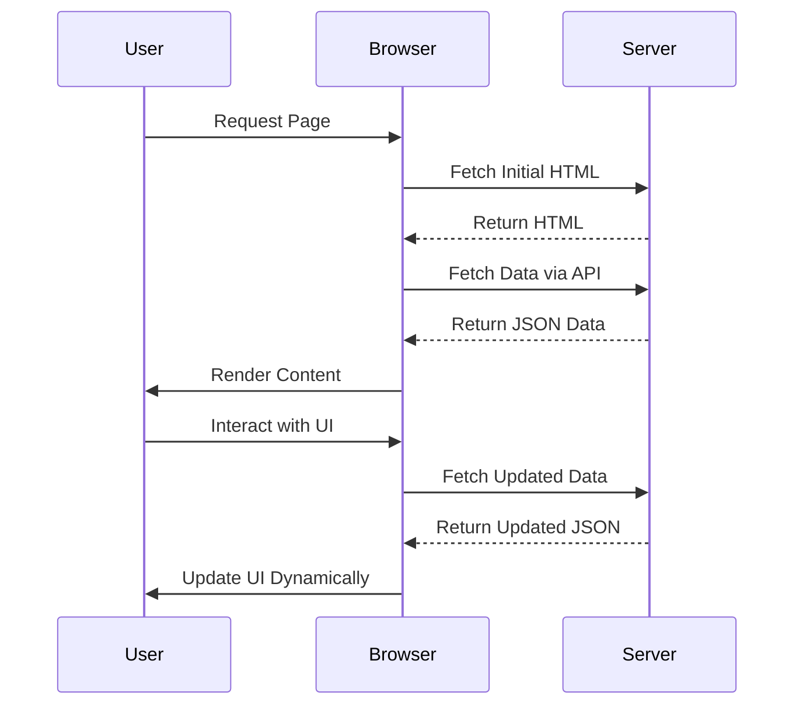

## 13.4 Single Page Applications (SPAs) with Haxe

Single Page Applications (SPAs) represent a modern approach to web development where the application loads a single HTML page and dynamically updates the content as the user interacts with it. This approach provides a seamless user experience, akin to desktop applications, by reducing page reloads and enhancing performance. In this section, we will delve into how Haxe can be leveraged to build robust SPAs, utilizing its cross-platform capabilities and powerful features.

### Understanding Single Page Applications

**Definition:** SPAs are web applications that load a single HTML page and dynamically update the content as the user interacts with the application. Unlike traditional multi-page applications, SPAs do not require a full page reload for each user interaction, resulting in a smoother and faster user experience.

**Key Characteristics:**
- **Dynamic Content Loading:** SPAs fetch data asynchronously and update the UI without reloading the page.
- **Client-Side Rendering:** Most of the rendering logic is handled on the client side, often using JavaScript frameworks.
- **Improved User Experience:** By minimizing page reloads, SPAs offer a more fluid and responsive interaction.

### Implementing SPAs in Haxe

Haxe, with its ability to compile to multiple targets including JavaScript, is well-suited for SPA development. Let's explore how to implement SPAs using Haxe.

#### Frontend Libraries

To build SPAs, we can use Haxe bindings to popular JavaScript frameworks such as React and Vue.js, or leverage Haxe-specific frameworks like `tink_lv`.

- **React with Haxe (`haxe-react`):** React is a popular library for building user interfaces, and `haxe-react` provides Haxe bindings to use React components and hooks seamlessly.

  ```haxe
  import react.ReactComponent;
  import react.ReactMacro.jsx;

  class MyComponent extends ReactComponent {
    override function render() {
      return jsx('<div>Hello, Haxe with React!</div>');
    }
  }
  ```

- **Vue.js with Haxe (`haxe-vue`):** Vue.js is another popular framework for building SPAs, and `haxe-vue` allows you to write Vue components in Haxe.

  ```haxe
  import vue.VueComponent;

  class MyVueComponent extends VueComponent {
    public var message:String = "Hello, Haxe with Vue!";

    public function new() {
      super();
    }
  }
  ```

- **`tink_lv`:** A lightweight Haxe framework for building SPAs, offering a simple and efficient way to manage views and state.

  ```haxe
  import tink_lv.*;

  class MyApp extends App {
    override function main() {
      var view = new View();
      view.render('<h1>Welcome to My Haxe SPA</h1>');
    }
  }
  ```

#### Routing

Client-side routing is essential for SPAs to manage navigation without reloading the page. Haxe can utilize libraries like `haxe-router` to implement routing.

```haxe
import haxe_router.Router;

class MyRouter {
  static function main() {
    var router = new Router();
    router.route("/", () -> trace("Home Page"));
    router.route("/about", () -> trace("About Page"));
    router.start();
  }
}
```

#### State Management

State management is crucial in SPAs to handle the application's state across different components. Patterns like Flux or Redux can be implemented using Haxe macros for efficient state management.

- **Flux Pattern:** A unidirectional data flow pattern that helps manage state changes in SPAs.

  ```haxe
  class AppState {
    public var count:Int = 0;
  }

  class AppActions {
    public static function increment(state:AppState):AppState {
      return { count: state.count + 1 };
    }
  }
  ```

- **Redux with Haxe:** Redux is a predictable state container for JavaScript apps, and Haxe can be used to implement similar patterns.

  ```haxe
  typedef Action = { type:String, payload:Dynamic };

  class Reducer {
    public static function reduce(state:AppState, action:Action):AppState {
      switch(action.type) {
        case "INCREMENT":
          return { count: state.count + 1 };
        default:
          return state;
      }
    }
  }
  ```

### Use Cases and Examples

SPAs are ideal for a variety of applications, particularly those requiring dynamic content updates and offline capabilities.

#### Interactive Dashboards

SPAs are well-suited for data-intensive applications like dashboards, where real-time data updates are crucial.

- **Example:** A financial dashboard that updates stock prices in real-time without page reloads.

#### Web Applications with Offline Capabilities

Utilizing service workers, SPAs can offer offline capabilities, allowing users to interact with the application even without an internet connection.

- **Example:** A note-taking app that saves changes locally and syncs when online.

### Visualizing SPA Architecture

To better understand the architecture of SPAs, let's visualize the interaction between different components using a sequence diagram.



### Try It Yourself

To get hands-on experience, try modifying the code examples provided. For instance, add a new route to the `MyRouter` class or implement a new action in the `AppActions` class. Experiment with different frontend libraries and see how they integrate with Haxe.

### References and Links

- [MDN Web Docs: Single Page Applications](https://developer.mozilla.org/en-US/docs/Glossary/SPA)
- [React Documentation](https://reactjs.org/docs/getting-started.html)
- [Vue.js Documentation](https://vuejs.org/v2/guide/)
- [Haxe React Bindings](https://github.com/massiveinteractive/haxe-react)
- [Haxe Vue Bindings](https://github.com/MatthijsKamstra/haxe-vue)

### Knowledge Check

- What are the key characteristics of SPAs?
- How does client-side routing enhance user experience in SPAs?
- Explain the role of state management in SPAs.
- How can Haxe macros be used to implement state management patterns like Flux?
- What are the benefits of using service workers in SPAs?

### Embrace the Journey

Remember, building SPAs with Haxe is just the beginning. As you progress, you'll be able to create more complex and interactive web applications. Keep experimenting, stay curious, and enjoy the journey!

## Quiz Time!



### What is a Single Page Application (SPA)?

- [x] An application that loads a single HTML page and dynamically updates content
- [ ] An application that requires full page reloads for each interaction
- [ ] A desktop application that runs in a browser
- [ ] An application that only works offline

> **Explanation:** SPAs load a single HTML page and dynamically update content without full page reloads.

### Which Haxe library provides bindings for React?

- [x] haxe-react
- [ ] haxe-vue
- [ ] tink_lv
- [ ] haxe-router

> **Explanation:** `haxe-react` provides Haxe bindings for React components and hooks.

### What is the purpose of client-side routing in SPAs?

- [x] To manage navigation without reloading the page
- [ ] To handle server-side data fetching
- [ ] To improve server performance
- [ ] To enhance security

> **Explanation:** Client-side routing allows navigation within an SPA without reloading the page.

### Which pattern is commonly used for state management in SPAs?

- [x] Flux
- [ ] MVC
- [ ] Singleton
- [ ] Factory

> **Explanation:** Flux is a unidirectional data flow pattern commonly used for state management in SPAs.

### How can service workers enhance SPAs?

- [x] By providing offline capabilities
- [ ] By improving server-side rendering
- [ ] By increasing server load
- [ ] By reducing client-side rendering

> **Explanation:** Service workers enable offline capabilities by caching resources and handling network requests.

### What is the role of Haxe macros in state management?

- [x] To implement patterns like Flux efficiently
- [ ] To handle server-side rendering
- [ ] To manage database connections
- [ ] To improve CSS styling

> **Explanation:** Haxe macros can be used to implement state management patterns like Flux efficiently.

### Which of the following is a benefit of using SPAs?

- [x] Improved user experience
- [ ] Increased server load
- [ ] More frequent page reloads
- [ ] Reduced client-side rendering

> **Explanation:** SPAs improve user experience by minimizing page reloads and providing a seamless interaction.

### What is `tink_lv` used for in Haxe?

- [x] Building lightweight SPAs
- [ ] Managing server-side data
- [ ] Handling database connections
- [ ] Improving CSS styling

> **Explanation:** `tink_lv` is a lightweight Haxe framework for building SPAs.

### Which diagram type is useful for visualizing SPA architecture?

- [x] Sequence diagram
- [ ] Class diagram
- [ ] Entity-relationship diagram
- [ ] Flowchart

> **Explanation:** Sequence diagrams are useful for visualizing the interaction between components in SPA architecture.

### True or False: SPAs require full page reloads for each user interaction.

- [ ] True
- [x] False

> **Explanation:** SPAs do not require full page reloads; they dynamically update content as the user interacts.


