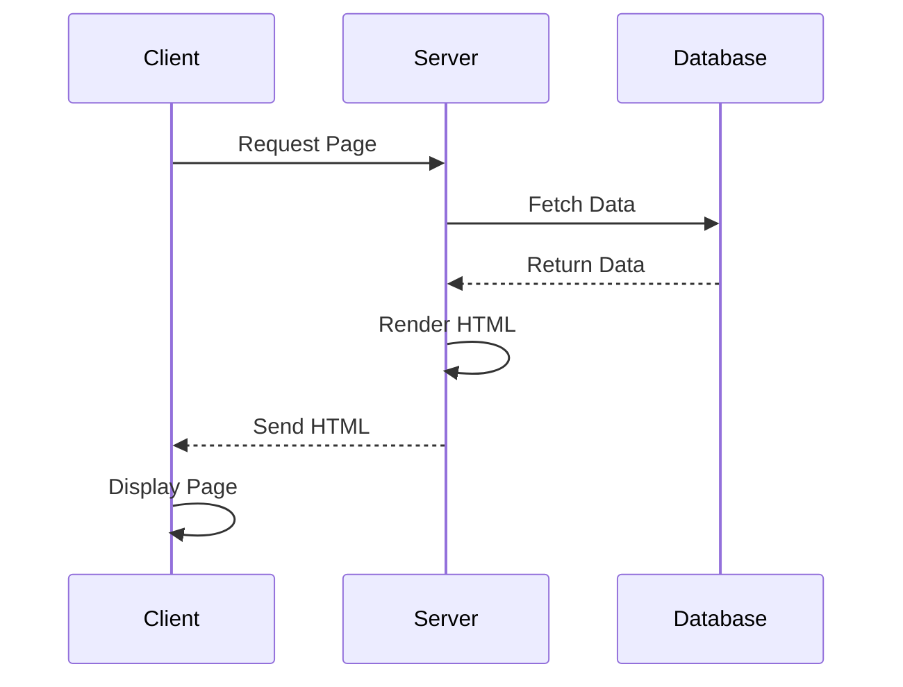

## 13.5 Server-Side Rendering

Server-Side Rendering (SSR) is a powerful technique in web development that involves generating HTML content on the server and delivering it to the client. This approach can significantly improve initial load times and enhance Search Engine Optimization (SEO), making it a crucial strategy for content-heavy websites and applications where visibility is paramount.

### Understanding Server-Side Rendering

Server-Side Rendering refers to the process of rendering web pages on the server instead of the client. When a user requests a page, the server processes the request, generates the HTML, and sends it to the client's browser. This contrasts with Client-Side Rendering (CSR), where the browser downloads a minimal HTML page and uses JavaScript to render the content dynamically.

#### Benefits of Server-Side Rendering

1. **Improved Performance:** SSR can reduce the time to first meaningful paint, as the browser receives a fully rendered page from the server.
2. **SEO Optimization:** Search engines can easily crawl and index server-rendered pages, improving the site's visibility.
3. **Faster Time-to-Interactive:** Users can interact with the content sooner, as the initial HTML is already rendered.
4. **Better Accessibility:** SSR ensures that content is available even if JavaScript is disabled in the browser.

### Implementing Server-Side Rendering in Haxe

Haxe, with its cross-platform capabilities, provides several tools and libraries to implement SSR effectively. Let's explore how to leverage Haxe's features for SSR.

#### Using Haxe's Template Class

Haxe's `Template` class is a built-in feature that allows developers to create dynamic HTML content. It uses a simple syntax to embed Haxe expressions within HTML, making it a powerful tool for SSR.

```haxe
import haxe.Template;

class Main {
    static function main() {
        var template = new Template("Hello, my name is \${name}!");
        var result = template.execute({name: "Haxe"});
        trace(result); // Outputs: Hello, my name is Haxe!
    }
}
```

In this example, we define a template with a placeholder for the `name` variable. The `execute` method replaces the placeholder with the actual value, generating the final HTML content.

#### Leveraging Libraries like `hxtemplo`

For more complex templating needs, libraries like `hxtemplo` offer advanced features such as loops, conditionals, and partials. `hxtemplo` is a popular choice for Haxe developers looking to implement SSR.

```haxe
import hxtemplo.Template;

class Main {
    static function main() {
        var template = new Template("Hello, my name is \${name}!");
        var result = template.execute({name: "Haxe"});
        trace(result); // Outputs: Hello, my name is Haxe!
    }
}
```

`hxtemplo` allows for more sophisticated template logic, enabling developers to build dynamic and reusable components.

#### Creating Isomorphic Applications

Isomorphic applications share rendering code between the server and client, allowing for a seamless transition between SSR and CSR. This approach can enhance performance and maintainability.

To create an isomorphic application in Haxe, you can compile the same codebase to both server and client targets. This ensures consistency in rendering logic and reduces duplication.

```haxe
class Renderer {
    public static function render(data:Dynamic):String {
        return "<div>Hello, " + data.name + "!</div>";
    }
}

class Server {
    static function main() {
        var html = Renderer.render({name: "Server"});
        trace(html); // Outputs: <div>Hello, Server!</div>
    }
}

class Client {
    static function main() {
        var html = Renderer.render({name: "Client"});
        js.Browser.document.body.innerHTML = html;
    }
}
```

In this example, the `Renderer` class is used to generate HTML on both the server and client, demonstrating the isomorphic approach.

### Use Cases and Examples

Server-Side Rendering is particularly beneficial for certain types of applications:

#### Content-Heavy Sites

Websites with a lot of content, such as blogs, news sites, or e-commerce platforms, can benefit from SSR. These sites often require fast load times and good SEO to attract and retain users.

#### Applications Requiring SEO Optimization

For applications where search engine visibility is crucial, SSR can ensure that all content is indexed correctly. This is especially important for sites that rely on organic search traffic.

### Visualizing Server-Side Rendering

To better understand the flow of SSR, let's visualize the process using a sequence diagram.



This diagram illustrates the typical flow of an SSR application, where the server fetches data, renders HTML, and sends it to the client for display.

### Design Considerations

When implementing SSR in Haxe, consider the following:

- **Caching:** Implement caching strategies to reduce server load and improve response times.
- **State Management:** Ensure that the server and client share the same application state to avoid inconsistencies.
- **Error Handling:** Handle errors gracefully on the server to prevent broken pages from being sent to the client.

### Differences and Similarities with Client-Side Rendering

While SSR and CSR both aim to render web pages, they differ in execution:

- **SSR** generates HTML on the server, while **CSR** relies on JavaScript to render content in the browser.
- **SSR** provides better SEO and initial load times, whereas **CSR** can offer more dynamic and interactive user experiences.

### Try It Yourself

To experiment with SSR in Haxe, try modifying the code examples provided. For instance, add more complex logic to the templates or implement a caching mechanism to improve performance.

### References and Links

For further reading on Server-Side Rendering and Haxe, consider the following resources:

- [MDN Web Docs on Server-Side Rendering](https://developer.mozilla.org/en-US/docs/Glossary/Server-side_rendering)
- [Haxe Manual on Templates](https://haxe.org/manual/std-template.html)
- [hxtemplo GitHub Repository](https://github.com/ianharrigan/hxtemplo)

### Knowledge Check

To reinforce your understanding of SSR in Haxe, consider the following questions:

- What are the primary benefits of using Server-Side Rendering?
- How can Haxe's `Template` class be used to generate HTML content?
- What are the advantages of creating isomorphic applications?

### Embrace the Journey

Remember, mastering Server-Side Rendering is a journey. As you continue to explore Haxe and its capabilities, you'll discover new ways to optimize and enhance your web applications. Keep experimenting, stay curious, and enjoy the process!

## Quiz Time!



### What is the primary advantage of Server-Side Rendering?

- [x] Improved SEO and initial load times
- [ ] Enhanced client-side interactivity
- [ ] Reduced server load
- [ ] Increased JavaScript execution speed

> **Explanation:** Server-Side Rendering improves SEO and initial load times by delivering fully rendered HTML to the client.

### Which Haxe class is used for templating in SSR?

- [x] Template
- [ ] Renderer
- [ ] Server
- [ ] Client

> **Explanation:** The `Template` class in Haxe is used for creating dynamic HTML content in SSR.

### What is an isomorphic application?

- [x] An application that shares rendering code between server and client
- [ ] An application that only runs on the server
- [ ] An application that only runs on the client
- [ ] An application that does not use JavaScript

> **Explanation:** Isomorphic applications share rendering code between the server and client, allowing for consistent rendering logic.

### Which library can be used for advanced templating in Haxe?

- [x] hxtemplo
- [ ] js.Browser
- [ ] haxe.Template
- [ ] haxe.Renderer

> **Explanation:** `hxtemplo` is a library used for advanced templating in Haxe, offering features like loops and conditionals.

### What is a key benefit of SSR for content-heavy sites?

- [x] Faster load times and better SEO
- [ ] Reduced server costs
- [ ] Increased client-side interactivity
- [ ] Simplified codebase

> **Explanation:** SSR provides faster load times and better SEO, which are crucial for content-heavy sites.

### How does SSR affect SEO?

- [x] Improves SEO by providing fully rendered pages for indexing
- [ ] Decreases SEO by relying on JavaScript
- [ ] Has no impact on SEO
- [ ] Only affects SEO for mobile devices

> **Explanation:** SSR improves SEO by delivering fully rendered pages that search engines can easily index.

### What should be considered when implementing SSR?

- [x] Caching strategies
- [ ] Client-side animations
- [ ] JavaScript minification
- [ ] CSS styling

> **Explanation:** Implementing caching strategies is important in SSR to reduce server load and improve response times.

### What is the role of the `Renderer` class in the isomorphic example?

- [x] To generate HTML on both server and client
- [ ] To handle client-side interactions
- [ ] To manage server requests
- [ ] To compile JavaScript code

> **Explanation:** The `Renderer` class generates HTML on both the server and client, demonstrating the isomorphic approach.

### Can SSR be used for applications requiring SEO optimization?

- [x] True
- [ ] False

> **Explanation:** SSR is particularly beneficial for applications requiring SEO optimization, as it ensures content is indexed correctly.

### What is a potential drawback of SSR?

- [x] Increased server load
- [ ] Reduced SEO
- [ ] Slower client-side interactions
- [ ] Limited browser compatibility

> **Explanation:** SSR can increase server load due to the need to render pages on the server.


